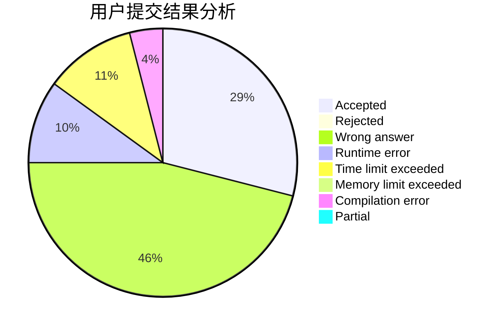
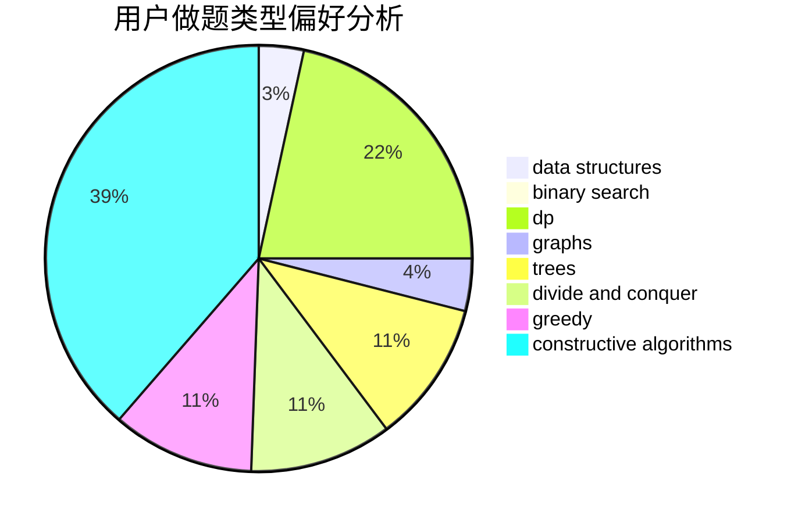
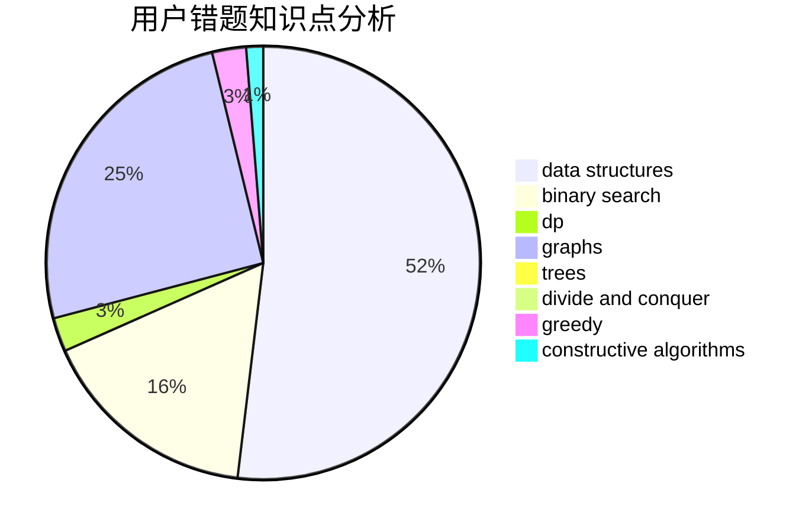

# 201465
<!-- tabs:start -->
#### **用户提交结果分析**

#### **用户做题类型偏好分析**

#### **用户错题知识点分析**

<!-- tabs:end -->
# 推荐题目
[Cards](http://codeforces.com/problemset/problem/1220/A)		implementation,
                        sortings,
                        strings		  
[Make The Fence Great Again](http://codeforces.com/problemset/problem/1221/D)		dp		  
[Multiplication Table](http://codeforces.com/problemset/problem/1220/B)		math,
                        number theory		  
[Lucky Permutation](http://codeforces.com/problemset/problem/121/C)		brute force,
                        combinatorics,
                        number theory		  
[Dwarves, Hats and Extrasensory Abilities](https://codeforces.com/contest/1064/problem/E)		binary search,
                        constructive algorithms,
                        geometry,
                        interactive		  
[Substring Game in the Lesson](http://codeforces.com/problemset/problem/1220/C)		games,
                        greedy,
                        strings		  
[Alex and Julian](http://codeforces.com/problemset/problem/1220/D)		bitmasks,
                        math,
                        number theory		  
[Gardener Alex](http://codeforces.com/problemset/problem/1220/F)		binary search,
                        data structures		  
[Lucky Segments](http://codeforces.com/problemset/problem/121/D)		binary search,
                        implementation,
                        two pointers		  
[Periodic integer number](http://codeforces.com/problemset/problem/1219/C)		implementation,
                        strings		  
<!-- tabs:start -->
#### **data structures**
[Cards](http://codeforces.com/problemset/problem/1220/F)		binary search,
                        data structures		  
[Make The Fence Great Again](http://codeforces.com/problemset/problem/121/E)		data structures		  
[Multiplication Table](http://codeforces.com/problemset/problem/1492/C)		binary search,
                        data structures,
                        dp,
                        greedy,
                        two pointers		  
[Lucky Permutation](http://codeforces.com/problemset/problem/1490/G)		binary search,
                        data structures,
                        math		  
[Dwarves, Hats and Extrasensory Abilities](http://codeforces.com/problemset/problem/1479/D)		binary search,
                        bitmasks,
                        brute force,
                        data structures,
                        probabilities,
                        trees		  
[Substring Game in the Lesson](http://codeforces.com/problemset/problem/1497/A)		brute force,
                        data structures,
                        greedy,
                        sortings		  
[Alex and Julian](http://codeforces.com/problemset/problem/1491/C)		brute force,
                        data structures,
                        dp,
                        greedy,
                        implementation		  
[Gardener Alex](http://codeforces.com/problemset/problem/1492/B)		data structures,
                        greedy,
                        math		  
[Lucky Segments](http://codeforces.com/problemset/problem/1436/E)		binary search,
                        data structures,
                        two pointers		  
[Periodic integer number](http://codeforces.com/problemset/problem/1461/D)		binary search,
                        brute force,
                        data structures,
                        divide and conquer,
                        implementation,
                        sortings		  
#### **binary search**
[Cards](https://codeforces.com/contest/1064/problem/E)		binary search,
                        constructive algorithms,
                        geometry,
                        interactive		  
[Make The Fence Great Again](http://codeforces.com/problemset/problem/1220/F)		binary search,
                        data structures		  
[Multiplication Table](http://codeforces.com/problemset/problem/121/D)		binary search,
                        implementation,
                        two pointers		  
[Lucky Permutation](http://codeforces.com/problemset/problem/1221/C)		binary search,
                        math		  
[Dwarves, Hats and Extrasensory Abilities](http://codeforces.com/problemset/problem/1492/C)		binary search,
                        data structures,
                        dp,
                        greedy,
                        two pointers		  
[Substring Game in the Lesson](http://codeforces.com/problemset/problem/1463/D)		binary search,
                        constructive algorithms,
                        greedy,
                        two pointers		  
[Alex and Julian](http://codeforces.com/problemset/problem/1490/G)		binary search,
                        data structures,
                        math		  
[Gardener Alex](http://codeforces.com/problemset/problem/1479/D)		binary search,
                        bitmasks,
                        brute force,
                        data structures,
                        probabilities,
                        trees		  
[Lucky Segments](http://codeforces.com/problemset/problem/1436/E)		binary search,
                        data structures,
                        two pointers		  
[Periodic integer number](http://codeforces.com/problemset/problem/1461/D)		binary search,
                        brute force,
                        data structures,
                        divide and conquer,
                        implementation,
                        sortings		  
#### **dp**
[Cards](http://codeforces.com/problemset/problem/1221/D)		dp		  
[Make The Fence Great Again](http://codeforces.com/problemset/problem/1220/E)		dfs and similar,
                        dp,
                        dsu,
                        graphs,
                        greedy,
                        trees		  
[Multiplication Table](http://codeforces.com/problemset/problem/1492/C)		binary search,
                        data structures,
                        dp,
                        greedy,
                        two pointers		  
[Lucky Permutation](https://codeforces.com/contest/1457/problem/C)		brute force,
                        dp,
                        implementation		  
[Dwarves, Hats and Extrasensory Abilities](http://codeforces.com/problemset/problem/1491/C)		brute force,
                        data structures,
                        dp,
                        greedy,
                        implementation		  
[Substring Game in the Lesson](http://codeforces.com/problemset/problem/1437/C)		dp,
                        flows,
                        graph matchings,
                        greedy,
                        math,
                        sortings		  
[Alex and Julian](http://codeforces.com/problemset/problem/1499/B)		brute force,
                        dp,
                        greedy,
                        implementation		  
[Gardener Alex](http://codeforces.com/problemset/problem/1491/D)		bitmasks,
                        constructive algorithms,
                        dp,
                        greedy,
                        math		  
[Lucky Segments](http://codeforces.com/problemset/problem/1497/E1)		data structures,
                        dp,
                        greedy,
                        math,
                        number theory,
                        two pointers		  
[Periodic integer number](http://codeforces.com/problemset/problem/1466/C)		dp,
                        greedy,
                        strings		  
#### **graph**
[Cards](https://codeforces.com/contest/1219/problem/B)		divide and conquer,
                        fft,
                        graphs		  
[Make The Fence Great Again](http://codeforces.com/problemset/problem/1220/E)		dfs and similar,
                        dp,
                        dsu,
                        graphs,
                        greedy,
                        trees		  
[Multiplication Table](http://codeforces.com/problemset/problem/1487/C)		brute force,
                        constructive algorithms,
                        dfs and similar,
                        graphs,
                        greedy,
                        implementation,
                        math		  
[Lucky Permutation](http://codeforces.com/problemset/problem/1437/C)		dp,
                        flows,
                        graph matchings,
                        greedy,
                        math,
                        sortings		  
[Dwarves, Hats and Extrasensory Abilities](http://codeforces.com/problemset/problem/1470/D)		constructive algorithms,
                        dfs and similar,
                        graph matchings,
                        graphs,
                        greedy		  
[Substring Game in the Lesson](http://codeforces.com/problemset/problem/1476/C)		dp,
                        graphs,
                        greedy		  
[Alex and Julian](http://codeforces.com/problemset/problem/1304/D)		constructive algorithms,
                        graphs,
                        greedy,
                        two pointers		  
[Gardener Alex](http://codeforces.com/problemset/problem/1475/C)		combinatorics,
                        graphs,
                        math		  
[Lucky Segments](http://codeforces.com/problemset/problem/553/E)		dp,
                        fft,
                        graphs,
                        math,
                        probabilities		  
[Periodic integer number](http://codeforces.com/problemset/problem/1495/C)		constructive algorithms,
                        graphs		  
#### **trees**
[Cards](http://codeforces.com/problemset/problem/1220/E)		dfs and similar,
                        dp,
                        dsu,
                        graphs,
                        greedy,
                        trees		  
[Make The Fence Great Again](http://codeforces.com/problemset/problem/1479/D)		binary search,
                        bitmasks,
                        brute force,
                        data structures,
                        probabilities,
                        trees		  
[Multiplication Table](http://codeforces.com/problemset/problem/1511/C)		brute force,
                        data structures,
                        implementation,
                        trees		  
[Lucky Permutation](http://codeforces.com/problemset/problem/1499/F)		combinatorics,
                        dfs and similar,
                        dp,
                        trees		  
[Dwarves, Hats and Extrasensory Abilities](http://codeforces.com/problemset/problem/1491/E)		brute force,
                        dfs and similar,
                        divide and conquer,
                        number theory,
                        trees		  
[Substring Game in the Lesson](http://codeforces.com/problemset/problem/1466/D)		data structures,
                        greedy,
                        sortings,
                        trees		  
[Alex and Julian](http://codeforces.com/problemset/problem/1495/D)		combinatorics,
                        dfs and similar,
                        graphs,
                        math,
                        shortest paths,
                        trees		  
[Gardener Alex](http://codeforces.com/problemset/problem/1303/G)		data structures,
                        divide and conquer,
                        geometry,
                        trees		  
[Lucky Segments](http://codeforces.com/problemset/problem/1454/E)		combinatorics,
                        dfs and similar,
                        graphs,
                        trees		  
[Periodic integer number](http://codeforces.com/problemset/problem/1494/D)		constructive algorithms,
                        data structures,
                        dfs and similar,
                        divide and conquer,
                        dsu,
                        greedy,
                        sortings,
                        trees		  
#### **divide and conquer**
[Cards](https://codeforces.com/contest/1219/problem/B)		divide and conquer,
                        fft,
                        graphs		  
[Make The Fence Great Again](http://codeforces.com/problemset/problem/1167/B)		brute force,
                        divide and conquer,
                        interactive,
                        math		  
[Multiplication Table](http://codeforces.com/problemset/problem/1461/D)		binary search,
                        brute force,
                        data structures,
                        divide and conquer,
                        implementation,
                        sortings		  
[Lucky Permutation](http://codeforces.com/problemset/problem/1466/G)		combinatorics,
                        divide and conquer,
                        hashing,
                        math,
                        string suffix structures,
                        strings		  
[Dwarves, Hats and Extrasensory Abilities](http://codeforces.com/problemset/problem/1490/D)		dfs and similar,
                        divide and conquer,
                        implementation		  
[Substring Game in the Lesson](https://codeforces.com/contest/1483/problem/C)		data structures,
                        divide and conquer,
                        dp		  
[Alex and Julian](http://codeforces.com/problemset/problem/1491/E)		brute force,
                        dfs and similar,
                        divide and conquer,
                        number theory,
                        trees		  
[Gardener Alex](http://codeforces.com/problemset/problem/1303/G)		data structures,
                        divide and conquer,
                        geometry,
                        trees		  
[Lucky Segments](http://codeforces.com/problemset/problem/1494/D)		constructive algorithms,
                        data structures,
                        dfs and similar,
                        divide and conquer,
                        dsu,
                        greedy,
                        sortings,
                        trees		  
[Periodic integer number](http://codeforces.com/problemset/problem/1482/E)		data structures,
                        divide and conquer,
                        dp		  
#### **greedy**
[Cards](http://codeforces.com/problemset/problem/1220/C)		games,
                        greedy,
                        strings		  
[Make The Fence Great Again](http://codeforces.com/problemset/problem/1218/I)		2-sat,
                        dfs and similar,
                        greedy		  
[Multiplication Table](http://codeforces.com/problemset/problem/1220/E)		dfs and similar,
                        dp,
                        dsu,
                        graphs,
                        greedy,
                        trees		  
[Lucky Permutation](http://codeforces.com/problemset/problem/1221/B)		constructive algorithms,
                        greedy		  
[Dwarves, Hats and Extrasensory Abilities](http://codeforces.com/problemset/problem/1221/A)		brute force,
                        greedy,
                        math		  
[Substring Game in the Lesson](http://codeforces.com/problemset/problem/1492/C)		binary search,
                        data structures,
                        dp,
                        greedy,
                        two pointers		  
[Alex and Julian](https://codeforces.com/contest/1496/problem/C)		geometry,
                        greedy,
                        math,
                        sortings		  
[Gardener Alex](http://codeforces.com/problemset/problem/1493/A)		constructive algorithms,
                        greedy		  
[Lucky Segments](http://codeforces.com/problemset/problem/1463/D)		binary search,
                        constructive algorithms,
                        greedy,
                        two pointers		  
[Periodic integer number](http://codeforces.com/problemset/problem/1462/C)		brute force,
                        greedy,
                        math		  
#### **constructive algorithms**
[Cards](https://codeforces.com/contest/1064/problem/E)		binary search,
                        constructive algorithms,
                        geometry,
                        interactive		  
[Make The Fence Great Again](http://codeforces.com/problemset/problem/1221/B)		constructive algorithms,
                        greedy		  
[Multiplication Table](http://codeforces.com/problemset/problem/1493/A)		constructive algorithms,
                        greedy		  
[Lucky Permutation](http://codeforces.com/problemset/problem/1463/D)		binary search,
                        constructive algorithms,
                        greedy,
                        two pointers		  
[Dwarves, Hats and Extrasensory Abilities](https://codeforces.com/contest/1456/problem/B)		bitmasks,
                        brute force,
                        constructive algorithms		  
[Substring Game in the Lesson](http://codeforces.com/problemset/problem/1492/D)		bitmasks,
                        constructive algorithms,
                        greedy,
                        math		  
[Alex and Julian](https://codeforces.com/contest/1504/problem/D)		constructive algorithms,
                        games,
                        interactive		  
[Gardener Alex](https://codeforces.com/contest/1483/problem/A)		brute force,
                        constructive algorithms,
                        greedy,
                        implementation		  
[Lucky Segments](https://codeforces.com/contest/1457/problem/D)		bitmasks,
                        brute force,
                        constructive algorithms		  
[Periodic integer number](http://codeforces.com/problemset/problem/1513/A)		constructive algorithms,
                        implementation		  
#### **sortings**
[Cards](http://codeforces.com/problemset/problem/1220/A)		implementation,
                        sortings,
                        strings		  
[Make The Fence Great Again](https://codeforces.com/contest/1496/problem/C)		geometry,
                        greedy,
                        math,
                        sortings		  
[Multiplication Table](http://codeforces.com/problemset/problem/1495/A)		geometry,
                        greedy,
                        math,
                        sortings		  
[Lucky Permutation](http://codeforces.com/problemset/problem/1497/A)		brute force,
                        data structures,
                        greedy,
                        sortings		  
[Dwarves, Hats and Extrasensory Abilities](http://codeforces.com/problemset/problem/1427/A)		math,
                        sortings		  
[Substring Game in the Lesson](http://codeforces.com/problemset/problem/1461/D)		binary search,
                        brute force,
                        data structures,
                        divide and conquer,
                        implementation,
                        sortings		  
[Alex and Julian](http://codeforces.com/problemset/problem/1437/C)		dp,
                        flows,
                        graph matchings,
                        greedy,
                        math,
                        sortings		  
[Gardener Alex](http://codeforces.com/problemset/problem/1473/A)		greedy,
                        implementation,
                        math,
                        sortings		  
[Lucky Segments](http://codeforces.com/problemset/problem/1486/B)		binary search,
                        geometry,
                        shortest paths,
                        sortings		  
[Periodic integer number](http://codeforces.com/problemset/problem/1480/B)		greedy,
                        implementation,
                        sortings		  
<!-- tabs:end -->
