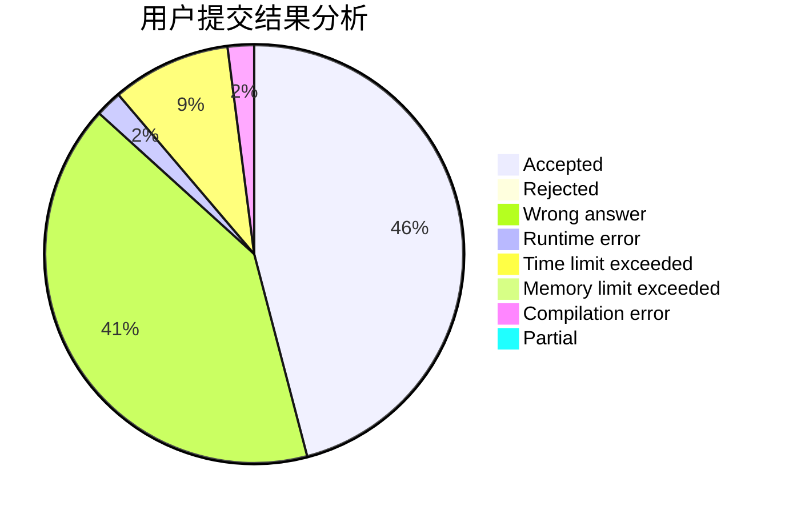
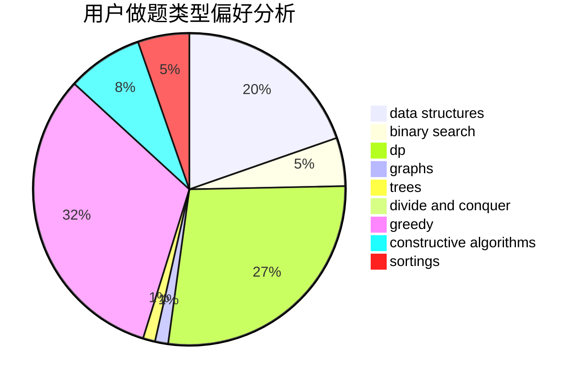
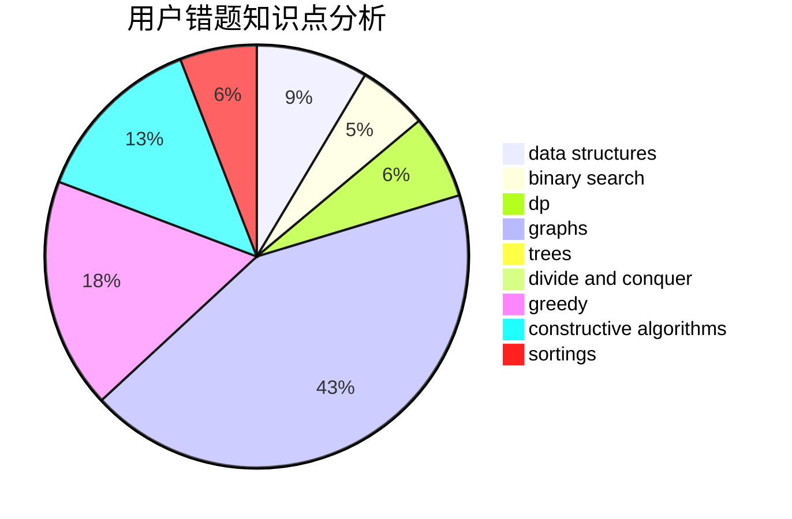

# Devour_
<!-- tabs:start -->
#### **用户提交结果分析**

#### **用户做题类型偏好分析**

#### **用户错题知识点分析**

<!-- tabs:end -->
# 推荐题目
[1459D](https://codeforces.com/contest/1459/problem/D)		dp		  
[1323D](https://codeforces.com/contest/1323/problem/D)		binary search,
                        bitmasks,
                        constructive algorithms,
                        data structures,
                        math,
                        sortings		  
[1286B](http://codeforces.com/problemset/problem/1286/B)		constructive algorithms,
                        data structures,
                        dfs and similar,
                        graphs,
                        greedy,
                        trees		  
[20A](http://codeforces.com/problemset/problem/20/A)		implementation		  
[1250I](http://codeforces.com/problemset/problem/1250/I)		binary search,
                        brute force,
                        greedy,
                        shortest paths		  
[1179D](http://codeforces.com/problemset/problem/1179/D)		data structures,
                        dp,
                        trees		  
[687A](http://codeforces.com/problemset/problem/687/A)		dfs and similar,
                        graphs		  
[1246B](https://codeforces.com/contest/1246/problem/B)		hashing,
                        math,
                        number theory		  
[238A](http://codeforces.com/problemset/problem/238/A)		constructive algorithms,
                        math		  
[670D2](http://codeforces.com/problemset/problem/670/D2)		binary search,
                        implementation		  
<!-- tabs:start -->
#### **data structures**
[1323D](https://codeforces.com/contest/1323/problem/D)		binary search,
                        bitmasks,
                        constructive algorithms,
                        data structures,
                        math,
                        sortings		  
[1286B](http://codeforces.com/problemset/problem/1286/B)		constructive algorithms,
                        data structures,
                        dfs and similar,
                        graphs,
                        greedy,
                        trees		  
[1179D](http://codeforces.com/problemset/problem/1179/D)		data structures,
                        dp,
                        trees		  
[1223F](http://codeforces.com/problemset/problem/1223/F)		data structures,
                        divide and conquer,
                        dp,
                        hashing		  
[1252K](http://codeforces.com/problemset/problem/1252/K)		data structures,
                        math,
                        matrices		  
[1326E](http://codeforces.com/problemset/problem/1326/E)		data structures,
                        two pointers		  
[379F](http://codeforces.com/problemset/problem/379/F)		data structures,
                        divide and conquer,
                        trees		  
[1006C](http://codeforces.com/problemset/problem/1006/C)		binary search,
                        data structures,
                        two pointers		  
[1327F](http://codeforces.com/problemset/problem/1327/F)		bitmasks,
                        combinatorics,
                        data structures,
                        dp,
                        two pointers		  
[1261B1](https://codeforces.com/contest/1261/problem/B1)		data structures,
                        greedy		  
#### **binary search**
[1323D](https://codeforces.com/contest/1323/problem/D)		binary search,
                        bitmasks,
                        constructive algorithms,
                        data structures,
                        math,
                        sortings		  
[1250I](http://codeforces.com/problemset/problem/1250/I)		binary search,
                        brute force,
                        greedy,
                        shortest paths		  
[670D2](http://codeforces.com/problemset/problem/670/D2)		binary search,
                        implementation		  
[778A](http://codeforces.com/problemset/problem/778/A)		binary search,
                        greedy,
                        strings		  
[1006C](http://codeforces.com/problemset/problem/1006/C)		binary search,
                        data structures,
                        two pointers		  
[1326D2](http://codeforces.com/problemset/problem/1326/D2)		binary search,
                        greedy,
                        hashing,
                        string suffix structures,
                        strings		  
[1492C](http://codeforces.com/problemset/problem/1492/C)		binary search,
                        data structures,
                        dp,
                        greedy,
                        two pointers		  
[1463D](http://codeforces.com/problemset/problem/1463/D)		binary search,
                        constructive algorithms,
                        greedy,
                        two pointers		  
[1490G](http://codeforces.com/problemset/problem/1490/G)		binary search,
                        data structures,
                        math		  
[1479D](http://codeforces.com/problemset/problem/1479/D)		binary search,
                        bitmasks,
                        brute force,
                        data structures,
                        probabilities,
                        trees		  
#### **dp**
[1459D](https://codeforces.com/contest/1459/problem/D)		dp		  
[1179D](http://codeforces.com/problemset/problem/1179/D)		data structures,
                        dp,
                        trees		  
[1290F](http://codeforces.com/problemset/problem/1290/F)		dp		  
[1138E](https://codeforces.com/contest/1138/problem/E)		dp,
                        graphs,
                        implementation		  
[1223F](http://codeforces.com/problemset/problem/1223/F)		data structures,
                        divide and conquer,
                        dp,
                        hashing		  
[1096G](http://codeforces.com/problemset/problem/1096/G)		divide and conquer,
                        dp,
                        fft		  
[10B](http://codeforces.com/problemset/problem/10/B)		dp,
                        implementation		  
[1327E](http://codeforces.com/problemset/problem/1327/E)		combinatorics,
                        dp,
                        math		  
[1379E](http://codeforces.com/problemset/problem/1379/E)		constructive algorithms,
                        divide and conquer,
                        dp,
                        math,
                        trees		  
[1459B](http://codeforces.com/problemset/problem/1459/B)		dp,
                        math		  
#### **graph**
[1286B](http://codeforces.com/problemset/problem/1286/B)		constructive algorithms,
                        data structures,
                        dfs and similar,
                        graphs,
                        greedy,
                        trees		  
[687A](http://codeforces.com/problemset/problem/687/A)		dfs and similar,
                        graphs		  
[1138E](https://codeforces.com/contest/1138/problem/E)		dp,
                        graphs,
                        implementation		  
[780E](http://codeforces.com/problemset/problem/780/E)		constructive algorithms,
                        dfs and similar,
                        graphs		  
[1082D](http://codeforces.com/problemset/problem/1082/D)		constructive algorithms,
                        graphs,
                        implementation		  
[1325F](http://codeforces.com/problemset/problem/1325/F)		constructive algorithms,
                        dfs and similar,
                        graphs,
                        greedy		  
[1487C](http://codeforces.com/problemset/problem/1487/C)		brute force,
                        constructive algorithms,
                        dfs and similar,
                        graphs,
                        greedy,
                        implementation,
                        math		  
[1437C](http://codeforces.com/problemset/problem/1437/C)		dp,
                        flows,
                        graph matchings,
                        greedy,
                        math,
                        sortings		  
[1470D](http://codeforces.com/problemset/problem/1470/D)		constructive algorithms,
                        dfs and similar,
                        graph matchings,
                        graphs,
                        greedy		  
[1476C](http://codeforces.com/problemset/problem/1476/C)		dp,
                        graphs,
                        greedy		  
#### **trees**
[1286B](http://codeforces.com/problemset/problem/1286/B)		constructive algorithms,
                        data structures,
                        dfs and similar,
                        graphs,
                        greedy,
                        trees		  
[1179D](http://codeforces.com/problemset/problem/1179/D)		data structures,
                        dp,
                        trees		  
[379F](http://codeforces.com/problemset/problem/379/F)		data structures,
                        divide and conquer,
                        trees		  
[1379E](http://codeforces.com/problemset/problem/1379/E)		constructive algorithms,
                        divide and conquer,
                        dp,
                        math,
                        trees		  
[1325C](http://codeforces.com/problemset/problem/1325/C)		constructive algorithms,
                        dfs and similar,
                        greedy,
                        trees		  
[1479D](http://codeforces.com/problemset/problem/1479/D)		binary search,
                        bitmasks,
                        brute force,
                        data structures,
                        probabilities,
                        trees		  
[1511C](http://codeforces.com/problemset/problem/1511/C)		brute force,
                        data structures,
                        implementation,
                        trees		  
[1499F](http://codeforces.com/problemset/problem/1499/F)		combinatorics,
                        dfs and similar,
                        dp,
                        trees		  
[1491E](http://codeforces.com/problemset/problem/1491/E)		brute force,
                        dfs and similar,
                        divide and conquer,
                        number theory,
                        trees		  
[1466D](http://codeforces.com/problemset/problem/1466/D)		data structures,
                        greedy,
                        sortings,
                        trees		  
#### **divide and conquer**
[1223F](http://codeforces.com/problemset/problem/1223/F)		data structures,
                        divide and conquer,
                        dp,
                        hashing		  
[1096G](http://codeforces.com/problemset/problem/1096/G)		divide and conquer,
                        dp,
                        fft		  
[379F](http://codeforces.com/problemset/problem/379/F)		data structures,
                        divide and conquer,
                        trees		  
[1379E](http://codeforces.com/problemset/problem/1379/E)		constructive algorithms,
                        divide and conquer,
                        dp,
                        math,
                        trees		  
[1461D](http://codeforces.com/problemset/problem/1461/D)		binary search,
                        brute force,
                        data structures,
                        divide and conquer,
                        implementation,
                        sortings		  
[1466G](http://codeforces.com/problemset/problem/1466/G)		combinatorics,
                        divide and conquer,
                        hashing,
                        math,
                        string suffix structures,
                        strings		  
[1490D](http://codeforces.com/problemset/problem/1490/D)		dfs and similar,
                        divide and conquer,
                        implementation		  
[1483C](https://codeforces.com/contest/1483/problem/C)		data structures,
                        divide and conquer,
                        dp		  
[1491E](http://codeforces.com/problemset/problem/1491/E)		brute force,
                        dfs and similar,
                        divide and conquer,
                        number theory,
                        trees		  
[1303G](http://codeforces.com/problemset/problem/1303/G)		data structures,
                        divide and conquer,
                        geometry,
                        trees		  
#### **greedy**
[1286B](http://codeforces.com/problemset/problem/1286/B)		constructive algorithms,
                        data structures,
                        dfs and similar,
                        graphs,
                        greedy,
                        trees		  
[1250I](http://codeforces.com/problemset/problem/1250/I)		binary search,
                        brute force,
                        greedy,
                        shortest paths		  
[778A](http://codeforces.com/problemset/problem/778/A)		binary search,
                        greedy,
                        strings		  
[1409D](http://codeforces.com/problemset/problem/1409/D)		greedy,
                        math		  
[388A](http://codeforces.com/problemset/problem/388/A)		greedy,
                        sortings		  
[1325C](http://codeforces.com/problemset/problem/1325/C)		constructive algorithms,
                        dfs and similar,
                        greedy,
                        trees		  
[1325F](http://codeforces.com/problemset/problem/1325/F)		constructive algorithms,
                        dfs and similar,
                        graphs,
                        greedy		  
[1261B1](https://codeforces.com/contest/1261/problem/B1)		data structures,
                        greedy		  
[1371D](http://codeforces.com/problemset/problem/1371/D)		constructive algorithms,
                        greedy,
                        implementation		  
[1326D2](http://codeforces.com/problemset/problem/1326/D2)		binary search,
                        greedy,
                        hashing,
                        string suffix structures,
                        strings		  
#### **constructive algorithms**
[1323D](https://codeforces.com/contest/1323/problem/D)		binary search,
                        bitmasks,
                        constructive algorithms,
                        data structures,
                        math,
                        sortings		  
[1286B](http://codeforces.com/problemset/problem/1286/B)		constructive algorithms,
                        data structures,
                        dfs and similar,
                        graphs,
                        greedy,
                        trees		  
[238A](http://codeforces.com/problemset/problem/238/A)		constructive algorithms,
                        math		  
[780E](http://codeforces.com/problemset/problem/780/E)		constructive algorithms,
                        dfs and similar,
                        graphs		  
[1082D](http://codeforces.com/problemset/problem/1082/D)		constructive algorithms,
                        graphs,
                        implementation		  
[1379E](http://codeforces.com/problemset/problem/1379/E)		constructive algorithms,
                        divide and conquer,
                        dp,
                        math,
                        trees		  
[1325C](http://codeforces.com/problemset/problem/1325/C)		constructive algorithms,
                        dfs and similar,
                        greedy,
                        trees		  
[1327C](http://codeforces.com/problemset/problem/1327/C)		constructive algorithms,
                        implementation		  
[1325F](http://codeforces.com/problemset/problem/1325/F)		constructive algorithms,
                        dfs and similar,
                        graphs,
                        greedy		  
[1371D](http://codeforces.com/problemset/problem/1371/D)		constructive algorithms,
                        greedy,
                        implementation		  
#### **sortings**
[1323D](https://codeforces.com/contest/1323/problem/D)		binary search,
                        bitmasks,
                        constructive algorithms,
                        data structures,
                        math,
                        sortings		  
[388A](http://codeforces.com/problemset/problem/388/A)		greedy,
                        sortings		  
[1496C](https://codeforces.com/contest/1496/problem/C)		geometry,
                        greedy,
                        math,
                        sortings		  
[1495A](http://codeforces.com/problemset/problem/1495/A)		geometry,
                        greedy,
                        math,
                        sortings		  
[1497A](http://codeforces.com/problemset/problem/1497/A)		brute force,
                        data structures,
                        greedy,
                        sortings		  
[1427A](http://codeforces.com/problemset/problem/1427/A)		math,
                        sortings		  
[1461D](http://codeforces.com/problemset/problem/1461/D)		binary search,
                        brute force,
                        data structures,
                        divide and conquer,
                        implementation,
                        sortings		  
[1437C](http://codeforces.com/problemset/problem/1437/C)		dp,
                        flows,
                        graph matchings,
                        greedy,
                        math,
                        sortings		  
[1473A](http://codeforces.com/problemset/problem/1473/A)		greedy,
                        implementation,
                        math,
                        sortings		  
[1486B](http://codeforces.com/problemset/problem/1486/B)		binary search,
                        geometry,
                        shortest paths,
                        sortings		  
<!-- tabs:end -->
