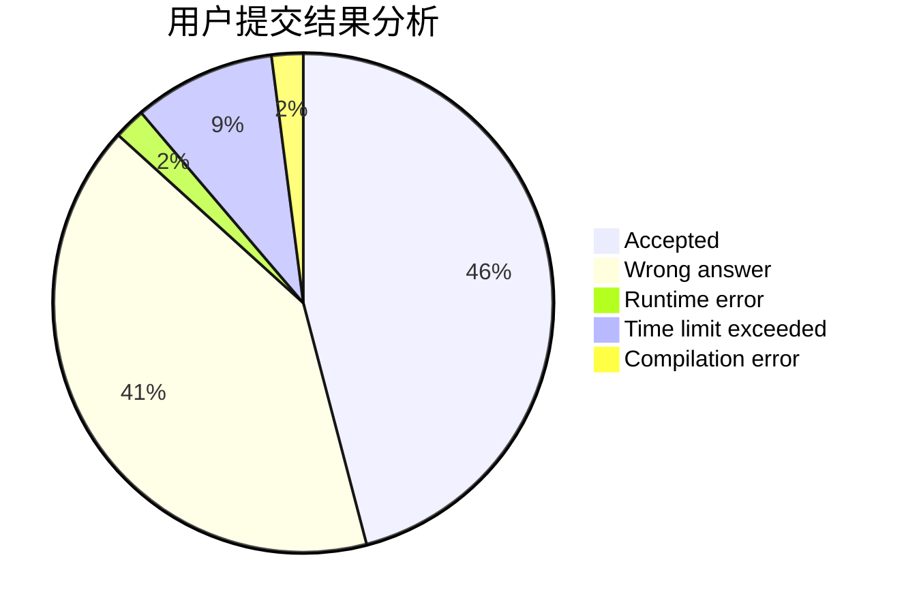
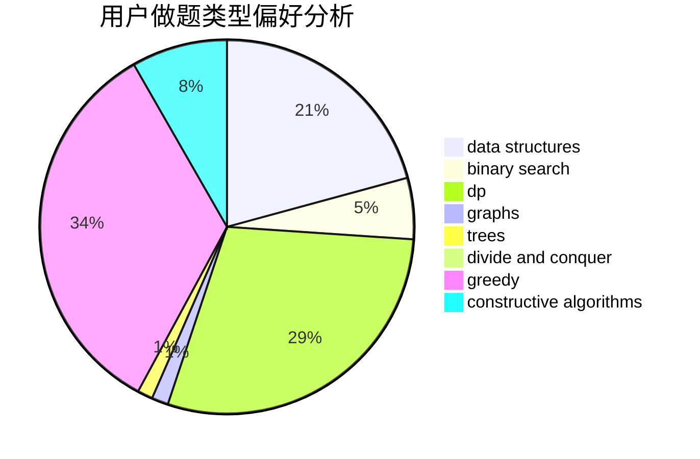
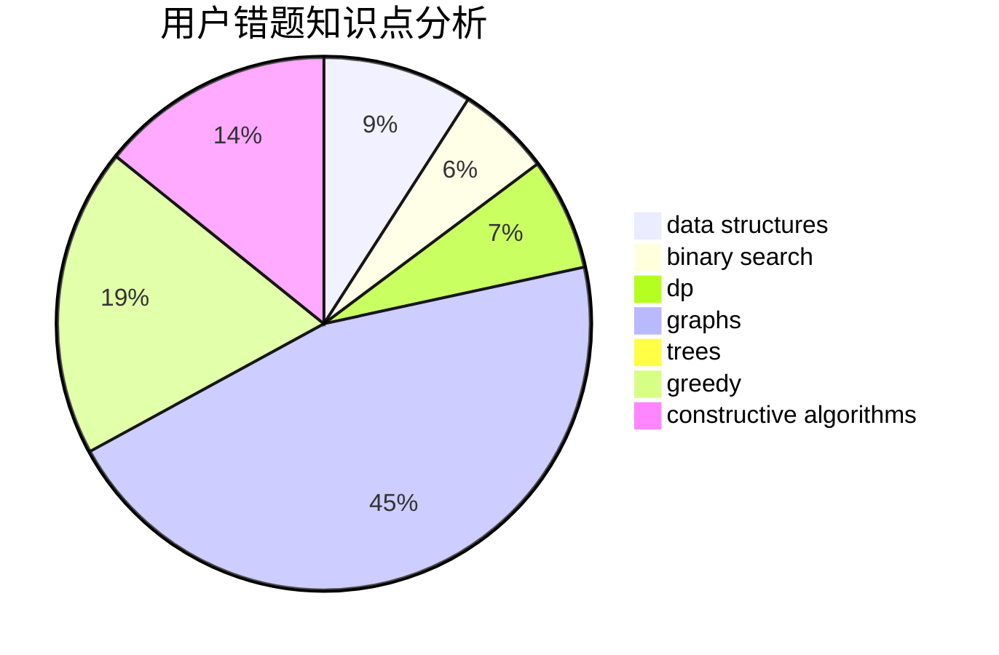

# Devour_
<!-- tabs:start -->
#### **用户提交结果分析**

#### **用户做题类型偏好分析**

#### **用户错题知识点分析**

<!-- tabs:end -->
# 推荐题目
[Glass Half Spilled](https://codeforces.com/contest/1459/problem/D)		dp		  
[Present](https://codeforces.com/contest/1323/problem/D)		binary search,
                        bitmasks,
                        constructive algorithms,
                        data structures,
                        math,
                        sortings		  
[Numbers on Tree](http://codeforces.com/problemset/problem/1286/B)		constructive algorithms,
                        data structures,
                        dfs and similar,
                        graphs,
                        greedy,
                        trees		  
[BerOS file system](http://codeforces.com/problemset/problem/20/A)		implementation		  
[Show Must Go On](http://codeforces.com/problemset/problem/1250/I)		binary search,
                        brute force,
                        greedy,
                        shortest paths		  
[Fedor Runs for President](http://codeforces.com/problemset/problem/1179/D)		data structures,
                        dp,
                        trees		  
[NP-Hard Problem](http://codeforces.com/problemset/problem/687/A)		dfs and similar,
                        graphs		  
[Power Products](https://codeforces.com/contest/1246/problem/B)		hashing,
                        math,
                        number theory		  
[Not Wool Sequences](http://codeforces.com/problemset/problem/238/A)		constructive algorithms,
                        math		  
[Magic Powder - 2](http://codeforces.com/problemset/problem/670/D2)		binary search,
                        implementation		  
<!-- tabs:start -->
#### **data structures**
[Present](https://codeforces.com/contest/1323/problem/D)		binary search,
                        bitmasks,
                        constructive algorithms,
                        data structures,
                        math,
                        sortings		  
[Numbers on Tree](http://codeforces.com/problemset/problem/1286/B)		constructive algorithms,
                        data structures,
                        dfs and similar,
                        graphs,
                        greedy,
                        trees		  
[Fedor Runs for President](http://codeforces.com/problemset/problem/1179/D)		data structures,
                        dp,
                        trees		  
[Stack Exterminable Arrays](http://codeforces.com/problemset/problem/1223/F)		data structures,
                        divide and conquer,
                        dp,
                        hashing		  
[Addition Robot](http://codeforces.com/problemset/problem/1252/K)		data structures,
                        math,
                        matrices		  
[Bombs](http://codeforces.com/problemset/problem/1326/E)		data structures,
                        two pointers		  
[New Year Tree](http://codeforces.com/problemset/problem/379/F)		data structures,
                        divide and conquer,
                        trees		  
[Three Parts of the Array](http://codeforces.com/problemset/problem/1006/C)		binary search,
                        data structures,
                        two pointers		  
[AND Segments](http://codeforces.com/problemset/problem/1327/F)		bitmasks,
                        combinatorics,
                        data structures,
                        dp,
                        two pointers		  
[Optimal Subsequences (Easy Version)](https://codeforces.com/contest/1261/problem/B1)		data structures,
                        greedy		  
#### **binary search**
[Present](https://codeforces.com/contest/1323/problem/D)		binary search,
                        bitmasks,
                        constructive algorithms,
                        data structures,
                        math,
                        sortings		  
[Show Must Go On](http://codeforces.com/problemset/problem/1250/I)		binary search,
                        brute force,
                        greedy,
                        shortest paths		  
[Magic Powder - 2](http://codeforces.com/problemset/problem/670/D2)		binary search,
                        implementation		  
[String Game](http://codeforces.com/problemset/problem/778/A)		binary search,
                        greedy,
                        strings		  
[Three Parts of the Array](http://codeforces.com/problemset/problem/1006/C)		binary search,
                        data structures,
                        two pointers		  
[Prefix-Suffix Palindrome (Hard version)](http://codeforces.com/problemset/problem/1326/D2)		binary search,
                        greedy,
                        hashing,
                        string suffix structures,
                        strings		  
[Maximum width](http://codeforces.com/problemset/problem/1492/C)		binary search,
                        data structures,
                        dp,
                        greedy,
                        two pointers		  
[Pairs](http://codeforces.com/problemset/problem/1463/D)		binary search,
                        constructive algorithms,
                        greedy,
                        two pointers		  
[Old Floppy Drive](http://codeforces.com/problemset/problem/1490/G)		binary search,
                        data structures,
                        math		  
[Odd Mineral Resource](http://codeforces.com/problemset/problem/1479/D)		binary search,
                        bitmasks,
                        brute force,
                        data structures,
                        probabilities,
                        trees		  
#### **dp**
[Glass Half Spilled](https://codeforces.com/contest/1459/problem/D)		dp		  
[Fedor Runs for President](http://codeforces.com/problemset/problem/1179/D)		data structures,
                        dp,
                        trees		  
[Making Shapes](http://codeforces.com/problemset/problem/1290/F)		dp		  
[Museums Tour](https://codeforces.com/contest/1138/problem/E)		dp,
                        graphs,
                        implementation		  
[Stack Exterminable Arrays](http://codeforces.com/problemset/problem/1223/F)		data structures,
                        divide and conquer,
                        dp,
                        hashing		  
[Lucky Tickets](http://codeforces.com/problemset/problem/1096/G)		divide and conquer,
                        dp,
                        fft		  
[Cinema Cashier](http://codeforces.com/problemset/problem/10/B)		dp,
                        implementation		  
[Count The Blocks](http://codeforces.com/problemset/problem/1327/E)		combinatorics,
                        dp,
                        math		  
[Inverse Genealogy](http://codeforces.com/problemset/problem/1379/E)		constructive algorithms,
                        divide and conquer,
                        dp,
                        math,
                        trees		  
[Move and Turn](http://codeforces.com/problemset/problem/1459/B)		dp,
                        math		  
#### **graph**
[Numbers on Tree](http://codeforces.com/problemset/problem/1286/B)		constructive algorithms,
                        data structures,
                        dfs and similar,
                        graphs,
                        greedy,
                        trees		  
[NP-Hard Problem](http://codeforces.com/problemset/problem/687/A)		dfs and similar,
                        graphs		  
[Museums Tour](https://codeforces.com/contest/1138/problem/E)		dp,
                        graphs,
                        implementation		  
[Underground Lab](http://codeforces.com/problemset/problem/780/E)		constructive algorithms,
                        dfs and similar,
                        graphs		  
[Maximum Diameter Graph](http://codeforces.com/problemset/problem/1082/D)		constructive algorithms,
                        graphs,
                        implementation		  
[Ehab's Last Theorem](http://codeforces.com/problemset/problem/1325/F)		constructive algorithms,
                        dfs and similar,
                        graphs,
                        greedy		  
[Minimum Ties](http://codeforces.com/problemset/problem/1487/C)		brute force,
                        constructive algorithms,
                        dfs and similar,
                        graphs,
                        greedy,
                        implementation,
                        math		  
[Chef Monocarp](http://codeforces.com/problemset/problem/1437/C)		dp,
                        flows,
                        graph matchings,
                        greedy,
                        math,
                        sortings		  
[Strange Housing](http://codeforces.com/problemset/problem/1470/D)		constructive algorithms,
                        dfs and similar,
                        graph matchings,
                        graphs,
                        greedy		  
[Longest Simple Cycle](http://codeforces.com/problemset/problem/1476/C)		dp,
                        graphs,
                        greedy		  
#### **trees**
[Numbers on Tree](http://codeforces.com/problemset/problem/1286/B)		constructive algorithms,
                        data structures,
                        dfs and similar,
                        graphs,
                        greedy,
                        trees		  
[Fedor Runs for President](http://codeforces.com/problemset/problem/1179/D)		data structures,
                        dp,
                        trees		  
[New Year Tree](http://codeforces.com/problemset/problem/379/F)		data structures,
                        divide and conquer,
                        trees		  
[Inverse Genealogy](http://codeforces.com/problemset/problem/1379/E)		constructive algorithms,
                        divide and conquer,
                        dp,
                        math,
                        trees		  
[Ehab and Path-etic MEXs](http://codeforces.com/problemset/problem/1325/C)		constructive algorithms,
                        dfs and similar,
                        greedy,
                        trees		  
[Odd Mineral Resource](http://codeforces.com/problemset/problem/1479/D)		binary search,
                        bitmasks,
                        brute force,
                        data structures,
                        probabilities,
                        trees		  
[Yet Another Card Deck](http://codeforces.com/problemset/problem/1511/C)		brute force,
                        data structures,
                        implementation,
                        trees		  
[Diameter Cuts](http://codeforces.com/problemset/problem/1499/F)		combinatorics,
                        dfs and similar,
                        dp,
                        trees		  
[Fib-tree](http://codeforces.com/problemset/problem/1491/E)		brute force,
                        dfs and similar,
                        divide and conquer,
                        number theory,
                        trees		  
[13th Labour of Heracles](http://codeforces.com/problemset/problem/1466/D)		data structures,
                        greedy,
                        sortings,
                        trees		  
#### **divide and conquer**
[Stack Exterminable Arrays](http://codeforces.com/problemset/problem/1223/F)		data structures,
                        divide and conquer,
                        dp,
                        hashing		  
[Lucky Tickets](http://codeforces.com/problemset/problem/1096/G)		divide and conquer,
                        dp,
                        fft		  
[New Year Tree](http://codeforces.com/problemset/problem/379/F)		data structures,
                        divide and conquer,
                        trees		  
[Inverse Genealogy](http://codeforces.com/problemset/problem/1379/E)		constructive algorithms,
                        divide and conquer,
                        dp,
                        math,
                        trees		  
[Divide and Summarize](http://codeforces.com/problemset/problem/1461/D)		binary search,
                        brute force,
                        data structures,
                        divide and conquer,
                        implementation,
                        sortings		  
[Song of the Sirens](http://codeforces.com/problemset/problem/1466/G)		combinatorics,
                        divide and conquer,
                        hashing,
                        math,
                        string suffix structures,
                        strings		  
[Permutation Transformation](http://codeforces.com/problemset/problem/1490/D)		dfs and similar,
                        divide and conquer,
                        implementation		  
[Skyline Photo](https://codeforces.com/contest/1483/problem/C)		data structures,
                        divide and conquer,
                        dp		  
[Fib-tree](http://codeforces.com/problemset/problem/1491/E)		brute force,
                        dfs and similar,
                        divide and conquer,
                        number theory,
                        trees		  
[Sum of Prefix Sums](http://codeforces.com/problemset/problem/1303/G)		data structures,
                        divide and conquer,
                        geometry,
                        trees		  
#### **greedy**
[Numbers on Tree](http://codeforces.com/problemset/problem/1286/B)		constructive algorithms,
                        data structures,
                        dfs and similar,
                        graphs,
                        greedy,
                        trees		  
[Show Must Go On](http://codeforces.com/problemset/problem/1250/I)		binary search,
                        brute force,
                        greedy,
                        shortest paths		  
[String Game](http://codeforces.com/problemset/problem/778/A)		binary search,
                        greedy,
                        strings		  
[Decrease the Sum of Digits](http://codeforces.com/problemset/problem/1409/D)		greedy,
                        math		  
[Fox and Box Accumulation](http://codeforces.com/problemset/problem/388/A)		greedy,
                        sortings		  
[Ehab and Path-etic MEXs](http://codeforces.com/problemset/problem/1325/C)		constructive algorithms,
                        dfs and similar,
                        greedy,
                        trees		  
[Ehab's Last Theorem](http://codeforces.com/problemset/problem/1325/F)		constructive algorithms,
                        dfs and similar,
                        graphs,
                        greedy		  
[Optimal Subsequences (Easy Version)](https://codeforces.com/contest/1261/problem/B1)		data structures,
                        greedy		  
[Grid-00100](http://codeforces.com/problemset/problem/1371/D)		constructive algorithms,
                        greedy,
                        implementation		  
[Prefix-Suffix Palindrome (Hard version)](http://codeforces.com/problemset/problem/1326/D2)		binary search,
                        greedy,
                        hashing,
                        string suffix structures,
                        strings		  
#### **constructive algorithms**
[Present](https://codeforces.com/contest/1323/problem/D)		binary search,
                        bitmasks,
                        constructive algorithms,
                        data structures,
                        math,
                        sortings		  
[Numbers on Tree](http://codeforces.com/problemset/problem/1286/B)		constructive algorithms,
                        data structures,
                        dfs and similar,
                        graphs,
                        greedy,
                        trees		  
[Not Wool Sequences](http://codeforces.com/problemset/problem/238/A)		constructive algorithms,
                        math		  
[Underground Lab](http://codeforces.com/problemset/problem/780/E)		constructive algorithms,
                        dfs and similar,
                        graphs		  
[Maximum Diameter Graph](http://codeforces.com/problemset/problem/1082/D)		constructive algorithms,
                        graphs,
                        implementation		  
[Inverse Genealogy](http://codeforces.com/problemset/problem/1379/E)		constructive algorithms,
                        divide and conquer,
                        dp,
                        math,
                        trees		  
[Ehab and Path-etic MEXs](http://codeforces.com/problemset/problem/1325/C)		constructive algorithms,
                        dfs and similar,
                        greedy,
                        trees		  
[Game with Chips](http://codeforces.com/problemset/problem/1327/C)		constructive algorithms,
                        implementation		  
[Ehab's Last Theorem](http://codeforces.com/problemset/problem/1325/F)		constructive algorithms,
                        dfs and similar,
                        graphs,
                        greedy		  
[Grid-00100](http://codeforces.com/problemset/problem/1371/D)		constructive algorithms,
                        greedy,
                        implementation		  
#### **sortings**
[Present](https://codeforces.com/contest/1323/problem/D)		binary search,
                        bitmasks,
                        constructive algorithms,
                        data structures,
                        math,
                        sortings		  
[Fox and Box Accumulation](http://codeforces.com/problemset/problem/388/A)		greedy,
                        sortings		  
[Diamond Miner](https://codeforces.com/contest/1496/problem/C)		geometry,
                        greedy,
                        math,
                        sortings		  
[Meximization](http://codeforces.com/problemset/problem/1497/A)		brute force,
                        data structures,
                        greedy,
                        sortings		  
[Avoiding Zero](http://codeforces.com/problemset/problem/1427/A)		math,
                        sortings		  
[Divide and Summarize](http://codeforces.com/problemset/problem/1461/D)		binary search,
                        brute force,
                        data structures,
                        divide and conquer,
                        implementation,
                        sortings		  
[Chef Monocarp](http://codeforces.com/problemset/problem/1437/C)		dp,
                        flows,
                        graph matchings,
                        greedy,
                        math,
                        sortings		  
[Replacing Elements](http://codeforces.com/problemset/problem/1473/A)		greedy,
                        implementation,
                        math,
                        sortings		  
[Eastern Exhibition](http://codeforces.com/problemset/problem/1486/B)		binary search,
                        geometry,
                        shortest paths,
                        sortings		  
[The Great Hero](http://codeforces.com/problemset/problem/1480/B)		greedy,
                        implementation,
                        sortings		  
<!-- tabs:end -->
