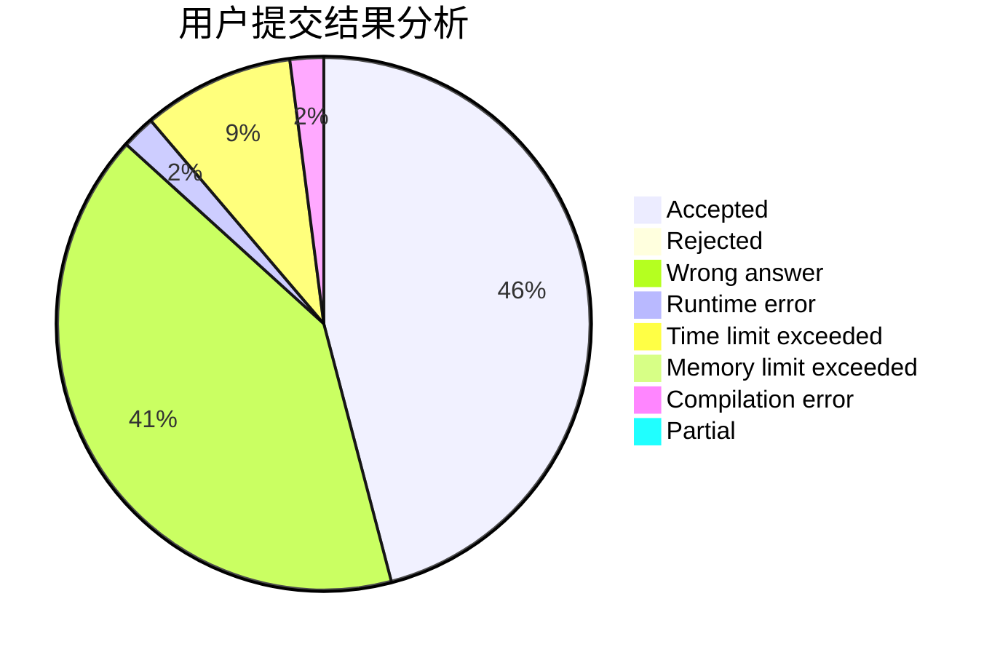
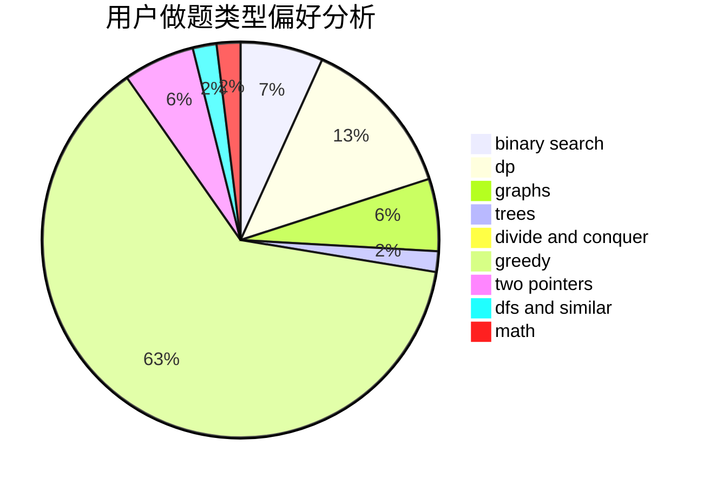

# Devour_

<!-- tabs:start -->

#### **用户提交结果分析**

#### **用户做题类型偏好分析**

<!-- tabs:end -->
# 推荐题目
[1330B](https://codeforces.com/contest/1330/problem/B)
[1468D](https://codeforces.com/contest/1468/problem/D)
[1293C](https://codeforces.com/contest/1293/problem/C)
[25D](https://codeforces.com/contest/25/problem/D)
[231C](https://codeforces.com/contest/231/problem/C)
[1182C](https://codeforces.com/contest/1182/problem/C)
[1255A](https://codeforces.com/contest/1255/problem/A)
[1250J](https://codeforces.com/contest/1250/problem/J)
[1297C](https://codeforces.com/contest/1297/problem/C)
[1388E](https://codeforces.com/contest/1388/problem/E)
