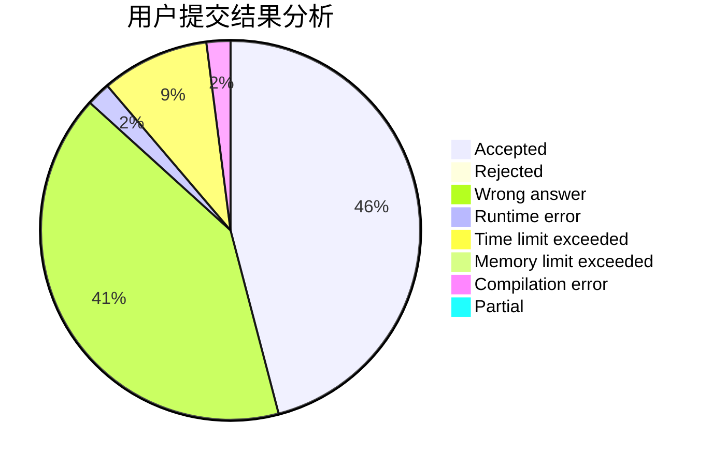
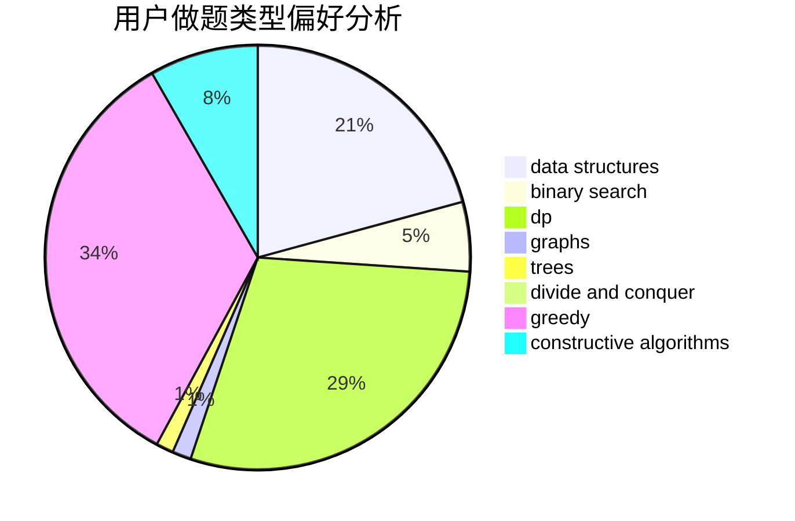
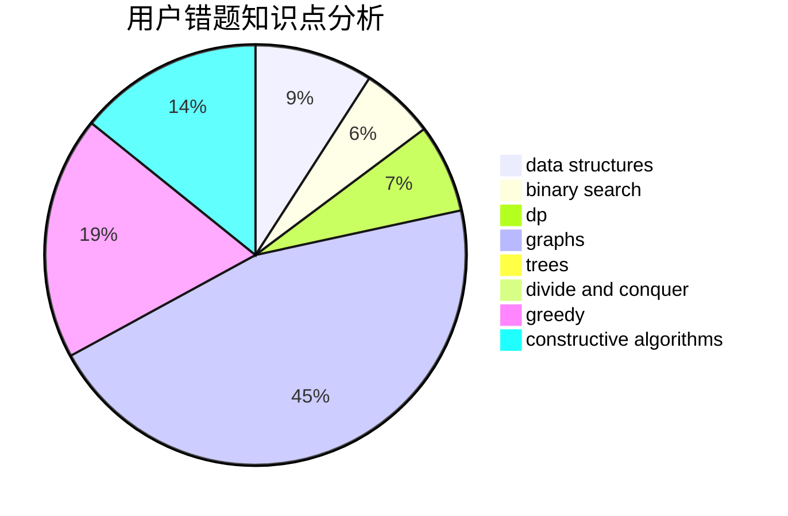

# Devour_

<!-- tabs:start -->

#### **用户提交结果分析**

#### **用户做题类型偏好分析**

#### **用户错题知识点分析**

<!-- tabs:end -->
# 推荐题目
[1323D](https://codeforces.com/contest/1323/problem/D)		dsu,graphs,sortings,trees		  
[1459D](https://codeforces.com/contest/1459/problem/D)		dsu,graphs,sortings,trees		  
[1286B](https://codeforces.com/contest/1286/problem/B)		constructive algorithms,
                        data structures,
                        dfs and similar,
                        graphs,
                        greedy,
                        trees		  
[238A](https://codeforces.com/contest/238/problem/A)		constructive algorithms,
                        math		  
[20A](https://codeforces.com/contest/20/problem/A)		implementation		  
[1179D](https://codeforces.com/contest/1179/problem/D)		data structures,
                        dp,
                        trees		  
[1250I](https://codeforces.com/contest/1250/problem/I)		binary search,
                        brute force,
                        greedy,
                        shortest paths		  
[1246B](https://codeforces.com/contest/1246/problem/B)		dsu,graphs,sortings,trees		  
[1290F](https://codeforces.com/contest/1290/problem/F)		dp		  
[1379E](https://codeforces.com/contest/1379/problem/E)		constructive algorithms,
                        divide and conquer,
                        dp,
                        math,
                        trees		  
