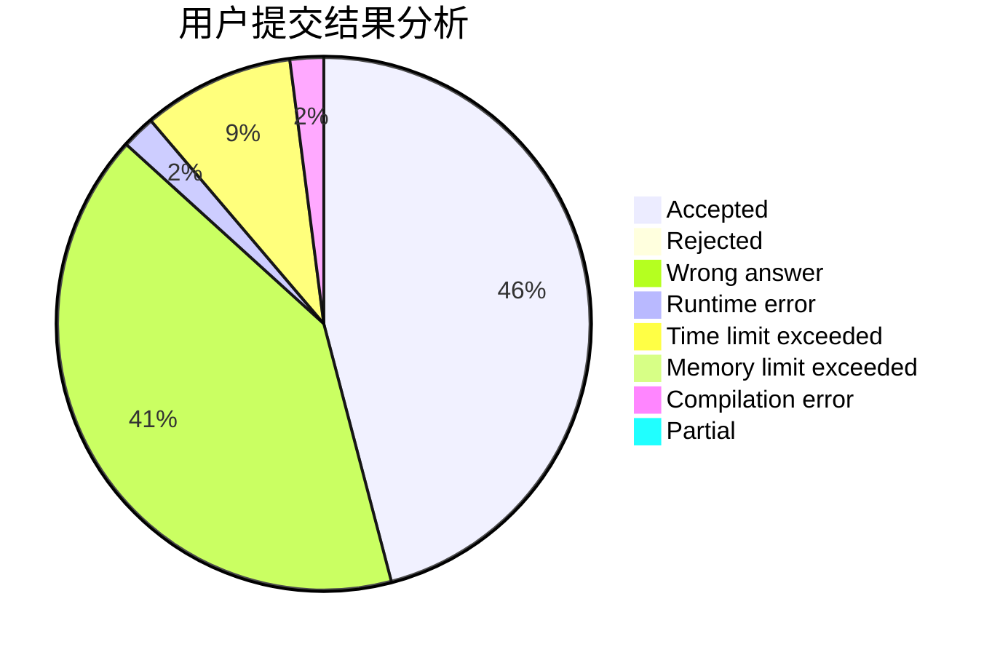
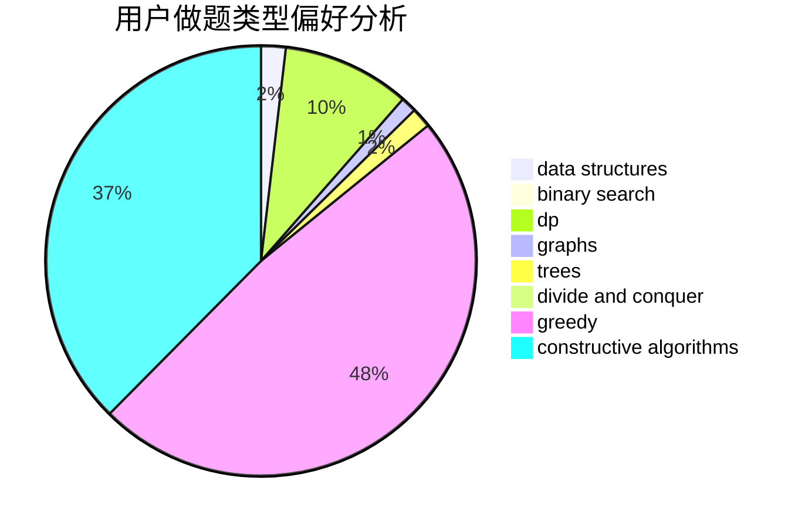
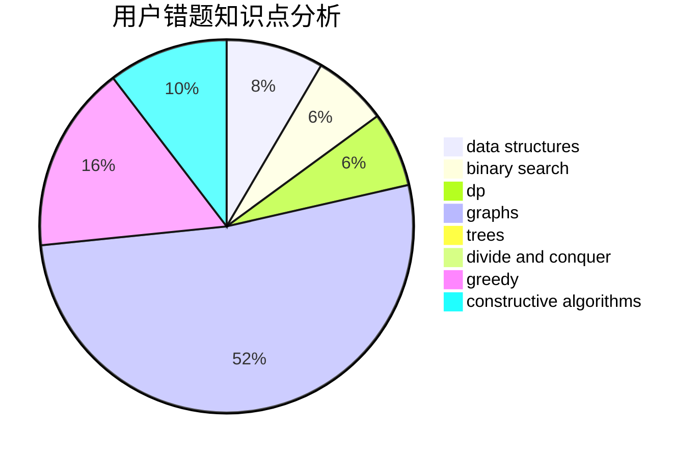

# Devour_

<!-- tabs:start -->

#### **用户提交结果分析**

#### **用户做题类型偏好分析**

#### **用户错题知识点分析**

<!-- tabs:end -->
# 推荐题目
[1330B](https://codeforces.com/contest/1330/problem/B)		implementation,
                        math		  
[1468D](https://codeforces.com/contest/1468/problem/D)		binary search,
                        sortings		  
[1293C](https://codeforces.com/contest/1293/problem/C)		dsu,graphs,sortings,trees		  
[25D](https://codeforces.com/contest/25/problem/D)		dsu,
                        graphs,
                        trees		  
[231C](https://codeforces.com/contest/231/problem/C)		binary search,
                        sortings,
                        two pointers		  
[1182C](https://codeforces.com/contest/1182/problem/C)		data structures,
                        greedy,
                        strings		  
[1255A](https://codeforces.com/contest/1255/problem/A)		math		  
[1250J](https://codeforces.com/contest/1250/problem/J)		binary search,
                        greedy		  
[1297C](https://codeforces.com/contest/1297/problem/C)		*special problem,
                        greedy		  
[1388E](https://codeforces.com/contest/1388/problem/E)		data structures,
                        geometry,
                        sortings		  
