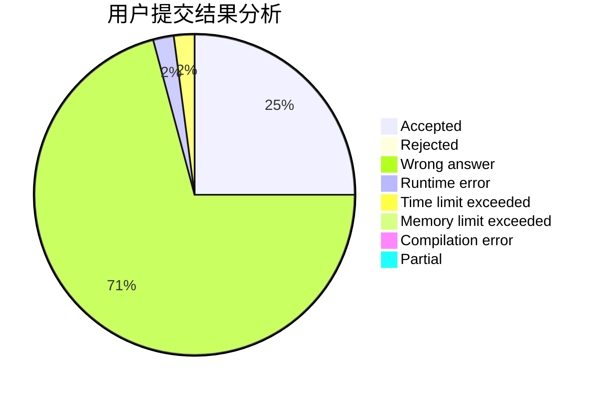
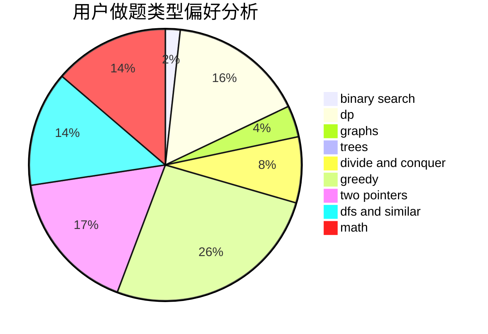

# Dianaa

<!-- tabs:start -->

#### **用户提交结果分析**

#### **用户做题类型偏好分析**

<!-- tabs:end -->
# 推荐题目
[1464C](https://codeforces.com/contest/1464/problem/C)
[1314E](https://codeforces.com/contest/1314/problem/E)
[1473C](https://codeforces.com/contest/1473/problem/C)
[7C](https://codeforces.com/contest/7/problem/C)
[7A](https://codeforces.com/contest/7/problem/A)
[166A](https://codeforces.com/contest/166/problem/A)
[456B](https://codeforces.com/contest/456/problem/B)
[1300E](https://codeforces.com/contest/1300/problem/E)
[506A](https://codeforces.com/contest/506/problem/A)
[233A](https://codeforces.com/contest/233/problem/A)
