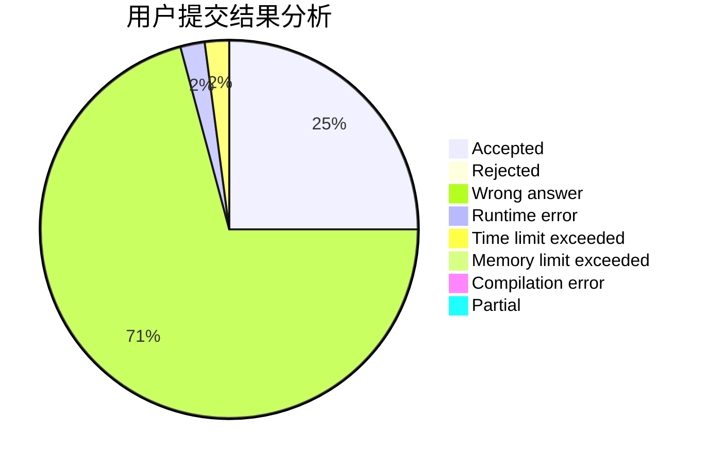
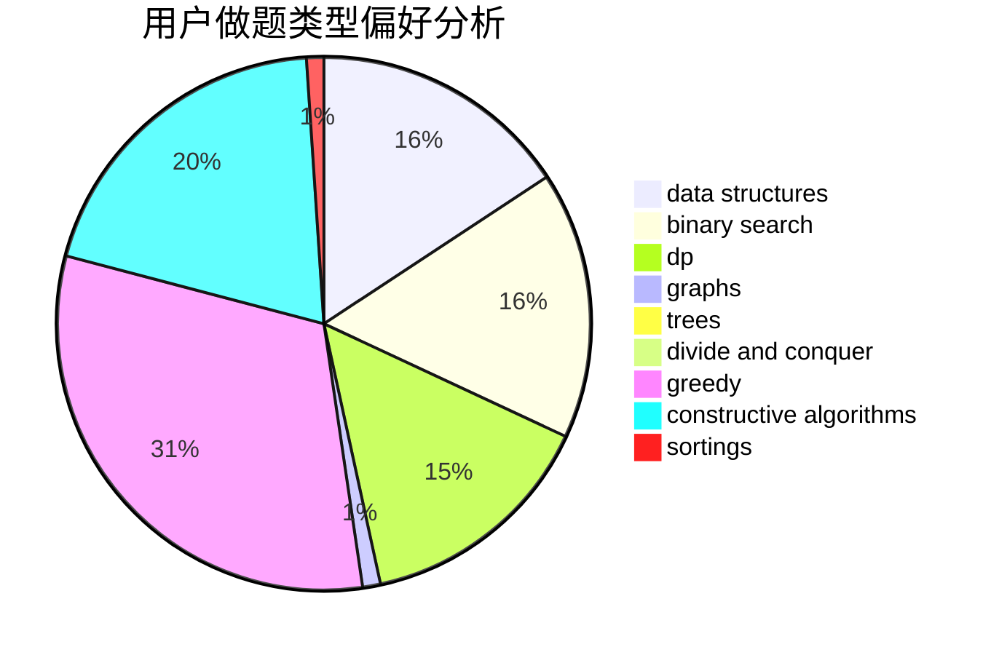
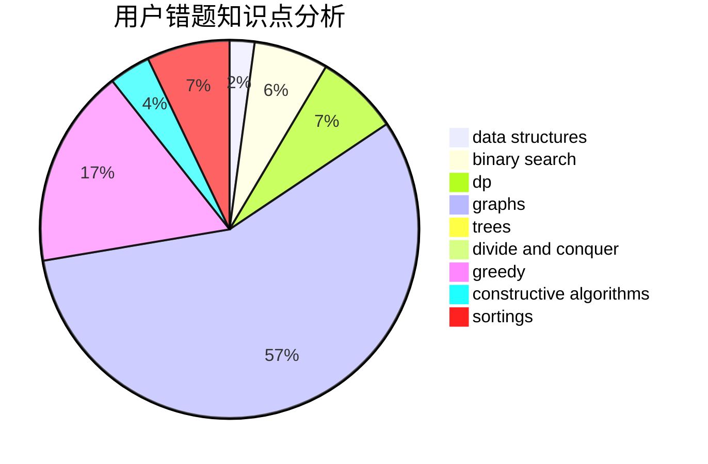

# Dianaa
<!-- tabs:start -->
#### **用户提交结果分析**

#### **用户做题类型偏好分析**

#### **用户错题知识点分析**

<!-- tabs:end -->
# 推荐题目
[781C](https://codeforces.com/contest/781/problem/C)		constructive algorithms,
                        dfs and similar,
                        graphs		  
[1305F](http://codeforces.com/problemset/problem/1305/F)		math,
                        number theory,
                        probabilities		  
[1510I](http://codeforces.com/problemset/problem/1510/I)		greedy,
                        interactive,
                        math,
                        probabilities		  
[436B](http://codeforces.com/problemset/problem/436/B)		implementation,
                        math		  
[781E](https://codeforces.com/contest/781/problem/E)		data structures,
                        dp		  
[780G](http://codeforces.com/problemset/problem/780/G)		data structures,
                        dp		  
[1294C](http://codeforces.com/problemset/problem/1294/C)		greedy,
                        math,
                        number theory		  
[436C](http://codeforces.com/problemset/problem/436/C)		dsu,
                        graphs,
                        greedy,
                        trees		  
[781D](https://codeforces.com/contest/781/problem/D)		bitmasks,
                        dp,
                        graphs,
                        matrices		  
[1270F](http://codeforces.com/problemset/problem/1270/F)		math,
                        strings		  
<!-- tabs:start -->
#### **data structures**
[781E](https://codeforces.com/contest/781/problem/E)		data structures,
                        dp		  
[780G](http://codeforces.com/problemset/problem/780/G)		data structures,
                        dp		  
[1374E2](http://codeforces.com/problemset/problem/1374/E2)		data structures,
                        greedy,
                        implementation,
                        sortings,
                        ternary search,
                        two pointers		  
[1454F](http://codeforces.com/problemset/problem/1454/F)		binary search,
                        data structures,
                        greedy,
                        two pointers		  
[484E](http://codeforces.com/problemset/problem/484/E)		binary search,
                        constructive algorithms,
                        data structures		  
[1344E](http://codeforces.com/problemset/problem/1344/E)		data structures,
                        trees		  
[38G](http://codeforces.com/problemset/problem/38/G)		data structures		  
[263E](http://codeforces.com/problemset/problem/263/E)		brute force,
                        data structures,
                        dp		  
[1209G2](http://codeforces.com/problemset/problem/1209/G2)		data structures		  
[213E](http://codeforces.com/problemset/problem/213/E)		data structures,
                        hashing,
                        strings		  
#### **binary search**
[1454F](http://codeforces.com/problemset/problem/1454/F)		binary search,
                        data structures,
                        greedy,
                        two pointers		  
[484E](http://codeforces.com/problemset/problem/484/E)		binary search,
                        constructive algorithms,
                        data structures		  
[780H](http://codeforces.com/problemset/problem/780/H)		binary search,
                        geometry,
                        implementation,
                        two pointers		  
[258C](http://codeforces.com/problemset/problem/258/C)		binary search,
                        combinatorics,
                        dp,
                        math		  
[1492C](http://codeforces.com/problemset/problem/1492/C)		binary search,
                        data structures,
                        dp,
                        greedy,
                        two pointers		  
[1463D](http://codeforces.com/problemset/problem/1463/D)		binary search,
                        constructive algorithms,
                        greedy,
                        two pointers		  
[1490G](http://codeforces.com/problemset/problem/1490/G)		binary search,
                        data structures,
                        math		  
[1479D](http://codeforces.com/problemset/problem/1479/D)		binary search,
                        bitmasks,
                        brute force,
                        data structures,
                        probabilities,
                        trees		  
[1436E](http://codeforces.com/problemset/problem/1436/E)		binary search,
                        data structures,
                        two pointers		  
[1461D](http://codeforces.com/problemset/problem/1461/D)		binary search,
                        brute force,
                        data structures,
                        divide and conquer,
                        implementation,
                        sortings		  
#### **dp**
[781E](https://codeforces.com/contest/781/problem/E)		data structures,
                        dp		  
[780G](http://codeforces.com/problemset/problem/780/G)		data structures,
                        dp		  
[781D](https://codeforces.com/contest/781/problem/D)		bitmasks,
                        dp,
                        graphs,
                        matrices		  
[258C](http://codeforces.com/problemset/problem/258/C)		binary search,
                        combinatorics,
                        dp,
                        math		  
[263E](http://codeforces.com/problemset/problem/263/E)		brute force,
                        data structures,
                        dp		  
[1029E](http://codeforces.com/problemset/problem/1029/E)		dp,
                        graphs,
                        greedy		  
[1466C](http://codeforces.com/problemset/problem/1466/C)		dp,
                        greedy,
                        strings		  
[372C](http://codeforces.com/problemset/problem/372/C)		data structures,
                        dp,
                        math		  
[780F](http://codeforces.com/problemset/problem/780/F)		bitmasks,
                        dp,
                        graphs,
                        matrices		  
[439E](http://codeforces.com/problemset/problem/439/E)		combinatorics,
                        dp,
                        math		  
#### **graph**
[781C](https://codeforces.com/contest/781/problem/C)		constructive algorithms,
                        dfs and similar,
                        graphs		  
[436C](http://codeforces.com/problemset/problem/436/C)		dsu,
                        graphs,
                        greedy,
                        trees		  
[781D](https://codeforces.com/contest/781/problem/D)		bitmasks,
                        dp,
                        graphs,
                        matrices		  
[1334E](http://codeforces.com/problemset/problem/1334/E)		combinatorics,
                        graphs,
                        greedy,
                        math,
                        number theory		  
[1089D](http://codeforces.com/problemset/problem/1089/D)		graphs		  
[1156G](http://codeforces.com/problemset/problem/1156/G)		graphs,
                        greedy,
                        hashing,
                        implementation		  
[1029E](http://codeforces.com/problemset/problem/1029/E)		dp,
                        graphs,
                        greedy		  
[780F](http://codeforces.com/problemset/problem/780/F)		bitmasks,
                        dp,
                        graphs,
                        matrices		  
[1485D](http://codeforces.com/problemset/problem/1485/D)		constructive algorithms,
                        graphs,
                        math,
                        number theory		  
[1487C](http://codeforces.com/problemset/problem/1487/C)		brute force,
                        constructive algorithms,
                        dfs and similar,
                        graphs,
                        greedy,
                        implementation,
                        math		  
#### **trees**
[436C](http://codeforces.com/problemset/problem/436/C)		dsu,
                        graphs,
                        greedy,
                        trees		  
[1344E](http://codeforces.com/problemset/problem/1344/E)		data structures,
                        trees		  
[1479D](http://codeforces.com/problemset/problem/1479/D)		binary search,
                        bitmasks,
                        brute force,
                        data structures,
                        probabilities,
                        trees		  
[1511C](http://codeforces.com/problemset/problem/1511/C)		brute force,
                        data structures,
                        implementation,
                        trees		  
[1499F](http://codeforces.com/problemset/problem/1499/F)		combinatorics,
                        dfs and similar,
                        dp,
                        trees		  
[1491E](http://codeforces.com/problemset/problem/1491/E)		brute force,
                        dfs and similar,
                        divide and conquer,
                        number theory,
                        trees		  
[1466D](http://codeforces.com/problemset/problem/1466/D)		data structures,
                        greedy,
                        sortings,
                        trees		  
[1495D](http://codeforces.com/problemset/problem/1495/D)		combinatorics,
                        dfs and similar,
                        graphs,
                        math,
                        shortest paths,
                        trees		  
[1303G](http://codeforces.com/problemset/problem/1303/G)		data structures,
                        divide and conquer,
                        geometry,
                        trees		  
[1454E](http://codeforces.com/problemset/problem/1454/E)		combinatorics,
                        dfs and similar,
                        graphs,
                        trees		  
#### **divide and conquer**
[1461D](http://codeforces.com/problemset/problem/1461/D)		binary search,
                        brute force,
                        data structures,
                        divide and conquer,
                        implementation,
                        sortings		  
[1466G](http://codeforces.com/problemset/problem/1466/G)		combinatorics,
                        divide and conquer,
                        hashing,
                        math,
                        string suffix structures,
                        strings		  
[1490D](http://codeforces.com/problemset/problem/1490/D)		dfs and similar,
                        divide and conquer,
                        implementation		  
[1483C](https://codeforces.com/contest/1483/problem/C)		data structures,
                        divide and conquer,
                        dp		  
[1491E](http://codeforces.com/problemset/problem/1491/E)		brute force,
                        dfs and similar,
                        divide and conquer,
                        number theory,
                        trees		  
[1303G](http://codeforces.com/problemset/problem/1303/G)		data structures,
                        divide and conquer,
                        geometry,
                        trees		  
[1494D](http://codeforces.com/problemset/problem/1494/D)		constructive algorithms,
                        data structures,
                        dfs and similar,
                        divide and conquer,
                        dsu,
                        greedy,
                        sortings,
                        trees		  
[1482E](http://codeforces.com/problemset/problem/1482/E)		data structures,
                        divide and conquer,
                        dp		  
[566C](http://codeforces.com/problemset/problem/566/C)		dfs and similar,
                        divide and conquer,
                        trees		  
[1428F](http://codeforces.com/problemset/problem/1428/F)		binary search,
                        data structures,
                        divide and conquer,
                        dp,
                        two pointers		  
#### **greedy**
[1510I](http://codeforces.com/problemset/problem/1510/I)		greedy,
                        interactive,
                        math,
                        probabilities		  
[1294C](http://codeforces.com/problemset/problem/1294/C)		greedy,
                        math,
                        number theory		  
[436C](http://codeforces.com/problemset/problem/436/C)		dsu,
                        graphs,
                        greedy,
                        trees		  
[1374E2](http://codeforces.com/problemset/problem/1374/E2)		data structures,
                        greedy,
                        implementation,
                        sortings,
                        ternary search,
                        two pointers		  
[1454F](http://codeforces.com/problemset/problem/1454/F)		binary search,
                        data structures,
                        greedy,
                        two pointers		  
[1334E](http://codeforces.com/problemset/problem/1334/E)		combinatorics,
                        graphs,
                        greedy,
                        math,
                        number theory		  
[496E](http://codeforces.com/problemset/problem/496/E)		greedy,
                        sortings		  
[1156G](http://codeforces.com/problemset/problem/1156/G)		graphs,
                        greedy,
                        hashing,
                        implementation		  
[1029E](http://codeforces.com/problemset/problem/1029/E)		dp,
                        graphs,
                        greedy		  
[1466C](http://codeforces.com/problemset/problem/1466/C)		dp,
                        greedy,
                        strings		  
#### **constructive algorithms**
[781C](https://codeforces.com/contest/781/problem/C)		constructive algorithms,
                        dfs and similar,
                        graphs		  
[484E](http://codeforces.com/problemset/problem/484/E)		binary search,
                        constructive algorithms,
                        data structures		  
[1272B](http://codeforces.com/problemset/problem/1272/B)		constructive algorithms,
                        greedy,
                        implementation		  
[286E](http://codeforces.com/problemset/problem/286/E)		constructive algorithms,
                        fft,
                        math		  
[1407A](http://codeforces.com/problemset/problem/1407/A)		constructive algorithms,
                        math		  
[1152B](http://codeforces.com/problemset/problem/1152/B)		bitmasks,
                        constructive algorithms,
                        dfs and similar,
                        math		  
[40A](http://codeforces.com/problemset/problem/40/A)		constructive algorithms,
                        geometry,
                        implementation,
                        math		  
[1485D](http://codeforces.com/problemset/problem/1485/D)		constructive algorithms,
                        graphs,
                        math,
                        number theory		  
[1269C](https://codeforces.com/contest/1269/problem/C)		constructive algorithms,
                        greedy,
                        implementation,
                        strings		  
[1493A](http://codeforces.com/problemset/problem/1493/A)		constructive algorithms,
                        greedy		  
#### **sortings**
[1374E2](http://codeforces.com/problemset/problem/1374/E2)		data structures,
                        greedy,
                        implementation,
                        sortings,
                        ternary search,
                        two pointers		  
[496E](http://codeforces.com/problemset/problem/496/E)		greedy,
                        sortings		  
[1496C](https://codeforces.com/contest/1496/problem/C)		geometry,
                        greedy,
                        math,
                        sortings		  
[1495A](http://codeforces.com/problemset/problem/1495/A)		geometry,
                        greedy,
                        math,
                        sortings		  
[1497A](http://codeforces.com/problemset/problem/1497/A)		brute force,
                        data structures,
                        greedy,
                        sortings		  
[1427A](http://codeforces.com/problemset/problem/1427/A)		math,
                        sortings		  
[1461D](http://codeforces.com/problemset/problem/1461/D)		binary search,
                        brute force,
                        data structures,
                        divide and conquer,
                        implementation,
                        sortings		  
[1437C](http://codeforces.com/problemset/problem/1437/C)		dp,
                        flows,
                        graph matchings,
                        greedy,
                        math,
                        sortings		  
[1473A](http://codeforces.com/problemset/problem/1473/A)		greedy,
                        implementation,
                        math,
                        sortings		  
[1486B](http://codeforces.com/problemset/problem/1486/B)		binary search,
                        geometry,
                        shortest paths,
                        sortings		  
<!-- tabs:end -->
