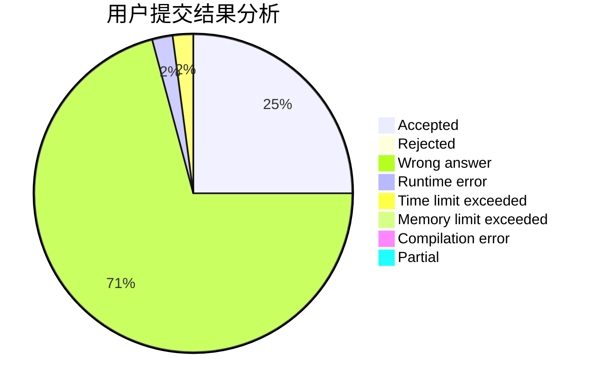
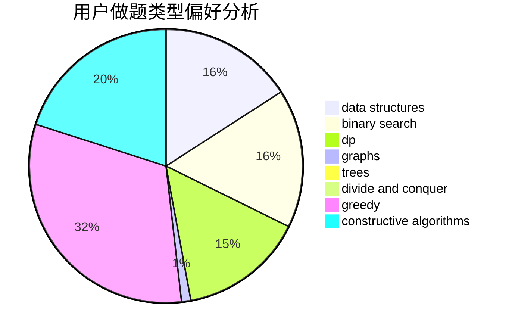
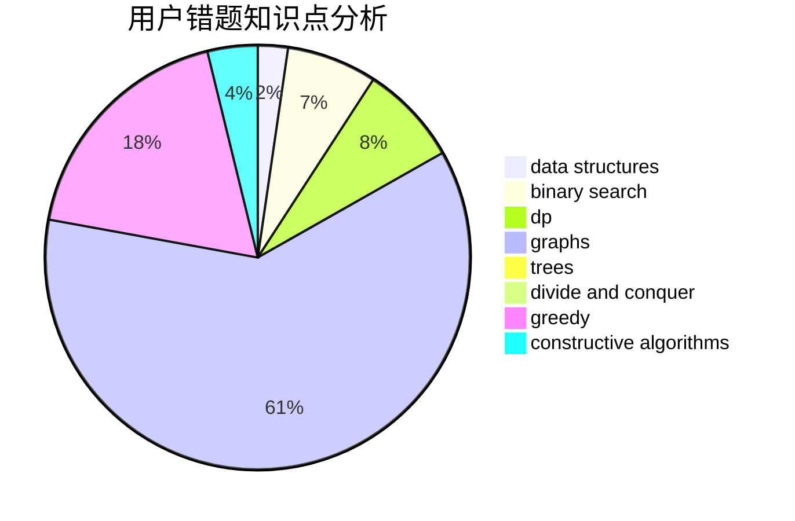

# Dianaa

<!-- tabs:start -->

#### **用户提交结果分析**

#### **用户做题类型偏好分析**

#### **用户错题知识点分析**

<!-- tabs:end -->
# 推荐题目
[1454F](https://codeforces.com/contest/1454/problem/F)		binary search,
                        data structures,
                        greedy,
                        two pointers		  
[1305F](https://codeforces.com/contest/1305/problem/F)		math,
                        number theory,
                        probabilities		  
[1466C](https://codeforces.com/contest/1466/problem/C)		dp,
                        greedy,
                        strings		  
[781E](https://codeforces.com/contest/781/problem/E)		dsu,graphs,sortings,trees		  
[781C](https://codeforces.com/contest/781/problem/C)		dsu,graphs,sortings,trees		  
[1510I](https://codeforces.com/contest/1510/problem/I)		greedy,
                        interactive,
                        math,
                        probabilities		  
[436B](https://codeforces.com/contest/436/problem/B)		implementation,
                        math		  
[1294C](https://codeforces.com/contest/1294/problem/C)		greedy,
                        math,
                        number theory		  
[484E](https://codeforces.com/contest/484/problem/E)		binary search,
                        constructive algorithms,
                        data structures		  
[213E](https://codeforces.com/contest/213/problem/E)		data structures,
                        hashing,
                        strings		  
