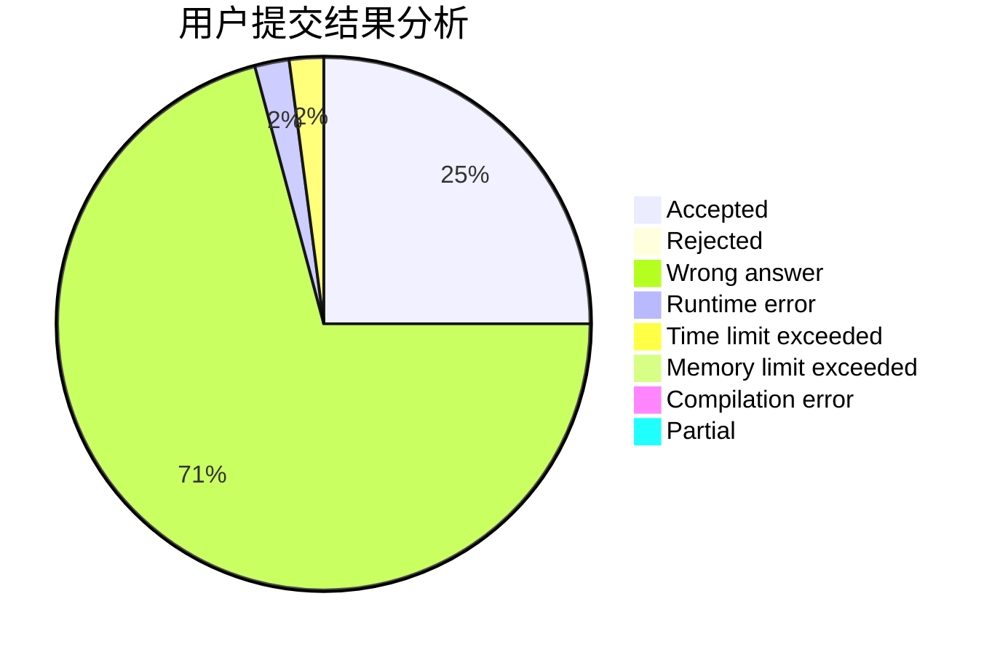
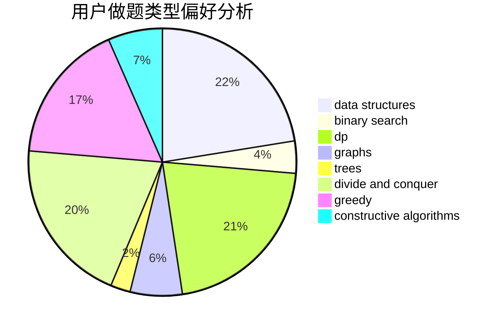
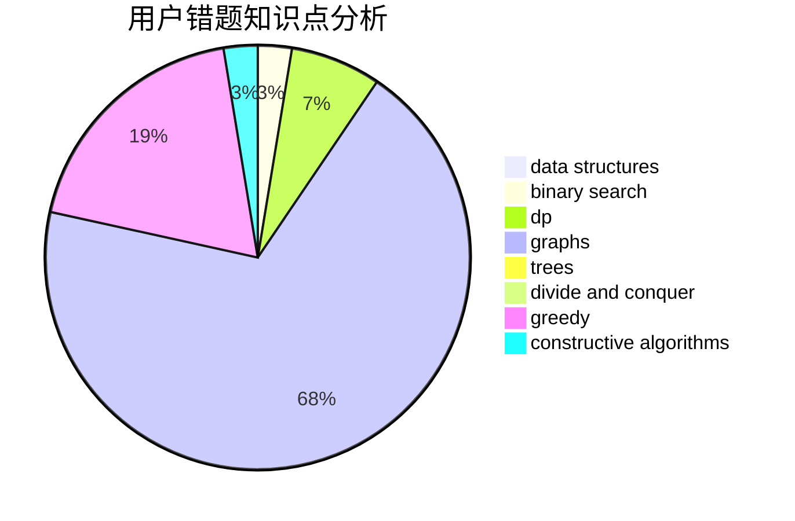

# Dianaa

<!-- tabs:start -->

#### **用户提交结果分析**

#### **用户做题类型偏好分析**

#### **用户错题知识点分析**

<!-- tabs:end -->
# 推荐题目
[1464C](https://codeforces.com/contest/1464/problem/C)		dsu,graphs,sortings,trees		  
[1314E](https://codeforces.com/contest/1314/problem/E)		dsu,graphs,sortings,trees		  
[1473C](https://codeforces.com/contest/1473/problem/C)		constructive algorithms,
                        math		  
[7C](https://codeforces.com/contest/7/problem/C)		math,
                        number theory		  
[7A](https://codeforces.com/contest/7/problem/A)		brute force,
                        constructive algorithms		  
[166A](https://codeforces.com/contest/166/problem/A)		binary search,
                        implementation,
                        sortings		  
[456B](https://codeforces.com/contest/456/problem/B)		math,
                        number theory		  
[1300E](https://codeforces.com/contest/1300/problem/E)		dsu,graphs,sortings,trees		  
[506A](https://codeforces.com/contest/506/problem/A)		dsu,graphs,sortings,trees		  
[233A](https://codeforces.com/contest/233/problem/A)		implementation,
                        math		  
