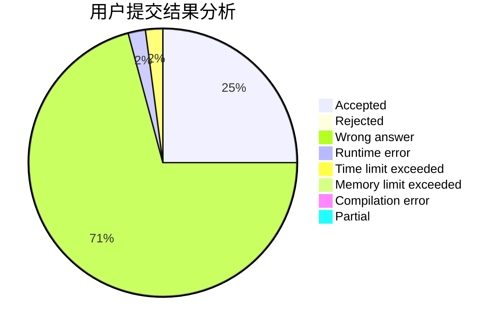
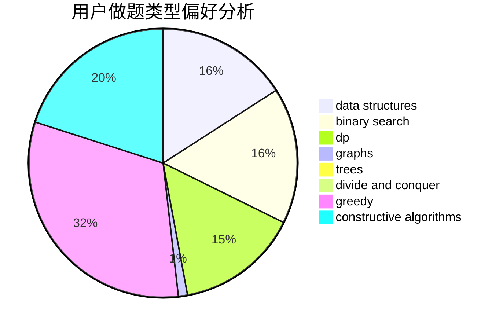
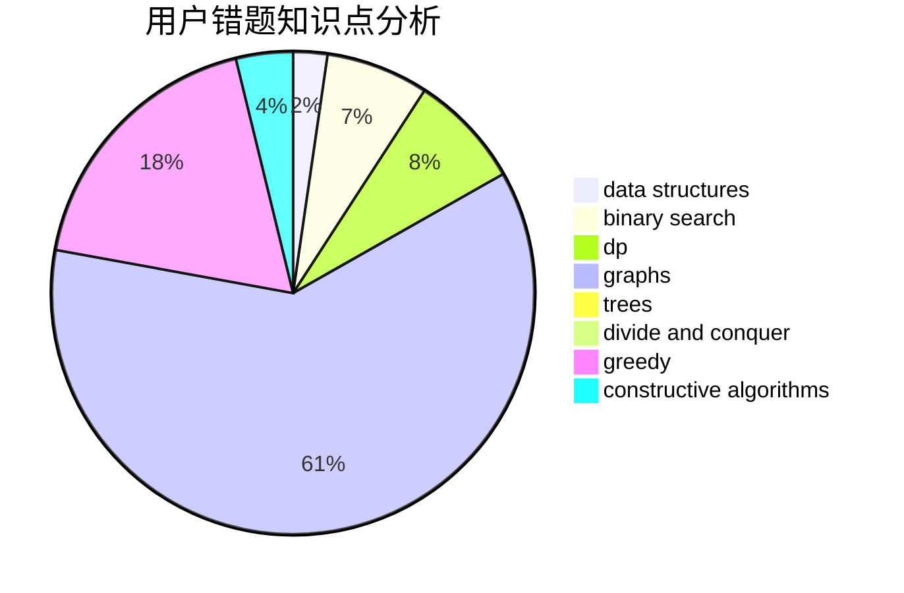

# Dianaa
<!-- tabs:start -->
#### **用户提交结果分析**

#### **用户做题类型偏好分析**

#### **用户错题知识点分析**

<!-- tabs:end -->
# 推荐题目
[Underground Lab](https://codeforces.com/contest/781/problem/C)		constructive algorithms,
                        dfs and similar,
                        graphs		  
[Kuroni and the Punishment](http://codeforces.com/problemset/problem/1305/F)		math,
                        number theory,
                        probabilities		  
[Is It Rated?](http://codeforces.com/problemset/problem/1510/I)		greedy,
                        interactive,
                        math,
                        probabilities		  
[Om Nom and Spiders](http://codeforces.com/problemset/problem/436/B)		implementation,
                        math		  
[Andryusha and Nervous Barriers](https://codeforces.com/contest/781/problem/E)		data structures,
                        dp		  
[Andryusha and Nervous Barriers](http://codeforces.com/problemset/problem/780/G)		data structures,
                        dp		  
[Product of Three Numbers](http://codeforces.com/problemset/problem/1294/C)		greedy,
                        math,
                        number theory		  
[Dungeons and Candies](http://codeforces.com/problemset/problem/436/C)		dsu,
                        graphs,
                        greedy,
                        trees		  
[Axel and Marston in Bitland](https://codeforces.com/contest/781/problem/D)		bitmasks,
                        dp,
                        graphs,
                        matrices		  
[Awesome Substrings](http://codeforces.com/problemset/problem/1270/F)		math,
                        strings		  
<!-- tabs:start -->
#### **data structures**
[Andryusha and Nervous Barriers](https://codeforces.com/contest/781/problem/E)		data structures,
                        dp		  
[Andryusha and Nervous Barriers](http://codeforces.com/problemset/problem/780/G)		data structures,
                        dp		  
[Reading Books (hard version)](http://codeforces.com/problemset/problem/1374/E2)		data structures,
                        greedy,
                        implementation,
                        sortings,
                        ternary search,
                        two pointers		  
[Array Partition](http://codeforces.com/problemset/problem/1454/F)		binary search,
                        data structures,
                        greedy,
                        two pointers		  
[Sign on Fence](http://codeforces.com/problemset/problem/484/E)		binary search,
                        constructive algorithms,
                        data structures		  
[Train Tracks](http://codeforces.com/problemset/problem/1344/E)		data structures,
                        trees		  
[Queue](http://codeforces.com/problemset/problem/38/G)		data structures		  
[Rhombus](http://codeforces.com/problemset/problem/263/E)		brute force,
                        data structures,
                        dp		  
[Into Blocks (hard version)](http://codeforces.com/problemset/problem/1209/G2)		data structures		  
[Two Permutations](http://codeforces.com/problemset/problem/213/E)		data structures,
                        hashing,
                        strings		  
#### **binary search**
[Array Partition](http://codeforces.com/problemset/problem/1454/F)		binary search,
                        data structures,
                        greedy,
                        two pointers		  
[Sign on Fence](http://codeforces.com/problemset/problem/484/E)		binary search,
                        constructive algorithms,
                        data structures		  
[Intranet of Buses](http://codeforces.com/problemset/problem/780/H)		binary search,
                        geometry,
                        implementation,
                        two pointers		  
[Little Elephant and LCM](http://codeforces.com/problemset/problem/258/C)		binary search,
                        combinatorics,
                        dp,
                        math		  
[Maximum width](http://codeforces.com/problemset/problem/1492/C)		binary search,
                        data structures,
                        dp,
                        greedy,
                        two pointers		  
[Pairs](http://codeforces.com/problemset/problem/1463/D)		binary search,
                        constructive algorithms,
                        greedy,
                        two pointers		  
[Old Floppy Drive](http://codeforces.com/problemset/problem/1490/G)		binary search,
                        data structures,
                        math		  
[Odd Mineral Resource](http://codeforces.com/problemset/problem/1479/D)		binary search,
                        bitmasks,
                        brute force,
                        data structures,
                        probabilities,
                        trees		  
[Complicated Computations](http://codeforces.com/problemset/problem/1436/E)		binary search,
                        data structures,
                        two pointers		  
[Divide and Summarize](http://codeforces.com/problemset/problem/1461/D)		binary search,
                        brute force,
                        data structures,
                        divide and conquer,
                        implementation,
                        sortings		  
#### **dp**
[Andryusha and Nervous Barriers](https://codeforces.com/contest/781/problem/E)		data structures,
                        dp		  
[Andryusha and Nervous Barriers](http://codeforces.com/problemset/problem/780/G)		data structures,
                        dp		  
[Axel and Marston in Bitland](https://codeforces.com/contest/781/problem/D)		bitmasks,
                        dp,
                        graphs,
                        matrices		  
[Little Elephant and LCM](http://codeforces.com/problemset/problem/258/C)		binary search,
                        combinatorics,
                        dp,
                        math		  
[Rhombus](http://codeforces.com/problemset/problem/263/E)		brute force,
                        data structures,
                        dp		  
[Tree with Small Distances](http://codeforces.com/problemset/problem/1029/E)		dp,
                        graphs,
                        greedy		  
[Canine poetry](http://codeforces.com/problemset/problem/1466/C)		dp,
                        greedy,
                        strings		  
[Watching Fireworks is Fun](http://codeforces.com/problemset/problem/372/C)		data structures,
                        dp,
                        math		  
[Axel and Marston in Bitland](http://codeforces.com/problemset/problem/780/F)		bitmasks,
                        dp,
                        graphs,
                        matrices		  
[Devu and Birthday Celebration](http://codeforces.com/problemset/problem/439/E)		combinatorics,
                        dp,
                        math		  
#### **graph**
[Underground Lab](https://codeforces.com/contest/781/problem/C)		constructive algorithms,
                        dfs and similar,
                        graphs		  
[Dungeons and Candies](http://codeforces.com/problemset/problem/436/C)		dsu,
                        graphs,
                        greedy,
                        trees		  
[Axel and Marston in Bitland](https://codeforces.com/contest/781/problem/D)		bitmasks,
                        dp,
                        graphs,
                        matrices		  
[Divisor Paths](http://codeforces.com/problemset/problem/1334/E)		combinatorics,
                        graphs,
                        greedy,
                        math,
                        number theory		  
[Distance Sum](http://codeforces.com/problemset/problem/1089/D)		graphs		  
[Optimizer](http://codeforces.com/problemset/problem/1156/G)		graphs,
                        greedy,
                        hashing,
                        implementation		  
[Tree with Small Distances](http://codeforces.com/problemset/problem/1029/E)		dp,
                        graphs,
                        greedy		  
[Axel and Marston in Bitland](http://codeforces.com/problemset/problem/780/F)		bitmasks,
                        dp,
                        graphs,
                        matrices		  
[Multiples and Power Differences](http://codeforces.com/problemset/problem/1485/D)		constructive algorithms,
                        graphs,
                        math,
                        number theory		  
[Minimum Ties](http://codeforces.com/problemset/problem/1487/C)		brute force,
                        constructive algorithms,
                        dfs and similar,
                        graphs,
                        greedy,
                        implementation,
                        math		  
#### **trees**
[Dungeons and Candies](http://codeforces.com/problemset/problem/436/C)		dsu,
                        graphs,
                        greedy,
                        trees		  
[Train Tracks](http://codeforces.com/problemset/problem/1344/E)		data structures,
                        trees		  
[Odd Mineral Resource](http://codeforces.com/problemset/problem/1479/D)		binary search,
                        bitmasks,
                        brute force,
                        data structures,
                        probabilities,
                        trees		  
[Yet Another Card Deck](http://codeforces.com/problemset/problem/1511/C)		brute force,
                        data structures,
                        implementation,
                        trees		  
[Diameter Cuts](http://codeforces.com/problemset/problem/1499/F)		combinatorics,
                        dfs and similar,
                        dp,
                        trees		  
[Fib-tree](http://codeforces.com/problemset/problem/1491/E)		brute force,
                        dfs and similar,
                        divide and conquer,
                        number theory,
                        trees		  
[13th Labour of Heracles](http://codeforces.com/problemset/problem/1466/D)		data structures,
                        greedy,
                        sortings,
                        trees		  
[BFS Trees](http://codeforces.com/problemset/problem/1495/D)		combinatorics,
                        dfs and similar,
                        graphs,
                        math,
                        shortest paths,
                        trees		  
[Sum of Prefix Sums](http://codeforces.com/problemset/problem/1303/G)		data structures,
                        divide and conquer,
                        geometry,
                        trees		  
[Number of Simple Paths](http://codeforces.com/problemset/problem/1454/E)		combinatorics,
                        dfs and similar,
                        graphs,
                        trees		  
#### **divide and conquer**
[Divide and Summarize](http://codeforces.com/problemset/problem/1461/D)		binary search,
                        brute force,
                        data structures,
                        divide and conquer,
                        implementation,
                        sortings		  
[Song of the Sirens](http://codeforces.com/problemset/problem/1466/G)		combinatorics,
                        divide and conquer,
                        hashing,
                        math,
                        string suffix structures,
                        strings		  
[Permutation Transformation](http://codeforces.com/problemset/problem/1490/D)		dfs and similar,
                        divide and conquer,
                        implementation		  
[Skyline Photo](https://codeforces.com/contest/1483/problem/C)		data structures,
                        divide and conquer,
                        dp		  
[Fib-tree](http://codeforces.com/problemset/problem/1491/E)		brute force,
                        dfs and similar,
                        divide and conquer,
                        number theory,
                        trees		  
[Sum of Prefix Sums](http://codeforces.com/problemset/problem/1303/G)		data structures,
                        divide and conquer,
                        geometry,
                        trees		  
[Dogeforces](http://codeforces.com/problemset/problem/1494/D)		constructive algorithms,
                        data structures,
                        dfs and similar,
                        divide and conquer,
                        dsu,
                        greedy,
                        sortings,
                        trees		  
[Skyline Photo](http://codeforces.com/problemset/problem/1482/E)		data structures,
                        divide and conquer,
                        dp		  
[Logistical Questions](http://codeforces.com/problemset/problem/566/C)		dfs and similar,
                        divide and conquer,
                        trees		  
[Fruit Sequences](http://codeforces.com/problemset/problem/1428/F)		binary search,
                        data structures,
                        divide and conquer,
                        dp,
                        two pointers		  
#### **greedy**
[Is It Rated?](http://codeforces.com/problemset/problem/1510/I)		greedy,
                        interactive,
                        math,
                        probabilities		  
[Product of Three Numbers](http://codeforces.com/problemset/problem/1294/C)		greedy,
                        math,
                        number theory		  
[Dungeons and Candies](http://codeforces.com/problemset/problem/436/C)		dsu,
                        graphs,
                        greedy,
                        trees		  
[Reading Books (hard version)](http://codeforces.com/problemset/problem/1374/E2)		data structures,
                        greedy,
                        implementation,
                        sortings,
                        ternary search,
                        two pointers		  
[Array Partition](http://codeforces.com/problemset/problem/1454/F)		binary search,
                        data structures,
                        greedy,
                        two pointers		  
[Divisor Paths](http://codeforces.com/problemset/problem/1334/E)		combinatorics,
                        graphs,
                        greedy,
                        math,
                        number theory		  
[Distributing Parts](http://codeforces.com/problemset/problem/496/E)		greedy,
                        sortings		  
[Optimizer](http://codeforces.com/problemset/problem/1156/G)		graphs,
                        greedy,
                        hashing,
                        implementation		  
[Tree with Small Distances](http://codeforces.com/problemset/problem/1029/E)		dp,
                        graphs,
                        greedy		  
[Canine poetry](http://codeforces.com/problemset/problem/1466/C)		dp,
                        greedy,
                        strings		  
#### **constructive algorithms**
[Underground Lab](https://codeforces.com/contest/781/problem/C)		constructive algorithms,
                        dfs and similar,
                        graphs		  
[Sign on Fence](http://codeforces.com/problemset/problem/484/E)		binary search,
                        constructive algorithms,
                        data structures		  
[Snow Walking Robot](http://codeforces.com/problemset/problem/1272/B)		constructive algorithms,
                        greedy,
                        implementation		  
[Ladies' Shop](http://codeforces.com/problemset/problem/286/E)		constructive algorithms,
                        fft,
                        math		  
[Ahahahahahahahaha](http://codeforces.com/problemset/problem/1407/A)		constructive algorithms,
                        math		  
[Neko Performs Cat Furrier Transform](http://codeforces.com/problemset/problem/1152/B)		bitmasks,
                        constructive algorithms,
                        dfs and similar,
                        math		  
[Find Color](http://codeforces.com/problemset/problem/40/A)		constructive algorithms,
                        geometry,
                        implementation,
                        math		  
[Multiples and Power Differences](http://codeforces.com/problemset/problem/1485/D)		constructive algorithms,
                        graphs,
                        math,
                        number theory		  
[Long Beautiful Integer](https://codeforces.com/contest/1269/problem/C)		constructive algorithms,
                        greedy,
                        implementation,
                        strings		  
[Anti-knapsack](http://codeforces.com/problemset/problem/1493/A)		constructive algorithms,
                        greedy		  
#### **sortings**
[Reading Books (hard version)](http://codeforces.com/problemset/problem/1374/E2)		data structures,
                        greedy,
                        implementation,
                        sortings,
                        ternary search,
                        two pointers		  
[Distributing Parts](http://codeforces.com/problemset/problem/496/E)		greedy,
                        sortings		  
[Diamond Miner](https://codeforces.com/contest/1496/problem/C)		geometry,
                        greedy,
                        math,
                        sortings		  
[Diamond Miner](http://codeforces.com/problemset/problem/1495/A)		geometry,
                        greedy,
                        math,
                        sortings		  
[Meximization](http://codeforces.com/problemset/problem/1497/A)		brute force,
                        data structures,
                        greedy,
                        sortings		  
[Avoiding Zero](http://codeforces.com/problemset/problem/1427/A)		math,
                        sortings		  
[Divide and Summarize](http://codeforces.com/problemset/problem/1461/D)		binary search,
                        brute force,
                        data structures,
                        divide and conquer,
                        implementation,
                        sortings		  
[Chef Monocarp](http://codeforces.com/problemset/problem/1437/C)		dp,
                        flows,
                        graph matchings,
                        greedy,
                        math,
                        sortings		  
[Replacing Elements](http://codeforces.com/problemset/problem/1473/A)		greedy,
                        implementation,
                        math,
                        sortings		  
[Eastern Exhibition](http://codeforces.com/problemset/problem/1486/B)		binary search,
                        geometry,
                        shortest paths,
                        sortings		  
<!-- tabs:end -->
