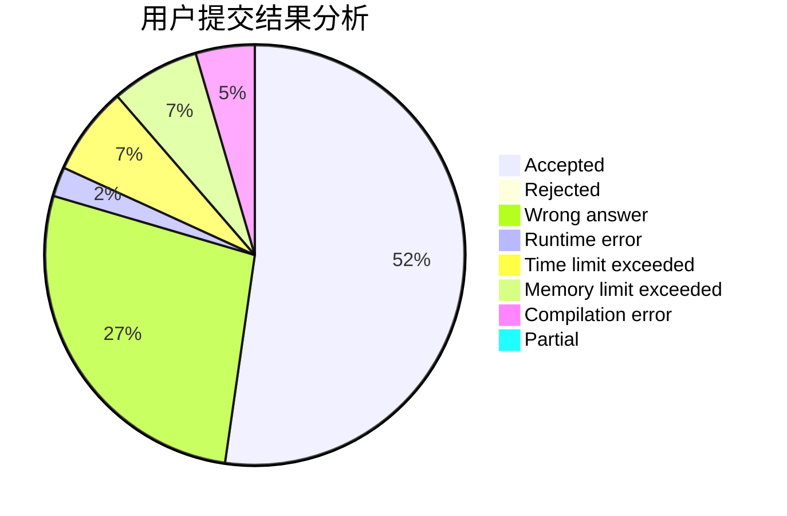
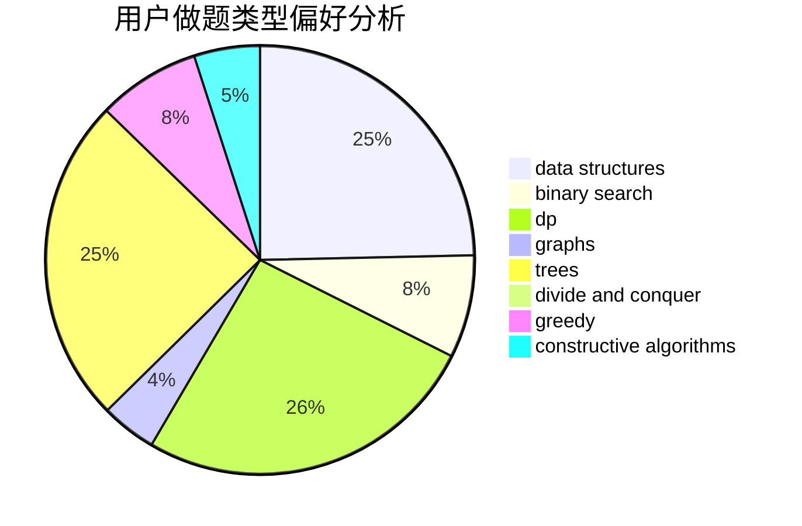
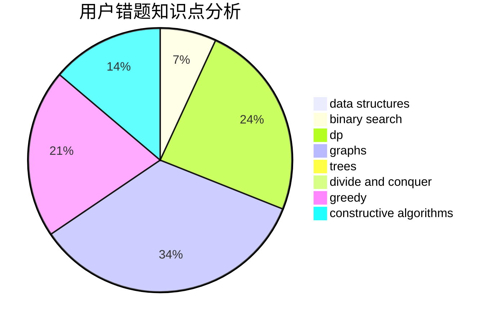

# DinoMax00

<!-- tabs:start -->

#### **用户提交结果分析**

#### **用户做题类型偏好分析**

#### **用户错题知识点分析**

<!-- tabs:end -->
# 推荐题目
[1286B](https://codeforces.com/contest/1286/problem/B)		constructive algorithms,
                        data structures,
                        dfs and similar,
                        graphs,
                        greedy,
                        trees		  
[598A](https://codeforces.com/contest/598/problem/A)		math		  
[1510J](https://codeforces.com/contest/1510/problem/J)		constructive algorithms,
                        math		  
[166E](https://codeforces.com/contest/166/problem/E)		dp,
                        math,
                        matrices		  
[782A](https://codeforces.com/contest/782/problem/A)		dsu,graphs,sortings,trees		  
[109A](https://codeforces.com/contest/109/problem/A)		brute force,
                        implementation		  
[293C](https://codeforces.com/contest/293/problem/C)		brute force,
                        math,
                        number theory		  
[1136E](https://codeforces.com/contest/1136/problem/E)		binary search,
                        data structures		  
[219C](https://codeforces.com/contest/219/problem/C)		brute force,
                        dp,
                        greedy		  
[493E](https://codeforces.com/contest/493/problem/E)		math		  
