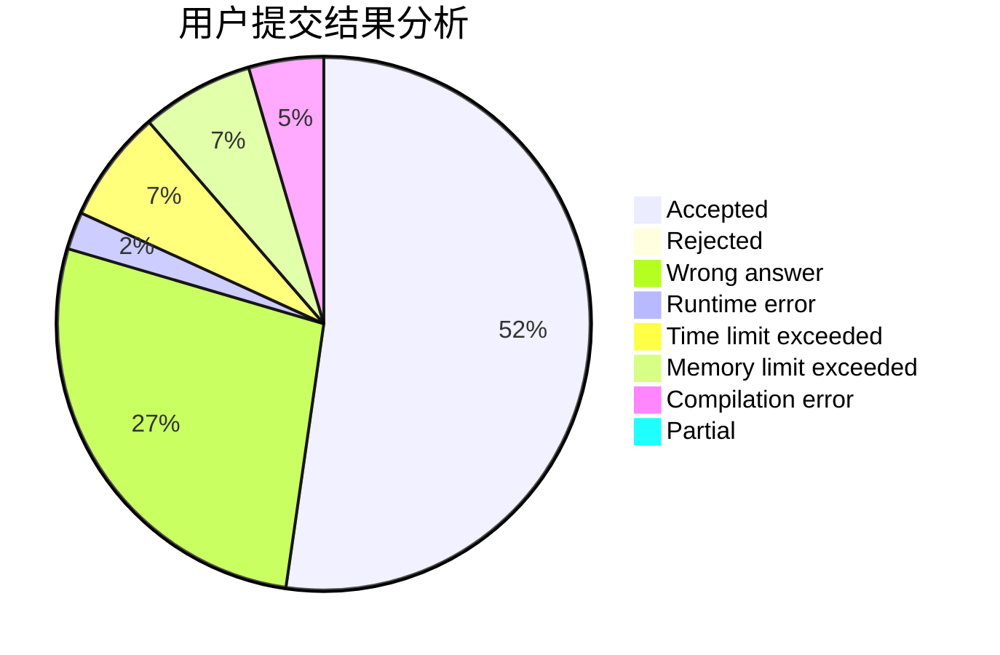
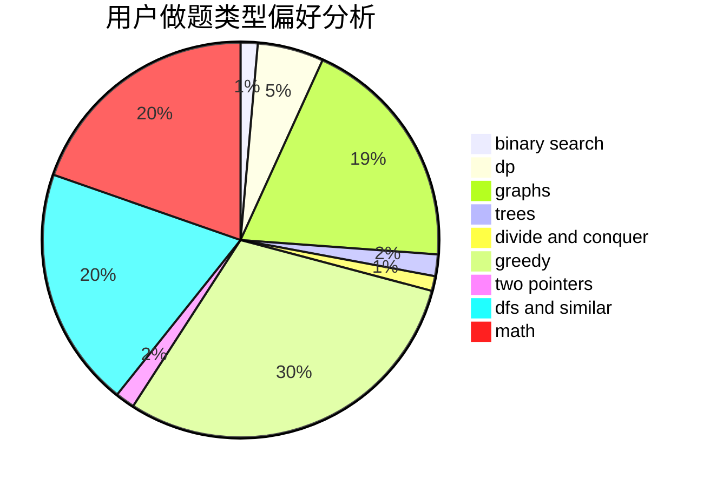

# DinoMax00

<!-- tabs:start -->

#### **用户提交结果分析**

#### **用户做题类型偏好分析**

<!-- tabs:end -->
# 推荐题目
[1293C](https://codeforces.com/contest/1293/problem/C)
[615D](https://codeforces.com/contest/615/problem/D)
[166C](https://codeforces.com/contest/166/problem/C)
[193B](https://codeforces.com/contest/193/problem/B)
[7E](https://codeforces.com/contest/7/problem/E)
[10C](https://codeforces.com/contest/10/problem/C)
[30A](https://codeforces.com/contest/30/problem/A)
[1139A](https://codeforces.com/contest/1139/problem/A)
[238D](https://codeforces.com/contest/238/problem/D)
[513C](https://codeforces.com/contest/513/problem/C)
