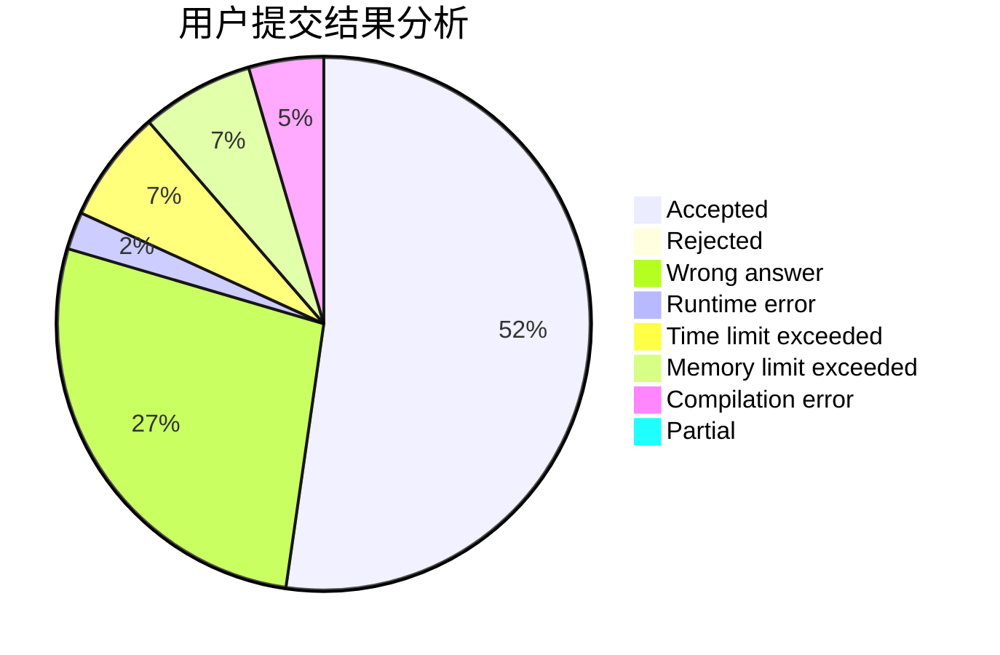
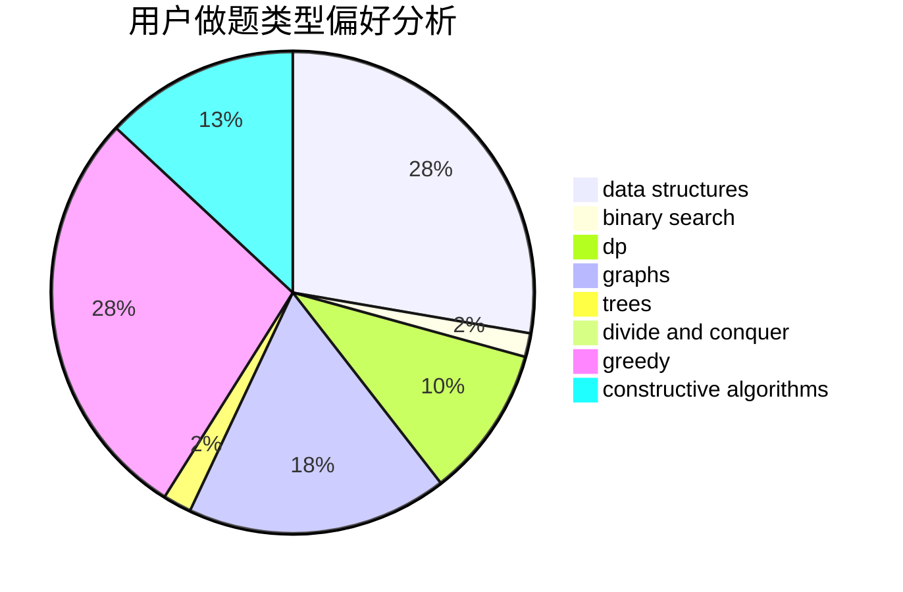
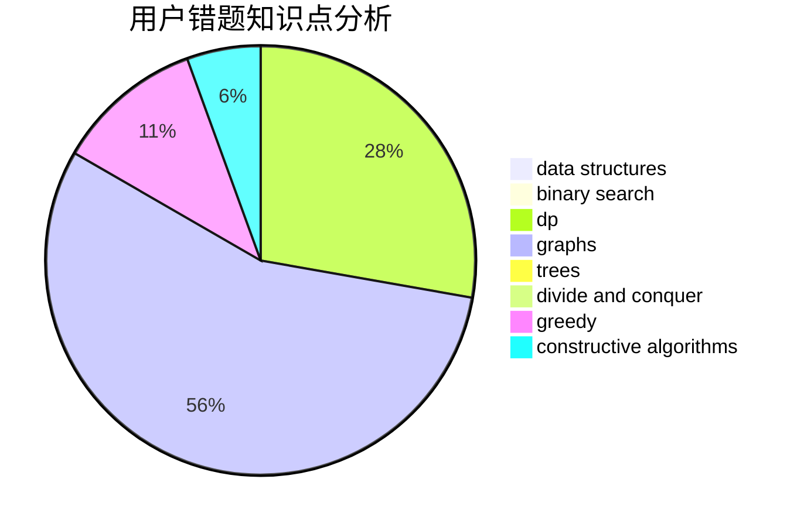

# DinoMax00

<!-- tabs:start -->

#### **用户提交结果分析**

#### **用户做题类型偏好分析**

#### **用户错题知识点分析**

<!-- tabs:end -->
# 推荐题目
[1293C](https://codeforces.com/contest/1293/problem/C)		dsu,graphs,sortings,trees		  
[615D](https://codeforces.com/contest/615/problem/D)		math,
                        number theory		  
[166C](https://codeforces.com/contest/166/problem/C)		greedy,
                        math,
                        sortings		  
[193B](https://codeforces.com/contest/193/problem/B)		brute force		  
[7E](https://codeforces.com/contest/7/problem/E)		dp,
                        expression parsing,
                        implementation		  
[10C](https://codeforces.com/contest/10/problem/C)		number theory		  
[30A](https://codeforces.com/contest/30/problem/A)		brute force,
                        math		  
[1139A](https://codeforces.com/contest/1139/problem/A)		implementation,
                        strings		  
[238D](https://codeforces.com/contest/238/problem/D)		data structures,
                        implementation		  
[513C](https://codeforces.com/contest/513/problem/C)		bitmasks,
                        probabilities		  
