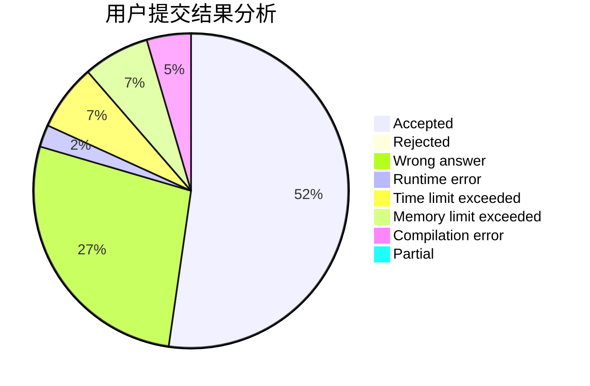
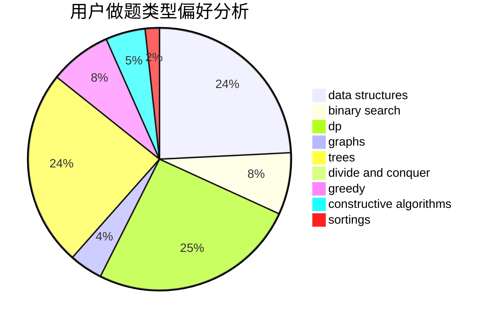
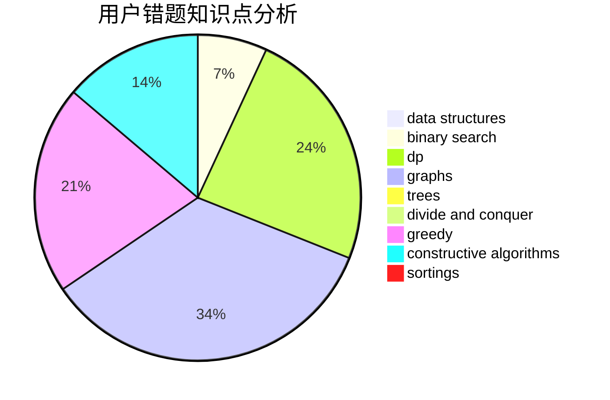

# DinoMax00
<!-- tabs:start -->
#### **用户提交结果分析**

#### **用户做题类型偏好分析**

#### **用户错题知识点分析**

<!-- tabs:end -->
# 推荐题目
[1336E1](http://codeforces.com/problemset/problem/1336/E1)		bitmasks,
                        brute force,
                        combinatorics,
                        math		  
[1415B](http://codeforces.com/problemset/problem/1415/B)		brute force,
                        brute force,
                        greedy		  
[782A](https://codeforces.com/contest/782/problem/A)		implementation		  
[1223F](http://codeforces.com/problemset/problem/1223/F)		data structures,
                        divide and conquer,
                        dp,
                        hashing		  
[598A](http://codeforces.com/problemset/problem/598/A)		math		  
[1249E](http://codeforces.com/problemset/problem/1249/E)		dp,
                        shortest paths		  
[662E](http://codeforces.com/problemset/problem/662/E)		brute force,
                        dp,
                        greedy		  
[493E](http://codeforces.com/problemset/problem/493/E)		math		  
[781F](https://codeforces.com/contest/781/problem/F)		binary search,
                        geometry,
                        implementation,
                        two pointers		  
[166E](http://codeforces.com/problemset/problem/166/E)		dp,
                        math,
                        matrices		  
<!-- tabs:start -->
#### **data structures**
[1223F](http://codeforces.com/problemset/problem/1223/F)		data structures,
                        divide and conquer,
                        dp,
                        hashing		  
[1136E](http://codeforces.com/problemset/problem/1136/E)		binary search,
                        data structures		  
[1286B](http://codeforces.com/problemset/problem/1286/B)		constructive algorithms,
                        data structures,
                        dfs and similar,
                        graphs,
                        greedy,
                        trees		  
[1292A](http://codeforces.com/problemset/problem/1292/A)		data structures,
                        dsu,
                        implementation		  
[1209G1](http://codeforces.com/problemset/problem/1209/G1)		data structures,
                        dsu,
                        greedy,
                        implementation,
                        two pointers		  
[1492C](http://codeforces.com/problemset/problem/1492/C)		binary search,
                        data structures,
                        dp,
                        greedy,
                        two pointers		  
[1490G](http://codeforces.com/problemset/problem/1490/G)		binary search,
                        data structures,
                        math		  
[1479D](http://codeforces.com/problemset/problem/1479/D)		binary search,
                        bitmasks,
                        brute force,
                        data structures,
                        probabilities,
                        trees		  
[1497A](http://codeforces.com/problemset/problem/1497/A)		brute force,
                        data structures,
                        greedy,
                        sortings		  
[1491C](http://codeforces.com/problemset/problem/1491/C)		brute force,
                        data structures,
                        dp,
                        greedy,
                        implementation		  
#### **binary search**
[781F](https://codeforces.com/contest/781/problem/F)		binary search,
                        geometry,
                        implementation,
                        two pointers		  
[1136E](http://codeforces.com/problemset/problem/1136/E)		binary search,
                        data structures		  
[702C](http://codeforces.com/problemset/problem/702/C)		binary search,
                        implementation,
                        two pointers		  
[727F](http://codeforces.com/problemset/problem/727/F)		binary search,
                        dp,
                        greedy		  
[1492C](http://codeforces.com/problemset/problem/1492/C)		binary search,
                        data structures,
                        dp,
                        greedy,
                        two pointers		  
[1463D](http://codeforces.com/problemset/problem/1463/D)		binary search,
                        constructive algorithms,
                        greedy,
                        two pointers		  
[1490G](http://codeforces.com/problemset/problem/1490/G)		binary search,
                        data structures,
                        math		  
[1479D](http://codeforces.com/problemset/problem/1479/D)		binary search,
                        bitmasks,
                        brute force,
                        data structures,
                        probabilities,
                        trees		  
[1436E](http://codeforces.com/problemset/problem/1436/E)		binary search,
                        data structures,
                        two pointers		  
[1461D](http://codeforces.com/problemset/problem/1461/D)		binary search,
                        brute force,
                        data structures,
                        divide and conquer,
                        implementation,
                        sortings		  
#### **dp**
[1223F](http://codeforces.com/problemset/problem/1223/F)		data structures,
                        divide and conquer,
                        dp,
                        hashing		  
[1249E](http://codeforces.com/problemset/problem/1249/E)		dp,
                        shortest paths		  
[662E](http://codeforces.com/problemset/problem/662/E)		brute force,
                        dp,
                        greedy		  
[166E](http://codeforces.com/problemset/problem/166/E)		dp,
                        math,
                        matrices		  
[219C](http://codeforces.com/problemset/problem/219/C)		brute force,
                        dp,
                        greedy		  
[225C](http://codeforces.com/problemset/problem/225/C)		dp,
                        matrices		  
[1040B](http://codeforces.com/problemset/problem/1040/B)		dp,
                        greedy,
                        math		  
[663E](https://codeforces.com/contest/663/problem/E)		bitmasks,
                        brute force,
                        divide and conquer,
                        dp,
                        fft,
                        math		  
[161D](http://codeforces.com/problemset/problem/161/D)		dfs and similar,
                        dp,
                        trees		  
[727F](http://codeforces.com/problemset/problem/727/F)		binary search,
                        dp,
                        greedy		  
#### **graph**
[782B](https://codeforces.com/contest/782/problem/B)		dfs and similar,
                        graphs		  
[1286B](http://codeforces.com/problemset/problem/1286/B)		constructive algorithms,
                        data structures,
                        dfs and similar,
                        graphs,
                        greedy,
                        trees		  
[1009G](http://codeforces.com/problemset/problem/1009/G)		bitmasks,
                        flows,
                        graph matchings,
                        graphs,
                        greedy		  
[1487C](http://codeforces.com/problemset/problem/1487/C)		brute force,
                        constructive algorithms,
                        dfs and similar,
                        graphs,
                        greedy,
                        implementation,
                        math		  
[1437C](http://codeforces.com/problemset/problem/1437/C)		dp,
                        flows,
                        graph matchings,
                        greedy,
                        math,
                        sortings		  
[1470D](http://codeforces.com/problemset/problem/1470/D)		constructive algorithms,
                        dfs and similar,
                        graph matchings,
                        graphs,
                        greedy		  
[1476C](http://codeforces.com/problemset/problem/1476/C)		dp,
                        graphs,
                        greedy		  
[1304D](http://codeforces.com/problemset/problem/1304/D)		constructive algorithms,
                        graphs,
                        greedy,
                        two pointers		  
[1475C](http://codeforces.com/problemset/problem/1475/C)		combinatorics,
                        graphs,
                        math		  
[553E](http://codeforces.com/problemset/problem/553/E)		dp,
                        fft,
                        graphs,
                        math,
                        probabilities		  
#### **trees**
[1286B](http://codeforces.com/problemset/problem/1286/B)		constructive algorithms,
                        data structures,
                        dfs and similar,
                        graphs,
                        greedy,
                        trees		  
[161D](http://codeforces.com/problemset/problem/161/D)		dfs and similar,
                        dp,
                        trees		  
[486D](http://codeforces.com/problemset/problem/486/D)		dfs and similar,
                        dp,
                        math,
                        trees		  
[1338B](http://codeforces.com/problemset/problem/1338/B)		bitmasks,
                        constructive algorithms,
                        dfs and similar,
                        greedy,
                        math,
                        trees		  
[1479D](http://codeforces.com/problemset/problem/1479/D)		binary search,
                        bitmasks,
                        brute force,
                        data structures,
                        probabilities,
                        trees		  
[1511C](http://codeforces.com/problemset/problem/1511/C)		brute force,
                        data structures,
                        implementation,
                        trees		  
[1499F](http://codeforces.com/problemset/problem/1499/F)		combinatorics,
                        dfs and similar,
                        dp,
                        trees		  
[1491E](http://codeforces.com/problemset/problem/1491/E)		brute force,
                        dfs and similar,
                        divide and conquer,
                        number theory,
                        trees		  
[1466D](http://codeforces.com/problemset/problem/1466/D)		data structures,
                        greedy,
                        sortings,
                        trees		  
[1495D](http://codeforces.com/problemset/problem/1495/D)		combinatorics,
                        dfs and similar,
                        graphs,
                        math,
                        shortest paths,
                        trees		  
#### **divide and conquer**
[1223F](http://codeforces.com/problemset/problem/1223/F)		data structures,
                        divide and conquer,
                        dp,
                        hashing		  
[663E](https://codeforces.com/contest/663/problem/E)		bitmasks,
                        brute force,
                        divide and conquer,
                        dp,
                        fft,
                        math		  
[1461D](http://codeforces.com/problemset/problem/1461/D)		binary search,
                        brute force,
                        data structures,
                        divide and conquer,
                        implementation,
                        sortings		  
[1466G](http://codeforces.com/problemset/problem/1466/G)		combinatorics,
                        divide and conquer,
                        hashing,
                        math,
                        string suffix structures,
                        strings		  
[1490D](http://codeforces.com/problemset/problem/1490/D)		dfs and similar,
                        divide and conquer,
                        implementation		  
[1483C](https://codeforces.com/contest/1483/problem/C)		data structures,
                        divide and conquer,
                        dp		  
[1491E](http://codeforces.com/problemset/problem/1491/E)		brute force,
                        dfs and similar,
                        divide and conquer,
                        number theory,
                        trees		  
[1303G](http://codeforces.com/problemset/problem/1303/G)		data structures,
                        divide and conquer,
                        geometry,
                        trees		  
[1494D](http://codeforces.com/problemset/problem/1494/D)		constructive algorithms,
                        data structures,
                        dfs and similar,
                        divide and conquer,
                        dsu,
                        greedy,
                        sortings,
                        trees		  
[1482E](http://codeforces.com/problemset/problem/1482/E)		data structures,
                        divide and conquer,
                        dp		  
#### **greedy**
[1415B](http://codeforces.com/problemset/problem/1415/B)		brute force,
                        brute force,
                        greedy		  
[662E](http://codeforces.com/problemset/problem/662/E)		brute force,
                        dp,
                        greedy		  
[219C](http://codeforces.com/problemset/problem/219/C)		brute force,
                        dp,
                        greedy		  
[1040B](http://codeforces.com/problemset/problem/1040/B)		dp,
                        greedy,
                        math		  
[1286B](http://codeforces.com/problemset/problem/1286/B)		constructive algorithms,
                        data structures,
                        dfs and similar,
                        graphs,
                        greedy,
                        trees		  
[727F](http://codeforces.com/problemset/problem/727/F)		binary search,
                        dp,
                        greedy		  
[1009G](http://codeforces.com/problemset/problem/1009/G)		bitmasks,
                        flows,
                        graph matchings,
                        graphs,
                        greedy		  
[1209G1](http://codeforces.com/problemset/problem/1209/G1)		data structures,
                        dsu,
                        greedy,
                        implementation,
                        two pointers		  
[1338B](http://codeforces.com/problemset/problem/1338/B)		bitmasks,
                        constructive algorithms,
                        dfs and similar,
                        greedy,
                        math,
                        trees		  
[1492C](http://codeforces.com/problemset/problem/1492/C)		binary search,
                        data structures,
                        dp,
                        greedy,
                        two pointers		  
#### **constructive algorithms**
[277B](http://codeforces.com/problemset/problem/277/B)		constructive algorithms,
                        geometry		  
[1286B](http://codeforces.com/problemset/problem/1286/B)		constructive algorithms,
                        data structures,
                        dfs and similar,
                        graphs,
                        greedy,
                        trees		  
[1392E](http://codeforces.com/problemset/problem/1392/E)		bitmasks,
                        constructive algorithms,
                        interactive,
                        math		  
[1338B](http://codeforces.com/problemset/problem/1338/B)		bitmasks,
                        constructive algorithms,
                        dfs and similar,
                        greedy,
                        math,
                        trees		  
[1510J](http://codeforces.com/problemset/problem/1510/J)		constructive algorithms,
                        math		  
[1493A](http://codeforces.com/problemset/problem/1493/A)		constructive algorithms,
                        greedy		  
[1463D](http://codeforces.com/problemset/problem/1463/D)		binary search,
                        constructive algorithms,
                        greedy,
                        two pointers		  
[1456B](https://codeforces.com/contest/1456/problem/B)		bitmasks,
                        brute force,
                        constructive algorithms		  
[1492D](http://codeforces.com/problemset/problem/1492/D)		bitmasks,
                        constructive algorithms,
                        greedy,
                        math		  
[1504D](https://codeforces.com/contest/1504/problem/D)		constructive algorithms,
                        games,
                        interactive		  
#### **sortings**
[1496C](https://codeforces.com/contest/1496/problem/C)		geometry,
                        greedy,
                        math,
                        sortings		  
[1495A](http://codeforces.com/problemset/problem/1495/A)		geometry,
                        greedy,
                        math,
                        sortings		  
[1497A](http://codeforces.com/problemset/problem/1497/A)		brute force,
                        data structures,
                        greedy,
                        sortings		  
[1427A](http://codeforces.com/problemset/problem/1427/A)		math,
                        sortings		  
[1461D](http://codeforces.com/problemset/problem/1461/D)		binary search,
                        brute force,
                        data structures,
                        divide and conquer,
                        implementation,
                        sortings		  
[1437C](http://codeforces.com/problemset/problem/1437/C)		dp,
                        flows,
                        graph matchings,
                        greedy,
                        math,
                        sortings		  
[1473A](http://codeforces.com/problemset/problem/1473/A)		greedy,
                        implementation,
                        math,
                        sortings		  
[1486B](http://codeforces.com/problemset/problem/1486/B)		binary search,
                        geometry,
                        shortest paths,
                        sortings		  
[1480B](http://codeforces.com/problemset/problem/1480/B)		greedy,
                        implementation,
                        sortings		  
[1420D](http://codeforces.com/problemset/problem/1420/D)		combinatorics,
                        data structures,
                        sortings		  
<!-- tabs:end -->
