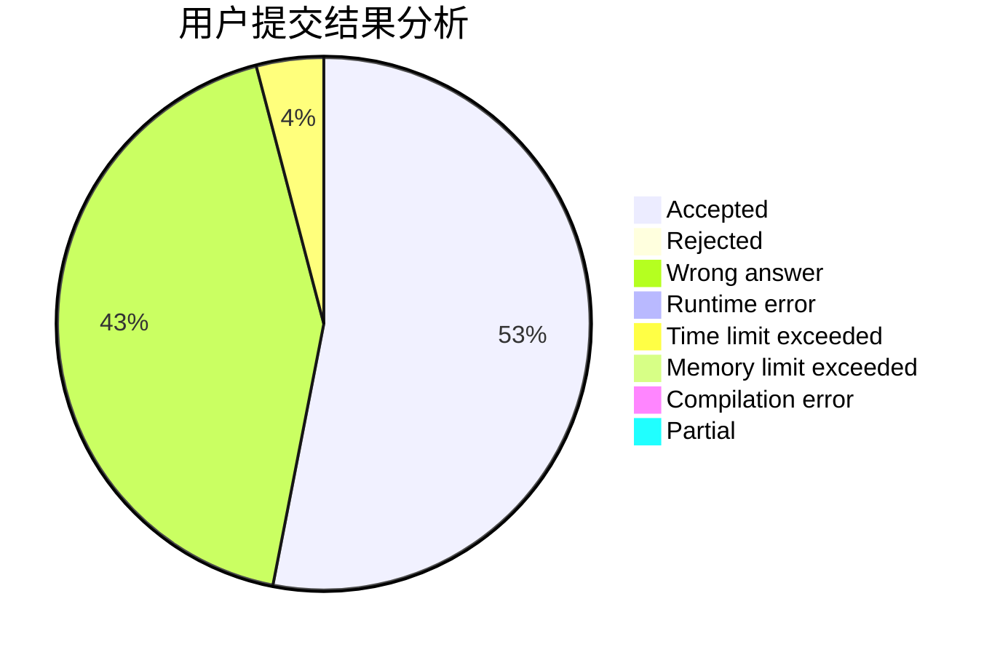
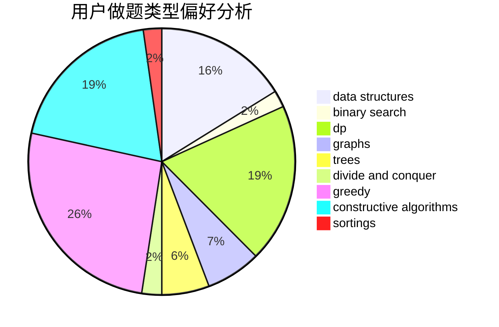
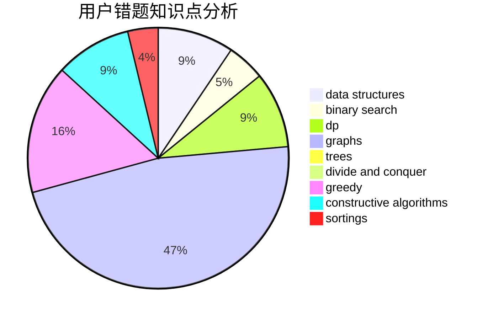

# DirectCurrent
<!-- tabs:start -->
#### **用户提交结果分析**

#### **用户做题类型偏好分析**

#### **用户错题知识点分析**

<!-- tabs:end -->
# 推荐题目
[1264D1](http://codeforces.com/problemset/problem/1264/D1)		combinatorics,
                        dp,
                        probabilities		  
[27D](http://codeforces.com/problemset/problem/27/D)		2-sat,
                        dfs and similar,
                        dsu,
                        graphs		  
[782D](https://codeforces.com/contest/782/problem/D)		2-sat,
                        graphs,
                        greedy,
                        implementation,
                        shortest paths,
                        strings		  
[1034D](http://codeforces.com/problemset/problem/1034/D)		binary search,
                        data structures,
                        two pointers		  
[1196F](http://codeforces.com/problemset/problem/1196/F)		brute force,
                        constructive algorithms,
                        shortest paths,
                        sortings		  
[269B](http://codeforces.com/problemset/problem/269/B)		dp		  
[1183E](http://codeforces.com/problemset/problem/1183/E)		dp,
                        graphs,
                        implementation,
                        shortest paths		  
[26D](http://codeforces.com/problemset/problem/26/D)		combinatorics,
                        math,
                        probabilities		  
[515C](http://codeforces.com/problemset/problem/515/C)		greedy,
                        math,
                        sortings		  
[1220E](http://codeforces.com/problemset/problem/1220/E)		dfs and similar,
                        dp,
                        dsu,
                        graphs,
                        greedy,
                        trees		  
<!-- tabs:start -->
#### **data structures**
[1034D](http://codeforces.com/problemset/problem/1034/D)		binary search,
                        data structures,
                        two pointers		  
[1373F](http://codeforces.com/problemset/problem/1373/F)		binary search,
                        constructive algorithms,
                        data structures,
                        greedy		  
[339D](http://codeforces.com/problemset/problem/339/D)		data structures,
                        trees		  
[1447E](https://codeforces.com/contest/1447/problem/E)		binary search,
                        bitmasks,
                        data structures,
                        divide and conquer,
                        dp,
                        trees		  
[1492C](http://codeforces.com/problemset/problem/1492/C)		binary search,
                        data structures,
                        dp,
                        greedy,
                        two pointers		  
[1490G](http://codeforces.com/problemset/problem/1490/G)		binary search,
                        data structures,
                        math		  
[1479D](http://codeforces.com/problemset/problem/1479/D)		binary search,
                        bitmasks,
                        brute force,
                        data structures,
                        probabilities,
                        trees		  
[1497A](http://codeforces.com/problemset/problem/1497/A)		brute force,
                        data structures,
                        greedy,
                        sortings		  
[1491C](http://codeforces.com/problemset/problem/1491/C)		brute force,
                        data structures,
                        dp,
                        greedy,
                        implementation		  
[1492B](http://codeforces.com/problemset/problem/1492/B)		data structures,
                        greedy,
                        math		  
#### **binary search**
[1034D](http://codeforces.com/problemset/problem/1034/D)		binary search,
                        data structures,
                        two pointers		  
[1373F](http://codeforces.com/problemset/problem/1373/F)		binary search,
                        constructive algorithms,
                        data structures,
                        greedy		  
[1447E](https://codeforces.com/contest/1447/problem/E)		binary search,
                        bitmasks,
                        data structures,
                        divide and conquer,
                        dp,
                        trees		  
[1492C](http://codeforces.com/problemset/problem/1492/C)		binary search,
                        data structures,
                        dp,
                        greedy,
                        two pointers		  
[1463D](http://codeforces.com/problemset/problem/1463/D)		binary search,
                        constructive algorithms,
                        greedy,
                        two pointers		  
[1490G](http://codeforces.com/problemset/problem/1490/G)		binary search,
                        data structures,
                        math		  
[1479D](http://codeforces.com/problemset/problem/1479/D)		binary search,
                        bitmasks,
                        brute force,
                        data structures,
                        probabilities,
                        trees		  
[1436E](http://codeforces.com/problemset/problem/1436/E)		binary search,
                        data structures,
                        two pointers		  
[1461D](http://codeforces.com/problemset/problem/1461/D)		binary search,
                        brute force,
                        data structures,
                        divide and conquer,
                        implementation,
                        sortings		  
[1493C](http://codeforces.com/problemset/problem/1493/C)		binary search,
                        brute force,
                        constructive algorithms,
                        greedy,
                        strings		  
#### **dp**
[1264D1](http://codeforces.com/problemset/problem/1264/D1)		combinatorics,
                        dp,
                        probabilities		  
[269B](http://codeforces.com/problemset/problem/269/B)		dp		  
[1183E](http://codeforces.com/problemset/problem/1183/E)		dp,
                        graphs,
                        implementation,
                        shortest paths		  
[1220E](http://codeforces.com/problemset/problem/1220/E)		dfs and similar,
                        dp,
                        dsu,
                        graphs,
                        greedy,
                        trees		  
[593E](http://codeforces.com/problemset/problem/593/E)		dp,
                        matrices		  
[1282B2](http://codeforces.com/problemset/problem/1282/B2)		dp,
                        greedy,
                        sortings		  
[1383B](http://codeforces.com/problemset/problem/1383/B)		bitmasks,
                        constructive algorithms,
                        dp,
                        games,
                        greedy,
                        math		  
[145C](http://codeforces.com/problemset/problem/145/C)		combinatorics,
                        dp,
                        math		  
[337D](http://codeforces.com/problemset/problem/337/D)		dfs and similar,
                        divide and conquer,
                        dp,
                        trees		  
[115D](http://codeforces.com/problemset/problem/115/D)		dp,
                        expression parsing		  
#### **graph**
[27D](http://codeforces.com/problemset/problem/27/D)		2-sat,
                        dfs and similar,
                        dsu,
                        graphs		  
[782D](https://codeforces.com/contest/782/problem/D)		2-sat,
                        graphs,
                        greedy,
                        implementation,
                        shortest paths,
                        strings		  
[1183E](http://codeforces.com/problemset/problem/1183/E)		dp,
                        graphs,
                        implementation,
                        shortest paths		  
[1220E](http://codeforces.com/problemset/problem/1220/E)		dfs and similar,
                        dp,
                        dsu,
                        graphs,
                        greedy,
                        trees		  
[1340E](http://codeforces.com/problemset/problem/1340/E)		graphs,
                        interactive,
                        probabilities		  
[782C](https://codeforces.com/contest/782/problem/C)		dfs and similar,
                        graphs,
                        greedy,
                        trees		  
[782E](https://codeforces.com/contest/782/problem/E)		constructive algorithms,
                        dfs and similar,
                        graphs		  
[1487C](http://codeforces.com/problemset/problem/1487/C)		brute force,
                        constructive algorithms,
                        dfs and similar,
                        graphs,
                        greedy,
                        implementation,
                        math		  
[1437C](http://codeforces.com/problemset/problem/1437/C)		dp,
                        flows,
                        graph matchings,
                        greedy,
                        math,
                        sortings		  
[1470D](http://codeforces.com/problemset/problem/1470/D)		constructive algorithms,
                        dfs and similar,
                        graph matchings,
                        graphs,
                        greedy		  
#### **trees**
[1220E](http://codeforces.com/problemset/problem/1220/E)		dfs and similar,
                        dp,
                        dsu,
                        graphs,
                        greedy,
                        trees		  
[782C](https://codeforces.com/contest/782/problem/C)		dfs and similar,
                        graphs,
                        greedy,
                        trees		  
[337D](http://codeforces.com/problemset/problem/337/D)		dfs and similar,
                        divide and conquer,
                        dp,
                        trees		  
[339D](http://codeforces.com/problemset/problem/339/D)		data structures,
                        trees		  
[486D](http://codeforces.com/problemset/problem/486/D)		dfs and similar,
                        dp,
                        math,
                        trees		  
[1173D](https://codeforces.com/contest/1173/problem/D)		combinatorics,
                        dfs and similar,
                        dp,
                        trees		  
[1447E](https://codeforces.com/contest/1447/problem/E)		binary search,
                        bitmasks,
                        data structures,
                        divide and conquer,
                        dp,
                        trees		  
[1479D](http://codeforces.com/problemset/problem/1479/D)		binary search,
                        bitmasks,
                        brute force,
                        data structures,
                        probabilities,
                        trees		  
[1511C](http://codeforces.com/problemset/problem/1511/C)		brute force,
                        data structures,
                        implementation,
                        trees		  
[1499F](http://codeforces.com/problemset/problem/1499/F)		combinatorics,
                        dfs and similar,
                        dp,
                        trees		  
#### **divide and conquer**
[337D](http://codeforces.com/problemset/problem/337/D)		dfs and similar,
                        divide and conquer,
                        dp,
                        trees		  
[1447E](https://codeforces.com/contest/1447/problem/E)		binary search,
                        bitmasks,
                        data structures,
                        divide and conquer,
                        dp,
                        trees		  
[1461D](http://codeforces.com/problemset/problem/1461/D)		binary search,
                        brute force,
                        data structures,
                        divide and conquer,
                        implementation,
                        sortings		  
[1466G](http://codeforces.com/problemset/problem/1466/G)		combinatorics,
                        divide and conquer,
                        hashing,
                        math,
                        string suffix structures,
                        strings		  
[1490D](http://codeforces.com/problemset/problem/1490/D)		dfs and similar,
                        divide and conquer,
                        implementation		  
[1483C](https://codeforces.com/contest/1483/problem/C)		data structures,
                        divide and conquer,
                        dp		  
[1491E](http://codeforces.com/problemset/problem/1491/E)		brute force,
                        dfs and similar,
                        divide and conquer,
                        number theory,
                        trees		  
[1303G](http://codeforces.com/problemset/problem/1303/G)		data structures,
                        divide and conquer,
                        geometry,
                        trees		  
[1494D](http://codeforces.com/problemset/problem/1494/D)		constructive algorithms,
                        data structures,
                        dfs and similar,
                        divide and conquer,
                        dsu,
                        greedy,
                        sortings,
                        trees		  
[1482E](http://codeforces.com/problemset/problem/1482/E)		data structures,
                        divide and conquer,
                        dp		  
#### **greedy**
[782D](https://codeforces.com/contest/782/problem/D)		2-sat,
                        graphs,
                        greedy,
                        implementation,
                        shortest paths,
                        strings		  
[515C](http://codeforces.com/problemset/problem/515/C)		greedy,
                        math,
                        sortings		  
[1220E](http://codeforces.com/problemset/problem/1220/E)		dfs and similar,
                        dp,
                        dsu,
                        graphs,
                        greedy,
                        trees		  
[1373F](http://codeforces.com/problemset/problem/1373/F)		binary search,
                        constructive algorithms,
                        data structures,
                        greedy		  
[782C](https://codeforces.com/contest/782/problem/C)		dfs and similar,
                        graphs,
                        greedy,
                        trees		  
[1282B2](http://codeforces.com/problemset/problem/1282/B2)		dp,
                        greedy,
                        sortings		  
[1383B](http://codeforces.com/problemset/problem/1383/B)		bitmasks,
                        constructive algorithms,
                        dp,
                        games,
                        greedy,
                        math		  
[1466C](http://codeforces.com/problemset/problem/1466/C)		dp,
                        greedy,
                        strings		  
[1469C](http://codeforces.com/problemset/problem/1469/C)		dp,
                        greedy,
                        implementation,
                        two pointers		  
[1492C](http://codeforces.com/problemset/problem/1492/C)		binary search,
                        data structures,
                        dp,
                        greedy,
                        two pointers		  
#### **constructive algorithms**
[1196F](http://codeforces.com/problemset/problem/1196/F)		brute force,
                        constructive algorithms,
                        shortest paths,
                        sortings		  
[1373F](http://codeforces.com/problemset/problem/1373/F)		binary search,
                        constructive algorithms,
                        data structures,
                        greedy		  
[1383B](http://codeforces.com/problemset/problem/1383/B)		bitmasks,
                        constructive algorithms,
                        dp,
                        games,
                        greedy,
                        math		  
[782E](https://codeforces.com/contest/782/problem/E)		constructive algorithms,
                        dfs and similar,
                        graphs		  
[1023E](http://codeforces.com/problemset/problem/1023/E)		constructive algorithms,
                        interactive,
                        matrices		  
[538G](http://codeforces.com/problemset/problem/538/G)		constructive algorithms,
                        math,
                        sortings		  
[1493A](http://codeforces.com/problemset/problem/1493/A)		constructive algorithms,
                        greedy		  
[1463D](http://codeforces.com/problemset/problem/1463/D)		binary search,
                        constructive algorithms,
                        greedy,
                        two pointers		  
[1456B](https://codeforces.com/contest/1456/problem/B)		bitmasks,
                        brute force,
                        constructive algorithms		  
[1492D](http://codeforces.com/problemset/problem/1492/D)		bitmasks,
                        constructive algorithms,
                        greedy,
                        math		  
#### **sortings**
[1196F](http://codeforces.com/problemset/problem/1196/F)		brute force,
                        constructive algorithms,
                        shortest paths,
                        sortings		  
[515C](http://codeforces.com/problemset/problem/515/C)		greedy,
                        math,
                        sortings		  
[1282B2](http://codeforces.com/problemset/problem/1282/B2)		dp,
                        greedy,
                        sortings		  
[538G](http://codeforces.com/problemset/problem/538/G)		constructive algorithms,
                        math,
                        sortings		  
[1496C](https://codeforces.com/contest/1496/problem/C)		geometry,
                        greedy,
                        math,
                        sortings		  
[1495A](http://codeforces.com/problemset/problem/1495/A)		geometry,
                        greedy,
                        math,
                        sortings		  
[1497A](http://codeforces.com/problemset/problem/1497/A)		brute force,
                        data structures,
                        greedy,
                        sortings		  
[1427A](http://codeforces.com/problemset/problem/1427/A)		math,
                        sortings		  
[1461D](http://codeforces.com/problemset/problem/1461/D)		binary search,
                        brute force,
                        data structures,
                        divide and conquer,
                        implementation,
                        sortings		  
[1437C](http://codeforces.com/problemset/problem/1437/C)		dp,
                        flows,
                        graph matchings,
                        greedy,
                        math,
                        sortings		  
<!-- tabs:end -->
