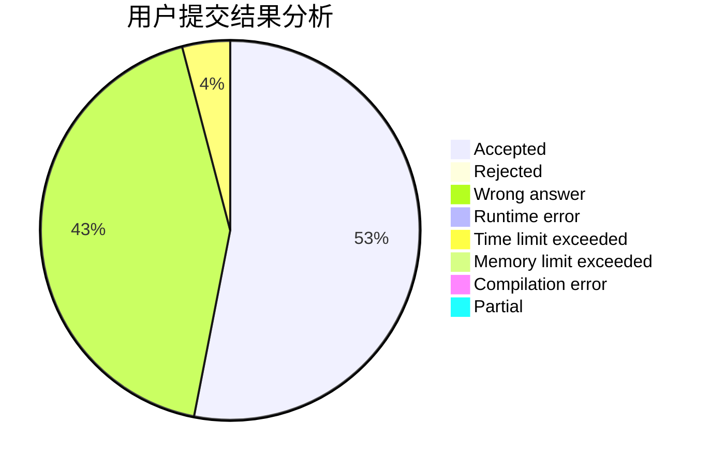
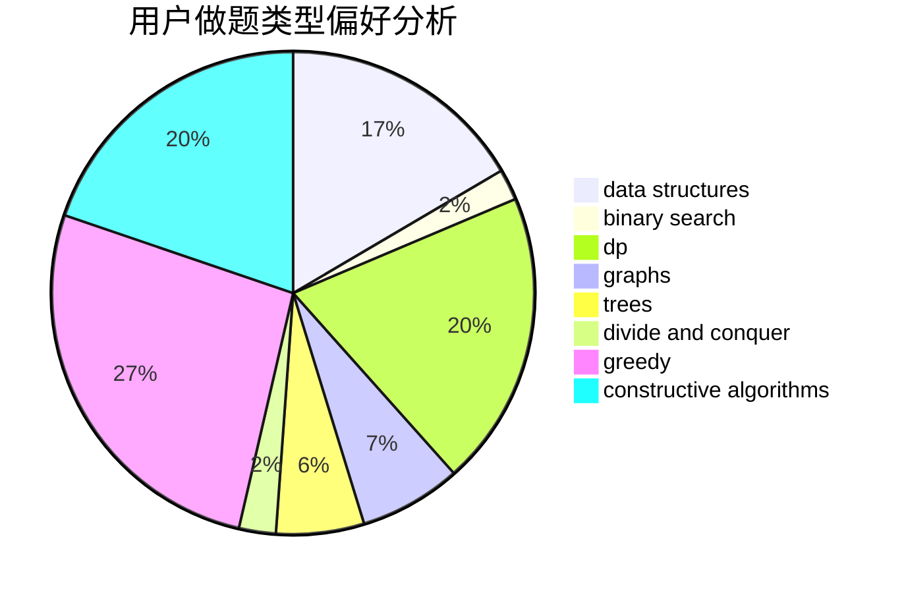
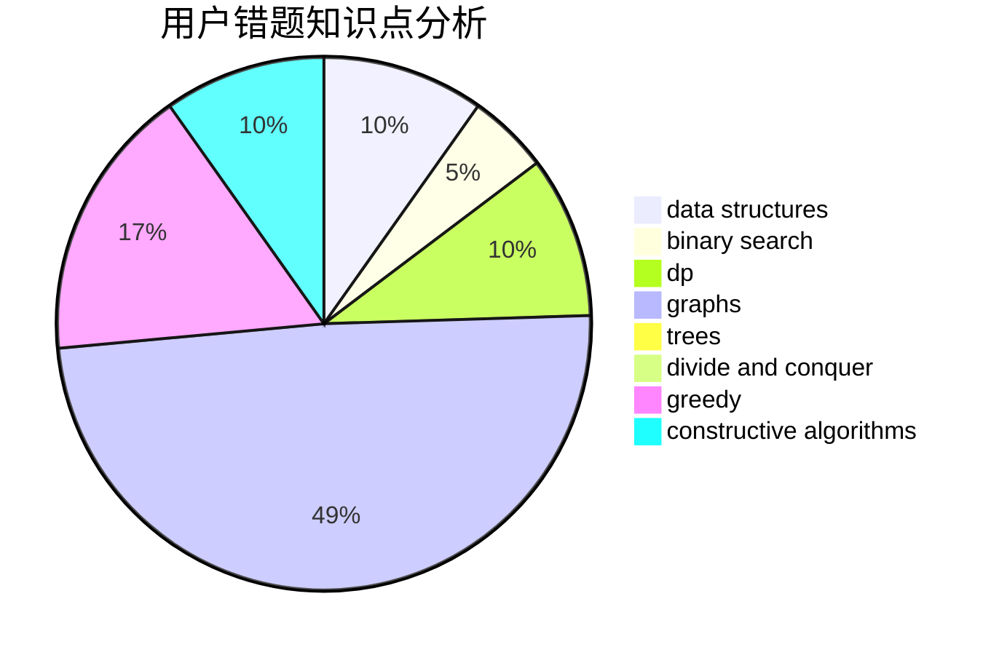

# DirectCurrent

<!-- tabs:start -->

#### **用户提交结果分析**

#### **用户做题类型偏好分析**

#### **用户错题知识点分析**

<!-- tabs:end -->
# 推荐题目
[1447E](https://codeforces.com/contest/1447/problem/E)		dsu,graphs,sortings,trees		  
[1034D](https://codeforces.com/contest/1034/problem/D)		binary search,
                        data structures,
                        two pointers		  
[26D](https://codeforces.com/contest/26/problem/D)		combinatorics,
                        math,
                        probabilities		  
[27D](https://codeforces.com/contest/27/problem/D)		2-sat,
                        dfs and similar,
                        dsu,
                        graphs		  
[269B](https://codeforces.com/contest/269/problem/B)		dp		  
[1282B2](https://codeforces.com/contest/1282B/problem/2)		dp,
                        greedy,
                        sortings		  
[515C](https://codeforces.com/contest/515/problem/C)		greedy,
                        math,
                        sortings		  
[1383B](https://codeforces.com/contest/1383/problem/B)		bitmasks,
                        constructive algorithms,
                        dp,
                        games,
                        greedy,
                        math		  
[1183E](https://codeforces.com/contest/1183/problem/E)		dp,
                        graphs,
                        implementation,
                        shortest paths		  
[486D](https://codeforces.com/contest/486/problem/D)		dfs and similar,
                        dp,
                        math,
                        trees		  
