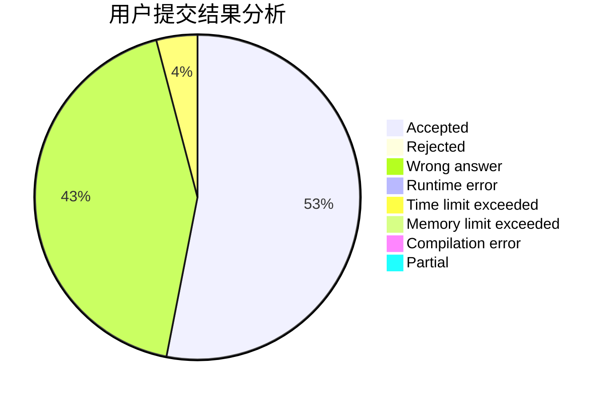
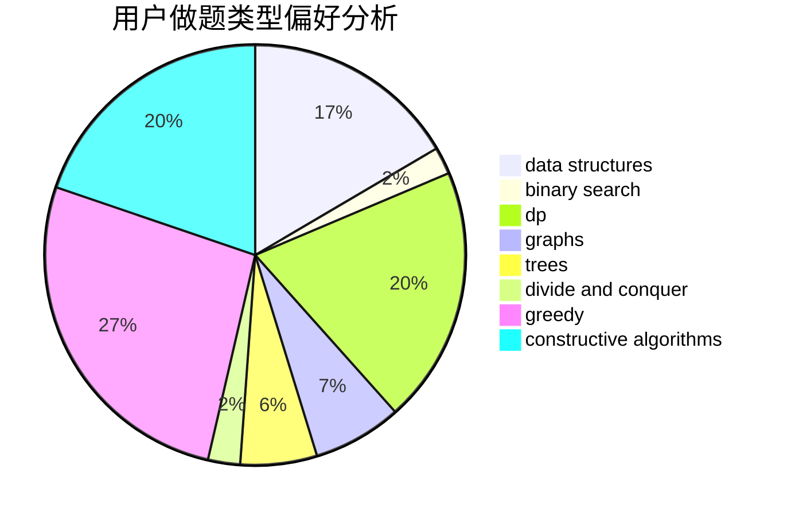
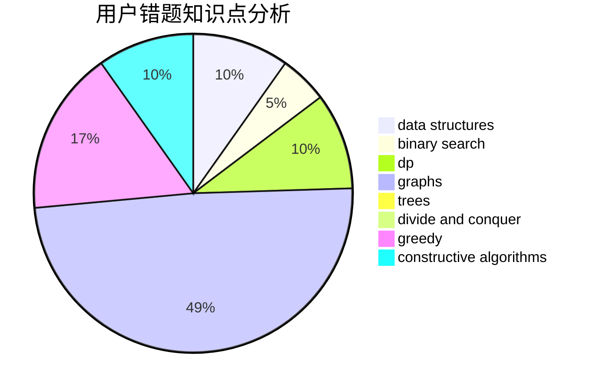

# DirectCurrent
<!-- tabs:start -->
#### **用户提交结果分析**

#### **用户做题类型偏好分析**

#### **用户错题知识点分析**

<!-- tabs:end -->
# 推荐题目
[Beautiful Bracket Sequence (easy version)](http://codeforces.com/problemset/problem/1264/D1)		combinatorics,
                        dp,
                        probabilities		  
[Ring Road 2](http://codeforces.com/problemset/problem/27/D)		2-sat,
                        dfs and similar,
                        dsu,
                        graphs		  
[Innokenty and a Football League](https://codeforces.com/contest/782/problem/D)		2-sat,
                        graphs,
                        greedy,
                        implementation,
                        shortest paths,
                        strings		  
[Intervals of Intervals](http://codeforces.com/problemset/problem/1034/D)		binary search,
                        data structures,
                        two pointers		  
[K-th Path](http://codeforces.com/problemset/problem/1196/F)		brute force,
                        constructive algorithms,
                        shortest paths,
                        sortings		  
[Greenhouse Effect](http://codeforces.com/problemset/problem/269/B)		dp		  
[Subsequences (easy version)](http://codeforces.com/problemset/problem/1183/E)		dp,
                        graphs,
                        implementation,
                        shortest paths		  
[Tickets](http://codeforces.com/problemset/problem/26/D)		combinatorics,
                        math,
                        probabilities		  
[Drazil and Factorial](http://codeforces.com/problemset/problem/515/C)		greedy,
                        math,
                        sortings		  
[Tourism](http://codeforces.com/problemset/problem/1220/E)		dfs and similar,
                        dp,
                        dsu,
                        graphs,
                        greedy,
                        trees		  
<!-- tabs:start -->
#### **data structures**
[Intervals of Intervals](http://codeforces.com/problemset/problem/1034/D)		binary search,
                        data structures,
                        two pointers		  
[Network Coverage](http://codeforces.com/problemset/problem/1373/F)		binary search,
                        constructive algorithms,
                        data structures,
                        greedy		  
[Xenia and Bit Operations](http://codeforces.com/problemset/problem/339/D)		data structures,
                        trees		  
[Xor Tree](https://codeforces.com/contest/1447/problem/E)		binary search,
                        bitmasks,
                        data structures,
                        divide and conquer,
                        dp,
                        trees		  
[Maximum width](http://codeforces.com/problemset/problem/1492/C)		binary search,
                        data structures,
                        dp,
                        greedy,
                        two pointers		  
[Old Floppy Drive](http://codeforces.com/problemset/problem/1490/G)		binary search,
                        data structures,
                        math		  
[Odd Mineral Resource](http://codeforces.com/problemset/problem/1479/D)		binary search,
                        bitmasks,
                        brute force,
                        data structures,
                        probabilities,
                        trees		  
[Meximization](http://codeforces.com/problemset/problem/1497/A)		brute force,
                        data structures,
                        greedy,
                        sortings		  
[Pekora and Trampoline](http://codeforces.com/problemset/problem/1491/C)		brute force,
                        data structures,
                        dp,
                        greedy,
                        implementation		  
[Card Deck](http://codeforces.com/problemset/problem/1492/B)		data structures,
                        greedy,
                        math		  
#### **binary search**
[Intervals of Intervals](http://codeforces.com/problemset/problem/1034/D)		binary search,
                        data structures,
                        two pointers		  
[Network Coverage](http://codeforces.com/problemset/problem/1373/F)		binary search,
                        constructive algorithms,
                        data structures,
                        greedy		  
[Xor Tree](https://codeforces.com/contest/1447/problem/E)		binary search,
                        bitmasks,
                        data structures,
                        divide and conquer,
                        dp,
                        trees		  
[Maximum width](http://codeforces.com/problemset/problem/1492/C)		binary search,
                        data structures,
                        dp,
                        greedy,
                        two pointers		  
[Pairs](http://codeforces.com/problemset/problem/1463/D)		binary search,
                        constructive algorithms,
                        greedy,
                        two pointers		  
[Old Floppy Drive](http://codeforces.com/problemset/problem/1490/G)		binary search,
                        data structures,
                        math		  
[Odd Mineral Resource](http://codeforces.com/problemset/problem/1479/D)		binary search,
                        bitmasks,
                        brute force,
                        data structures,
                        probabilities,
                        trees		  
[Complicated Computations](http://codeforces.com/problemset/problem/1436/E)		binary search,
                        data structures,
                        two pointers		  
[Divide and Summarize](http://codeforces.com/problemset/problem/1461/D)		binary search,
                        brute force,
                        data structures,
                        divide and conquer,
                        implementation,
                        sortings		  
[K-beautiful Strings](http://codeforces.com/problemset/problem/1493/C)		binary search,
                        brute force,
                        constructive algorithms,
                        greedy,
                        strings		  
#### **dp**
[Beautiful Bracket Sequence (easy version)](http://codeforces.com/problemset/problem/1264/D1)		combinatorics,
                        dp,
                        probabilities		  
[Greenhouse Effect](http://codeforces.com/problemset/problem/269/B)		dp		  
[Subsequences (easy version)](http://codeforces.com/problemset/problem/1183/E)		dp,
                        graphs,
                        implementation,
                        shortest paths		  
[Tourism](http://codeforces.com/problemset/problem/1220/E)		dfs and similar,
                        dp,
                        dsu,
                        graphs,
                        greedy,
                        trees		  
[Strange Calculation and Cats](http://codeforces.com/problemset/problem/593/E)		dp,
                        matrices		  
[K for the Price of One (Hard Version)](http://codeforces.com/problemset/problem/1282/B2)		dp,
                        greedy,
                        sortings		  
[GameGame](http://codeforces.com/problemset/problem/1383/B)		bitmasks,
                        constructive algorithms,
                        dp,
                        games,
                        greedy,
                        math		  
[Lucky Subsequence](http://codeforces.com/problemset/problem/145/C)		combinatorics,
                        dp,
                        math		  
[Book of Evil](http://codeforces.com/problemset/problem/337/D)		dfs and similar,
                        divide and conquer,
                        dp,
                        trees		  
[Unambiguous Arithmetic Expression](http://codeforces.com/problemset/problem/115/D)		dp,
                        expression parsing		  
#### **graph**
[Ring Road 2](http://codeforces.com/problemset/problem/27/D)		2-sat,
                        dfs and similar,
                        dsu,
                        graphs		  
[Innokenty and a Football League](https://codeforces.com/contest/782/problem/D)		2-sat,
                        graphs,
                        greedy,
                        implementation,
                        shortest paths,
                        strings		  
[Subsequences (easy version)](http://codeforces.com/problemset/problem/1183/E)		dp,
                        graphs,
                        implementation,
                        shortest paths		  
[Tourism](http://codeforces.com/problemset/problem/1220/E)		dfs and similar,
                        dp,
                        dsu,
                        graphs,
                        greedy,
                        trees		  
[Nastya and Bees](http://codeforces.com/problemset/problem/1340/E)		graphs,
                        interactive,
                        probabilities		  
[Andryusha and Colored Balloons](https://codeforces.com/contest/782/problem/C)		dfs and similar,
                        graphs,
                        greedy,
                        trees		  
[Underground Lab](https://codeforces.com/contest/782/problem/E)		constructive algorithms,
                        dfs and similar,
                        graphs		  
[Minimum Ties](http://codeforces.com/problemset/problem/1487/C)		brute force,
                        constructive algorithms,
                        dfs and similar,
                        graphs,
                        greedy,
                        implementation,
                        math		  
[Chef Monocarp](http://codeforces.com/problemset/problem/1437/C)		dp,
                        flows,
                        graph matchings,
                        greedy,
                        math,
                        sortings		  
[Strange Housing](http://codeforces.com/problemset/problem/1470/D)		constructive algorithms,
                        dfs and similar,
                        graph matchings,
                        graphs,
                        greedy		  
#### **trees**
[Tourism](http://codeforces.com/problemset/problem/1220/E)		dfs and similar,
                        dp,
                        dsu,
                        graphs,
                        greedy,
                        trees		  
[Andryusha and Colored Balloons](https://codeforces.com/contest/782/problem/C)		dfs and similar,
                        graphs,
                        greedy,
                        trees		  
[Book of Evil](http://codeforces.com/problemset/problem/337/D)		dfs and similar,
                        divide and conquer,
                        dp,
                        trees		  
[Xenia and Bit Operations](http://codeforces.com/problemset/problem/339/D)		data structures,
                        trees		  
[Valid Sets](http://codeforces.com/problemset/problem/486/D)		dfs and similar,
                        dp,
                        math,
                        trees		  
[Nauuo and Circle](https://codeforces.com/contest/1173/problem/D)		combinatorics,
                        dfs and similar,
                        dp,
                        trees		  
[Xor Tree](https://codeforces.com/contest/1447/problem/E)		binary search,
                        bitmasks,
                        data structures,
                        divide and conquer,
                        dp,
                        trees		  
[Odd Mineral Resource](http://codeforces.com/problemset/problem/1479/D)		binary search,
                        bitmasks,
                        brute force,
                        data structures,
                        probabilities,
                        trees		  
[Yet Another Card Deck](http://codeforces.com/problemset/problem/1511/C)		brute force,
                        data structures,
                        implementation,
                        trees		  
[Diameter Cuts](http://codeforces.com/problemset/problem/1499/F)		combinatorics,
                        dfs and similar,
                        dp,
                        trees		  
#### **divide and conquer**
[Book of Evil](http://codeforces.com/problemset/problem/337/D)		dfs and similar,
                        divide and conquer,
                        dp,
                        trees		  
[Xor Tree](https://codeforces.com/contest/1447/problem/E)		binary search,
                        bitmasks,
                        data structures,
                        divide and conquer,
                        dp,
                        trees		  
[Divide and Summarize](http://codeforces.com/problemset/problem/1461/D)		binary search,
                        brute force,
                        data structures,
                        divide and conquer,
                        implementation,
                        sortings		  
[Song of the Sirens](http://codeforces.com/problemset/problem/1466/G)		combinatorics,
                        divide and conquer,
                        hashing,
                        math,
                        string suffix structures,
                        strings		  
[Permutation Transformation](http://codeforces.com/problemset/problem/1490/D)		dfs and similar,
                        divide and conquer,
                        implementation		  
[Skyline Photo](https://codeforces.com/contest/1483/problem/C)		data structures,
                        divide and conquer,
                        dp		  
[Fib-tree](http://codeforces.com/problemset/problem/1491/E)		brute force,
                        dfs and similar,
                        divide and conquer,
                        number theory,
                        trees		  
[Sum of Prefix Sums](http://codeforces.com/problemset/problem/1303/G)		data structures,
                        divide and conquer,
                        geometry,
                        trees		  
[Dogeforces](http://codeforces.com/problemset/problem/1494/D)		constructive algorithms,
                        data structures,
                        dfs and similar,
                        divide and conquer,
                        dsu,
                        greedy,
                        sortings,
                        trees		  
[Logistical Questions](http://codeforces.com/problemset/problem/566/C)		dfs and similar,
                        divide and conquer,
                        trees		  
#### **greedy**
[Innokenty and a Football League](https://codeforces.com/contest/782/problem/D)		2-sat,
                        graphs,
                        greedy,
                        implementation,
                        shortest paths,
                        strings		  
[Drazil and Factorial](http://codeforces.com/problemset/problem/515/C)		greedy,
                        math,
                        sortings		  
[Tourism](http://codeforces.com/problemset/problem/1220/E)		dfs and similar,
                        dp,
                        dsu,
                        graphs,
                        greedy,
                        trees		  
[Network Coverage](http://codeforces.com/problemset/problem/1373/F)		binary search,
                        constructive algorithms,
                        data structures,
                        greedy		  
[Andryusha and Colored Balloons](https://codeforces.com/contest/782/problem/C)		dfs and similar,
                        graphs,
                        greedy,
                        trees		  
[K for the Price of One (Hard Version)](http://codeforces.com/problemset/problem/1282/B2)		dp,
                        greedy,
                        sortings		  
[GameGame](http://codeforces.com/problemset/problem/1383/B)		bitmasks,
                        constructive algorithms,
                        dp,
                        games,
                        greedy,
                        math		  
[Canine poetry](http://codeforces.com/problemset/problem/1466/C)		dp,
                        greedy,
                        strings		  
[Building a Fence](http://codeforces.com/problemset/problem/1469/C)		dp,
                        greedy,
                        implementation,
                        two pointers		  
[Maximum width](http://codeforces.com/problemset/problem/1492/C)		binary search,
                        data structures,
                        dp,
                        greedy,
                        two pointers		  
#### **constructive algorithms**
[K-th Path](http://codeforces.com/problemset/problem/1196/F)		brute force,
                        constructive algorithms,
                        shortest paths,
                        sortings		  
[Network Coverage](http://codeforces.com/problemset/problem/1373/F)		binary search,
                        constructive algorithms,
                        data structures,
                        greedy		  
[GameGame](http://codeforces.com/problemset/problem/1383/B)		bitmasks,
                        constructive algorithms,
                        dp,
                        games,
                        greedy,
                        math		  
[Underground Lab](https://codeforces.com/contest/782/problem/E)		constructive algorithms,
                        dfs and similar,
                        graphs		  
[Down or Right](http://codeforces.com/problemset/problem/1023/E)		constructive algorithms,
                        interactive,
                        matrices		  
[Berserk Robot](http://codeforces.com/problemset/problem/538/G)		constructive algorithms,
                        math,
                        sortings		  
[Anti-knapsack](http://codeforces.com/problemset/problem/1493/A)		constructive algorithms,
                        greedy		  
[Pairs](http://codeforces.com/problemset/problem/1463/D)		binary search,
                        constructive algorithms,
                        greedy,
                        two pointers		  
[XOR-gun](https://codeforces.com/contest/1456/problem/B)		bitmasks,
                        brute force,
                        constructive algorithms		  
[Genius's Gambit](http://codeforces.com/problemset/problem/1492/D)		bitmasks,
                        constructive algorithms,
                        greedy,
                        math		  
#### **sortings**
[K-th Path](http://codeforces.com/problemset/problem/1196/F)		brute force,
                        constructive algorithms,
                        shortest paths,
                        sortings		  
[Drazil and Factorial](http://codeforces.com/problemset/problem/515/C)		greedy,
                        math,
                        sortings		  
[K for the Price of One (Hard Version)](http://codeforces.com/problemset/problem/1282/B2)		dp,
                        greedy,
                        sortings		  
[Berserk Robot](http://codeforces.com/problemset/problem/538/G)		constructive algorithms,
                        math,
                        sortings		  
[Diamond Miner](https://codeforces.com/contest/1496/problem/C)		geometry,
                        greedy,
                        math,
                        sortings		  
[Meximization](http://codeforces.com/problemset/problem/1497/A)		brute force,
                        data structures,
                        greedy,
                        sortings		  
[Avoiding Zero](http://codeforces.com/problemset/problem/1427/A)		math,
                        sortings		  
[Divide and Summarize](http://codeforces.com/problemset/problem/1461/D)		binary search,
                        brute force,
                        data structures,
                        divide and conquer,
                        implementation,
                        sortings		  
[Chef Monocarp](http://codeforces.com/problemset/problem/1437/C)		dp,
                        flows,
                        graph matchings,
                        greedy,
                        math,
                        sortings		  
[Replacing Elements](http://codeforces.com/problemset/problem/1473/A)		greedy,
                        implementation,
                        math,
                        sortings		  
<!-- tabs:end -->
