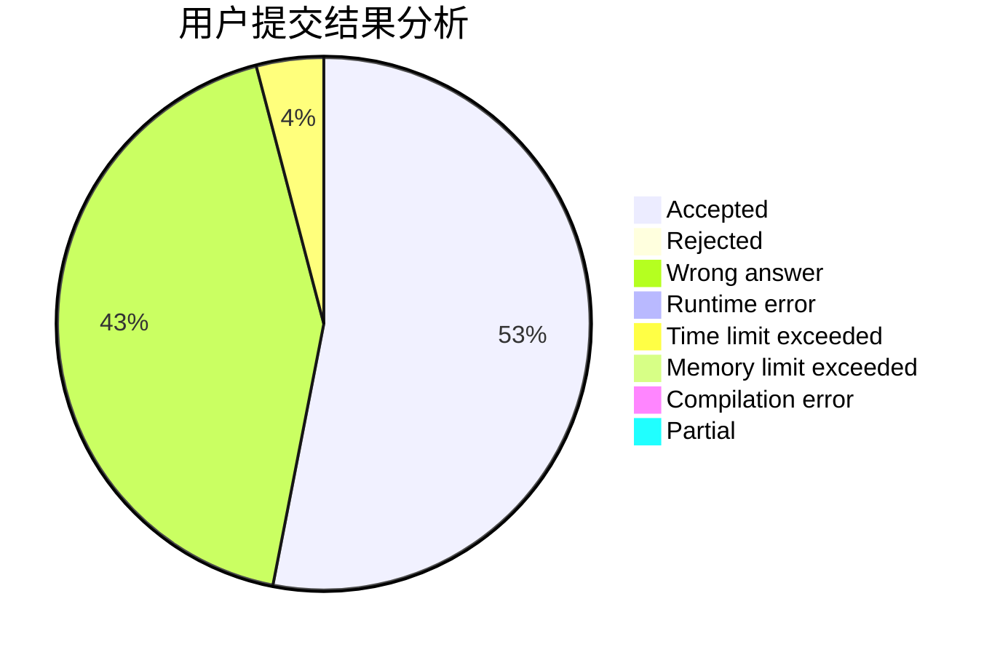
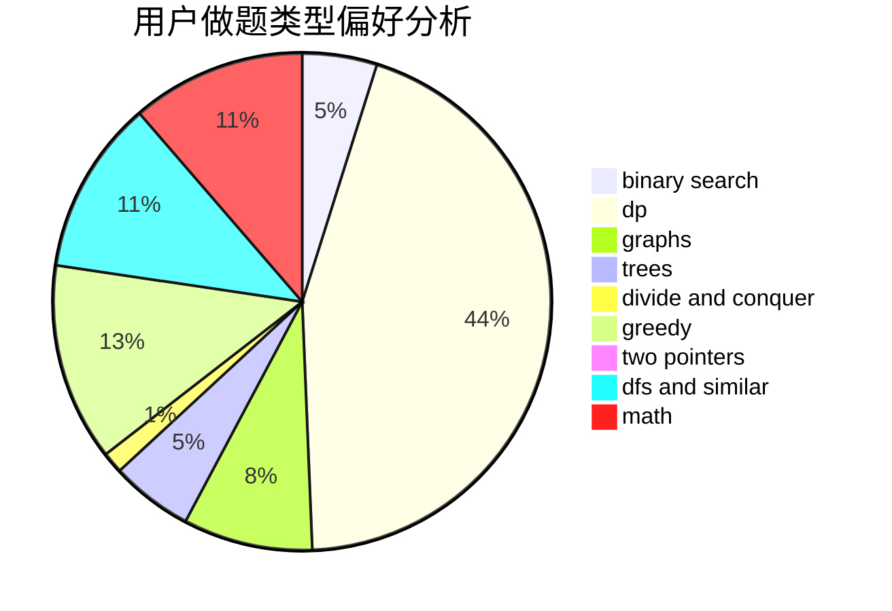

# DirectCurrent

<!-- tabs:start -->

#### **用户提交结果分析**

#### **用户做题类型偏好分析**

<!-- tabs:end -->
# 推荐题目
[1457B](https://codeforces.com/contest/1457/problem/B)
[1036B](https://codeforces.com/contest/1036/problem/B)
[286D](https://codeforces.com/contest/286/problem/D)
[295C](https://codeforces.com/contest/295/problem/C)
[284E](https://codeforces.com/contest/284/problem/E)
[1288E](https://codeforces.com/contest/1288/problem/E)
[542D](https://codeforces.com/contest/542/problem/D)
[13931](https://codeforces.com/contest/1393/problem/1)
[1186C](https://codeforces.com/contest/1186/problem/C)
[507D](https://codeforces.com/contest/507/problem/D)
