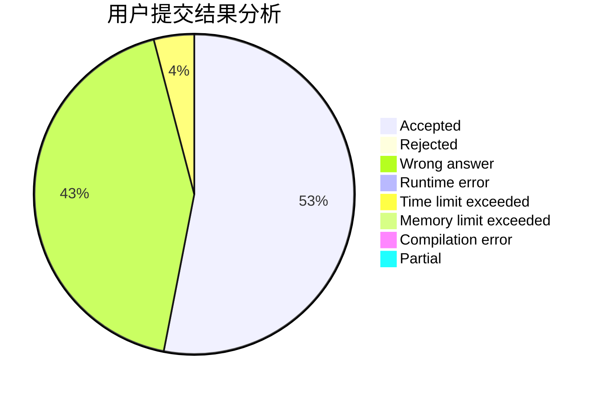
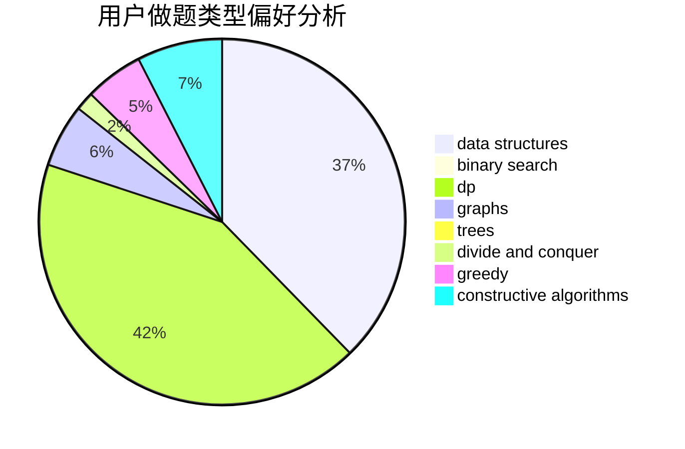
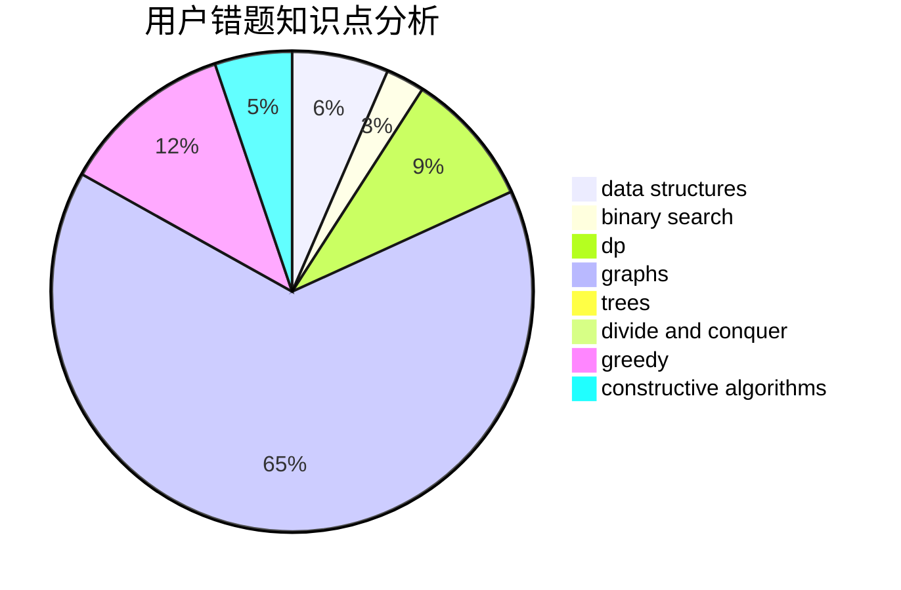

# DirectCurrent

<!-- tabs:start -->

#### **用户提交结果分析**

#### **用户做题类型偏好分析**

#### **用户错题知识点分析**

<!-- tabs:end -->
# 推荐题目
[1457B](https://codeforces.com/contest/1457/problem/B)		dsu,graphs,sortings,trees		  
[1036B](https://codeforces.com/contest/1036/problem/B)		math		  
[286D](https://codeforces.com/contest/286/problem/D)		data structures,
                        sortings		  
[295C](https://codeforces.com/contest/295/problem/C)		combinatorics,
                        dp,
                        graphs,
                        shortest paths		  
[284E](https://codeforces.com/contest/284/problem/E)		dsu,graphs,sortings,trees		  
[1288E](https://codeforces.com/contest/1288/problem/E)		data structures		  
[542D](https://codeforces.com/contest/542/problem/D)		dfs and similar,
                        dp,
                        hashing,
                        math,
                        number theory		  
[13931](https://codeforces.com/contest/1393/problem/1)		dsu,graphs,sortings,trees		  
[1186C](https://codeforces.com/contest/1186/problem/C)		implementation,
                        math		  
[507D](https://codeforces.com/contest/507/problem/D)		dp,
                        implementation		  
