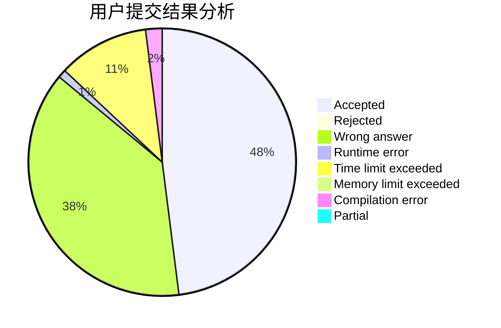
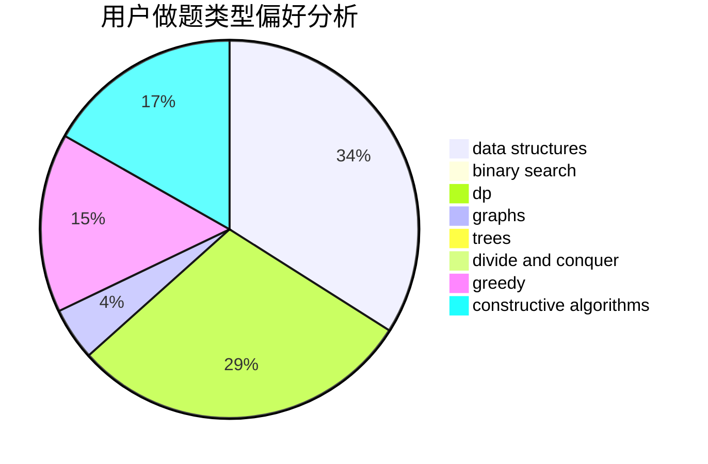

# Dirk_

<!-- tabs:start -->

#### **用户提交结果分析**

#### **用户做题类型偏好分析**

#### **用户错题知识点分析**

<!-- tabs:end -->
# 推荐题目
[638A](https://codeforces.com/contest/638/problem/A)		*special problem,
                        constructive algorithms,
                        math		  
[485A](https://codeforces.com/contest/485/problem/A)		implementation,
                        math,
                        matrices		  
[633D](https://codeforces.com/contest/633/problem/D)		brute force,
                        dp,
                        hashing,
                        implementation,
                        math		  
[801A](https://codeforces.com/contest/801/problem/A)		brute force		  
[1085G](https://codeforces.com/contest/1085/problem/G)		combinatorics,
                        data structures,
                        dp		  
[238A](https://codeforces.com/contest/238/problem/A)		constructive algorithms,
                        math		  
[28A](https://codeforces.com/contest/28/problem/A)		implementation		  
[608B](https://codeforces.com/contest/608/problem/B)		combinatorics,
                        strings		  
[686D](https://codeforces.com/contest/686/problem/D)		dsu,graphs,sortings,trees		  
[1350B](https://codeforces.com/contest/1350/problem/B)		dp,
                        math,
                        number theory		  
