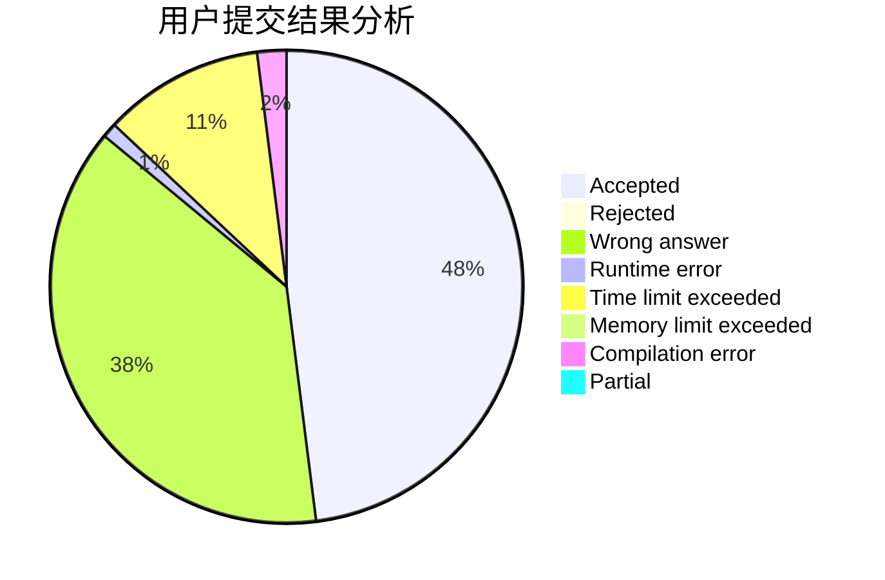
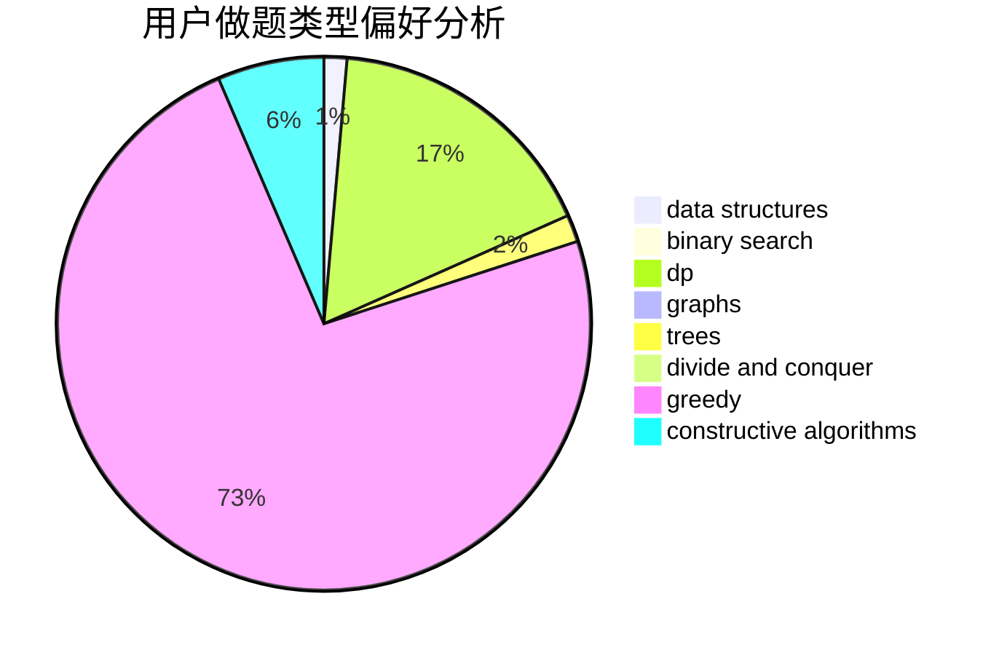

# Dirk_

<!-- tabs:start -->

#### **用户提交结果分析**

#### **用户做题类型偏好分析**

#### **用户错题知识点分析**

<!-- tabs:end -->
# 推荐题目
[618B](https://codeforces.com/contest/618/problem/B)		constructive algorithms		  
[466A](https://codeforces.com/contest/466/problem/A)		implementation		  
[615D](https://codeforces.com/contest/615/problem/D)		math,
                        number theory		  
[784A](https://codeforces.com/contest/784/problem/A)		*special problem		  
[1085B](https://codeforces.com/contest/1085/problem/B)		math		  
[218D](https://codeforces.com/contest/218/problem/D)		dsu,graphs,sortings,trees		  
[274B](https://codeforces.com/contest/274/problem/B)		dfs and similar,
                        dp,
                        greedy,
                        trees		  
[587F](https://codeforces.com/contest/587/problem/F)		data structures,
                        strings		  
[665F](https://codeforces.com/contest/665/problem/F)		data structures,
                        dp,
                        math,
                        number theory,
                        sortings,
                        two pointers		  
[1343D](https://codeforces.com/contest/1343/problem/D)		brute force,
                        data structures,
                        greedy,
                        two pointers		  
