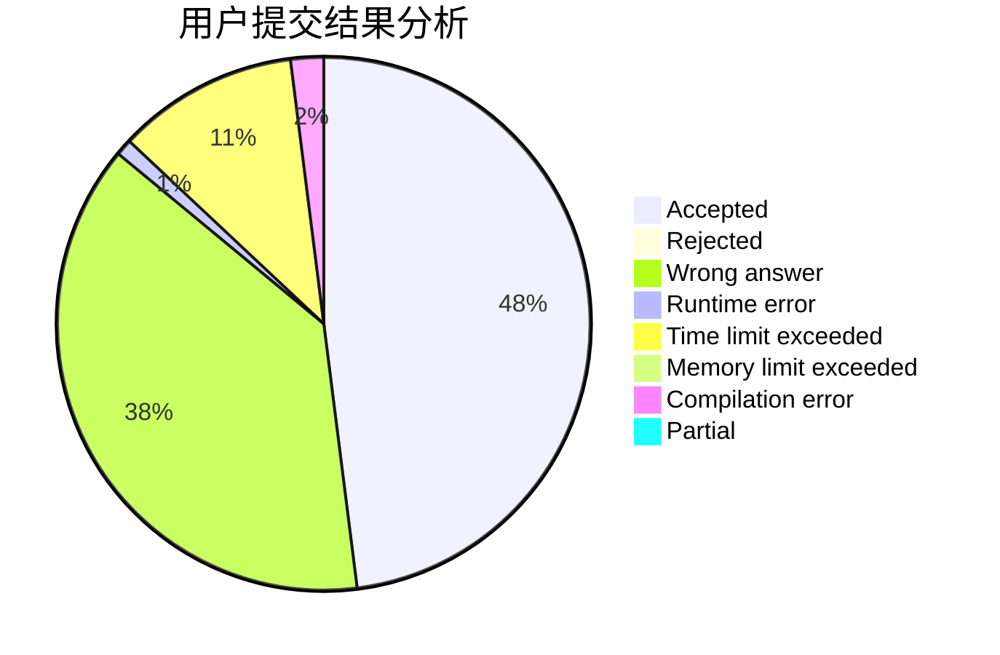
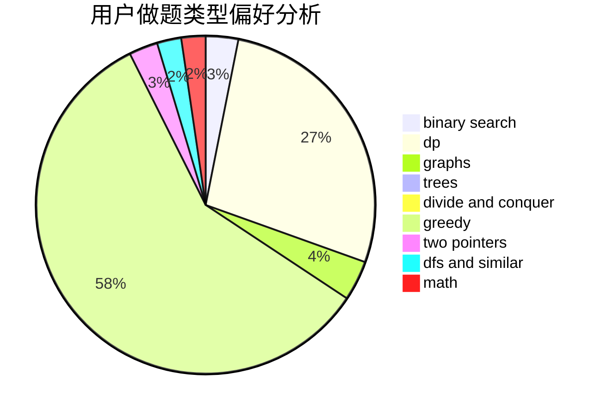

# Dirk_

<!-- tabs:start -->

#### **用户提交结果分析**

#### **用户做题类型偏好分析**

<!-- tabs:end -->
# 推荐题目
[638A](https://codeforces.com/contest/638/problem/A)
[485A](https://codeforces.com/contest/485/problem/A)
[633D](https://codeforces.com/contest/633/problem/D)
[801A](https://codeforces.com/contest/801/problem/A)
[1085G](https://codeforces.com/contest/1085/problem/G)
[238A](https://codeforces.com/contest/238/problem/A)
[28A](https://codeforces.com/contest/28/problem/A)
[608B](https://codeforces.com/contest/608/problem/B)
[686D](https://codeforces.com/contest/686/problem/D)
[1350B](https://codeforces.com/contest/1350/problem/B)
