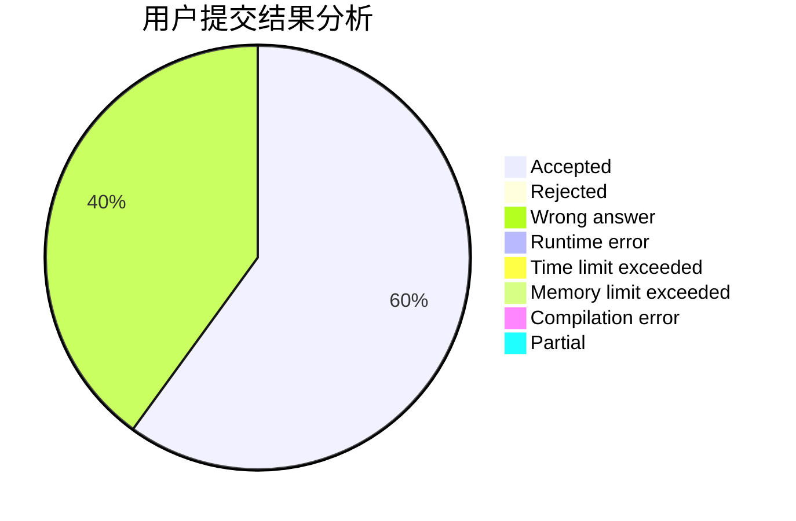
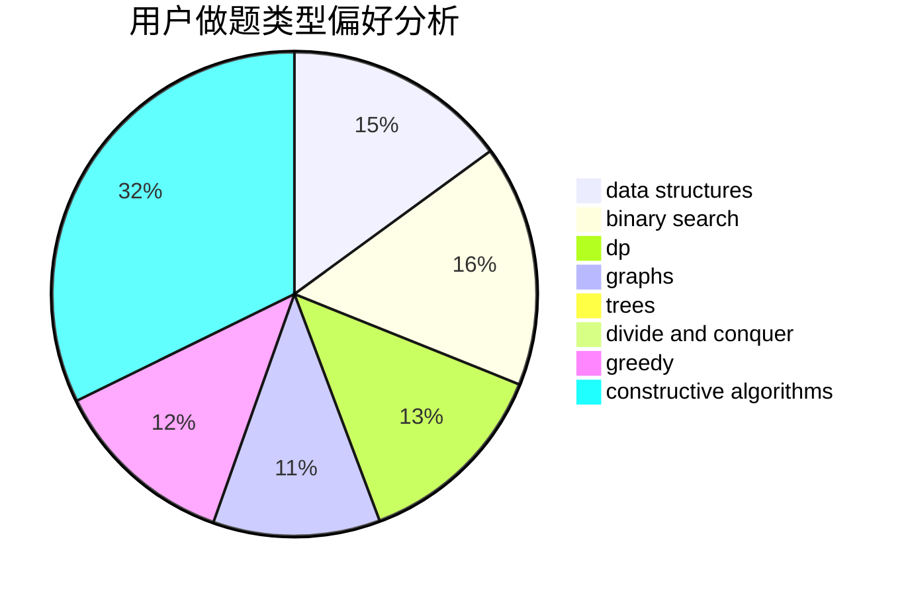
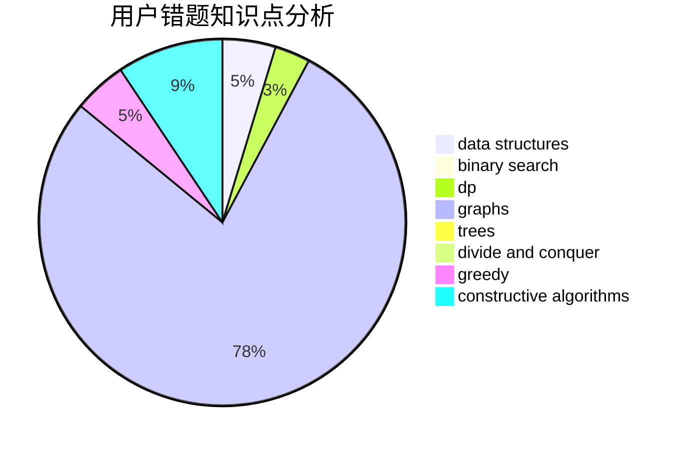

# Dirt

<!-- tabs:start -->

#### **用户提交结果分析**

#### **用户做题类型偏好分析**

#### **用户错题知识点分析**

<!-- tabs:end -->
# 推荐题目
[768G](https://codeforces.com/contest/768/problem/G)		binary search,
                        data structures		  
[1283A](https://codeforces.com/contest/1283/problem/A)		math		  
[784C](https://codeforces.com/contest/784/problem/C)		*special problem,
                        implementation		  
[231B](https://codeforces.com/contest/231/problem/B)		constructive algorithms,
                        greedy		  
[1044B](https://codeforces.com/contest/1044/problem/B)		dfs and similar,
                        interactive,
                        trees		  
[784E](https://codeforces.com/contest/784/problem/E)		*special problem,
                        brute force,
                        implementation		  
[667C](https://codeforces.com/contest/667/problem/C)		dsu,graphs,sortings,trees		  
[1027E](https://codeforces.com/contest/1027/problem/E)		combinatorics,
                        dp,
                        math		  
[1316A](https://codeforces.com/contest/1316/problem/A)		implementation		  
[375C](https://codeforces.com/contest/375/problem/C)		bitmasks,
                        shortest paths		  
