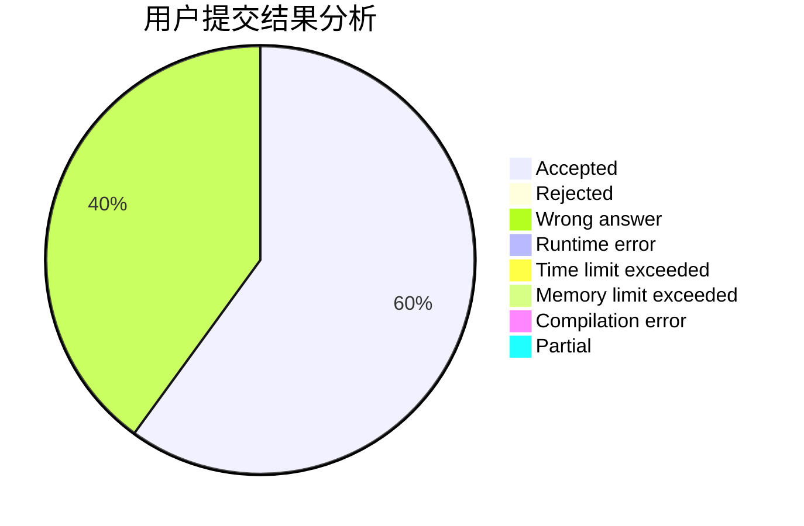
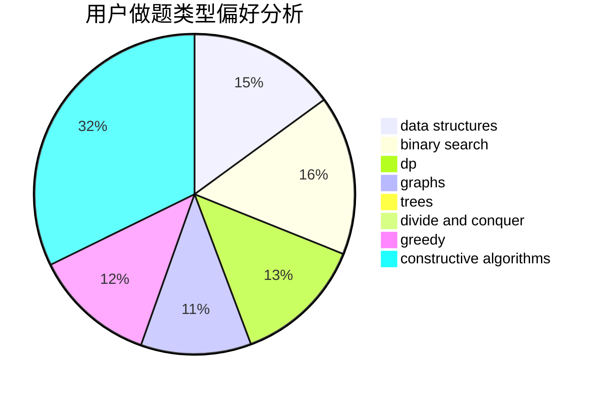
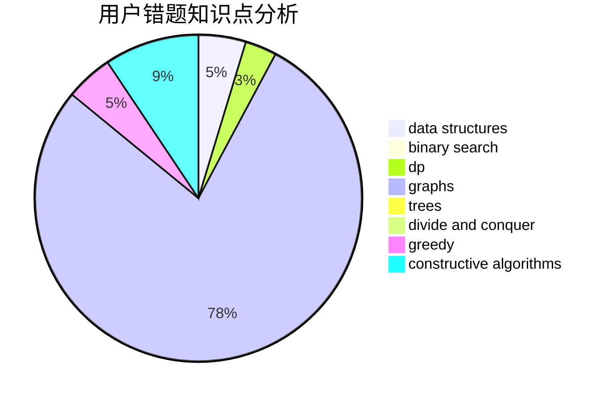

# Dirt
<!-- tabs:start -->
#### **用户提交结果分析**

#### **用户做题类型偏好分析**

#### **用户错题知识点分析**

<!-- tabs:end -->
# 推荐题目
[Anti-knapsack](http://codeforces.com/problemset/problem/1493/A)		constructive algorithms,
                        greedy		  
[The Winds of Winter](http://codeforces.com/problemset/problem/768/G)		binary search,
                        data structures		  
[Minutes Before the New Year](http://codeforces.com/problemset/problem/1283/A)		math		  
[INTERCALC](http://codeforces.com/problemset/problem/784/C)		*special problem,
                        implementation		  
[Intersecting Subtrees](http://codeforces.com/problemset/problem/1044/B)		dfs and similar,
                        interactive,
                        trees		  
[Magic, Wizardry and Wonders](http://codeforces.com/problemset/problem/231/B)		constructive algorithms,
                        greedy		  
[Au Pont Rouge](https://codeforces.com/contest/1315/problem/F)		binary search,
                        dp,
                        strings		  
[Inverse Coloring](http://codeforces.com/problemset/problem/1027/E)		combinatorics,
                        dp,
                        math		  
[Crunching Numbers Just for You](http://codeforces.com/problemset/problem/784/F)		*special problem,
                        implementation		  
[Booking System](http://codeforces.com/problemset/problem/416/C)		binary search,
                        dp,
                        greedy,
                        implementation		  
<!-- tabs:start -->
#### **data structures**
[The Winds of Winter](http://codeforces.com/problemset/problem/768/G)		binary search,
                        data structures		  
[Longest Increasing Subsequence](http://codeforces.com/problemset/problem/568/E)		data structures,
                        dp		  
[Pudding Monsters](http://codeforces.com/problemset/problem/526/F)		data structures,
                        divide and conquer		  
[The Treasure of The Segments](http://codeforces.com/problemset/problem/1462/F)		binary search,
                        data structures,
                        greedy		  
[Maximum width](http://codeforces.com/problemset/problem/1492/C)		binary search,
                        data structures,
                        dp,
                        greedy,
                        two pointers		  
[Old Floppy Drive](http://codeforces.com/problemset/problem/1490/G)		binary search,
                        data structures,
                        math		  
[Odd Mineral Resource](http://codeforces.com/problemset/problem/1479/D)		binary search,
                        bitmasks,
                        brute force,
                        data structures,
                        probabilities,
                        trees		  
[Meximization](http://codeforces.com/problemset/problem/1497/A)		brute force,
                        data structures,
                        greedy,
                        sortings		  
[Pekora and Trampoline](http://codeforces.com/problemset/problem/1491/C)		brute force,
                        data structures,
                        dp,
                        greedy,
                        implementation		  
[Card Deck](http://codeforces.com/problemset/problem/1492/B)		data structures,
                        greedy,
                        math		  
#### **binary search**
[The Winds of Winter](http://codeforces.com/problemset/problem/768/G)		binary search,
                        data structures		  
[Au Pont Rouge](https://codeforces.com/contest/1315/problem/F)		binary search,
                        dp,
                        strings		  
[Booking System](http://codeforces.com/problemset/problem/416/C)		binary search,
                        dp,
                        greedy,
                        implementation		  
[The Treasure of The Segments](http://codeforces.com/problemset/problem/1462/F)		binary search,
                        data structures,
                        greedy		  
[Maximum width](http://codeforces.com/problemset/problem/1492/C)		binary search,
                        data structures,
                        dp,
                        greedy,
                        two pointers		  
[Pairs](http://codeforces.com/problemset/problem/1463/D)		binary search,
                        constructive algorithms,
                        greedy,
                        two pointers		  
[Old Floppy Drive](http://codeforces.com/problemset/problem/1490/G)		binary search,
                        data structures,
                        math		  
[Odd Mineral Resource](http://codeforces.com/problemset/problem/1479/D)		binary search,
                        bitmasks,
                        brute force,
                        data structures,
                        probabilities,
                        trees		  
[Complicated Computations](http://codeforces.com/problemset/problem/1436/E)		binary search,
                        data structures,
                        two pointers		  
[Divide and Summarize](http://codeforces.com/problemset/problem/1461/D)		binary search,
                        brute force,
                        data structures,
                        divide and conquer,
                        implementation,
                        sortings		  
#### **dp**
[Au Pont Rouge](https://codeforces.com/contest/1315/problem/F)		binary search,
                        dp,
                        strings		  
[Inverse Coloring](http://codeforces.com/problemset/problem/1027/E)		combinatorics,
                        dp,
                        math		  
[Booking System](http://codeforces.com/problemset/problem/416/C)		binary search,
                        dp,
                        greedy,
                        implementation		  
[Reberland Linguistics](https://codeforces.com/contest/667/problem/C)		dp,
                        implementation,
                        strings		  
[Longest Increasing Subsequence](http://codeforces.com/problemset/problem/568/E)		data structures,
                        dp		  
[Maximum width](http://codeforces.com/problemset/problem/1492/C)		binary search,
                        data structures,
                        dp,
                        greedy,
                        two pointers		  
[Bouncing Ball](https://codeforces.com/contest/1457/problem/C)		brute force,
                        dp,
                        implementation		  
[Pekora and Trampoline](http://codeforces.com/problemset/problem/1491/C)		brute force,
                        data structures,
                        dp,
                        greedy,
                        implementation		  
[Chef Monocarp](http://codeforces.com/problemset/problem/1437/C)		dp,
                        flows,
                        graph matchings,
                        greedy,
                        math,
                        sortings		  
[Binary Removals](http://codeforces.com/problemset/problem/1499/B)		brute force,
                        dp,
                        greedy,
                        implementation		  
#### **graph**
[World Tour](http://codeforces.com/problemset/problem/666/B)		graphs,
                        shortest paths		  
[Tanya and Password](http://codeforces.com/problemset/problem/508/D)		dfs and similar,
                        graphs		  
[Minimum Ties](http://codeforces.com/problemset/problem/1487/C)		brute force,
                        constructive algorithms,
                        dfs and similar,
                        graphs,
                        greedy,
                        implementation,
                        math		  
[Chef Monocarp](http://codeforces.com/problemset/problem/1437/C)		dp,
                        flows,
                        graph matchings,
                        greedy,
                        math,
                        sortings		  
[Strange Housing](http://codeforces.com/problemset/problem/1470/D)		constructive algorithms,
                        dfs and similar,
                        graph matchings,
                        graphs,
                        greedy		  
[Longest Simple Cycle](http://codeforces.com/problemset/problem/1476/C)		dp,
                        graphs,
                        greedy		  
[Shortest and Longest LIS](http://codeforces.com/problemset/problem/1304/D)		constructive algorithms,
                        graphs,
                        greedy,
                        two pointers		  
[Ball in Berland](http://codeforces.com/problemset/problem/1475/C)		combinatorics,
                        graphs,
                        math		  
[Kyoya and Train](http://codeforces.com/problemset/problem/553/E)		dp,
                        fft,
                        graphs,
                        math,
                        probabilities		  
[Garden of the Sun](http://codeforces.com/problemset/problem/1495/C)		constructive algorithms,
                        graphs		  
#### **trees**
[Intersecting Subtrees](http://codeforces.com/problemset/problem/1044/B)		dfs and similar,
                        interactive,
                        trees		  
[Odd Mineral Resource](http://codeforces.com/problemset/problem/1479/D)		binary search,
                        bitmasks,
                        brute force,
                        data structures,
                        probabilities,
                        trees		  
[Yet Another Card Deck](http://codeforces.com/problemset/problem/1511/C)		brute force,
                        data structures,
                        implementation,
                        trees		  
[Diameter Cuts](http://codeforces.com/problemset/problem/1499/F)		combinatorics,
                        dfs and similar,
                        dp,
                        trees		  
[Fib-tree](http://codeforces.com/problemset/problem/1491/E)		brute force,
                        dfs and similar,
                        divide and conquer,
                        number theory,
                        trees		  
[13th Labour of Heracles](http://codeforces.com/problemset/problem/1466/D)		data structures,
                        greedy,
                        sortings,
                        trees		  
[BFS Trees](http://codeforces.com/problemset/problem/1495/D)		combinatorics,
                        dfs and similar,
                        graphs,
                        math,
                        shortest paths,
                        trees		  
[Sum of Prefix Sums](http://codeforces.com/problemset/problem/1303/G)		data structures,
                        divide and conquer,
                        geometry,
                        trees		  
[Number of Simple Paths](http://codeforces.com/problemset/problem/1454/E)		combinatorics,
                        dfs and similar,
                        graphs,
                        trees		  
[Dogeforces](http://codeforces.com/problemset/problem/1494/D)		constructive algorithms,
                        data structures,
                        dfs and similar,
                        divide and conquer,
                        dsu,
                        greedy,
                        sortings,
                        trees		  
#### **divide and conquer**
[Pudding Monsters](http://codeforces.com/problemset/problem/526/F)		data structures,
                        divide and conquer		  
[Divide and Summarize](http://codeforces.com/problemset/problem/1461/D)		binary search,
                        brute force,
                        data structures,
                        divide and conquer,
                        implementation,
                        sortings		  
[Song of the Sirens](http://codeforces.com/problemset/problem/1466/G)		combinatorics,
                        divide and conquer,
                        hashing,
                        math,
                        string suffix structures,
                        strings		  
[Permutation Transformation](http://codeforces.com/problemset/problem/1490/D)		dfs and similar,
                        divide and conquer,
                        implementation		  
[Skyline Photo](https://codeforces.com/contest/1483/problem/C)		data structures,
                        divide and conquer,
                        dp		  
[Fib-tree](http://codeforces.com/problemset/problem/1491/E)		brute force,
                        dfs and similar,
                        divide and conquer,
                        number theory,
                        trees		  
[Sum of Prefix Sums](http://codeforces.com/problemset/problem/1303/G)		data structures,
                        divide and conquer,
                        geometry,
                        trees		  
[Dogeforces](http://codeforces.com/problemset/problem/1494/D)		constructive algorithms,
                        data structures,
                        dfs and similar,
                        divide and conquer,
                        dsu,
                        greedy,
                        sortings,
                        trees		  
[Logistical Questions](http://codeforces.com/problemset/problem/566/C)		dfs and similar,
                        divide and conquer,
                        trees		  
[Fruit Sequences](http://codeforces.com/problemset/problem/1428/F)		binary search,
                        data structures,
                        divide and conquer,
                        dp,
                        two pointers		  
#### **greedy**
[Anti-knapsack](http://codeforces.com/problemset/problem/1493/A)		constructive algorithms,
                        greedy		  
[Magic, Wizardry and Wonders](http://codeforces.com/problemset/problem/231/B)		constructive algorithms,
                        greedy		  
[Booking System](http://codeforces.com/problemset/problem/416/C)		binary search,
                        dp,
                        greedy,
                        implementation		  
[Three Swaps](http://codeforces.com/problemset/problem/339/E)		constructive algorithms,
                        dfs and similar,
                        greedy		  
[Swap Letters](http://codeforces.com/problemset/problem/1215/C)		constructive algorithms,
                        greedy		  
[Another One Bites The Dust](http://codeforces.com/problemset/problem/1148/A)		greedy		  
[M-arrays](http://codeforces.com/problemset/problem/1497/B)		constructive algorithms,
                        greedy,
                        math		  
[The Treasure of The Segments](http://codeforces.com/problemset/problem/1462/F)		binary search,
                        data structures,
                        greedy		  
[Maximum width](http://codeforces.com/problemset/problem/1492/C)		binary search,
                        data structures,
                        dp,
                        greedy,
                        two pointers		  
[Diamond Miner](https://codeforces.com/contest/1496/problem/C)		geometry,
                        greedy,
                        math,
                        sortings		  
#### **constructive algorithms**
[Anti-knapsack](http://codeforces.com/problemset/problem/1493/A)		constructive algorithms,
                        greedy		  
[Magic, Wizardry and Wonders](http://codeforces.com/problemset/problem/231/B)		constructive algorithms,
                        greedy		  
[Vasya and Chess](http://codeforces.com/problemset/problem/493/D)		constructive algorithms,
                        games,
                        math		  
[Three Swaps](http://codeforces.com/problemset/problem/339/E)		constructive algorithms,
                        dfs and similar,
                        greedy		  
[Vasya And The Matrix](http://codeforces.com/problemset/problem/1016/D)		constructive algorithms,
                        flows,
                        math		  
[Swap Letters](http://codeforces.com/problemset/problem/1215/C)		constructive algorithms,
                        greedy		  
[M-arrays](http://codeforces.com/problemset/problem/1497/B)		constructive algorithms,
                        greedy,
                        math		  
[Pairs](http://codeforces.com/problemset/problem/1463/D)		binary search,
                        constructive algorithms,
                        greedy,
                        two pointers		  
[XOR-gun](https://codeforces.com/contest/1456/problem/B)		bitmasks,
                        brute force,
                        constructive algorithms		  
[Genius's Gambit](http://codeforces.com/problemset/problem/1492/D)		bitmasks,
                        constructive algorithms,
                        greedy,
                        math		  
#### **sortings**
[Diamond Miner](https://codeforces.com/contest/1496/problem/C)		geometry,
                        greedy,
                        math,
                        sortings		  
[Meximization](http://codeforces.com/problemset/problem/1497/A)		brute force,
                        data structures,
                        greedy,
                        sortings		  
[Avoiding Zero](http://codeforces.com/problemset/problem/1427/A)		math,
                        sortings		  
[Divide and Summarize](http://codeforces.com/problemset/problem/1461/D)		binary search,
                        brute force,
                        data structures,
                        divide and conquer,
                        implementation,
                        sortings		  
[Chef Monocarp](http://codeforces.com/problemset/problem/1437/C)		dp,
                        flows,
                        graph matchings,
                        greedy,
                        math,
                        sortings		  
[Replacing Elements](http://codeforces.com/problemset/problem/1473/A)		greedy,
                        implementation,
                        math,
                        sortings		  
[Eastern Exhibition](http://codeforces.com/problemset/problem/1486/B)		binary search,
                        geometry,
                        shortest paths,
                        sortings		  
[The Great Hero](http://codeforces.com/problemset/problem/1480/B)		greedy,
                        implementation,
                        sortings		  
[Rescue Nibel!](http://codeforces.com/problemset/problem/1420/D)		combinatorics,
                        data structures,
                        sortings		  
[GCD of an Array](http://codeforces.com/problemset/problem/1493/D)		brute force,
                        data structures,
                        hashing,
                        implementation,
                        math,
                        number theory,
                        sortings,
                        two pointers		  
<!-- tabs:end -->
