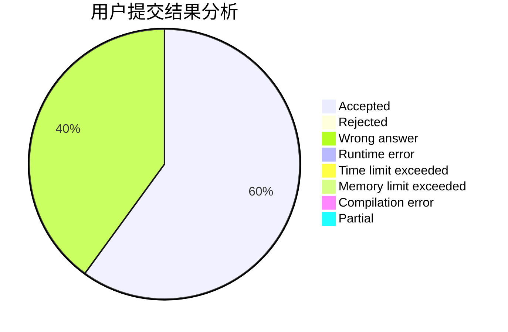
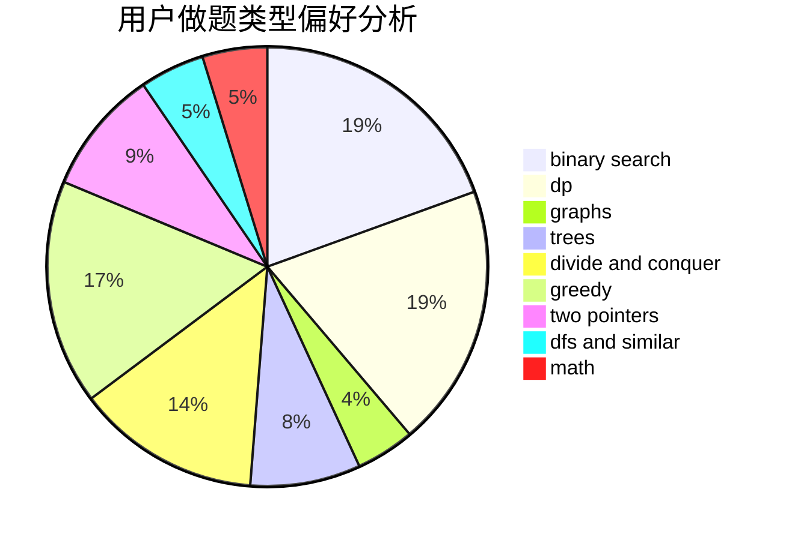

# Dirt

<!-- tabs:start -->

#### **用户提交结果分析**

#### **用户做题类型偏好分析**

<!-- tabs:end -->
# 推荐题目
[788E](https://codeforces.com/contest/788/problem/E)
[1290A](https://codeforces.com/contest/1290/problem/A)
[801C](https://codeforces.com/contest/801/problem/C)
[252A](https://codeforces.com/contest/252/problem/A)
[1045C](https://codeforces.com/contest/1045/problem/C)
[802A](https://codeforces.com/contest/802/problem/A)
[689D](https://codeforces.com/contest/689/problem/D)
[1028A](https://codeforces.com/contest/1028/problem/A)
[1325E](https://codeforces.com/contest/1325/problem/E)
[403C](https://codeforces.com/contest/403/problem/C)
