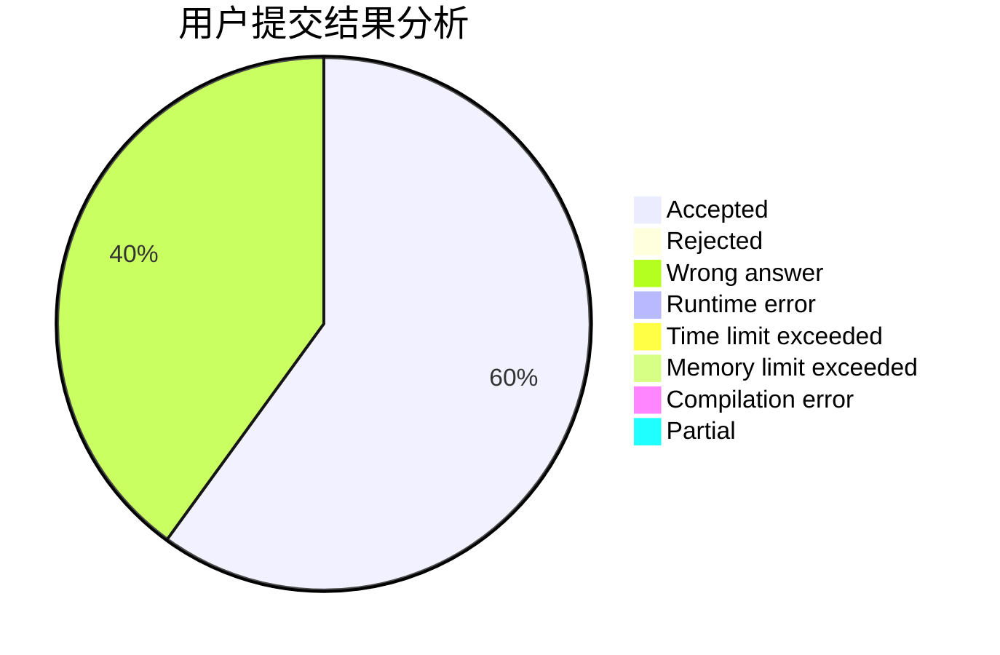
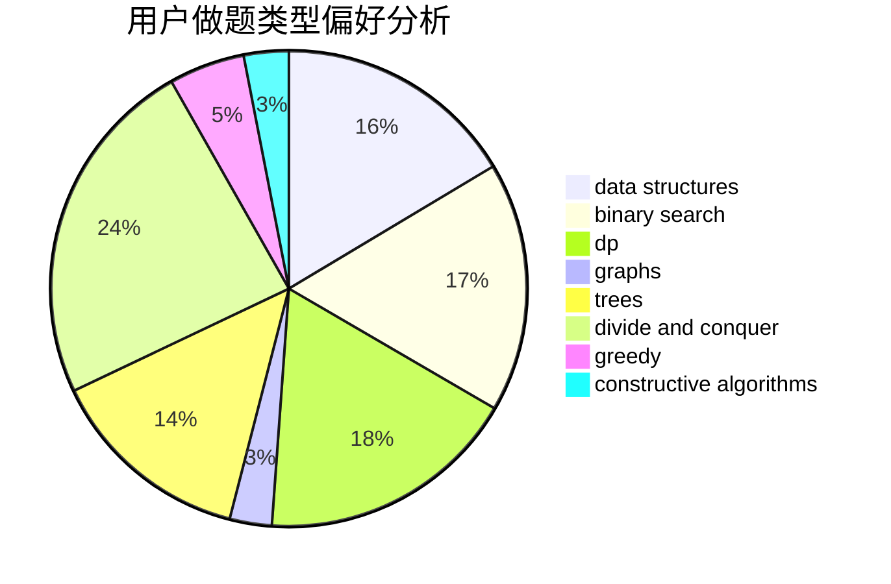
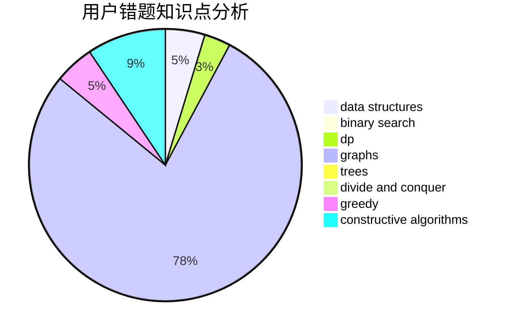

# Dirt

<!-- tabs:start -->

#### **用户提交结果分析**

#### **用户做题类型偏好分析**

#### **用户错题知识点分析**

<!-- tabs:end -->
# 推荐题目
[788E](https://codeforces.com/contest/788/problem/E)		data structures		  
[1290A](https://codeforces.com/contest/1290/problem/A)		brute force,
                        data structures,
                        implementation		  
[801C](https://codeforces.com/contest/801/problem/C)		dsu,graphs,sortings,trees		  
[252A](https://codeforces.com/contest/252/problem/A)		brute force,
                        implementation		  
[1045C](https://codeforces.com/contest/1045/problem/C)		dfs and similar,
                        graphs,
                        trees		  
[802A](https://codeforces.com/contest/802/problem/A)		greedy		  
[689D](https://codeforces.com/contest/689/problem/D)		binary search,
                        data structures		  
[1028A](https://codeforces.com/contest/1028/problem/A)		implementation		  
[1325E](https://codeforces.com/contest/1325/problem/E)		brute force,
                        dfs and similar,
                        graphs,
                        number theory,
                        shortest paths		  
[403C](https://codeforces.com/contest/403/problem/C)		dsu,graphs,sortings,trees		  
