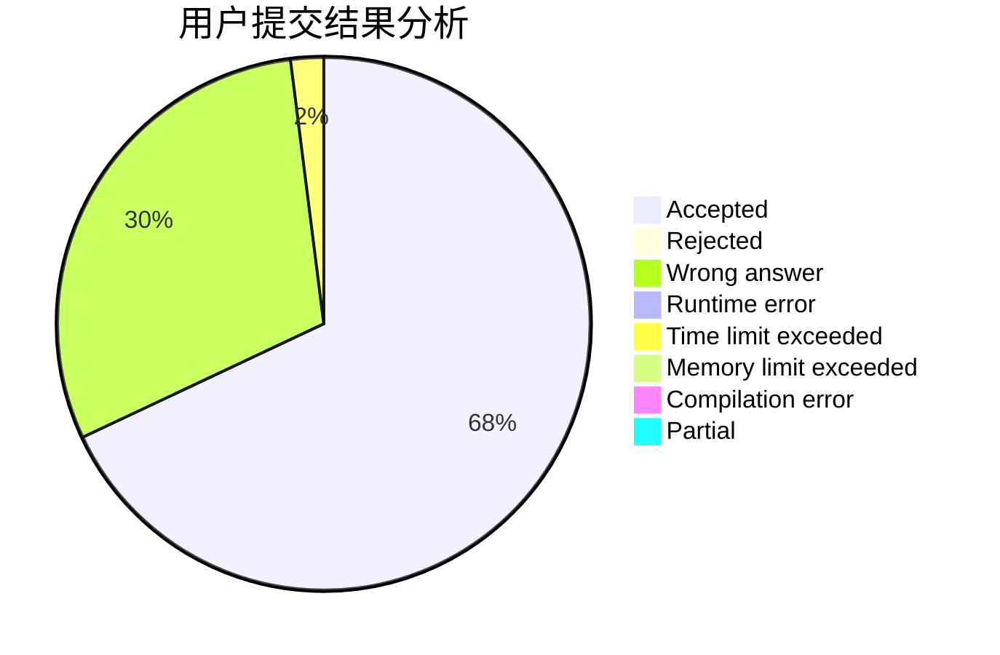
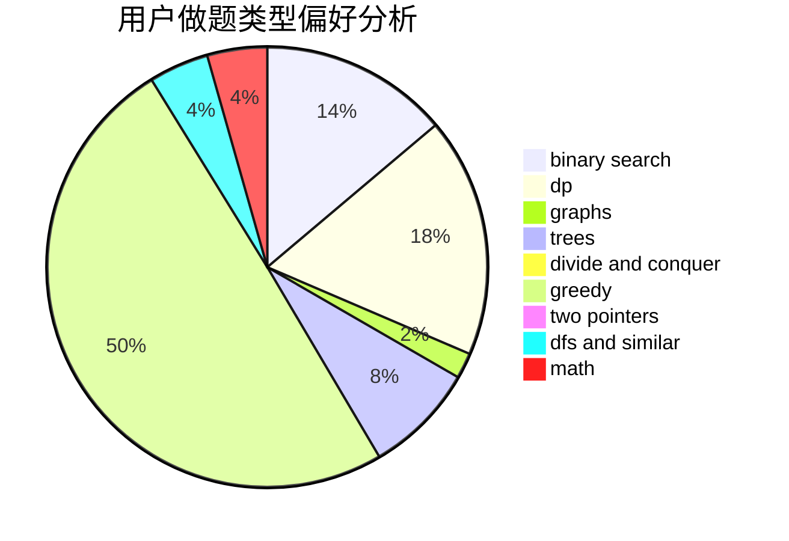

# DivQ

<!-- tabs:start -->

#### **用户提交结果分析**

#### **用户做题类型偏好分析**

<!-- tabs:end -->
# 推荐题目
[449C](https://codeforces.com/contest/449/problem/C)
[264C](https://codeforces.com/contest/264/problem/C)
[141B](https://codeforces.com/contest/141/problem/B)
[796A](https://codeforces.com/contest/796/problem/A)
[1020E](https://codeforces.com/contest/1020/problem/E)
[1406E](https://codeforces.com/contest/1406/problem/E)
[1257E](https://codeforces.com/contest/1257/problem/E)
[1501E](https://codeforces.com/contest/1501/problem/E)
[1197B](https://codeforces.com/contest/1197/problem/B)
[1433E](https://codeforces.com/contest/1433/problem/E)
