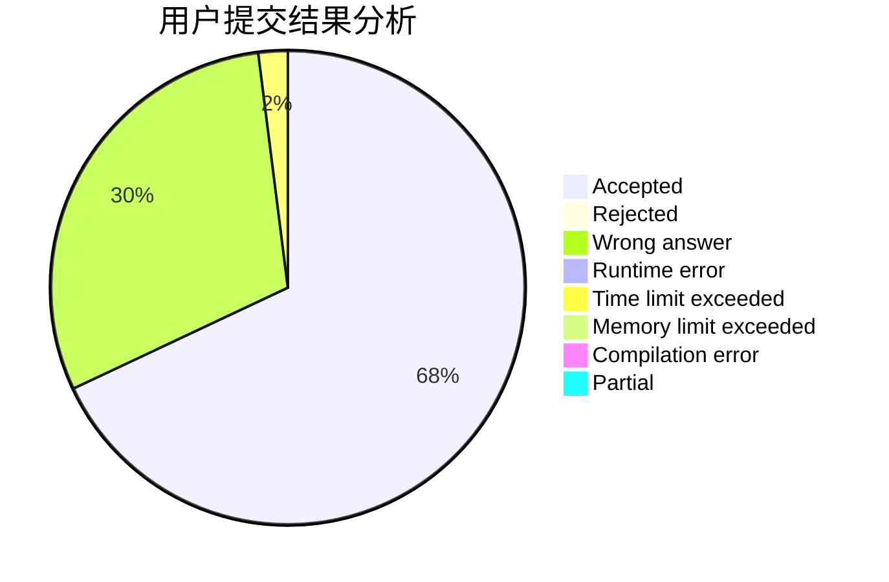
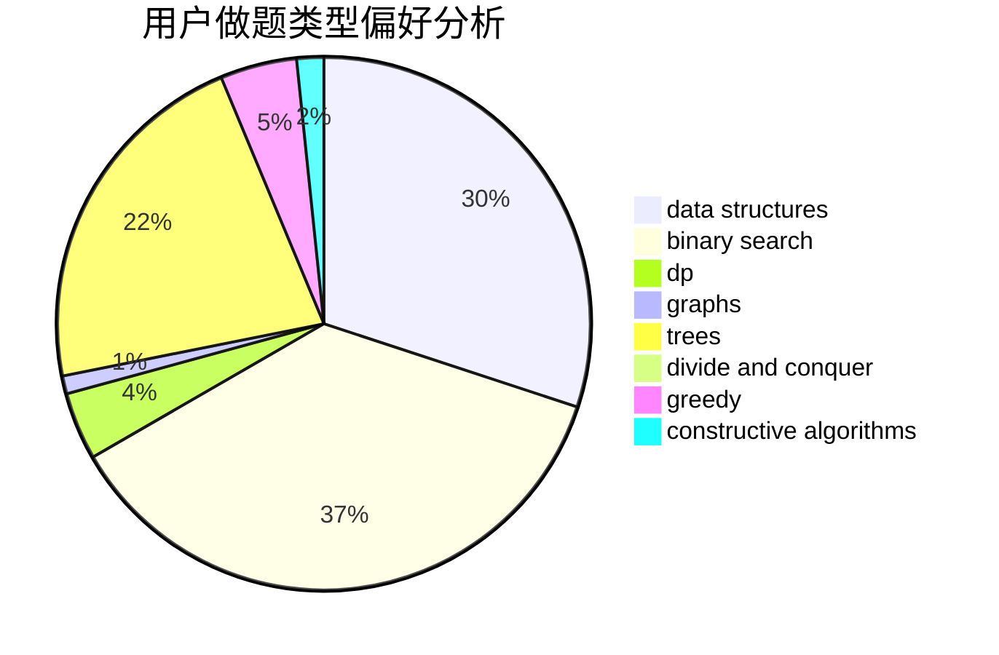
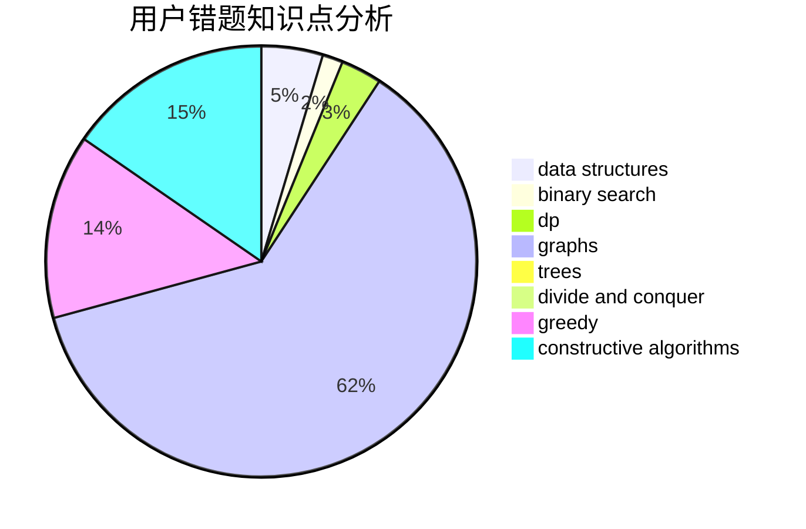

# DivQ

<!-- tabs:start -->

#### **用户提交结果分析**

#### **用户做题类型偏好分析**

#### **用户错题知识点分析**

<!-- tabs:end -->
# 推荐题目
[425E](https://codeforces.com/contest/425/problem/E)		dp		  
[243B](https://codeforces.com/contest/243/problem/B)		graphs,
                        sortings		  
[1409C](https://codeforces.com/contest/1409/problem/C)		brute force,
                        math,
                        number theory		  
[777D](https://codeforces.com/contest/777/problem/D)		binary search,
                        greedy,
                        implementation,
                        strings		  
[1020B](https://codeforces.com/contest/1020/problem/B)		brute force,
                        dfs and similar,
                        graphs		  
[1398A](https://codeforces.com/contest/1398/problem/A)		geometry,
                        math		  
[1252D](https://codeforces.com/contest/1252/problem/D)		data structures,
                        dp,
                        strings,
                        trees		  
[1493E](https://codeforces.com/contest/1493/problem/E)		bitmasks,
                        constructive algorithms,
                        greedy,
                        math,
                        strings,
                        two pointers		  
[1191C](https://codeforces.com/contest/1191/problem/C)		dsu,graphs,sortings,trees		  
[1425B](https://codeforces.com/contest/1425/problem/B)		divide and conquer,
                        dp		  
