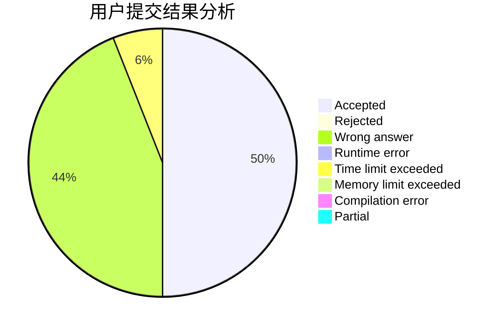
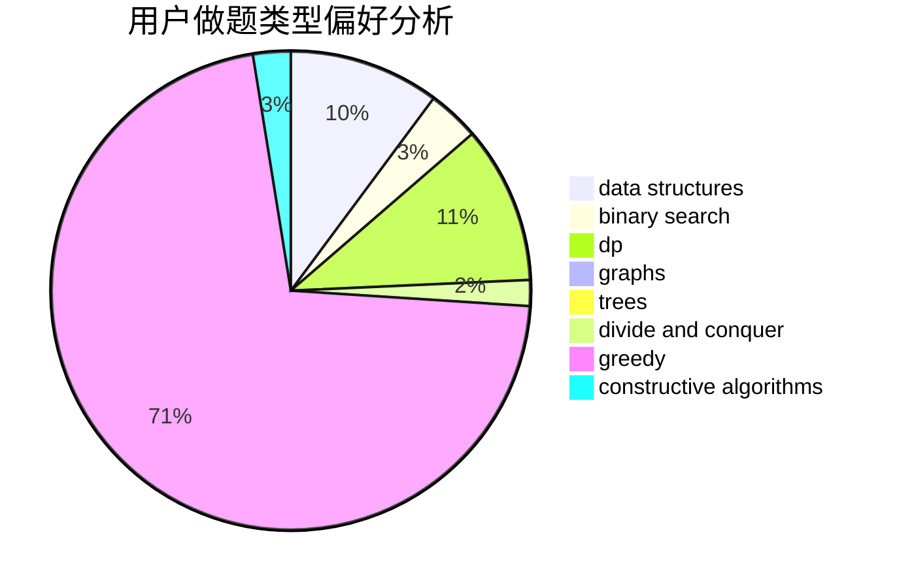
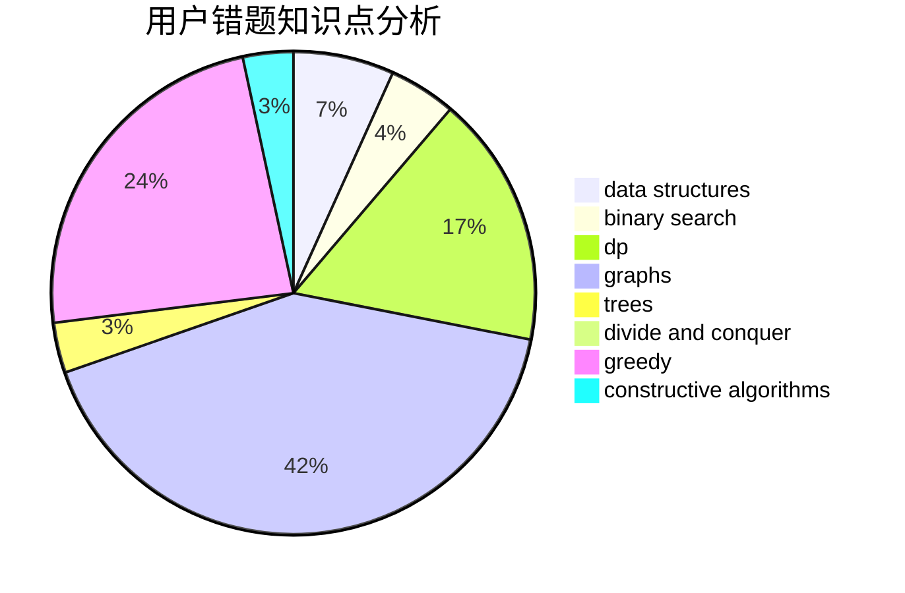

# DividedByZero

<!-- tabs:start -->

#### **用户提交结果分析**

#### **用户做题类型偏好分析**

#### **用户错题知识点分析**

<!-- tabs:end -->
# 推荐题目
[802I](https://codeforces.com/contest/802/problem/I)		string suffix structures		  
[1440B](https://codeforces.com/contest/1440/problem/B)		greedy,
                        math		  
[13702](https://codeforces.com/contest/1370/problem/2)		dsu,graphs,sortings,trees		  
[720D](https://codeforces.com/contest/720/problem/D)		data structures,
                        dp,
                        sortings		  
[802G](https://codeforces.com/contest/802/problem/G)		implementation,
                        strings		  
[155A](https://codeforces.com/contest/155/problem/A)		brute force		  
[1208E](https://codeforces.com/contest/1208/problem/E)		data structures,
                        implementation		  
[1298D](https://codeforces.com/contest/1298/problem/D)		dsu,graphs,sortings,trees		  
[364B](https://codeforces.com/contest/364/problem/B)		dp,
                        greedy		  
[445B](https://codeforces.com/contest/445/problem/B)		dfs and similar,
                        dsu,
                        greedy		  
