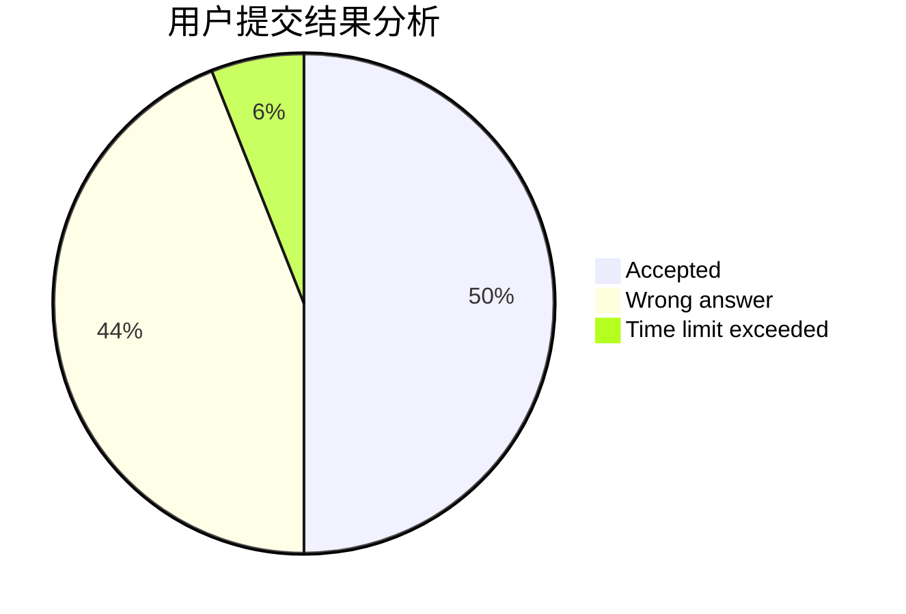
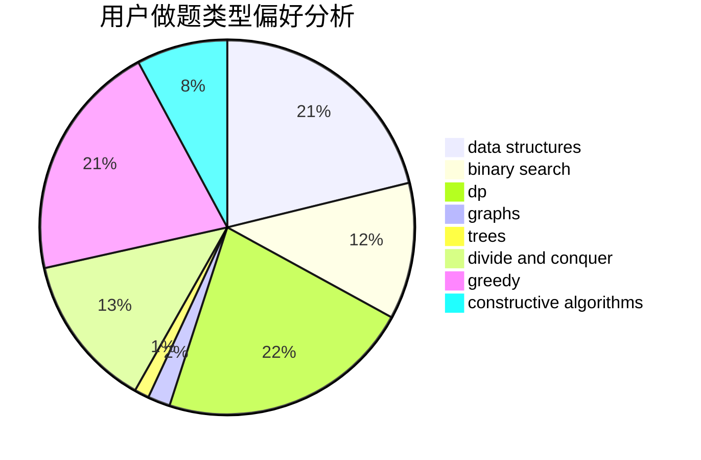
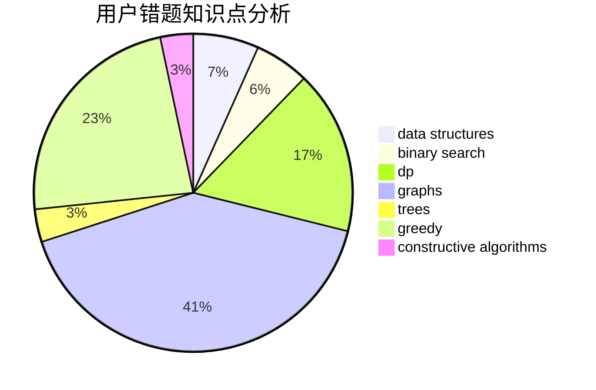

# DividedByZero
<!-- tabs:start -->
#### **用户提交结果分析**

#### **用户做题类型偏好分析**

#### **用户错题知识点分析**

<!-- tabs:end -->
# 推荐题目
[Special Permutation](http://codeforces.com/problemset/problem/1352/G)		constructive algorithms		  
[Pawn](http://codeforces.com/problemset/problem/41/D)		dp		  
[Odd Selection](http://codeforces.com/problemset/problem/1363/A)		brute force,
                        implementation,
                        math		  
[Complete the Projects (hard version)](http://codeforces.com/problemset/problem/1203/F2)		dp,
                        greedy		  
[Anton and Classes](http://codeforces.com/problemset/problem/785/B)		greedy,
                        sortings		  
[Anton and School - 2](http://codeforces.com/problemset/problem/785/D)		combinatorics,
                        dp,
                        math,
                        number theory		  
[Prefix Enlightenment](https://codeforces.com/contest/1291/problem/E)		dfs and similar,
                        dsu,
                        graphs		  
[Cakes for Clones](http://codeforces.com/problemset/problem/1415/F)		dp		  
[Tourism](http://codeforces.com/problemset/problem/1220/E)		dfs and similar,
                        dp,
                        dsu,
                        graphs,
                        greedy,
                        trees		  
[Set of Points](http://codeforces.com/problemset/problem/277/B)		constructive algorithms,
                        geometry		  
<!-- tabs:start -->
#### **data structures**
[Lucky Array](http://codeforces.com/problemset/problem/121/E)		data structures		  
[Lipshitz Sequence](http://codeforces.com/problemset/problem/601/B)		data structures,
                        math		  
[The Potion of Great Power](http://codeforces.com/problemset/problem/1403/A)		*special problem,
                        2-sat,
                        binary search,
                        data structures,
                        graphs,
                        interactive,
                        sortings,
                        two pointers		  
[Two permutations](http://codeforces.com/problemset/problem/323/C)		data structures		  
[Maximum width](http://codeforces.com/problemset/problem/1492/C)		binary search,
                        data structures,
                        dp,
                        greedy,
                        two pointers		  
[Old Floppy Drive](http://codeforces.com/problemset/problem/1490/G)		binary search,
                        data structures,
                        math		  
[Odd Mineral Resource](http://codeforces.com/problemset/problem/1479/D)		binary search,
                        bitmasks,
                        brute force,
                        data structures,
                        probabilities,
                        trees		  
[Meximization](http://codeforces.com/problemset/problem/1497/A)		brute force,
                        data structures,
                        greedy,
                        sortings		  
[Pekora and Trampoline](http://codeforces.com/problemset/problem/1491/C)		brute force,
                        data structures,
                        dp,
                        greedy,
                        implementation		  
[Card Deck](http://codeforces.com/problemset/problem/1492/B)		data structures,
                        greedy,
                        math		  
#### **binary search**
[Anton and Fairy Tale](http://codeforces.com/problemset/problem/785/C)		binary search,
                        math		  
[The Potion of Great Power](http://codeforces.com/problemset/problem/1403/A)		*special problem,
                        2-sat,
                        binary search,
                        data structures,
                        graphs,
                        interactive,
                        sortings,
                        two pointers		  
[k-Multiple Free Set](http://codeforces.com/problemset/problem/274/A)		binary search,
                        greedy,
                        sortings		  
[Two Platforms](http://codeforces.com/problemset/problem/1409/E)		binary search,
                        dp,
                        sortings,
                        two pointers		  
[Maximum width](http://codeforces.com/problemset/problem/1492/C)		binary search,
                        data structures,
                        dp,
                        greedy,
                        two pointers		  
[Pairs](http://codeforces.com/problemset/problem/1463/D)		binary search,
                        constructive algorithms,
                        greedy,
                        two pointers		  
[Old Floppy Drive](http://codeforces.com/problemset/problem/1490/G)		binary search,
                        data structures,
                        math		  
[Odd Mineral Resource](http://codeforces.com/problemset/problem/1479/D)		binary search,
                        bitmasks,
                        brute force,
                        data structures,
                        probabilities,
                        trees		  
[Complicated Computations](http://codeforces.com/problemset/problem/1436/E)		binary search,
                        data structures,
                        two pointers		  
[Divide and Summarize](http://codeforces.com/problemset/problem/1461/D)		binary search,
                        brute force,
                        data structures,
                        divide and conquer,
                        implementation,
                        sortings		  
#### **dp**
[Pawn](http://codeforces.com/problemset/problem/41/D)		dp		  
[Complete the Projects (hard version)](http://codeforces.com/problemset/problem/1203/F2)		dp,
                        greedy		  
[Anton and School - 2](http://codeforces.com/problemset/problem/785/D)		combinatorics,
                        dp,
                        math,
                        number theory		  
[Cakes for Clones](http://codeforces.com/problemset/problem/1415/F)		dp		  
[Tourism](http://codeforces.com/problemset/problem/1220/E)		dfs and similar,
                        dp,
                        dsu,
                        graphs,
                        greedy,
                        trees		  
[Shovels Shop](http://codeforces.com/problemset/problem/1154/F)		dp,
                        greedy,
                        sortings		  
[Letter](http://codeforces.com/problemset/problem/180/C)		dp		  
[Sasha and a Bit of Relax](https://codeforces.com/contest/1113/problem/C)		dp,
                        implementation		  
[Bath Queue](http://codeforces.com/problemset/problem/28/C)		combinatorics,
                        dp,
                        probabilities		  
[Maximum Increase](http://codeforces.com/problemset/problem/702/A)		dp,
                        greedy,
                        implementation		  
#### **graph**
[Prefix Enlightenment](https://codeforces.com/contest/1291/problem/E)		dfs and similar,
                        dsu,
                        graphs		  
[Tourism](http://codeforces.com/problemset/problem/1220/E)		dfs and similar,
                        dp,
                        dsu,
                        graphs,
                        greedy,
                        trees		  
[The Potion of Great Power](http://codeforces.com/problemset/problem/1403/A)		*special problem,
                        2-sat,
                        binary search,
                        data structures,
                        graphs,
                        interactive,
                        sortings,
                        two pointers		  
[The Two Routes](http://codeforces.com/problemset/problem/601/A)		graphs,
                        shortest paths		  
[Minimum Ties](http://codeforces.com/problemset/problem/1487/C)		brute force,
                        constructive algorithms,
                        dfs and similar,
                        graphs,
                        greedy,
                        implementation,
                        math		  
[Chef Monocarp](http://codeforces.com/problemset/problem/1437/C)		dp,
                        flows,
                        graph matchings,
                        greedy,
                        math,
                        sortings		  
[Strange Housing](http://codeforces.com/problemset/problem/1470/D)		constructive algorithms,
                        dfs and similar,
                        graph matchings,
                        graphs,
                        greedy		  
[Longest Simple Cycle](http://codeforces.com/problemset/problem/1476/C)		dp,
                        graphs,
                        greedy		  
[Shortest and Longest LIS](http://codeforces.com/problemset/problem/1304/D)		constructive algorithms,
                        graphs,
                        greedy,
                        two pointers		  
[Ball in Berland](http://codeforces.com/problemset/problem/1475/C)		combinatorics,
                        graphs,
                        math		  
#### **trees**
[Tourism](http://codeforces.com/problemset/problem/1220/E)		dfs and similar,
                        dp,
                        dsu,
                        graphs,
                        greedy,
                        trees		  
[Book of Evil](http://codeforces.com/problemset/problem/337/D)		dfs and similar,
                        divide and conquer,
                        dp,
                        trees		  
[Odd Mineral Resource](http://codeforces.com/problemset/problem/1479/D)		binary search,
                        bitmasks,
                        brute force,
                        data structures,
                        probabilities,
                        trees		  
[Yet Another Card Deck](http://codeforces.com/problemset/problem/1511/C)		brute force,
                        data structures,
                        implementation,
                        trees		  
[Diameter Cuts](http://codeforces.com/problemset/problem/1499/F)		combinatorics,
                        dfs and similar,
                        dp,
                        trees		  
[Fib-tree](http://codeforces.com/problemset/problem/1491/E)		brute force,
                        dfs and similar,
                        divide and conquer,
                        number theory,
                        trees		  
[13th Labour of Heracles](http://codeforces.com/problemset/problem/1466/D)		data structures,
                        greedy,
                        sortings,
                        trees		  
[BFS Trees](http://codeforces.com/problemset/problem/1495/D)		combinatorics,
                        dfs and similar,
                        graphs,
                        math,
                        shortest paths,
                        trees		  
[Sum of Prefix Sums](http://codeforces.com/problemset/problem/1303/G)		data structures,
                        divide and conquer,
                        geometry,
                        trees		  
[Number of Simple Paths](http://codeforces.com/problemset/problem/1454/E)		combinatorics,
                        dfs and similar,
                        graphs,
                        trees		  
#### **divide and conquer**
[Book of Evil](http://codeforces.com/problemset/problem/337/D)		dfs and similar,
                        divide and conquer,
                        dp,
                        trees		  
[Divide and Summarize](http://codeforces.com/problemset/problem/1461/D)		binary search,
                        brute force,
                        data structures,
                        divide and conquer,
                        implementation,
                        sortings		  
[Song of the Sirens](http://codeforces.com/problemset/problem/1466/G)		combinatorics,
                        divide and conquer,
                        hashing,
                        math,
                        string suffix structures,
                        strings		  
[Permutation Transformation](http://codeforces.com/problemset/problem/1490/D)		dfs and similar,
                        divide and conquer,
                        implementation		  
[Skyline Photo](https://codeforces.com/contest/1483/problem/C)		data structures,
                        divide and conquer,
                        dp		  
[Fib-tree](http://codeforces.com/problemset/problem/1491/E)		brute force,
                        dfs and similar,
                        divide and conquer,
                        number theory,
                        trees		  
[Sum of Prefix Sums](http://codeforces.com/problemset/problem/1303/G)		data structures,
                        divide and conquer,
                        geometry,
                        trees		  
[Dogeforces](http://codeforces.com/problemset/problem/1494/D)		constructive algorithms,
                        data structures,
                        dfs and similar,
                        divide and conquer,
                        dsu,
                        greedy,
                        sortings,
                        trees		  
[Logistical Questions](http://codeforces.com/problemset/problem/566/C)		dfs and similar,
                        divide and conquer,
                        trees		  
[Fruit Sequences](http://codeforces.com/problemset/problem/1428/F)		binary search,
                        data structures,
                        divide and conquer,
                        dp,
                        two pointers		  
#### **greedy**
[Complete the Projects (hard version)](http://codeforces.com/problemset/problem/1203/F2)		dp,
                        greedy		  
[Anton and Classes](http://codeforces.com/problemset/problem/785/B)		greedy,
                        sortings		  
[Tourism](http://codeforces.com/problemset/problem/1220/E)		dfs and similar,
                        dp,
                        dsu,
                        graphs,
                        greedy,
                        trees		  
[Shovels Shop](http://codeforces.com/problemset/problem/1154/F)		dp,
                        greedy,
                        sortings		  
[Increasing Subsequence (easy version)](http://codeforces.com/problemset/problem/1157/C1)		greedy		  
[Used Markers](http://codeforces.com/problemset/problem/1431/D)		*special problem,
                        greedy		  
[Sockets](http://codeforces.com/problemset/problem/732/E)		greedy,
                        sortings		  
[k-Multiple Free Set](http://codeforces.com/problemset/problem/274/A)		binary search,
                        greedy,
                        sortings		  
[Dreamoon and Sets](http://codeforces.com/problemset/problem/476/D)		constructive algorithms,
                        greedy,
                        math		  
[Maximum Increase](http://codeforces.com/problemset/problem/702/A)		dp,
                        greedy,
                        implementation		  
#### **constructive algorithms**
[Special Permutation](http://codeforces.com/problemset/problem/1352/G)		constructive algorithms		  
[Set of Points](http://codeforces.com/problemset/problem/277/B)		constructive algorithms,
                        geometry		  
[Dreamoon and Sets](http://codeforces.com/problemset/problem/476/D)		constructive algorithms,
                        greedy,
                        math		  
[Game With Array](http://codeforces.com/problemset/problem/1355/D)		constructive algorithms,
                        math		  
[Tennis Championship](http://codeforces.com/problemset/problem/735/C)		combinatorics,
                        constructive algorithms,
                        greedy,
                        math		  
[Serval and Toy Bricks](http://codeforces.com/problemset/problem/1153/B)		constructive algorithms,
                        greedy		  
[Anti-knapsack](http://codeforces.com/problemset/problem/1493/A)		constructive algorithms,
                        greedy		  
[Pairs](http://codeforces.com/problemset/problem/1463/D)		binary search,
                        constructive algorithms,
                        greedy,
                        two pointers		  
[XOR-gun](https://codeforces.com/contest/1456/problem/B)		bitmasks,
                        brute force,
                        constructive algorithms		  
[Genius's Gambit](http://codeforces.com/problemset/problem/1492/D)		bitmasks,
                        constructive algorithms,
                        greedy,
                        math		  
#### **sortings**
[Anton and Classes](http://codeforces.com/problemset/problem/785/B)		greedy,
                        sortings		  
[Shovels Shop](http://codeforces.com/problemset/problem/1154/F)		dp,
                        greedy,
                        sortings		  
[The Potion of Great Power](http://codeforces.com/problemset/problem/1403/A)		*special problem,
                        2-sat,
                        binary search,
                        data structures,
                        graphs,
                        interactive,
                        sortings,
                        two pointers		  
[Sockets](http://codeforces.com/problemset/problem/732/E)		greedy,
                        sortings		  
[k-Multiple Free Set](http://codeforces.com/problemset/problem/274/A)		binary search,
                        greedy,
                        sortings		  
[Air Conditioner](http://codeforces.com/problemset/problem/1304/C)		dp,
                        greedy,
                        implementation,
                        sortings,
                        two pointers		  
[Two Platforms](http://codeforces.com/problemset/problem/1409/E)		binary search,
                        dp,
                        sortings,
                        two pointers		  
[Diamond Miner](https://codeforces.com/contest/1496/problem/C)		geometry,
                        greedy,
                        math,
                        sortings		  
[Meximization](http://codeforces.com/problemset/problem/1497/A)		brute force,
                        data structures,
                        greedy,
                        sortings		  
[Avoiding Zero](http://codeforces.com/problemset/problem/1427/A)		math,
                        sortings		  
<!-- tabs:end -->
