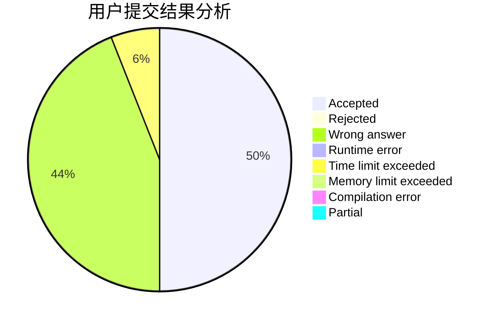
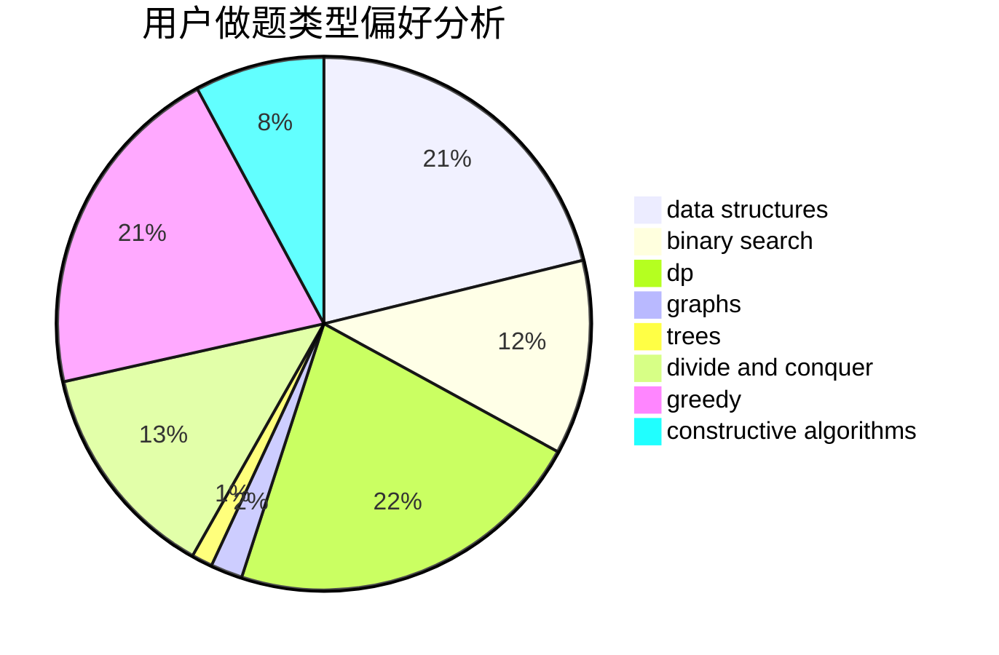
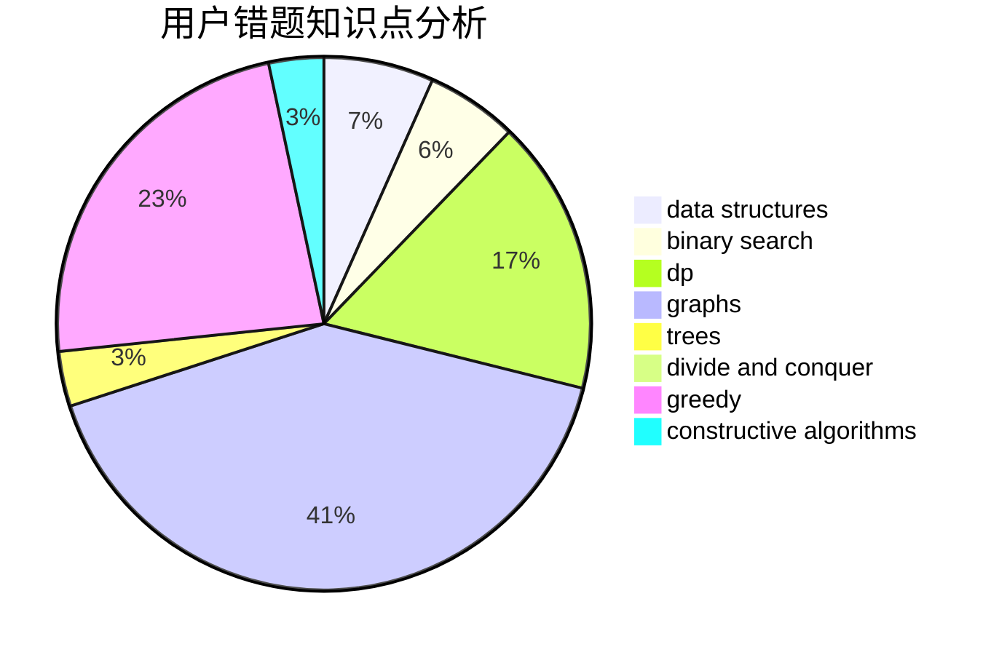

# DividedByZero

<!-- tabs:start -->

#### **用户提交结果分析**

#### **用户做题类型偏好分析**

#### **用户错题知识点分析**

<!-- tabs:end -->
# 推荐题目
[785D](https://codeforces.com/contest/785/problem/D)		combinatorics,
                        dp,
                        math,
                        number theory		  
[1431D](https://codeforces.com/contest/1431/problem/D)		*special problem,
                        greedy		  
[1363A](https://codeforces.com/contest/1363/problem/A)		brute force,
                        implementation,
                        math		  
[702A](https://codeforces.com/contest/702/problem/A)		dp,
                        greedy,
                        implementation		  
[785B](https://codeforces.com/contest/785/problem/B)		greedy,
                        sortings		  
[1505F](https://codeforces.com/contest/1505/problem/F)		math		  
[1203F2](https://codeforces.com/contest/1203F/problem/2)		dp,
                        greedy		  
[1291E](https://codeforces.com/contest/1291/problem/E)		dsu,graphs,sortings,trees		  
[337D](https://codeforces.com/contest/337/problem/D)		dfs and similar,
                        divide and conquer,
                        dp,
                        trees		  
[41D](https://codeforces.com/contest/41/problem/D)		dp		  
