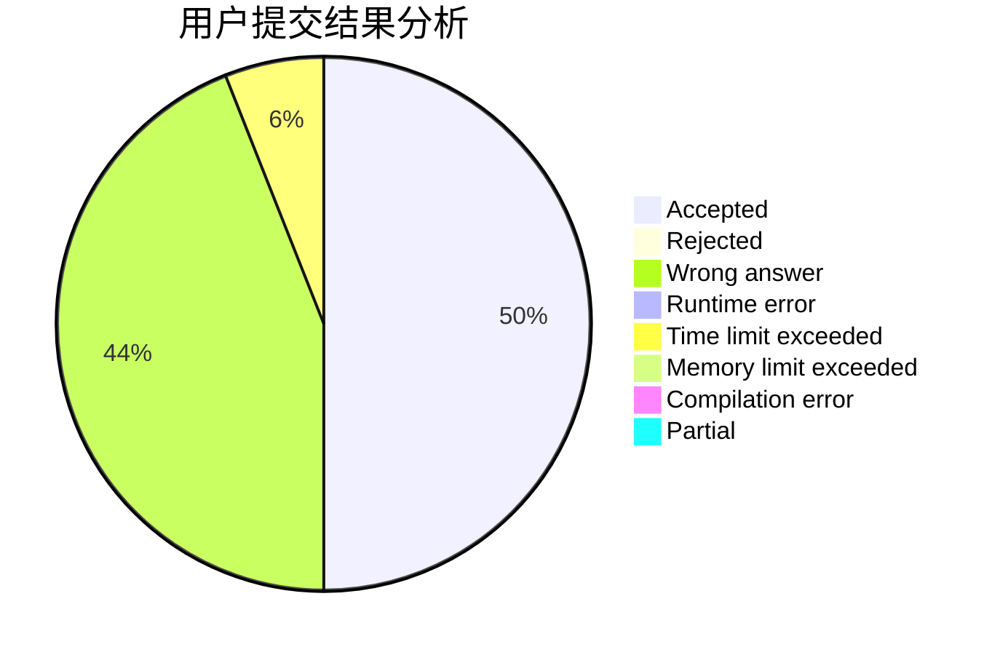
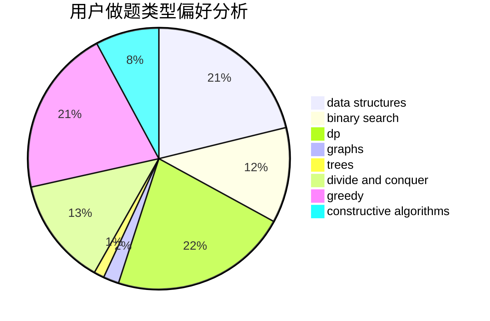
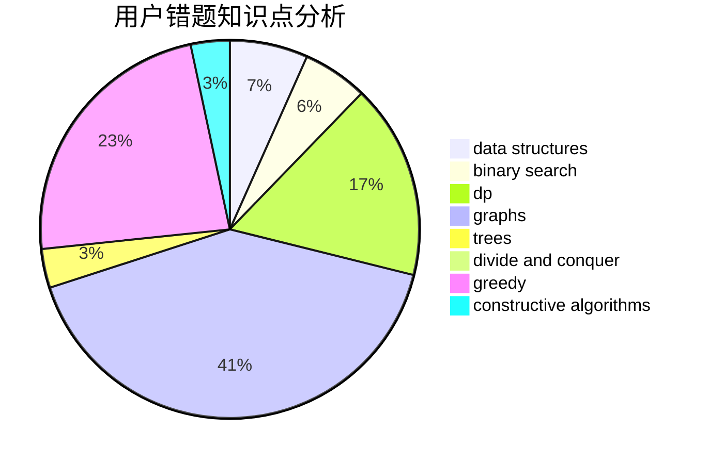

# DividedByZero
<!-- tabs:start -->
#### **用户提交结果分析**

#### **用户做题类型偏好分析**

#### **用户错题知识点分析**

<!-- tabs:end -->
# 推荐题目
[Special Permutation](http://codeforces.com/problemset/problem/1352/G)		constructive algorithms		  
[Pawn](http://codeforces.com/problemset/problem/41/D)		dp		  
[Odd Selection](http://codeforces.com/problemset/problem/1363/A)		brute force,
                        implementation,
                        math		  
[Complete the Projects (hard version)](http://codeforces.com/problemset/problem/1203/F2)		dp,
                        greedy		  
[Anton and Classes](http://codeforces.com/problemset/problem/785/B)		greedy,
                        sortings		  
[Anton and School - 2](http://codeforces.com/problemset/problem/785/D)		combinatorics,
                        dp,
                        math,
                        number theory		  
[Prefix Enlightenment](https://codeforces.com/contest/1291/problem/E)		dfs and similar,
                        dsu,
                        graphs		  
[Cakes for Clones](http://codeforces.com/problemset/problem/1415/F)		dp		  
[Tourism](http://codeforces.com/problemset/problem/1220/E)		dfs and similar,
                        dp,
                        dsu,
                        graphs,
                        greedy,
                        trees		  
[Set of Points](http://codeforces.com/problemset/problem/277/B)		constructive algorithms,
                        geometry		  
<!-- tabs:start -->
#### **data structures**
[Special Permutation](http://codeforces.com/problemset/problem/121/E)		data structures		  
[Pawn](http://codeforces.com/problemset/problem/601/B)		data structures,
                        math		  
[Odd Selection](http://codeforces.com/problemset/problem/1403/A)		*special problem,
                        2-sat,
                        binary search,
                        data structures,
                        graphs,
                        interactive,
                        sortings,
                        two pointers		  
[Complete the Projects (hard version)](http://codeforces.com/problemset/problem/323/C)		data structures		  
[Anton and Classes](http://codeforces.com/problemset/problem/1492/C)		binary search,
                        data structures,
                        dp,
                        greedy,
                        two pointers		  
[Anton and School - 2](http://codeforces.com/problemset/problem/1490/G)		binary search,
                        data structures,
                        math		  
[Prefix Enlightenment](http://codeforces.com/problemset/problem/1479/D)		binary search,
                        bitmasks,
                        brute force,
                        data structures,
                        probabilities,
                        trees		  
[Cakes for Clones](http://codeforces.com/problemset/problem/1497/A)		brute force,
                        data structures,
                        greedy,
                        sortings		  
[Tourism](http://codeforces.com/problemset/problem/1491/C)		brute force,
                        data structures,
                        dp,
                        greedy,
                        implementation		  
[Set of Points](http://codeforces.com/problemset/problem/1492/B)		data structures,
                        greedy,
                        math		  
#### **binary search**
[Special Permutation](http://codeforces.com/problemset/problem/785/C)		binary search,
                        math		  
[Pawn](http://codeforces.com/problemset/problem/1403/A)		*special problem,
                        2-sat,
                        binary search,
                        data structures,
                        graphs,
                        interactive,
                        sortings,
                        two pointers		  
[Odd Selection](http://codeforces.com/problemset/problem/274/A)		binary search,
                        greedy,
                        sortings		  
[Complete the Projects (hard version)](http://codeforces.com/problemset/problem/1409/E)		binary search,
                        dp,
                        sortings,
                        two pointers		  
[Anton and Classes](http://codeforces.com/problemset/problem/1492/C)		binary search,
                        data structures,
                        dp,
                        greedy,
                        two pointers		  
[Anton and School - 2](http://codeforces.com/problemset/problem/1463/D)		binary search,
                        constructive algorithms,
                        greedy,
                        two pointers		  
[Prefix Enlightenment](http://codeforces.com/problemset/problem/1490/G)		binary search,
                        data structures,
                        math		  
[Cakes for Clones](http://codeforces.com/problemset/problem/1479/D)		binary search,
                        bitmasks,
                        brute force,
                        data structures,
                        probabilities,
                        trees		  
[Tourism](http://codeforces.com/problemset/problem/1436/E)		binary search,
                        data structures,
                        two pointers		  
[Set of Points](http://codeforces.com/problemset/problem/1461/D)		binary search,
                        brute force,
                        data structures,
                        divide and conquer,
                        implementation,
                        sortings		  
#### **dp**
[Special Permutation](http://codeforces.com/problemset/problem/41/D)		dp		  
[Pawn](http://codeforces.com/problemset/problem/1203/F2)		dp,
                        greedy		  
[Odd Selection](http://codeforces.com/problemset/problem/785/D)		combinatorics,
                        dp,
                        math,
                        number theory		  
[Complete the Projects (hard version)](http://codeforces.com/problemset/problem/1415/F)		dp		  
[Anton and Classes](http://codeforces.com/problemset/problem/1220/E)		dfs and similar,
                        dp,
                        dsu,
                        graphs,
                        greedy,
                        trees		  
[Anton and School - 2](http://codeforces.com/problemset/problem/1154/F)		dp,
                        greedy,
                        sortings		  
[Prefix Enlightenment](http://codeforces.com/problemset/problem/180/C)		dp		  
[Cakes for Clones](https://codeforces.com/contest/1113/problem/C)		dp,
                        implementation		  
[Tourism](http://codeforces.com/problemset/problem/28/C)		combinatorics,
                        dp,
                        probabilities		  
[Set of Points](http://codeforces.com/problemset/problem/702/A)		dp,
                        greedy,
                        implementation		  
#### **graph**
[Special Permutation](https://codeforces.com/contest/1291/problem/E)		dfs and similar,
                        dsu,
                        graphs		  
[Pawn](http://codeforces.com/problemset/problem/1220/E)		dfs and similar,
                        dp,
                        dsu,
                        graphs,
                        greedy,
                        trees		  
[Odd Selection](http://codeforces.com/problemset/problem/1403/A)		*special problem,
                        2-sat,
                        binary search,
                        data structures,
                        graphs,
                        interactive,
                        sortings,
                        two pointers		  
[Complete the Projects (hard version)](http://codeforces.com/problemset/problem/601/A)		graphs,
                        shortest paths		  
[Anton and Classes](http://codeforces.com/problemset/problem/1487/C)		brute force,
                        constructive algorithms,
                        dfs and similar,
                        graphs,
                        greedy,
                        implementation,
                        math		  
[Anton and School - 2](http://codeforces.com/problemset/problem/1437/C)		dp,
                        flows,
                        graph matchings,
                        greedy,
                        math,
                        sortings		  
[Prefix Enlightenment](http://codeforces.com/problemset/problem/1470/D)		constructive algorithms,
                        dfs and similar,
                        graph matchings,
                        graphs,
                        greedy		  
[Cakes for Clones](http://codeforces.com/problemset/problem/1476/C)		dp,
                        graphs,
                        greedy		  
[Tourism](http://codeforces.com/problemset/problem/1304/D)		constructive algorithms,
                        graphs,
                        greedy,
                        two pointers		  
[Set of Points](http://codeforces.com/problemset/problem/1475/C)		combinatorics,
                        graphs,
                        math		  
#### **trees**
[Special Permutation](http://codeforces.com/problemset/problem/1220/E)		dfs and similar,
                        dp,
                        dsu,
                        graphs,
                        greedy,
                        trees		  
[Pawn](http://codeforces.com/problemset/problem/337/D)		dfs and similar,
                        divide and conquer,
                        dp,
                        trees		  
[Odd Selection](http://codeforces.com/problemset/problem/1479/D)		binary search,
                        bitmasks,
                        brute force,
                        data structures,
                        probabilities,
                        trees		  
[Complete the Projects (hard version)](http://codeforces.com/problemset/problem/1511/C)		brute force,
                        data structures,
                        implementation,
                        trees		  
[Anton and Classes](http://codeforces.com/problemset/problem/1499/F)		combinatorics,
                        dfs and similar,
                        dp,
                        trees		  
[Anton and School - 2](http://codeforces.com/problemset/problem/1491/E)		brute force,
                        dfs and similar,
                        divide and conquer,
                        number theory,
                        trees		  
[Prefix Enlightenment](http://codeforces.com/problemset/problem/1466/D)		data structures,
                        greedy,
                        sortings,
                        trees		  
[Cakes for Clones](http://codeforces.com/problemset/problem/1495/D)		combinatorics,
                        dfs and similar,
                        graphs,
                        math,
                        shortest paths,
                        trees		  
[Tourism](http://codeforces.com/problemset/problem/1303/G)		data structures,
                        divide and conquer,
                        geometry,
                        trees		  
[Set of Points](http://codeforces.com/problemset/problem/1454/E)		combinatorics,
                        dfs and similar,
                        graphs,
                        trees		  
#### **divide and conquer**
[Special Permutation](http://codeforces.com/problemset/problem/337/D)		dfs and similar,
                        divide and conquer,
                        dp,
                        trees		  
[Pawn](http://codeforces.com/problemset/problem/1461/D)		binary search,
                        brute force,
                        data structures,
                        divide and conquer,
                        implementation,
                        sortings		  
[Odd Selection](http://codeforces.com/problemset/problem/1466/G)		combinatorics,
                        divide and conquer,
                        hashing,
                        math,
                        string suffix structures,
                        strings		  
[Complete the Projects (hard version)](http://codeforces.com/problemset/problem/1490/D)		dfs and similar,
                        divide and conquer,
                        implementation		  
[Anton and Classes](https://codeforces.com/contest/1483/problem/C)		data structures,
                        divide and conquer,
                        dp		  
[Anton and School - 2](http://codeforces.com/problemset/problem/1491/E)		brute force,
                        dfs and similar,
                        divide and conquer,
                        number theory,
                        trees		  
[Prefix Enlightenment](http://codeforces.com/problemset/problem/1303/G)		data structures,
                        divide and conquer,
                        geometry,
                        trees		  
[Cakes for Clones](http://codeforces.com/problemset/problem/1494/D)		constructive algorithms,
                        data structures,
                        dfs and similar,
                        divide and conquer,
                        dsu,
                        greedy,
                        sortings,
                        trees		  
[Tourism](http://codeforces.com/problemset/problem/1482/E)		data structures,
                        divide and conquer,
                        dp		  
[Set of Points](http://codeforces.com/problemset/problem/566/C)		dfs and similar,
                        divide and conquer,
                        trees		  
#### **greedy**
[Special Permutation](http://codeforces.com/problemset/problem/1203/F2)		dp,
                        greedy		  
[Pawn](http://codeforces.com/problemset/problem/785/B)		greedy,
                        sortings		  
[Odd Selection](http://codeforces.com/problemset/problem/1220/E)		dfs and similar,
                        dp,
                        dsu,
                        graphs,
                        greedy,
                        trees		  
[Complete the Projects (hard version)](http://codeforces.com/problemset/problem/1154/F)		dp,
                        greedy,
                        sortings		  
[Anton and Classes](http://codeforces.com/problemset/problem/1157/C1)		greedy		  
[Anton and School - 2](http://codeforces.com/problemset/problem/1431/D)		*special problem,
                        greedy		  
[Prefix Enlightenment](http://codeforces.com/problemset/problem/732/E)		greedy,
                        sortings		  
[Cakes for Clones](http://codeforces.com/problemset/problem/274/A)		binary search,
                        greedy,
                        sortings		  
[Tourism](http://codeforces.com/problemset/problem/476/D)		constructive algorithms,
                        greedy,
                        math		  
[Set of Points](http://codeforces.com/problemset/problem/702/A)		dp,
                        greedy,
                        implementation		  
#### **constructive algorithms**
[Special Permutation](http://codeforces.com/problemset/problem/1352/G)		constructive algorithms		  
[Pawn](http://codeforces.com/problemset/problem/277/B)		constructive algorithms,
                        geometry		  
[Odd Selection](http://codeforces.com/problemset/problem/476/D)		constructive algorithms,
                        greedy,
                        math		  
[Complete the Projects (hard version)](http://codeforces.com/problemset/problem/1355/D)		constructive algorithms,
                        math		  
[Anton and Classes](http://codeforces.com/problemset/problem/735/C)		combinatorics,
                        constructive algorithms,
                        greedy,
                        math		  
[Anton and School - 2](http://codeforces.com/problemset/problem/1153/B)		constructive algorithms,
                        greedy		  
[Prefix Enlightenment](http://codeforces.com/problemset/problem/1493/A)		constructive algorithms,
                        greedy		  
[Cakes for Clones](http://codeforces.com/problemset/problem/1463/D)		binary search,
                        constructive algorithms,
                        greedy,
                        two pointers		  
[Tourism](https://codeforces.com/contest/1456/problem/B)		bitmasks,
                        brute force,
                        constructive algorithms		  
[Set of Points](http://codeforces.com/problemset/problem/1492/D)		bitmasks,
                        constructive algorithms,
                        greedy,
                        math		  
#### **sortings**
[Special Permutation](http://codeforces.com/problemset/problem/785/B)		greedy,
                        sortings		  
[Pawn](http://codeforces.com/problemset/problem/1154/F)		dp,
                        greedy,
                        sortings		  
[Odd Selection](http://codeforces.com/problemset/problem/1403/A)		*special problem,
                        2-sat,
                        binary search,
                        data structures,
                        graphs,
                        interactive,
                        sortings,
                        two pointers		  
[Complete the Projects (hard version)](http://codeforces.com/problemset/problem/732/E)		greedy,
                        sortings		  
[Anton and Classes](http://codeforces.com/problemset/problem/274/A)		binary search,
                        greedy,
                        sortings		  
[Anton and School - 2](http://codeforces.com/problemset/problem/1304/C)		dp,
                        greedy,
                        implementation,
                        sortings,
                        two pointers		  
[Prefix Enlightenment](http://codeforces.com/problemset/problem/1409/E)		binary search,
                        dp,
                        sortings,
                        two pointers		  
[Cakes for Clones](https://codeforces.com/contest/1496/problem/C)		geometry,
                        greedy,
                        math,
                        sortings		  
[Tourism](http://codeforces.com/problemset/problem/1495/A)		geometry,
                        greedy,
                        math,
                        sortings		  
[Set of Points](http://codeforces.com/problemset/problem/1497/A)		brute force,
                        data structures,
                        greedy,
                        sortings		  
<!-- tabs:end -->
