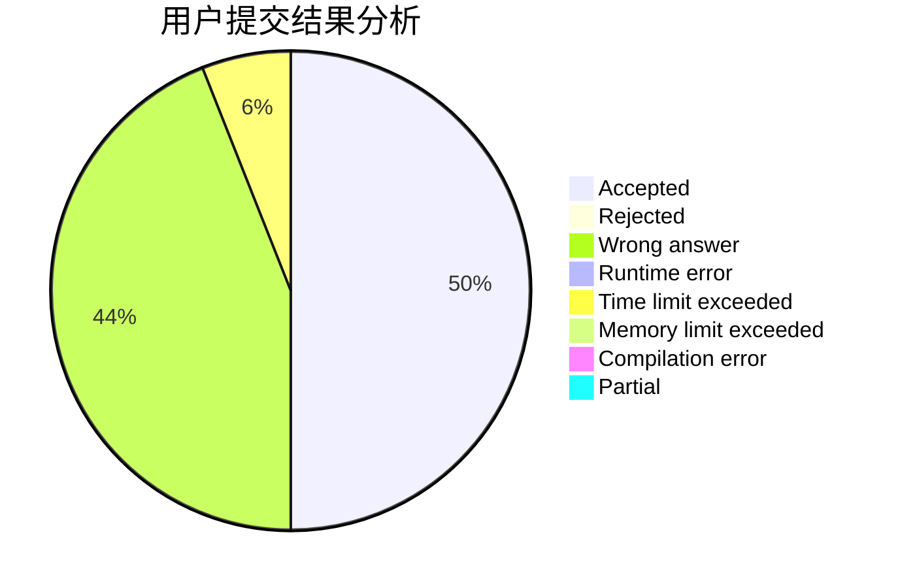
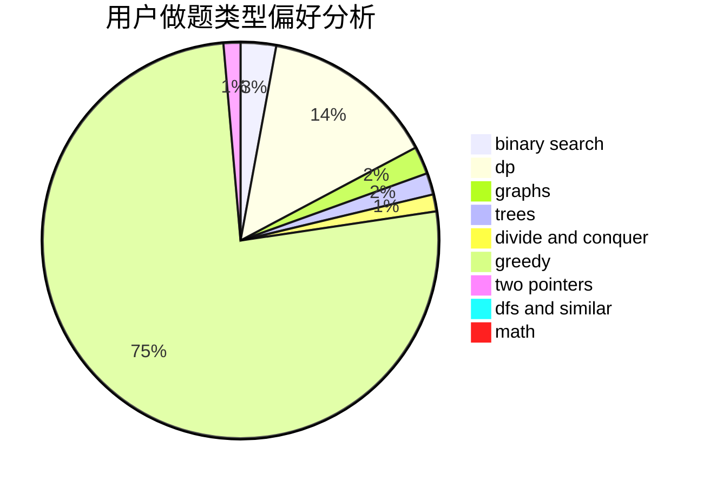

# DividedByZero

<!-- tabs:start -->

#### **用户提交结果分析**

#### **用户做题类型偏好分析**

<!-- tabs:end -->
# 推荐题目
[802I](https://codeforces.com/contest/802/problem/I)
[1440B](https://codeforces.com/contest/1440/problem/B)
[13702](https://codeforces.com/contest/1370/problem/2)
[720D](https://codeforces.com/contest/720/problem/D)
[802G](https://codeforces.com/contest/802/problem/G)
[155A](https://codeforces.com/contest/155/problem/A)
[1208E](https://codeforces.com/contest/1208/problem/E)
[1298D](https://codeforces.com/contest/1298/problem/D)
[364B](https://codeforces.com/contest/364/problem/B)
[445B](https://codeforces.com/contest/445/problem/B)
