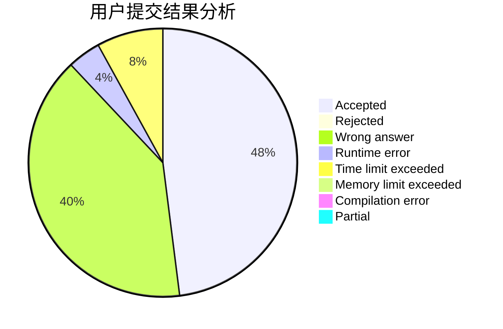
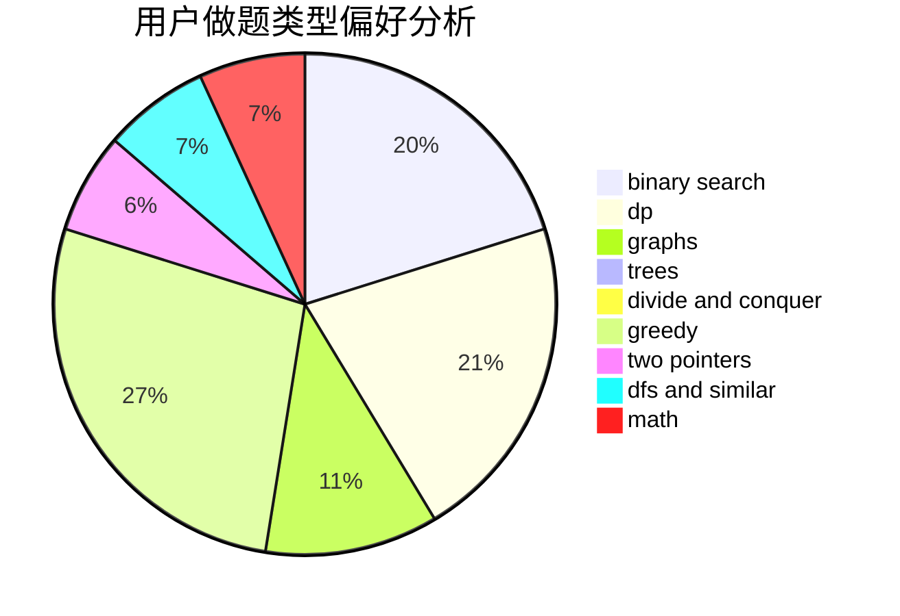

# Dix

<!-- tabs:start -->

#### **用户提交结果分析**

#### **用户做题类型偏好分析**

<!-- tabs:end -->
# 推荐题目
[1284C](https://codeforces.com/contest/1284/problem/C)
[1468G](https://codeforces.com/contest/1468/problem/G)
[802J](https://codeforces.com/contest/802/problem/J)
[1028B](https://codeforces.com/contest/1028/problem/B)
[448D](https://codeforces.com/contest/448/problem/D)
[30E](https://codeforces.com/contest/30/problem/E)
[216D](https://codeforces.com/contest/216/problem/D)
[1362E](https://codeforces.com/contest/1362/problem/E)
[652D](https://codeforces.com/contest/652/problem/D)
[768E](https://codeforces.com/contest/768/problem/E)
