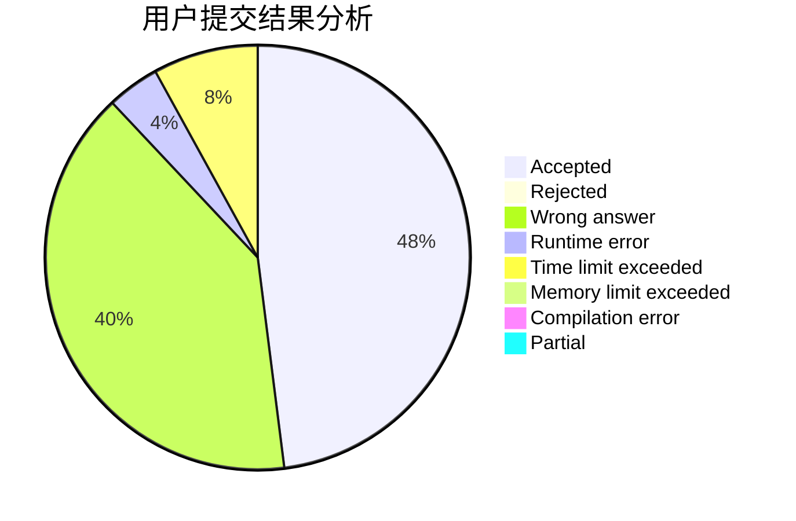
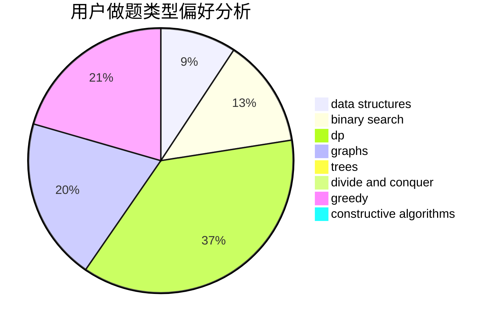

# Dix

<!-- tabs:start -->

#### **用户提交结果分析**

#### **用户做题类型偏好分析**

#### **用户错题知识点分析**

<!-- tabs:end -->
# 推荐题目
[1284C](https://codeforces.com/contest/1284/problem/C)		combinatorics,
                        math		  
[1468G](https://codeforces.com/contest/1468/problem/G)		binary search,
                        geometry		  
[802J](https://codeforces.com/contest/802/problem/J)		dfs and similar,
                        graphs,
                        trees		  
[1028B](https://codeforces.com/contest/1028/problem/B)		constructive algorithms,
                        math		  
[448D](https://codeforces.com/contest/448/problem/D)		binary search,
                        brute force		  
[30E](https://codeforces.com/contest/30/problem/E)		binary search,
                        constructive algorithms,
                        data structures,
                        greedy,
                        hashing,
                        strings		  
[216D](https://codeforces.com/contest/216/problem/D)		binary search,
                        sortings,
                        two pointers		  
[1362E](https://codeforces.com/contest/1362/problem/E)		dsu,graphs,sortings,trees		  
[652D](https://codeforces.com/contest/652/problem/D)		data structures,
                        sortings		  
[768E](https://codeforces.com/contest/768/problem/E)		bitmasks,
                        dp,
                        games		  
