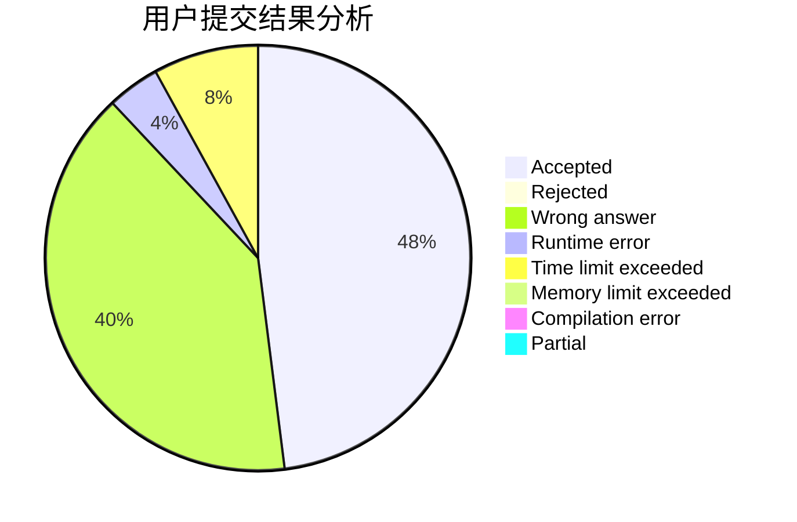
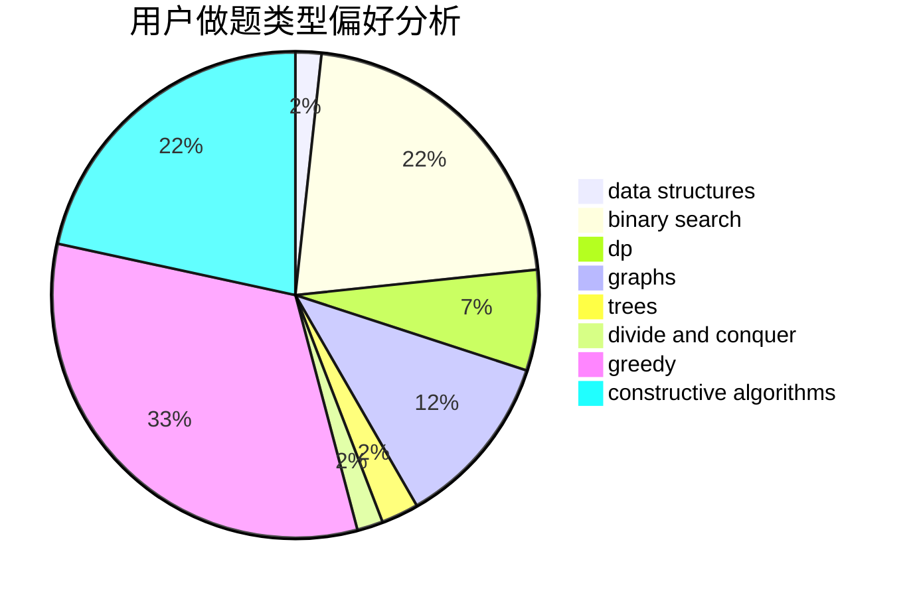

# Dix

<!-- tabs:start -->

#### **用户提交结果分析**

#### **用户做题类型偏好分析**

#### **用户错题知识点分析**

<!-- tabs:end -->
# 推荐题目
[1278A](https://codeforces.com/contest/1278/problem/A)		brute force,
                        implementation,
                        strings		  
[145A](https://codeforces.com/contest/145/problem/A)		greedy,
                        implementation		  
[785E](https://codeforces.com/contest/785/problem/E)		brute force,
                        data structures		  
[1027F](https://codeforces.com/contest/1027/problem/F)		binary search,
                        dfs and similar,
                        dsu,
                        graph matchings,
                        graphs		  
[425B](https://codeforces.com/contest/425/problem/B)		bitmasks,
                        greedy		  
[294C](https://codeforces.com/contest/294/problem/C)		combinatorics,
                        number theory		  
[193C](https://codeforces.com/contest/193/problem/C)		constructive algorithms,
                        greedy,
                        math,
                        matrices		  
[1355F](https://codeforces.com/contest/1355/problem/F)		constructive algorithms,
                        interactive,
                        number theory		  
[625E](https://codeforces.com/contest/625/problem/E)		data structures,
                        greedy		  
[749E](https://codeforces.com/contest/749/problem/E)		data structures,
                        probabilities		  
