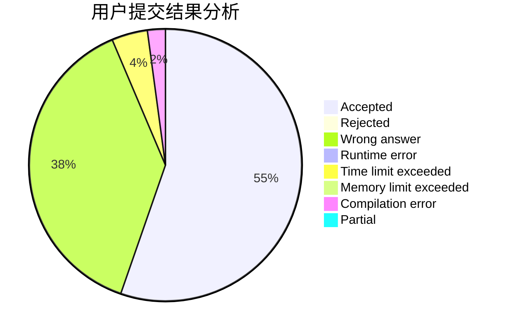
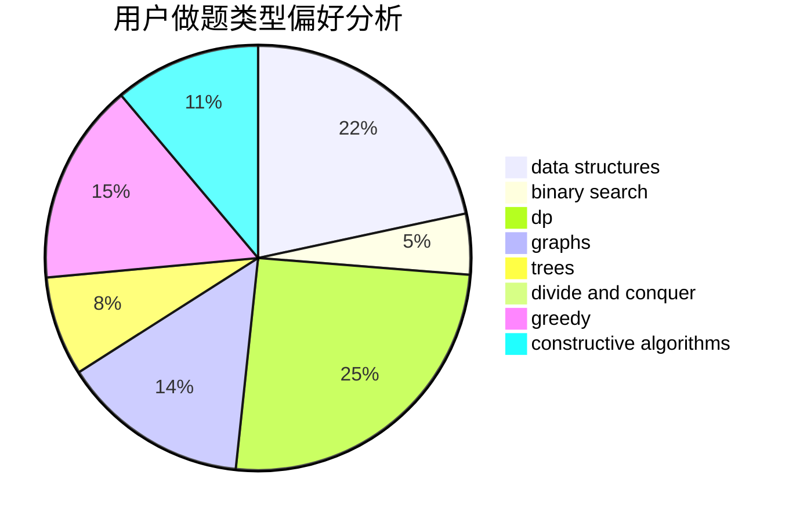
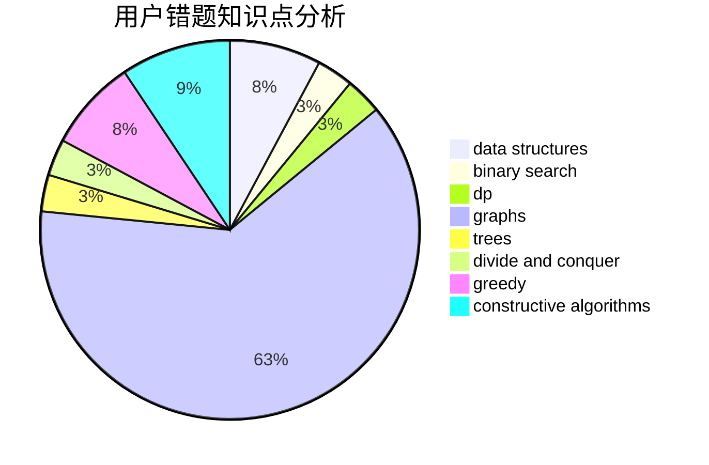

# DntcryBecthlev

<!-- tabs:start -->

#### **用户提交结果分析**

#### **用户做题类型偏好分析**

#### **用户错题知识点分析**

<!-- tabs:end -->
# 推荐题目
[1464A](https://codeforces.com/contest/1464/problem/A)		dsu,graphs,sortings,trees		  
[412D](https://codeforces.com/contest/412/problem/D)		dfs and similar		  
[1141D](https://codeforces.com/contest/1141/problem/D)		greedy,
                        implementation		  
[425C](https://codeforces.com/contest/425/problem/C)		data structures,
                        dp		  
[1290F](https://codeforces.com/contest/1290/problem/F)		dp		  
[1295F](https://codeforces.com/contest/1295/problem/F)		combinatorics,
                        dp,
                        probabilities		  
[1324C](https://codeforces.com/contest/1324/problem/C)		binary search,
                        data structures,
                        dfs and similar,
                        greedy,
                        implementation		  
[1211B](https://codeforces.com/contest/1211/problem/B)		*special problem,
                        implementation		  
[1311A](https://codeforces.com/contest/1311/problem/A)		greedy,
                        implementation,
                        math		  
[1011E](https://codeforces.com/contest/1011/problem/E)		dsu,graphs,sortings,trees		  
