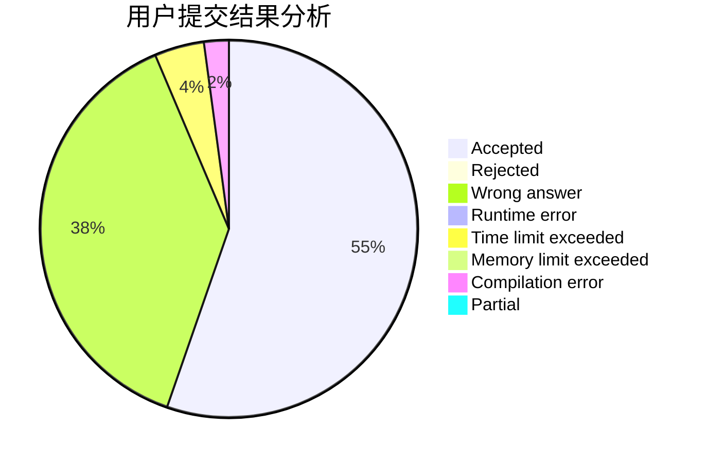
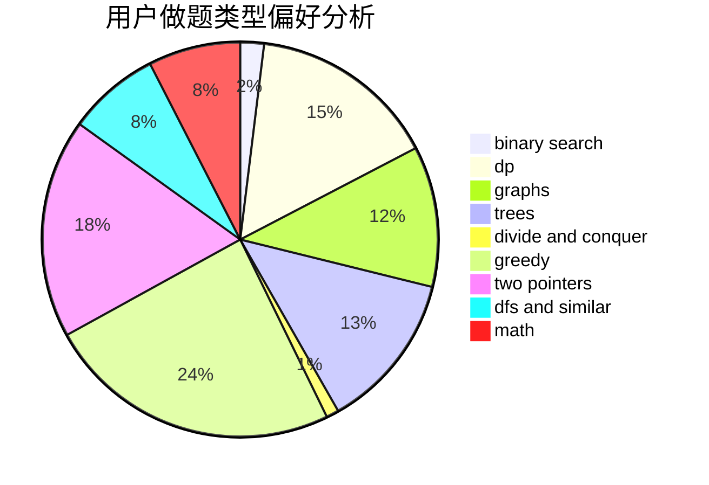

# DntcryBecthlev

<!-- tabs:start -->

#### **用户提交结果分析**

#### **用户做题类型偏好分析**

<!-- tabs:end -->
# 推荐题目
[1464A](https://codeforces.com/contest/1464/problem/A)
[412D](https://codeforces.com/contest/412/problem/D)
[1141D](https://codeforces.com/contest/1141/problem/D)
[425C](https://codeforces.com/contest/425/problem/C)
[1290F](https://codeforces.com/contest/1290/problem/F)
[1295F](https://codeforces.com/contest/1295/problem/F)
[1324C](https://codeforces.com/contest/1324/problem/C)
[1211B](https://codeforces.com/contest/1211/problem/B)
[1311A](https://codeforces.com/contest/1311/problem/A)
[1011E](https://codeforces.com/contest/1011/problem/E)
