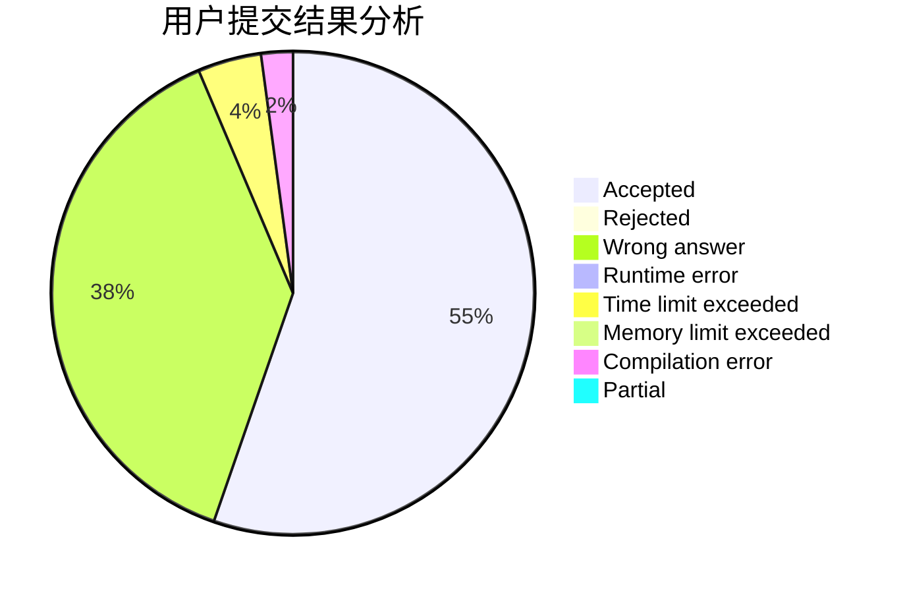
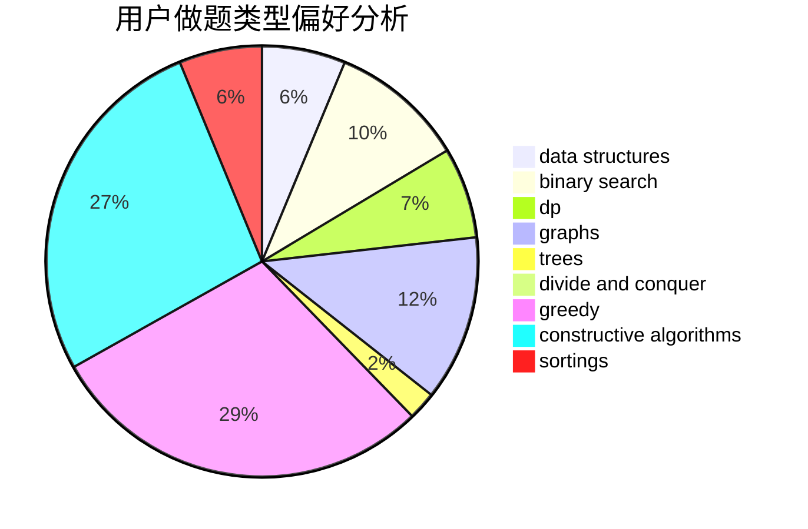
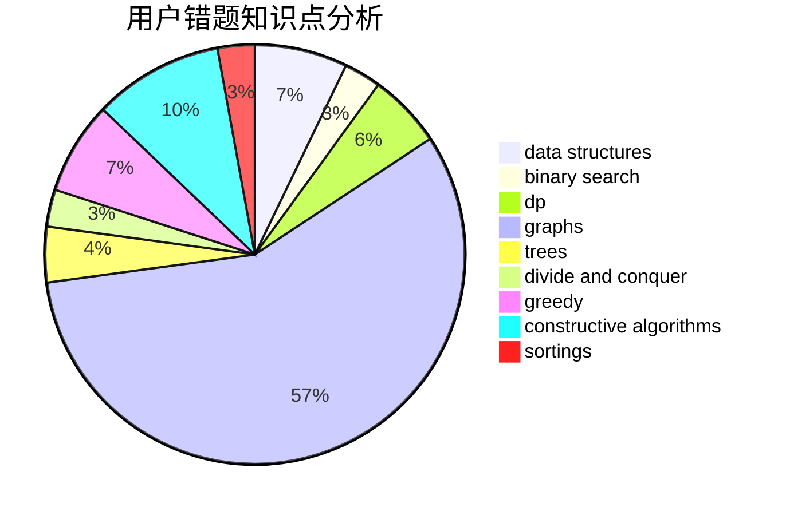

# DntcryBecthlev
<!-- tabs:start -->
#### **用户提交结果分析**

#### **用户做题类型偏好分析**

#### **用户错题知识点分析**

<!-- tabs:end -->
# 推荐题目
[538H](http://codeforces.com/problemset/problem/538/H)		2-sat,
                        data structures,
                        dfs and similar,
                        greedy		  
[1454D](http://codeforces.com/problemset/problem/1454/D)		constructive algorithms,
                        math,
                        number theory		  
[343D](http://codeforces.com/problemset/problem/343/D)		data structures,
                        dfs and similar,
                        graphs,
                        trees		  
[380E](http://codeforces.com/problemset/problem/380/E)		data structures		  
[516C](https://codeforces.com/contest/516/problem/C)		data structures		  
[39B](http://codeforces.com/problemset/problem/39/B)		greedy		  
[1396C](http://codeforces.com/problemset/problem/1396/C)		dp,
                        greedy,
                        implementation		  
[1476G](http://codeforces.com/problemset/problem/1476/G)		data structures,
                        hashing,
                        sortings,
                        two pointers		  
[735A](http://codeforces.com/problemset/problem/735/A)		implementation,
                        strings		  
[113D](http://codeforces.com/problemset/problem/113/D)		math,
                        matrices,
                        probabilities		  
<!-- tabs:start -->
#### **data structures**
[538H](http://codeforces.com/problemset/problem/538/H)		2-sat,
                        data structures,
                        dfs and similar,
                        greedy		  
[343D](http://codeforces.com/problemset/problem/343/D)		data structures,
                        dfs and similar,
                        graphs,
                        trees		  
[380E](http://codeforces.com/problemset/problem/380/E)		data structures		  
[516C](https://codeforces.com/contest/516/problem/C)		data structures		  
[1476G](http://codeforces.com/problemset/problem/1476/G)		data structures,
                        hashing,
                        sortings,
                        two pointers		  
[455D](http://codeforces.com/problemset/problem/455/D)		data structures		  
[1386C](http://codeforces.com/problemset/problem/1386/C)		*special problem,
                        bitmasks,
                        data structures,
                        divide and conquer,
                        dsu		  
[786B](http://codeforces.com/problemset/problem/786/B)		data structures,
                        graphs,
                        shortest paths		  
[1492C](http://codeforces.com/problemset/problem/1492/C)		binary search,
                        data structures,
                        dp,
                        greedy,
                        two pointers		  
[1490G](http://codeforces.com/problemset/problem/1490/G)		binary search,
                        data structures,
                        math		  
#### **binary search**
[1288D](http://codeforces.com/problemset/problem/1288/D)		binary search,
                        bitmasks,
                        dp		  
[1011B](http://codeforces.com/problemset/problem/1011/B)		binary search,
                        brute force,
                        implementation		  
[1423B](http://codeforces.com/problemset/problem/1423/B)		binary search,
                        flows,
                        graph matchings,
                        graphs		  
[1486B](http://codeforces.com/problemset/problem/1486/B)		binary search,
                        geometry,
                        shortest paths,
                        sortings		  
[1492C](http://codeforces.com/problemset/problem/1492/C)		binary search,
                        data structures,
                        dp,
                        greedy,
                        two pointers		  
[1463D](http://codeforces.com/problemset/problem/1463/D)		binary search,
                        constructive algorithms,
                        greedy,
                        two pointers		  
[1490G](http://codeforces.com/problemset/problem/1490/G)		binary search,
                        data structures,
                        math		  
[1479D](http://codeforces.com/problemset/problem/1479/D)		binary search,
                        bitmasks,
                        brute force,
                        data structures,
                        probabilities,
                        trees		  
[1436E](http://codeforces.com/problemset/problem/1436/E)		binary search,
                        data structures,
                        two pointers		  
[1461D](http://codeforces.com/problemset/problem/1461/D)		binary search,
                        brute force,
                        data structures,
                        divide and conquer,
                        implementation,
                        sortings		  
#### **dp**
[1396C](http://codeforces.com/problemset/problem/1396/C)		dp,
                        greedy,
                        implementation		  
[1288D](http://codeforces.com/problemset/problem/1288/D)		binary search,
                        bitmasks,
                        dp		  
[1314D](https://codeforces.com/contest/1314/problem/D)		dp,
                        graphs,
                        probabilities		  
[786A](http://codeforces.com/problemset/problem/786/A)		dfs and similar,
                        dp,
                        games		  
[671A](http://codeforces.com/problemset/problem/671/A)		dp,
                        geometry,
                        greedy,
                        implementation		  
[261B](http://codeforces.com/problemset/problem/261/B)		dp,
                        math,
                        probabilities		  
[106C](http://codeforces.com/problemset/problem/106/C)		dp		  
[1033C](http://codeforces.com/problemset/problem/1033/C)		brute force,
                        dp,
                        games		  
[1000D](http://codeforces.com/problemset/problem/1000/D)		combinatorics,
                        dp		  
[1227F1](http://codeforces.com/problemset/problem/1227/F1)		dp		  
#### **graph**
[343D](http://codeforces.com/problemset/problem/343/D)		data structures,
                        dfs and similar,
                        graphs,
                        trees		  
[370A](http://codeforces.com/problemset/problem/370/A)		graphs,
                        math,
                        shortest paths		  
[1314D](https://codeforces.com/contest/1314/problem/D)		dp,
                        graphs,
                        probabilities		  
[1301D](http://codeforces.com/problemset/problem/1301/D)		constructive algorithms,
                        graphs,
                        implementation		  
[786B](http://codeforces.com/problemset/problem/786/B)		data structures,
                        graphs,
                        shortest paths		  
[1423B](http://codeforces.com/problemset/problem/1423/B)		binary search,
                        flows,
                        graph matchings,
                        graphs		  
[1487C](http://codeforces.com/problemset/problem/1487/C)		brute force,
                        constructive algorithms,
                        dfs and similar,
                        graphs,
                        greedy,
                        implementation,
                        math		  
[1437C](http://codeforces.com/problemset/problem/1437/C)		dp,
                        flows,
                        graph matchings,
                        greedy,
                        math,
                        sortings		  
[1470D](http://codeforces.com/problemset/problem/1470/D)		constructive algorithms,
                        dfs and similar,
                        graph matchings,
                        graphs,
                        greedy		  
[1476C](http://codeforces.com/problemset/problem/1476/C)		dp,
                        graphs,
                        greedy		  
#### **trees**
[343D](http://codeforces.com/problemset/problem/343/D)		data structures,
                        dfs and similar,
                        graphs,
                        trees		  
[1361D](http://codeforces.com/problemset/problem/1361/D)		greedy,
                        implementation,
                        math,
                        trees		  
[1283F](http://codeforces.com/problemset/problem/1283/F)		constructive algorithms,
                        greedy,
                        trees		  
[1479D](http://codeforces.com/problemset/problem/1479/D)		binary search,
                        bitmasks,
                        brute force,
                        data structures,
                        probabilities,
                        trees		  
[1511C](http://codeforces.com/problemset/problem/1511/C)		brute force,
                        data structures,
                        implementation,
                        trees		  
[1499F](http://codeforces.com/problemset/problem/1499/F)		combinatorics,
                        dfs and similar,
                        dp,
                        trees		  
[1491E](http://codeforces.com/problemset/problem/1491/E)		brute force,
                        dfs and similar,
                        divide and conquer,
                        number theory,
                        trees		  
[1466D](http://codeforces.com/problemset/problem/1466/D)		data structures,
                        greedy,
                        sortings,
                        trees		  
[1495D](http://codeforces.com/problemset/problem/1495/D)		combinatorics,
                        dfs and similar,
                        graphs,
                        math,
                        shortest paths,
                        trees		  
[1303G](http://codeforces.com/problemset/problem/1303/G)		data structures,
                        divide and conquer,
                        geometry,
                        trees		  
#### **divide and conquer**
[1386C](http://codeforces.com/problemset/problem/1386/C)		*special problem,
                        bitmasks,
                        data structures,
                        divide and conquer,
                        dsu		  
[1461D](http://codeforces.com/problemset/problem/1461/D)		binary search,
                        brute force,
                        data structures,
                        divide and conquer,
                        implementation,
                        sortings		  
[1466G](http://codeforces.com/problemset/problem/1466/G)		combinatorics,
                        divide and conquer,
                        hashing,
                        math,
                        string suffix structures,
                        strings		  
[1490D](http://codeforces.com/problemset/problem/1490/D)		dfs and similar,
                        divide and conquer,
                        implementation		  
[1483C](https://codeforces.com/contest/1483/problem/C)		data structures,
                        divide and conquer,
                        dp		  
[1491E](http://codeforces.com/problemset/problem/1491/E)		brute force,
                        dfs and similar,
                        divide and conquer,
                        number theory,
                        trees		  
[1303G](http://codeforces.com/problemset/problem/1303/G)		data structures,
                        divide and conquer,
                        geometry,
                        trees		  
[1494D](http://codeforces.com/problemset/problem/1494/D)		constructive algorithms,
                        data structures,
                        dfs and similar,
                        divide and conquer,
                        dsu,
                        greedy,
                        sortings,
                        trees		  
[1482E](http://codeforces.com/problemset/problem/1482/E)		data structures,
                        divide and conquer,
                        dp		  
[566C](http://codeforces.com/problemset/problem/566/C)		dfs and similar,
                        divide and conquer,
                        trees		  
#### **greedy**
[538H](http://codeforces.com/problemset/problem/538/H)		2-sat,
                        data structures,
                        dfs and similar,
                        greedy		  
[39B](http://codeforces.com/problemset/problem/39/B)		greedy		  
[1396C](http://codeforces.com/problemset/problem/1396/C)		dp,
                        greedy,
                        implementation		  
[1361D](http://codeforces.com/problemset/problem/1361/D)		greedy,
                        implementation,
                        math,
                        trees		  
[1294C](http://codeforces.com/problemset/problem/1294/C)		greedy,
                        math,
                        number theory		  
[1360B](http://codeforces.com/problemset/problem/1360/B)		greedy,
                        sortings		  
[1411D](http://codeforces.com/problemset/problem/1411/D)		brute force,
                        greedy,
                        implementation,
                        strings		  
[671A](http://codeforces.com/problemset/problem/671/A)		dp,
                        geometry,
                        greedy,
                        implementation		  
[476D](http://codeforces.com/problemset/problem/476/D)		constructive algorithms,
                        greedy,
                        math		  
[1358B](http://codeforces.com/problemset/problem/1358/B)		greedy,
                        sortings		  
#### **constructive algorithms**
[1454D](http://codeforces.com/problemset/problem/1454/D)		constructive algorithms,
                        math,
                        number theory		  
[1301D](http://codeforces.com/problemset/problem/1301/D)		constructive algorithms,
                        graphs,
                        implementation		  
[638A](http://codeforces.com/problemset/problem/638/A)		*special problem,
                        constructive algorithms,
                        math		  
[476D](http://codeforces.com/problemset/problem/476/D)		constructive algorithms,
                        greedy,
                        math		  
[1283F](http://codeforces.com/problemset/problem/1283/F)		constructive algorithms,
                        greedy,
                        trees		  
[1207B](http://codeforces.com/problemset/problem/1207/B)		constructive algorithms,
                        greedy,
                        implementation		  
[1152B](http://codeforces.com/problemset/problem/1152/B)		bitmasks,
                        constructive algorithms,
                        dfs and similar,
                        math		  
[1428D](http://codeforces.com/problemset/problem/1428/D)		constructive algorithms,
                        greedy,
                        implementation		  
[1493A](http://codeforces.com/problemset/problem/1493/A)		constructive algorithms,
                        greedy		  
[1463D](http://codeforces.com/problemset/problem/1463/D)		binary search,
                        constructive algorithms,
                        greedy,
                        two pointers		  
#### **sortings**
[1476G](http://codeforces.com/problemset/problem/1476/G)		data structures,
                        hashing,
                        sortings,
                        two pointers		  
[1360B](http://codeforces.com/problemset/problem/1360/B)		greedy,
                        sortings		  
[1358B](http://codeforces.com/problemset/problem/1358/B)		greedy,
                        sortings		  
[1486B](http://codeforces.com/problemset/problem/1486/B)		binary search,
                        geometry,
                        shortest paths,
                        sortings		  
[1496C](https://codeforces.com/contest/1496/problem/C)		geometry,
                        greedy,
                        math,
                        sortings		  
[1495A](http://codeforces.com/problemset/problem/1495/A)		geometry,
                        greedy,
                        math,
                        sortings		  
[1497A](http://codeforces.com/problemset/problem/1497/A)		brute force,
                        data structures,
                        greedy,
                        sortings		  
[1427A](http://codeforces.com/problemset/problem/1427/A)		math,
                        sortings		  
[1461D](http://codeforces.com/problemset/problem/1461/D)		binary search,
                        brute force,
                        data structures,
                        divide and conquer,
                        implementation,
                        sortings		  
[1437C](http://codeforces.com/problemset/problem/1437/C)		dp,
                        flows,
                        graph matchings,
                        greedy,
                        math,
                        sortings		  
<!-- tabs:end -->
