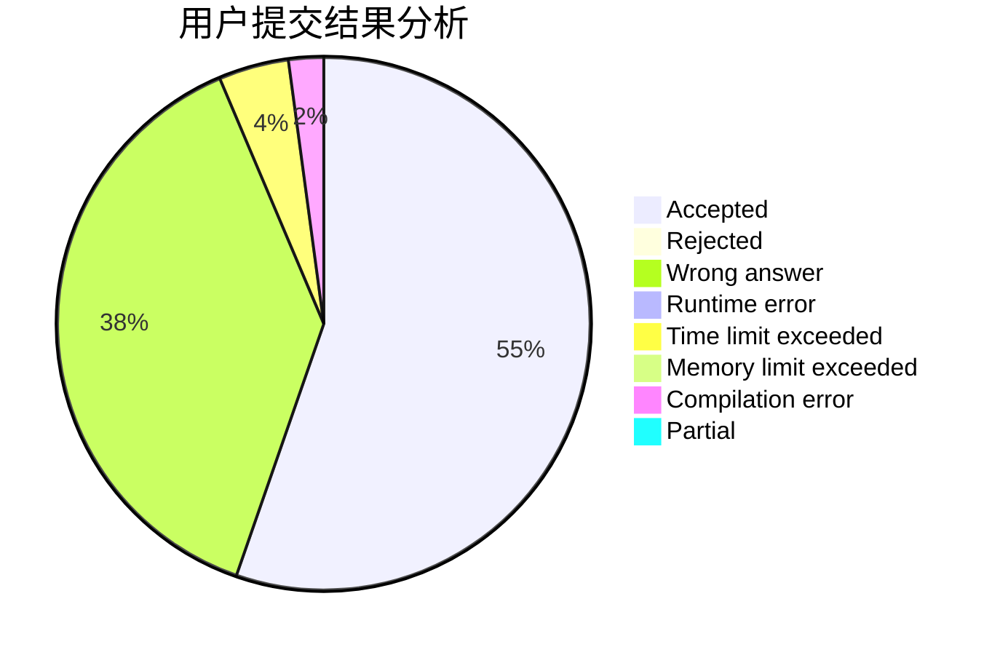
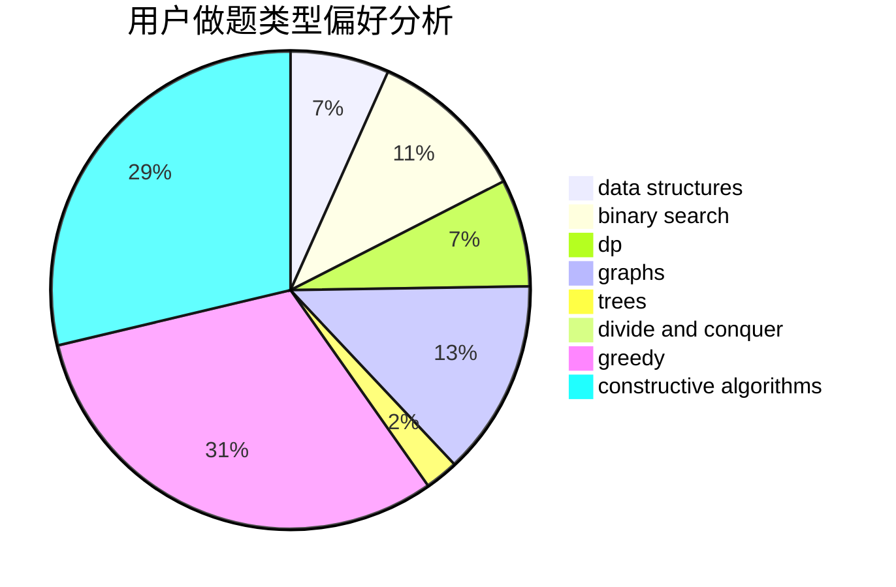
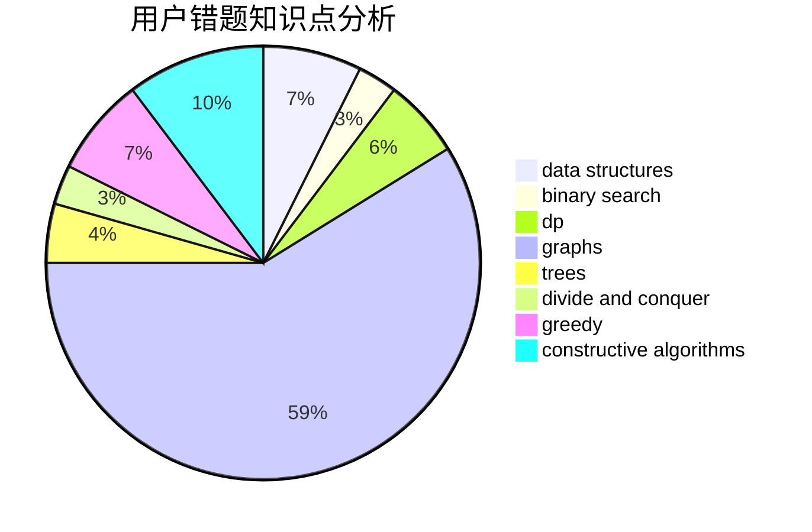

# DntcryBecthlev

<!-- tabs:start -->

#### **用户提交结果分析**

#### **用户做题类型偏好分析**

#### **用户错题知识点分析**

<!-- tabs:end -->
# 推荐题目
[1454D](https://codeforces.com/contest/1454/problem/D)		constructive algorithms,
                        math,
                        number theory		  
[380E](https://codeforces.com/contest/380/problem/E)		data structures		  
[113D](https://codeforces.com/contest/113/problem/D)		math,
                        matrices,
                        probabilities		  
[39B](https://codeforces.com/contest/39/problem/B)		greedy		  
[1283F](https://codeforces.com/contest/1283/problem/F)		constructive algorithms,
                        greedy,
                        trees		  
[1288D](https://codeforces.com/contest/1288/problem/D)		binary search,
                        bitmasks,
                        dp		  
[1314D](https://codeforces.com/contest/1314/problem/D)		dsu,graphs,sortings,trees		  
[1207B](https://codeforces.com/contest/1207/problem/B)		constructive algorithms,
                        greedy,
                        implementation		  
[1301D](https://codeforces.com/contest/1301/problem/D)		constructive algorithms,
                        graphs,
                        implementation		  
[1011B](https://codeforces.com/contest/1011/problem/B)		binary search,
                        brute force,
                        implementation		  
