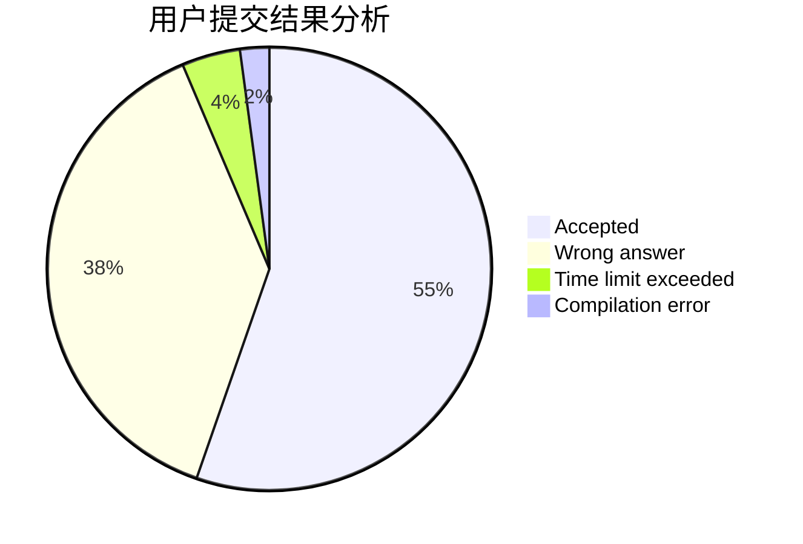
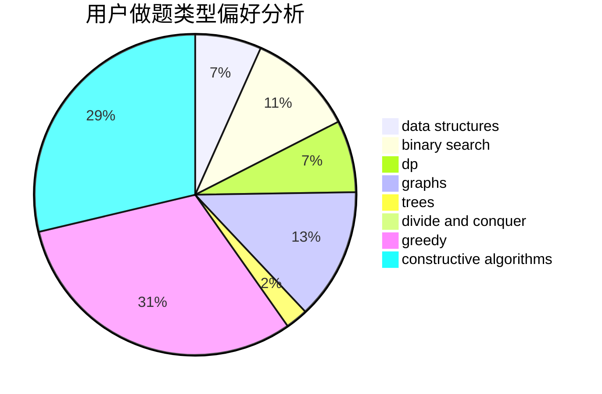
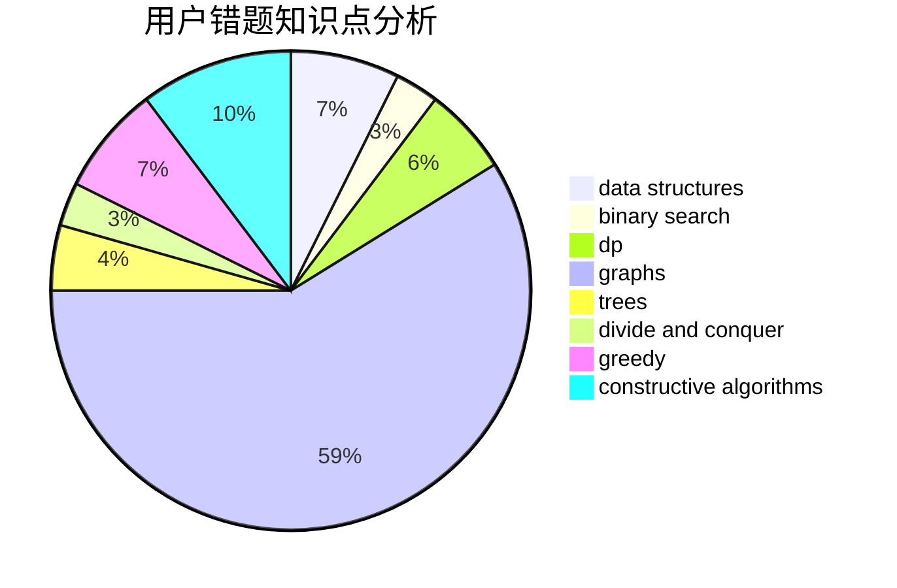

# DntcryBecthlev
<!-- tabs:start -->
#### **用户提交结果分析**

#### **用户做题类型偏好分析**

#### **用户错题知识点分析**

<!-- tabs:end -->
# 推荐题目
[Summer Dichotomy](http://codeforces.com/problemset/problem/538/H)		2-sat,
                        data structures,
                        dfs and similar,
                        greedy		  
[Number into Sequence](http://codeforces.com/problemset/problem/1454/D)		constructive algorithms,
                        math,
                        number theory		  
[Water Tree](http://codeforces.com/problemset/problem/343/D)		data structures,
                        dfs and similar,
                        graphs,
                        trees		  
[Sereja and Dividing](http://codeforces.com/problemset/problem/380/E)		data structures		  
[Drazil and Park](https://codeforces.com/contest/516/problem/C)		data structures		  
[Company Income Growth](http://codeforces.com/problemset/problem/39/B)		greedy		  
[Monster Invaders](http://codeforces.com/problemset/problem/1396/C)		dp,
                        greedy,
                        implementation		  
[Minimum Difference](http://codeforces.com/problemset/problem/1476/G)		data structures,
                        hashing,
                        sortings,
                        two pointers		  
[Ostap and Grasshopper](http://codeforces.com/problemset/problem/735/A)		implementation,
                        strings		  
[Museum](http://codeforces.com/problemset/problem/113/D)		math,
                        matrices,
                        probabilities		  
<!-- tabs:start -->
#### **data structures**
[Summer Dichotomy](http://codeforces.com/problemset/problem/538/H)		2-sat,
                        data structures,
                        dfs and similar,
                        greedy		  
[Water Tree](http://codeforces.com/problemset/problem/343/D)		data structures,
                        dfs and similar,
                        graphs,
                        trees		  
[Sereja and Dividing](http://codeforces.com/problemset/problem/380/E)		data structures		  
[Drazil and Park](https://codeforces.com/contest/516/problem/C)		data structures		  
[Minimum Difference](http://codeforces.com/problemset/problem/1476/G)		data structures,
                        hashing,
                        sortings,
                        two pointers		  
[Serega and Fun](http://codeforces.com/problemset/problem/455/D)		data structures		  
[Joker](http://codeforces.com/problemset/problem/1386/C)		*special problem,
                        bitmasks,
                        data structures,
                        divide and conquer,
                        dsu		  
[Legacy](http://codeforces.com/problemset/problem/786/B)		data structures,
                        graphs,
                        shortest paths		  
[Maximum width](http://codeforces.com/problemset/problem/1492/C)		binary search,
                        data structures,
                        dp,
                        greedy,
                        two pointers		  
[Old Floppy Drive](http://codeforces.com/problemset/problem/1490/G)		binary search,
                        data structures,
                        math		  
#### **binary search**
[Minimax Problem](http://codeforces.com/problemset/problem/1288/D)		binary search,
                        bitmasks,
                        dp		  
[Planning The Expedition](http://codeforces.com/problemset/problem/1011/B)		binary search,
                        brute force,
                        implementation		  
[Valuable Paper](http://codeforces.com/problemset/problem/1423/B)		binary search,
                        flows,
                        graph matchings,
                        graphs		  
[Eastern Exhibition](http://codeforces.com/problemset/problem/1486/B)		binary search,
                        geometry,
                        shortest paths,
                        sortings		  
[Maximum width](http://codeforces.com/problemset/problem/1492/C)		binary search,
                        data structures,
                        dp,
                        greedy,
                        two pointers		  
[Pairs](http://codeforces.com/problemset/problem/1463/D)		binary search,
                        constructive algorithms,
                        greedy,
                        two pointers		  
[Old Floppy Drive](http://codeforces.com/problemset/problem/1490/G)		binary search,
                        data structures,
                        math		  
[Odd Mineral Resource](http://codeforces.com/problemset/problem/1479/D)		binary search,
                        bitmasks,
                        brute force,
                        data structures,
                        probabilities,
                        trees		  
[Complicated Computations](http://codeforces.com/problemset/problem/1436/E)		binary search,
                        data structures,
                        two pointers		  
[Divide and Summarize](http://codeforces.com/problemset/problem/1461/D)		binary search,
                        brute force,
                        data structures,
                        divide and conquer,
                        implementation,
                        sortings		  
#### **dp**
[Monster Invaders](http://codeforces.com/problemset/problem/1396/C)		dp,
                        greedy,
                        implementation		  
[Minimax Problem](http://codeforces.com/problemset/problem/1288/D)		binary search,
                        bitmasks,
                        dp		  
[Tourism](https://codeforces.com/contest/1314/problem/D)		dp,
                        graphs,
                        probabilities		  
[Berzerk](http://codeforces.com/problemset/problem/786/A)		dfs and similar,
                        dp,
                        games		  
[Recycling Bottles](http://codeforces.com/problemset/problem/671/A)		dp,
                        geometry,
                        greedy,
                        implementation		  
[Maxim and Restaurant](http://codeforces.com/problemset/problem/261/B)		dp,
                        math,
                        probabilities		  
[Buns](http://codeforces.com/problemset/problem/106/C)		dp		  
[Permutation Game](http://codeforces.com/problemset/problem/1033/C)		brute force,
                        dp,
                        games		  
[Yet Another Problem On a Subsequence](http://codeforces.com/problemset/problem/1000/D)		combinatorics,
                        dp		  
[Wrong Answer on test 233 (Easy Version)](http://codeforces.com/problemset/problem/1227/F1)		dp		  
#### **graph**
[Water Tree](http://codeforces.com/problemset/problem/343/D)		data structures,
                        dfs and similar,
                        graphs,
                        trees		  
[Rook, Bishop and King](http://codeforces.com/problemset/problem/370/A)		graphs,
                        math,
                        shortest paths		  
[Tourism](https://codeforces.com/contest/1314/problem/D)		dp,
                        graphs,
                        probabilities		  
[Time to Run](http://codeforces.com/problemset/problem/1301/D)		constructive algorithms,
                        graphs,
                        implementation		  
[Legacy](http://codeforces.com/problemset/problem/786/B)		data structures,
                        graphs,
                        shortest paths		  
[Valuable Paper](http://codeforces.com/problemset/problem/1423/B)		binary search,
                        flows,
                        graph matchings,
                        graphs		  
[Minimum Ties](http://codeforces.com/problemset/problem/1487/C)		brute force,
                        constructive algorithms,
                        dfs and similar,
                        graphs,
                        greedy,
                        implementation,
                        math		  
[Chef Monocarp](http://codeforces.com/problemset/problem/1437/C)		dp,
                        flows,
                        graph matchings,
                        greedy,
                        math,
                        sortings		  
[Strange Housing](http://codeforces.com/problemset/problem/1470/D)		constructive algorithms,
                        dfs and similar,
                        graph matchings,
                        graphs,
                        greedy		  
[Longest Simple Cycle](http://codeforces.com/problemset/problem/1476/C)		dp,
                        graphs,
                        greedy		  
#### **trees**
[Water Tree](http://codeforces.com/problemset/problem/343/D)		data structures,
                        dfs and similar,
                        graphs,
                        trees		  
[Johnny and James](http://codeforces.com/problemset/problem/1361/D)		greedy,
                        implementation,
                        math,
                        trees		  
[DIY Garland](http://codeforces.com/problemset/problem/1283/F)		constructive algorithms,
                        greedy,
                        trees		  
[Odd Mineral Resource](http://codeforces.com/problemset/problem/1479/D)		binary search,
                        bitmasks,
                        brute force,
                        data structures,
                        probabilities,
                        trees		  
[Yet Another Card Deck](http://codeforces.com/problemset/problem/1511/C)		brute force,
                        data structures,
                        implementation,
                        trees		  
[Diameter Cuts](http://codeforces.com/problemset/problem/1499/F)		combinatorics,
                        dfs and similar,
                        dp,
                        trees		  
[Fib-tree](http://codeforces.com/problemset/problem/1491/E)		brute force,
                        dfs and similar,
                        divide and conquer,
                        number theory,
                        trees		  
[13th Labour of Heracles](http://codeforces.com/problemset/problem/1466/D)		data structures,
                        greedy,
                        sortings,
                        trees		  
[BFS Trees](http://codeforces.com/problemset/problem/1495/D)		combinatorics,
                        dfs and similar,
                        graphs,
                        math,
                        shortest paths,
                        trees		  
[Sum of Prefix Sums](http://codeforces.com/problemset/problem/1303/G)		data structures,
                        divide and conquer,
                        geometry,
                        trees		  
#### **divide and conquer**
[Joker](http://codeforces.com/problemset/problem/1386/C)		*special problem,
                        bitmasks,
                        data structures,
                        divide and conquer,
                        dsu		  
[Divide and Summarize](http://codeforces.com/problemset/problem/1461/D)		binary search,
                        brute force,
                        data structures,
                        divide and conquer,
                        implementation,
                        sortings		  
[Song of the Sirens](http://codeforces.com/problemset/problem/1466/G)		combinatorics,
                        divide and conquer,
                        hashing,
                        math,
                        string suffix structures,
                        strings		  
[Permutation Transformation](http://codeforces.com/problemset/problem/1490/D)		dfs and similar,
                        divide and conquer,
                        implementation		  
[Skyline Photo](https://codeforces.com/contest/1483/problem/C)		data structures,
                        divide and conquer,
                        dp		  
[Fib-tree](http://codeforces.com/problemset/problem/1491/E)		brute force,
                        dfs and similar,
                        divide and conquer,
                        number theory,
                        trees		  
[Sum of Prefix Sums](http://codeforces.com/problemset/problem/1303/G)		data structures,
                        divide and conquer,
                        geometry,
                        trees		  
[Dogeforces](http://codeforces.com/problemset/problem/1494/D)		constructive algorithms,
                        data structures,
                        dfs and similar,
                        divide and conquer,
                        dsu,
                        greedy,
                        sortings,
                        trees		  
[Logistical Questions](http://codeforces.com/problemset/problem/566/C)		dfs and similar,
                        divide and conquer,
                        trees		  
[Fruit Sequences](http://codeforces.com/problemset/problem/1428/F)		binary search,
                        data structures,
                        divide and conquer,
                        dp,
                        two pointers		  
#### **greedy**
[Summer Dichotomy](http://codeforces.com/problemset/problem/538/H)		2-sat,
                        data structures,
                        dfs and similar,
                        greedy		  
[Company Income Growth](http://codeforces.com/problemset/problem/39/B)		greedy		  
[Monster Invaders](http://codeforces.com/problemset/problem/1396/C)		dp,
                        greedy,
                        implementation		  
[Johnny and James](http://codeforces.com/problemset/problem/1361/D)		greedy,
                        implementation,
                        math,
                        trees		  
[Product of Three Numbers](http://codeforces.com/problemset/problem/1294/C)		greedy,
                        math,
                        number theory		  
[Honest Coach](http://codeforces.com/problemset/problem/1360/B)		greedy,
                        sortings		  
[Grime Zoo](http://codeforces.com/problemset/problem/1411/D)		brute force,
                        greedy,
                        implementation,
                        strings		  
[Recycling Bottles](http://codeforces.com/problemset/problem/671/A)		dp,
                        geometry,
                        greedy,
                        implementation		  
[Dreamoon and Sets](http://codeforces.com/problemset/problem/476/D)		constructive algorithms,
                        greedy,
                        math		  
[Maria Breaks the Self-isolation](http://codeforces.com/problemset/problem/1358/B)		greedy,
                        sortings		  
#### **constructive algorithms**
[Number into Sequence](http://codeforces.com/problemset/problem/1454/D)		constructive algorithms,
                        math,
                        number theory		  
[Time to Run](http://codeforces.com/problemset/problem/1301/D)		constructive algorithms,
                        graphs,
                        implementation		  
[Home Numbers](http://codeforces.com/problemset/problem/638/A)		*special problem,
                        constructive algorithms,
                        math		  
[Dreamoon and Sets](http://codeforces.com/problemset/problem/476/D)		constructive algorithms,
                        greedy,
                        math		  
[DIY Garland](http://codeforces.com/problemset/problem/1283/F)		constructive algorithms,
                        greedy,
                        trees		  
[Square Filling](http://codeforces.com/problemset/problem/1207/B)		constructive algorithms,
                        greedy,
                        implementation		  
[Neko Performs Cat Furrier Transform](http://codeforces.com/problemset/problem/1152/B)		bitmasks,
                        constructive algorithms,
                        dfs and similar,
                        math		  
[Bouncing Boomerangs](http://codeforces.com/problemset/problem/1428/D)		constructive algorithms,
                        greedy,
                        implementation		  
[Anti-knapsack](http://codeforces.com/problemset/problem/1493/A)		constructive algorithms,
                        greedy		  
[Pairs](http://codeforces.com/problemset/problem/1463/D)		binary search,
                        constructive algorithms,
                        greedy,
                        two pointers		  
#### **sortings**
[Minimum Difference](http://codeforces.com/problemset/problem/1476/G)		data structures,
                        hashing,
                        sortings,
                        two pointers		  
[Honest Coach](http://codeforces.com/problemset/problem/1360/B)		greedy,
                        sortings		  
[Maria Breaks the Self-isolation](http://codeforces.com/problemset/problem/1358/B)		greedy,
                        sortings		  
[Eastern Exhibition](http://codeforces.com/problemset/problem/1486/B)		binary search,
                        geometry,
                        shortest paths,
                        sortings		  
[Diamond Miner](https://codeforces.com/contest/1496/problem/C)		geometry,
                        greedy,
                        math,
                        sortings		  
[Meximization](http://codeforces.com/problemset/problem/1497/A)		brute force,
                        data structures,
                        greedy,
                        sortings		  
[Avoiding Zero](http://codeforces.com/problemset/problem/1427/A)		math,
                        sortings		  
[Divide and Summarize](http://codeforces.com/problemset/problem/1461/D)		binary search,
                        brute force,
                        data structures,
                        divide and conquer,
                        implementation,
                        sortings		  
[Chef Monocarp](http://codeforces.com/problemset/problem/1437/C)		dp,
                        flows,
                        graph matchings,
                        greedy,
                        math,
                        sortings		  
[Replacing Elements](http://codeforces.com/problemset/problem/1473/A)		greedy,
                        implementation,
                        math,
                        sortings		  
<!-- tabs:end -->
