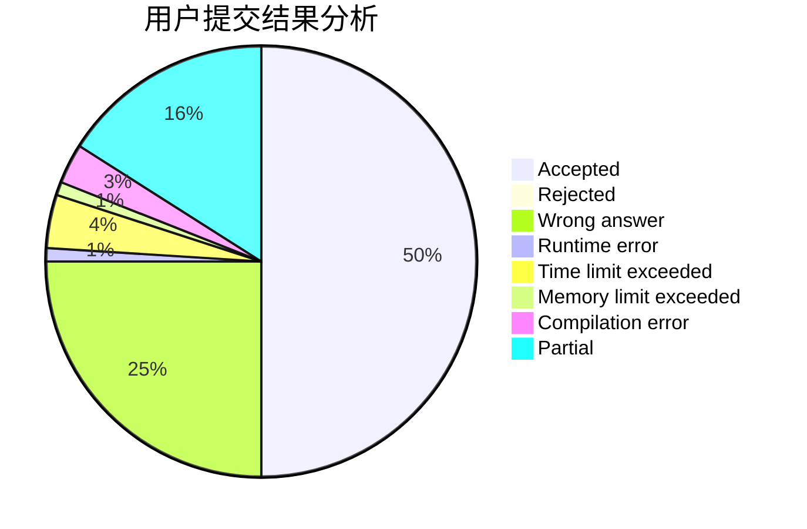
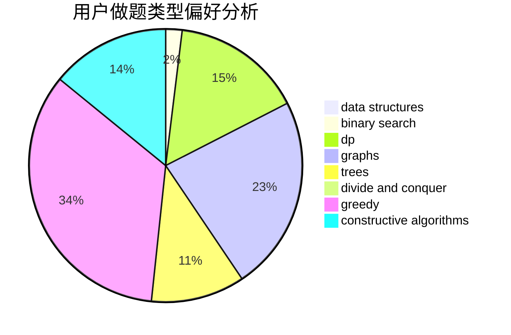
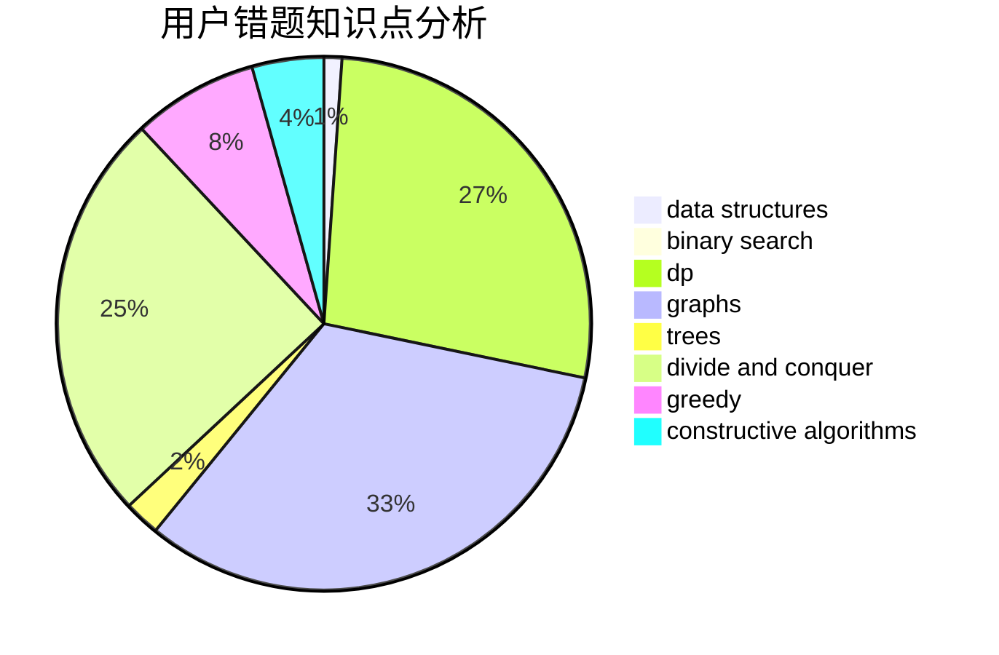

# 2014CAIS01

<!-- tabs:start -->

#### **用户提交结果分析**

#### **用户做题类型偏好分析**

#### **用户错题知识点分析**

<!-- tabs:end -->
# 推荐题目
[1238C](https://codeforces.com/contest/1238/problem/C)		dp,
                        greedy,
                        math		  
[1114F](https://codeforces.com/contest/1114/problem/F)		bitmasks,
                        data structures,
                        divide and conquer,
                        math,
                        number theory		  
[1237E](https://codeforces.com/contest/1237/problem/E)		dp,
                        math		  
[1237D](https://codeforces.com/contest/1237/problem/D)		binary search,
                        data structures,
                        implementation		  
[1236A](https://codeforces.com/contest/1236/problem/A)		brute force,
                        greedy,
                        math		  
[12372](https://codeforces.com/contest/1237/problem/2)		dsu,graphs,sortings,trees		  
[1237F](https://codeforces.com/contest/1237/problem/F)		combinatorics,
                        dp		  
[1234D](https://codeforces.com/contest/1234/problem/D)		data structures		  
[1237H](https://codeforces.com/contest/1237/problem/H)		constructive algorithms		  
[1236D](https://codeforces.com/contest/1236/problem/D)		brute force,
                        data structures,
                        greedy,
                        implementation		  
