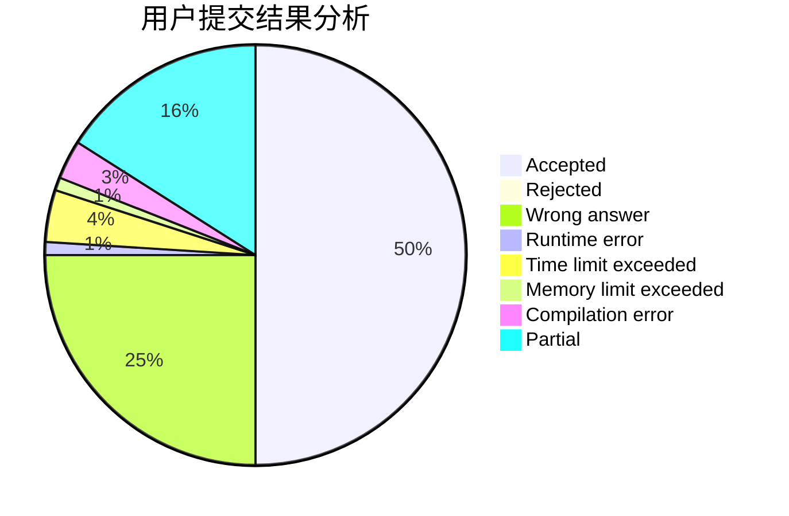
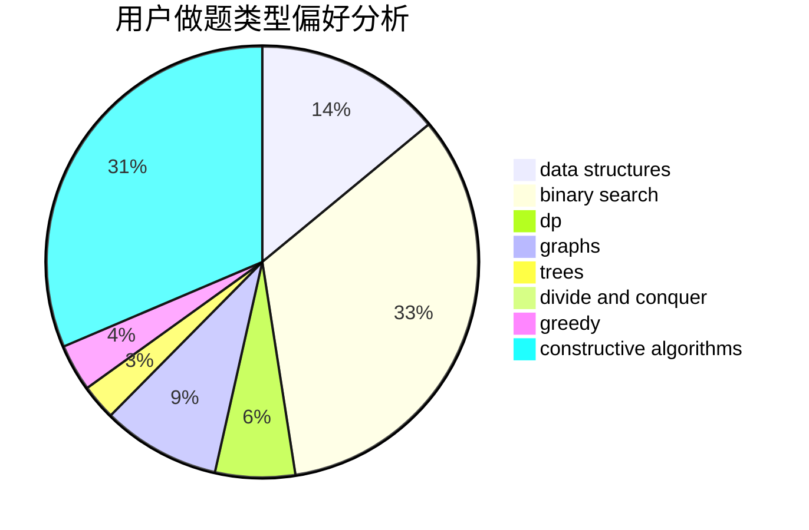
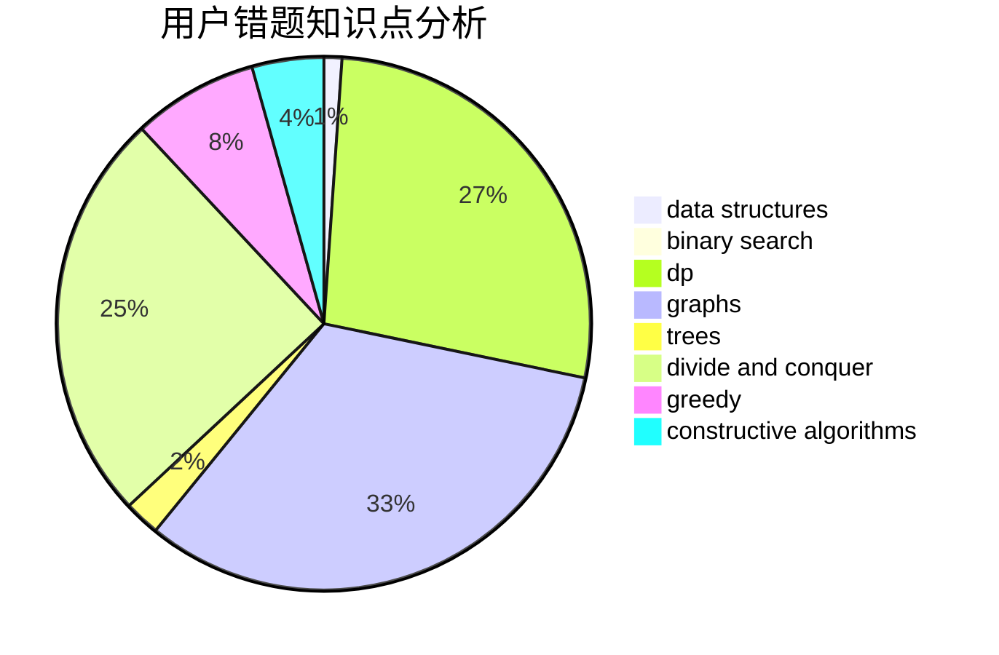

# 2014CAIS01
<!-- tabs:start -->
#### **用户提交结果分析**

#### **用户做题类型偏好分析**

#### **用户错题知识点分析**

<!-- tabs:end -->
# 推荐题目
[Another Filling the Grid](http://codeforces.com/problemset/problem/1228/E)		combinatorics,
                        dp,
                        math		  
[Complete Tripartite](http://codeforces.com/problemset/problem/1228/D)		brute force,
                        constructive algorithms,
                        graphs,
                        hashing,
                        implementation		  
[Kamil and Making a Stream](https://codeforces.com/contest/1229/problem/B)		math,
                        number theory,
                        trees		  
[Power Products](http://codeforces.com/problemset/problem/1225/D)		hashing,
                        math,
                        number theory		  
[Lucky Division](http://codeforces.com/problemset/problem/122/A)		brute force,
                        number theory		  
[Tourism](http://codeforces.com/problemset/problem/1220/E)		dfs and similar,
                        dp,
                        dsu,
                        graphs,
                        greedy,
                        trees		  
[Math Problem](http://codeforces.com/problemset/problem/1227/A)		math		  
[Optimal Subsequences (Hard Version)](http://codeforces.com/problemset/problem/1227/D2)		data structures,
                        greedy		  
[Distinct Digits](http://codeforces.com/problemset/problem/1228/A)		brute force,
                        implementation		  
[Heist](http://codeforces.com/problemset/problem/1041/A)		greedy,
                        implementation,
                        sortings		  
<!-- tabs:start -->
#### **data structures**
[Optimal Subsequences (Hard Version)](http://codeforces.com/problemset/problem/1227/D2)		data structures,
                        greedy		  
[Optimal Subsequences (Easy Version)](http://codeforces.com/problemset/problem/1227/D1)		data structures,
                        greedy		  
[Stack Exterminable Arrays](http://codeforces.com/problemset/problem/1223/F)		data structures,
                        divide and conquer,
                        dp,
                        hashing		  
[Choose a Square](http://codeforces.com/problemset/problem/1221/F)		binary search,
                        data structures,
                        sortings		  
[Koala and Notebook](http://codeforces.com/problemset/problem/1209/F)		data structures,
                        dfs and similar,
                        graphs,
                        shortest paths,
                        strings,
                        trees		  
[The Number of Subpermutations](http://codeforces.com/problemset/problem/1175/F)		brute force,
                        data structures,
                        divide and conquer,
                        hashing,
                        math		  
[Maximum width](http://codeforces.com/problemset/problem/1492/C)		binary search,
                        data structures,
                        dp,
                        greedy,
                        two pointers		  
[Old Floppy Drive](http://codeforces.com/problemset/problem/1490/G)		binary search,
                        data structures,
                        math		  
[Odd Mineral Resource](http://codeforces.com/problemset/problem/1479/D)		binary search,
                        bitmasks,
                        brute force,
                        data structures,
                        probabilities,
                        trees		  
[Meximization](http://codeforces.com/problemset/problem/1497/A)		brute force,
                        data structures,
                        greedy,
                        sortings		  
#### **binary search**
[Rock Is Push](http://codeforces.com/problemset/problem/1225/E)		binary search,
                        dp		  
[Wooden Raft](http://codeforces.com/problemset/problem/1223/G)		binary search,
                        math,
                        number theory		  
[Game with modulo](https://codeforces.com/contest/1104/problem/D)		binary search,
                        constructive algorithms,
                        interactive		  
[Choose a Square](http://codeforces.com/problemset/problem/1221/F)		binary search,
                        data structures,
                        sortings		  
[Maximum width](http://codeforces.com/problemset/problem/1492/C)		binary search,
                        data structures,
                        dp,
                        greedy,
                        two pointers		  
[Pairs](http://codeforces.com/problemset/problem/1463/D)		binary search,
                        constructive algorithms,
                        greedy,
                        two pointers		  
[Old Floppy Drive](http://codeforces.com/problemset/problem/1490/G)		binary search,
                        data structures,
                        math		  
[Odd Mineral Resource](http://codeforces.com/problemset/problem/1479/D)		binary search,
                        bitmasks,
                        brute force,
                        data structures,
                        probabilities,
                        trees		  
[Complicated Computations](http://codeforces.com/problemset/problem/1436/E)		binary search,
                        data structures,
                        two pointers		  
[Divide and Summarize](http://codeforces.com/problemset/problem/1461/D)		binary search,
                        brute force,
                        data structures,
                        divide and conquer,
                        implementation,
                        sortings		  
#### **dp**
[Another Filling the Grid](http://codeforces.com/problemset/problem/1228/E)		combinatorics,
                        dp,
                        math		  
[Tourism](http://codeforces.com/problemset/problem/1220/E)		dfs and similar,
                        dp,
                        dsu,
                        graphs,
                        greedy,
                        trees		  
[The Unbearable Lightness of Weights](https://codeforces.com/contest/1078/problem/B)		dp,
                        math		  
[Rock Is Push](http://codeforces.com/problemset/problem/1225/E)		binary search,
                        dp		  
[Graph And Numbers](http://codeforces.com/problemset/problem/1221/G)		bitmasks,
                        brute force,
                        combinatorics,
                        dp,
                        meet-in-the-middle		  
[Stack Exterminable Arrays](http://codeforces.com/problemset/problem/1223/F)		data structures,
                        divide and conquer,
                        dp,
                        hashing		  
[Mateusz and Escape Room](https://codeforces.com/contest/1229/problem/F)		dp		  
[To Make 1](http://codeforces.com/problemset/problem/1225/G)		bitmasks,
                        constructive algorithms,
                        dp,
                        greedy,
                        number theory		  
[Wrong Answer on test 233 (Easy Version)](http://codeforces.com/problemset/problem/1227/F1)		dp		  
[Sequence Sorting](http://codeforces.com/problemset/problem/1223/D)		dp,
                        greedy,
                        two pointers		  
#### **graph**
[Complete Tripartite](http://codeforces.com/problemset/problem/1228/D)		brute force,
                        constructive algorithms,
                        graphs,
                        hashing,
                        implementation		  
[Tourism](http://codeforces.com/problemset/problem/1220/E)		dfs and similar,
                        dp,
                        dsu,
                        graphs,
                        greedy,
                        trees		  
[Konrad and Company Evaluation](https://codeforces.com/contest/1229/problem/C)		graphs		  
[Koala and Notebook](http://codeforces.com/problemset/problem/1209/F)		data structures,
                        dfs and similar,
                        graphs,
                        shortest paths,
                        strings,
                        trees		  
[Minimum Ties](http://codeforces.com/problemset/problem/1487/C)		brute force,
                        constructive algorithms,
                        dfs and similar,
                        graphs,
                        greedy,
                        implementation,
                        math		  
[Chef Monocarp](http://codeforces.com/problemset/problem/1437/C)		dp,
                        flows,
                        graph matchings,
                        greedy,
                        math,
                        sortings		  
[Strange Housing](http://codeforces.com/problemset/problem/1470/D)		constructive algorithms,
                        dfs and similar,
                        graph matchings,
                        graphs,
                        greedy		  
[Longest Simple Cycle](http://codeforces.com/problemset/problem/1476/C)		dp,
                        graphs,
                        greedy		  
[Shortest and Longest LIS](http://codeforces.com/problemset/problem/1304/D)		constructive algorithms,
                        graphs,
                        greedy,
                        two pointers		  
[Ball in Berland](http://codeforces.com/problemset/problem/1475/C)		combinatorics,
                        graphs,
                        math		  
#### **trees**
[Kamil and Making a Stream](https://codeforces.com/contest/1229/problem/B)		math,
                        number theory,
                        trees		  
[Tourism](http://codeforces.com/problemset/problem/1220/E)		dfs and similar,
                        dp,
                        dsu,
                        graphs,
                        greedy,
                        trees		  
[Paint the Tree](http://codeforces.com/problemset/problem/1223/E)		dp,
                        sortings,
                        trees		  
[Tree Factory](http://codeforces.com/problemset/problem/1225/F)		constructive algorithms,
                        greedy,
                        trees		  
[Koala and Notebook](http://codeforces.com/problemset/problem/1209/F)		data structures,
                        dfs and similar,
                        graphs,
                        shortest paths,
                        strings,
                        trees		  
[Odd Mineral Resource](http://codeforces.com/problemset/problem/1479/D)		binary search,
                        bitmasks,
                        brute force,
                        data structures,
                        probabilities,
                        trees		  
[Yet Another Card Deck](http://codeforces.com/problemset/problem/1511/C)		brute force,
                        data structures,
                        implementation,
                        trees		  
[Diameter Cuts](http://codeforces.com/problemset/problem/1499/F)		combinatorics,
                        dfs and similar,
                        dp,
                        trees		  
[Fib-tree](http://codeforces.com/problemset/problem/1491/E)		brute force,
                        dfs and similar,
                        divide and conquer,
                        number theory,
                        trees		  
[13th Labour of Heracles](http://codeforces.com/problemset/problem/1466/D)		data structures,
                        greedy,
                        sortings,
                        trees		  
#### **divide and conquer**
[Stack Exterminable Arrays](http://codeforces.com/problemset/problem/1223/F)		data structures,
                        divide and conquer,
                        dp,
                        hashing		  
[The Number of Subpermutations](http://codeforces.com/problemset/problem/1175/F)		brute force,
                        data structures,
                        divide and conquer,
                        hashing,
                        math		  
[Divide and Summarize](http://codeforces.com/problemset/problem/1461/D)		binary search,
                        brute force,
                        data structures,
                        divide and conquer,
                        implementation,
                        sortings		  
[Song of the Sirens](http://codeforces.com/problemset/problem/1466/G)		combinatorics,
                        divide and conquer,
                        hashing,
                        math,
                        string suffix structures,
                        strings		  
[Permutation Transformation](http://codeforces.com/problemset/problem/1490/D)		dfs and similar,
                        divide and conquer,
                        implementation		  
[Skyline Photo](https://codeforces.com/contest/1483/problem/C)		data structures,
                        divide and conquer,
                        dp		  
[Fib-tree](http://codeforces.com/problemset/problem/1491/E)		brute force,
                        dfs and similar,
                        divide and conquer,
                        number theory,
                        trees		  
[Sum of Prefix Sums](http://codeforces.com/problemset/problem/1303/G)		data structures,
                        divide and conquer,
                        geometry,
                        trees		  
[Dogeforces](http://codeforces.com/problemset/problem/1494/D)		constructive algorithms,
                        data structures,
                        dfs and similar,
                        divide and conquer,
                        dsu,
                        greedy,
                        sortings,
                        trees		  
[Skyline Photo](http://codeforces.com/problemset/problem/1482/E)		data structures,
                        divide and conquer,
                        dp		  
#### **greedy**
[Tourism](http://codeforces.com/problemset/problem/1220/E)		dfs and similar,
                        dp,
                        dsu,
                        graphs,
                        greedy,
                        trees		  
[Optimal Subsequences (Hard Version)](http://codeforces.com/problemset/problem/1227/D2)		data structures,
                        greedy		  
[Heist](http://codeforces.com/problemset/problem/1041/A)		greedy,
                        implementation,
                        sortings		  
[Optimal Subsequences (Easy Version)](http://codeforces.com/problemset/problem/1227/D1)		data structures,
                        greedy		  
[Chocolates](http://codeforces.com/problemset/problem/1139/B)		greedy,
                        implementation		  
[To Make 1](http://codeforces.com/problemset/problem/1225/G)		bitmasks,
                        constructive algorithms,
                        dp,
                        greedy,
                        number theory		  
[Marcin and Training Camp](https://codeforces.com/contest/1229/problem/A)		brute force,
                        greedy		  
[Sequence Sorting](http://codeforces.com/problemset/problem/1223/D)		dp,
                        greedy,
                        two pointers		  
[Tree Factory](http://codeforces.com/problemset/problem/1225/F)		constructive algorithms,
                        greedy,
                        trees		  
[Ania and Minimizing](http://codeforces.com/problemset/problem/1230/B)		greedy,
                        implementation		  
#### **constructive algorithms**
[Complete Tripartite](http://codeforces.com/problemset/problem/1228/D)		brute force,
                        constructive algorithms,
                        graphs,
                        hashing,
                        implementation		  
[Box](http://codeforces.com/problemset/problem/1227/B)		constructive algorithms		  
[Game with modulo](https://codeforces.com/contest/1104/problem/D)		binary search,
                        constructive algorithms,
                        interactive		  
[To Make 1](http://codeforces.com/problemset/problem/1225/G)		bitmasks,
                        constructive algorithms,
                        dp,
                        greedy,
                        number theory		  
[Tree Factory](http://codeforces.com/problemset/problem/1225/F)		constructive algorithms,
                        greedy,
                        trees		  
[Not Same](http://codeforces.com/problemset/problem/1227/G)		constructive algorithms		  
[Anti-knapsack](http://codeforces.com/problemset/problem/1493/A)		constructive algorithms,
                        greedy		  
[Pairs](http://codeforces.com/problemset/problem/1463/D)		binary search,
                        constructive algorithms,
                        greedy,
                        two pointers		  
[XOR-gun](https://codeforces.com/contest/1456/problem/B)		bitmasks,
                        brute force,
                        constructive algorithms		  
[Genius's Gambit](http://codeforces.com/problemset/problem/1492/D)		bitmasks,
                        constructive algorithms,
                        greedy,
                        math		  
#### **sortings**
[Heist](http://codeforces.com/problemset/problem/1041/A)		greedy,
                        implementation,
                        sortings		  
[Choose a Square](http://codeforces.com/problemset/problem/1221/F)		binary search,
                        data structures,
                        sortings		  
[Paint the Tree](http://codeforces.com/problemset/problem/1223/E)		dp,
                        sortings,
                        trees		  
[Diamond Miner](https://codeforces.com/contest/1496/problem/C)		geometry,
                        greedy,
                        math,
                        sortings		  
[Diamond Miner](http://codeforces.com/problemset/problem/1495/A)		geometry,
                        greedy,
                        math,
                        sortings		  
[Meximization](http://codeforces.com/problemset/problem/1497/A)		brute force,
                        data structures,
                        greedy,
                        sortings		  
[Avoiding Zero](http://codeforces.com/problemset/problem/1427/A)		math,
                        sortings		  
[Divide and Summarize](http://codeforces.com/problemset/problem/1461/D)		binary search,
                        brute force,
                        data structures,
                        divide and conquer,
                        implementation,
                        sortings		  
[Chef Monocarp](http://codeforces.com/problemset/problem/1437/C)		dp,
                        flows,
                        graph matchings,
                        greedy,
                        math,
                        sortings		  
[Replacing Elements](http://codeforces.com/problemset/problem/1473/A)		greedy,
                        implementation,
                        math,
                        sortings		  
<!-- tabs:end -->
