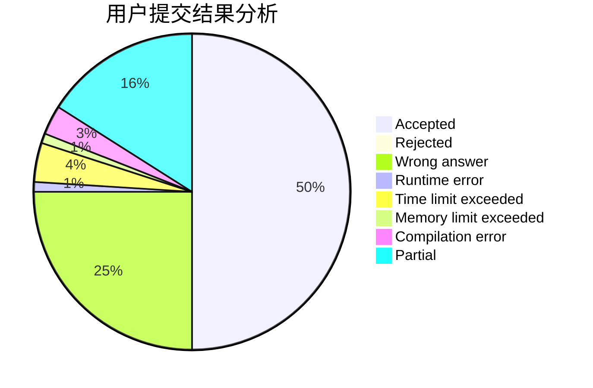
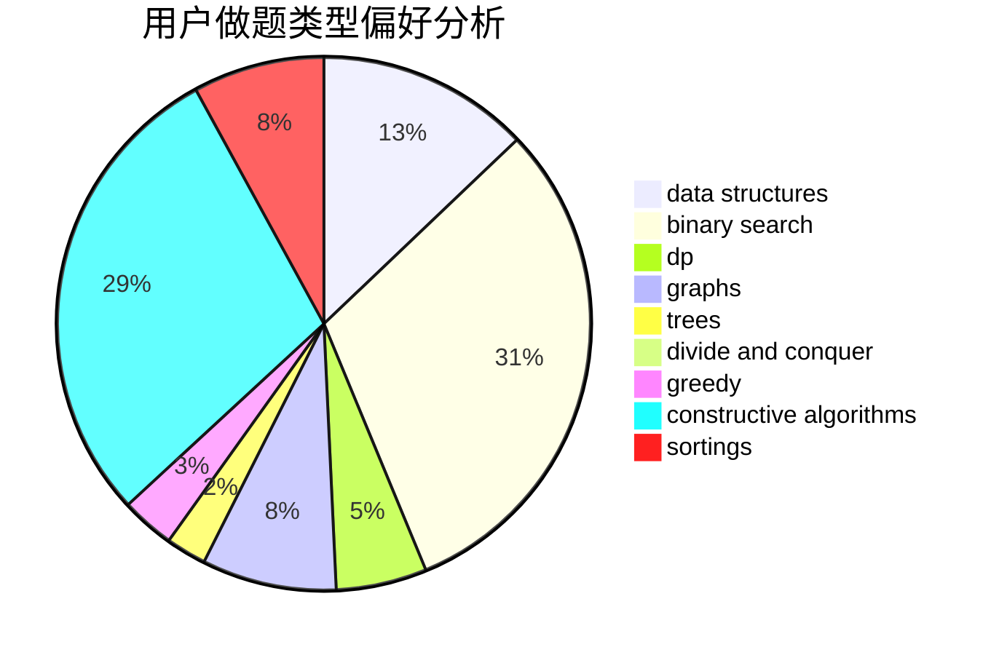
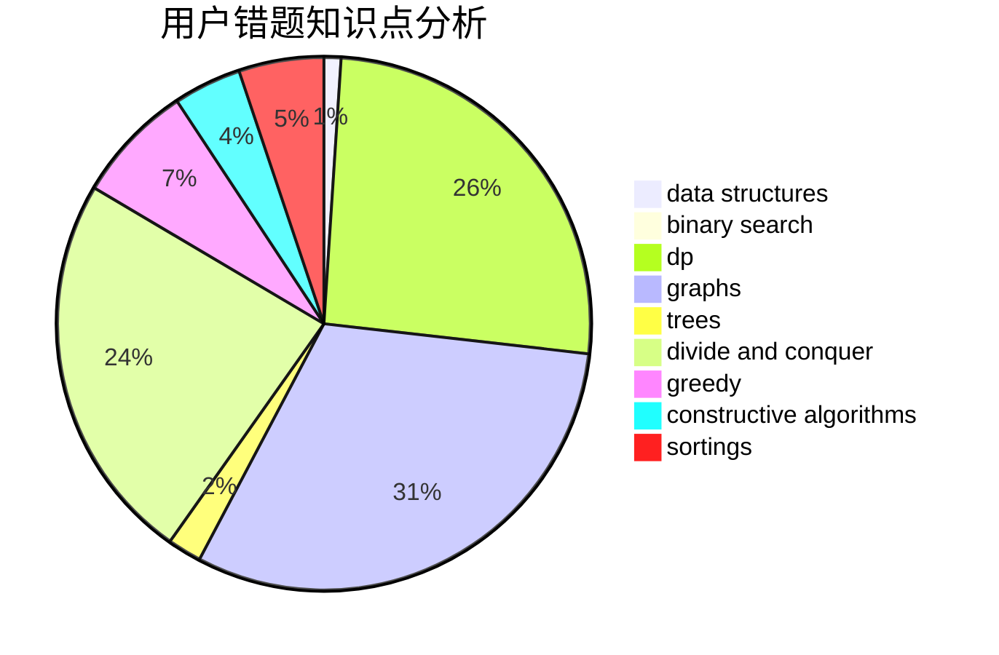

# 2014CAIS01
<!-- tabs:start -->
#### **用户提交结果分析**

#### **用户做题类型偏好分析**

#### **用户错题知识点分析**

<!-- tabs:end -->
# 推荐题目
[1228E](http://codeforces.com/problemset/problem/1228/E)		combinatorics,
                        dp,
                        math		  
[1228D](http://codeforces.com/problemset/problem/1228/D)		brute force,
                        constructive algorithms,
                        graphs,
                        hashing,
                        implementation		  
[1229B](https://codeforces.com/contest/1229/problem/B)		math,
                        number theory,
                        trees		  
[1225D](http://codeforces.com/problemset/problem/1225/D)		hashing,
                        math,
                        number theory		  
[122A](http://codeforces.com/problemset/problem/122/A)		brute force,
                        number theory		  
[1220E](http://codeforces.com/problemset/problem/1220/E)		dfs and similar,
                        dp,
                        dsu,
                        graphs,
                        greedy,
                        trees		  
[1227A](http://codeforces.com/problemset/problem/1227/A)		math		  
[1227D2](http://codeforces.com/problemset/problem/1227/D2)		data structures,
                        greedy		  
[1228A](http://codeforces.com/problemset/problem/1228/A)		brute force,
                        implementation		  
[1041A](http://codeforces.com/problemset/problem/1041/A)		greedy,
                        implementation,
                        sortings		  
<!-- tabs:start -->
#### **data structures**
[1227D2](http://codeforces.com/problemset/problem/1227/D2)		data structures,
                        greedy		  
[1227D1](http://codeforces.com/problemset/problem/1227/D1)		data structures,
                        greedy		  
[1223F](http://codeforces.com/problemset/problem/1223/F)		data structures,
                        divide and conquer,
                        dp,
                        hashing		  
[1221F](http://codeforces.com/problemset/problem/1221/F)		binary search,
                        data structures,
                        sortings		  
[1209F](http://codeforces.com/problemset/problem/1209/F)		data structures,
                        dfs and similar,
                        graphs,
                        shortest paths,
                        strings,
                        trees		  
[1175F](http://codeforces.com/problemset/problem/1175/F)		brute force,
                        data structures,
                        divide and conquer,
                        hashing,
                        math		  
[1492C](http://codeforces.com/problemset/problem/1492/C)		binary search,
                        data structures,
                        dp,
                        greedy,
                        two pointers		  
[1490G](http://codeforces.com/problemset/problem/1490/G)		binary search,
                        data structures,
                        math		  
[1479D](http://codeforces.com/problemset/problem/1479/D)		binary search,
                        bitmasks,
                        brute force,
                        data structures,
                        probabilities,
                        trees		  
[1497A](http://codeforces.com/problemset/problem/1497/A)		brute force,
                        data structures,
                        greedy,
                        sortings		  
#### **binary search**
[1225E](http://codeforces.com/problemset/problem/1225/E)		binary search,
                        dp		  
[1223G](http://codeforces.com/problemset/problem/1223/G)		binary search,
                        math,
                        number theory		  
[1104D](https://codeforces.com/contest/1104/problem/D)		binary search,
                        constructive algorithms,
                        interactive		  
[1221F](http://codeforces.com/problemset/problem/1221/F)		binary search,
                        data structures,
                        sortings		  
[1492C](http://codeforces.com/problemset/problem/1492/C)		binary search,
                        data structures,
                        dp,
                        greedy,
                        two pointers		  
[1463D](http://codeforces.com/problemset/problem/1463/D)		binary search,
                        constructive algorithms,
                        greedy,
                        two pointers		  
[1490G](http://codeforces.com/problemset/problem/1490/G)		binary search,
                        data structures,
                        math		  
[1479D](http://codeforces.com/problemset/problem/1479/D)		binary search,
                        bitmasks,
                        brute force,
                        data structures,
                        probabilities,
                        trees		  
[1436E](http://codeforces.com/problemset/problem/1436/E)		binary search,
                        data structures,
                        two pointers		  
[1461D](http://codeforces.com/problemset/problem/1461/D)		binary search,
                        brute force,
                        data structures,
                        divide and conquer,
                        implementation,
                        sortings		  
#### **dp**
[1228E](http://codeforces.com/problemset/problem/1228/E)		combinatorics,
                        dp,
                        math		  
[1220E](http://codeforces.com/problemset/problem/1220/E)		dfs and similar,
                        dp,
                        dsu,
                        graphs,
                        greedy,
                        trees		  
[1078B](https://codeforces.com/contest/1078/problem/B)		dp,
                        math		  
[1225E](http://codeforces.com/problemset/problem/1225/E)		binary search,
                        dp		  
[1221G](http://codeforces.com/problemset/problem/1221/G)		bitmasks,
                        brute force,
                        combinatorics,
                        dp,
                        meet-in-the-middle		  
[1223F](http://codeforces.com/problemset/problem/1223/F)		data structures,
                        divide and conquer,
                        dp,
                        hashing		  
[1229F](https://codeforces.com/contest/1229/problem/F)		dp		  
[1225G](http://codeforces.com/problemset/problem/1225/G)		bitmasks,
                        constructive algorithms,
                        dp,
                        greedy,
                        number theory		  
[1227F1](http://codeforces.com/problemset/problem/1227/F1)		dp		  
[1223D](http://codeforces.com/problemset/problem/1223/D)		dp,
                        greedy,
                        two pointers		  
#### **graph**
[1228D](http://codeforces.com/problemset/problem/1228/D)		brute force,
                        constructive algorithms,
                        graphs,
                        hashing,
                        implementation		  
[1220E](http://codeforces.com/problemset/problem/1220/E)		dfs and similar,
                        dp,
                        dsu,
                        graphs,
                        greedy,
                        trees		  
[1229C](https://codeforces.com/contest/1229/problem/C)		graphs		  
[1209F](http://codeforces.com/problemset/problem/1209/F)		data structures,
                        dfs and similar,
                        graphs,
                        shortest paths,
                        strings,
                        trees		  
[1487C](http://codeforces.com/problemset/problem/1487/C)		brute force,
                        constructive algorithms,
                        dfs and similar,
                        graphs,
                        greedy,
                        implementation,
                        math		  
[1437C](http://codeforces.com/problemset/problem/1437/C)		dp,
                        flows,
                        graph matchings,
                        greedy,
                        math,
                        sortings		  
[1470D](http://codeforces.com/problemset/problem/1470/D)		constructive algorithms,
                        dfs and similar,
                        graph matchings,
                        graphs,
                        greedy		  
[1476C](http://codeforces.com/problemset/problem/1476/C)		dp,
                        graphs,
                        greedy		  
[1304D](http://codeforces.com/problemset/problem/1304/D)		constructive algorithms,
                        graphs,
                        greedy,
                        two pointers		  
[1475C](http://codeforces.com/problemset/problem/1475/C)		combinatorics,
                        graphs,
                        math		  
#### **trees**
[1229B](https://codeforces.com/contest/1229/problem/B)		math,
                        number theory,
                        trees		  
[1220E](http://codeforces.com/problemset/problem/1220/E)		dfs and similar,
                        dp,
                        dsu,
                        graphs,
                        greedy,
                        trees		  
[1223E](http://codeforces.com/problemset/problem/1223/E)		dp,
                        sortings,
                        trees		  
[1225F](http://codeforces.com/problemset/problem/1225/F)		constructive algorithms,
                        greedy,
                        trees		  
[1209F](http://codeforces.com/problemset/problem/1209/F)		data structures,
                        dfs and similar,
                        graphs,
                        shortest paths,
                        strings,
                        trees		  
[1479D](http://codeforces.com/problemset/problem/1479/D)		binary search,
                        bitmasks,
                        brute force,
                        data structures,
                        probabilities,
                        trees		  
[1511C](http://codeforces.com/problemset/problem/1511/C)		brute force,
                        data structures,
                        implementation,
                        trees		  
[1499F](http://codeforces.com/problemset/problem/1499/F)		combinatorics,
                        dfs and similar,
                        dp,
                        trees		  
[1491E](http://codeforces.com/problemset/problem/1491/E)		brute force,
                        dfs and similar,
                        divide and conquer,
                        number theory,
                        trees		  
[1466D](http://codeforces.com/problemset/problem/1466/D)		data structures,
                        greedy,
                        sortings,
                        trees		  
#### **divide and conquer**
[1223F](http://codeforces.com/problemset/problem/1223/F)		data structures,
                        divide and conquer,
                        dp,
                        hashing		  
[1175F](http://codeforces.com/problemset/problem/1175/F)		brute force,
                        data structures,
                        divide and conquer,
                        hashing,
                        math		  
[1461D](http://codeforces.com/problemset/problem/1461/D)		binary search,
                        brute force,
                        data structures,
                        divide and conquer,
                        implementation,
                        sortings		  
[1466G](http://codeforces.com/problemset/problem/1466/G)		combinatorics,
                        divide and conquer,
                        hashing,
                        math,
                        string suffix structures,
                        strings		  
[1490D](http://codeforces.com/problemset/problem/1490/D)		dfs and similar,
                        divide and conquer,
                        implementation		  
[1483C](https://codeforces.com/contest/1483/problem/C)		data structures,
                        divide and conquer,
                        dp		  
[1491E](http://codeforces.com/problemset/problem/1491/E)		brute force,
                        dfs and similar,
                        divide and conquer,
                        number theory,
                        trees		  
[1303G](http://codeforces.com/problemset/problem/1303/G)		data structures,
                        divide and conquer,
                        geometry,
                        trees		  
[1494D](http://codeforces.com/problemset/problem/1494/D)		constructive algorithms,
                        data structures,
                        dfs and similar,
                        divide and conquer,
                        dsu,
                        greedy,
                        sortings,
                        trees		  
[1482E](http://codeforces.com/problemset/problem/1482/E)		data structures,
                        divide and conquer,
                        dp		  
#### **greedy**
[1220E](http://codeforces.com/problemset/problem/1220/E)		dfs and similar,
                        dp,
                        dsu,
                        graphs,
                        greedy,
                        trees		  
[1227D2](http://codeforces.com/problemset/problem/1227/D2)		data structures,
                        greedy		  
[1041A](http://codeforces.com/problemset/problem/1041/A)		greedy,
                        implementation,
                        sortings		  
[1227D1](http://codeforces.com/problemset/problem/1227/D1)		data structures,
                        greedy		  
[1139B](http://codeforces.com/problemset/problem/1139/B)		greedy,
                        implementation		  
[1225G](http://codeforces.com/problemset/problem/1225/G)		bitmasks,
                        constructive algorithms,
                        dp,
                        greedy,
                        number theory		  
[1229A](https://codeforces.com/contest/1229/problem/A)		brute force,
                        greedy		  
[1223D](http://codeforces.com/problemset/problem/1223/D)		dp,
                        greedy,
                        two pointers		  
[1225F](http://codeforces.com/problemset/problem/1225/F)		constructive algorithms,
                        greedy,
                        trees		  
[1230B](http://codeforces.com/problemset/problem/1230/B)		greedy,
                        implementation		  
#### **constructive algorithms**
[1228D](http://codeforces.com/problemset/problem/1228/D)		brute force,
                        constructive algorithms,
                        graphs,
                        hashing,
                        implementation		  
[1227B](http://codeforces.com/problemset/problem/1227/B)		constructive algorithms		  
[1104D](https://codeforces.com/contest/1104/problem/D)		binary search,
                        constructive algorithms,
                        interactive		  
[1225G](http://codeforces.com/problemset/problem/1225/G)		bitmasks,
                        constructive algorithms,
                        dp,
                        greedy,
                        number theory		  
[1225F](http://codeforces.com/problemset/problem/1225/F)		constructive algorithms,
                        greedy,
                        trees		  
[1227G](http://codeforces.com/problemset/problem/1227/G)		constructive algorithms		  
[1493A](http://codeforces.com/problemset/problem/1493/A)		constructive algorithms,
                        greedy		  
[1463D](http://codeforces.com/problemset/problem/1463/D)		binary search,
                        constructive algorithms,
                        greedy,
                        two pointers		  
[1456B](https://codeforces.com/contest/1456/problem/B)		bitmasks,
                        brute force,
                        constructive algorithms		  
[1492D](http://codeforces.com/problemset/problem/1492/D)		bitmasks,
                        constructive algorithms,
                        greedy,
                        math		  
#### **sortings**
[1041A](http://codeforces.com/problemset/problem/1041/A)		greedy,
                        implementation,
                        sortings		  
[1221F](http://codeforces.com/problemset/problem/1221/F)		binary search,
                        data structures,
                        sortings		  
[1223E](http://codeforces.com/problemset/problem/1223/E)		dp,
                        sortings,
                        trees		  
[1496C](https://codeforces.com/contest/1496/problem/C)		geometry,
                        greedy,
                        math,
                        sortings		  
[1495A](http://codeforces.com/problemset/problem/1495/A)		geometry,
                        greedy,
                        math,
                        sortings		  
[1497A](http://codeforces.com/problemset/problem/1497/A)		brute force,
                        data structures,
                        greedy,
                        sortings		  
[1427A](http://codeforces.com/problemset/problem/1427/A)		math,
                        sortings		  
[1461D](http://codeforces.com/problemset/problem/1461/D)		binary search,
                        brute force,
                        data structures,
                        divide and conquer,
                        implementation,
                        sortings		  
[1437C](http://codeforces.com/problemset/problem/1437/C)		dp,
                        flows,
                        graph matchings,
                        greedy,
                        math,
                        sortings		  
[1473A](http://codeforces.com/problemset/problem/1473/A)		greedy,
                        implementation,
                        math,
                        sortings		  
<!-- tabs:end -->
