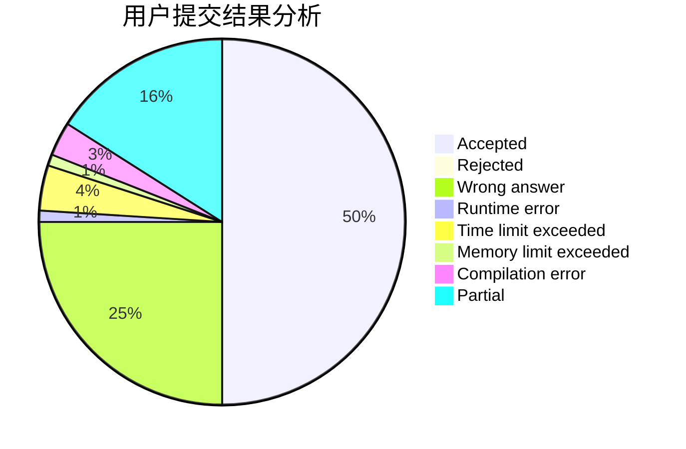
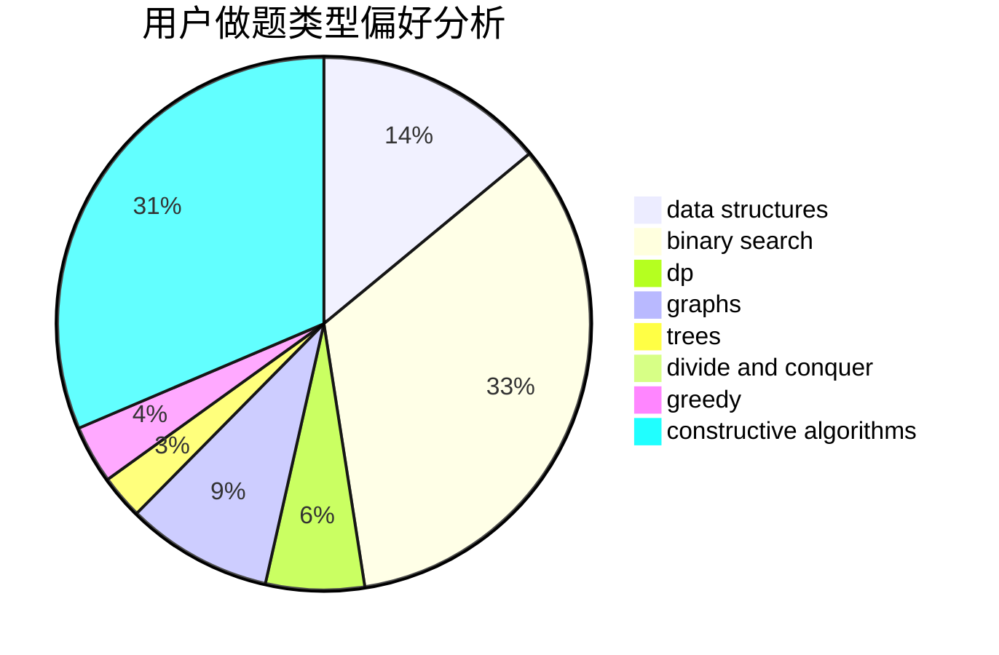
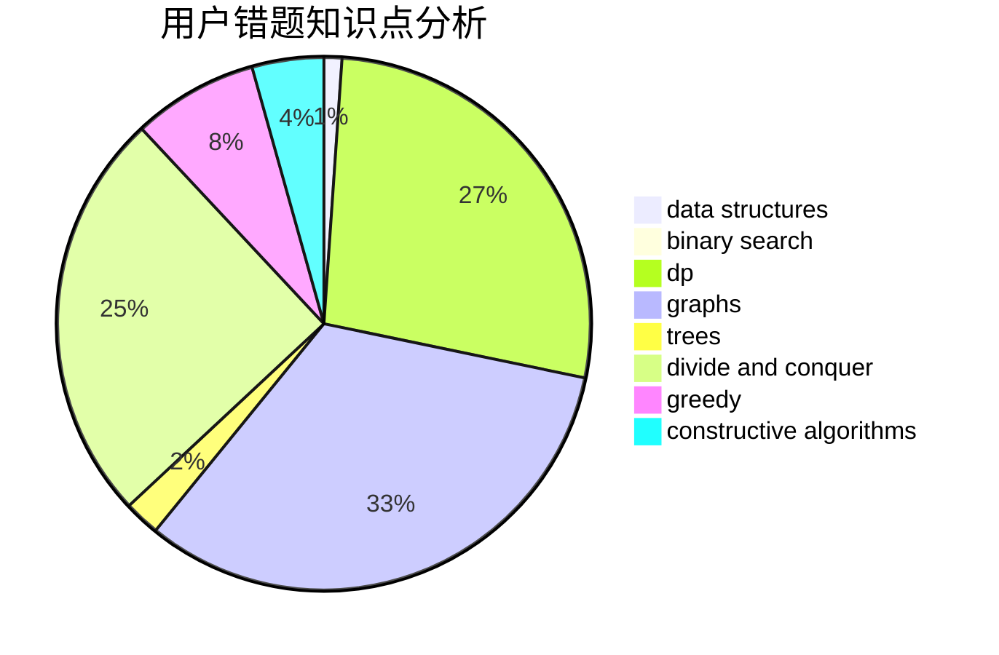

# 2014CAIS01

<!-- tabs:start -->

#### **用户提交结果分析**

#### **用户做题类型偏好分析**

#### **用户错题知识点分析**

<!-- tabs:end -->
# 推荐题目
[122B](https://codeforces.com/contest/122/problem/B)		brute force,
                        implementation		  
[1114C](https://codeforces.com/contest/1114/problem/C)		brute force,
                        implementation,
                        math,
                        number theory		  
[1229A](https://codeforces.com/contest/1229/problem/A)		dsu,graphs,sortings,trees		  
[1228E](https://codeforces.com/contest/1228/problem/E)		combinatorics,
                        dp,
                        math		  
[1227D1](https://codeforces.com/contest/1227D/problem/1)		data structures,
                        greedy		  
[1228B](https://codeforces.com/contest/1228/problem/B)		implementation,
                        math		  
[1229B](https://codeforces.com/contest/1229/problem/B)		dsu,graphs,sortings,trees		  
[1225G](https://codeforces.com/contest/1225/problem/G)		bitmasks,
                        constructive algorithms,
                        dp,
                        greedy,
                        number theory		  
[1229D](https://codeforces.com/contest/1229/problem/D)		dsu,graphs,sortings,trees		  
[1227F2](https://codeforces.com/contest/1227F/problem/2)		combinatorics,
                        math		  
