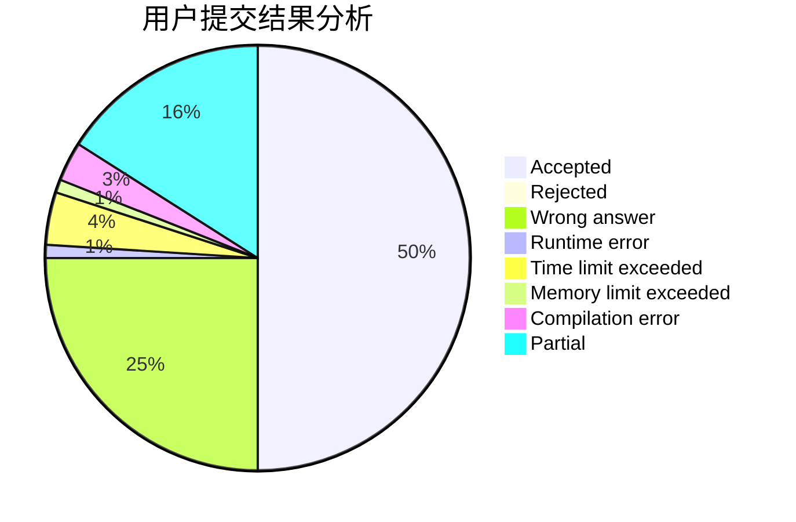
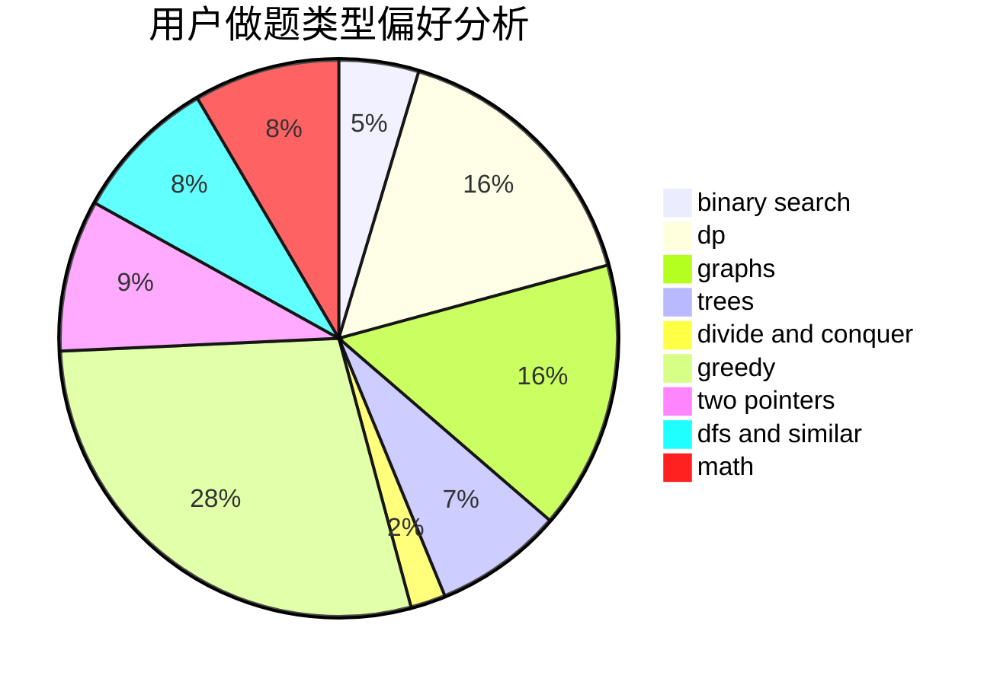

# 2014CAIS01

<!-- tabs:start -->

#### **用户提交结果分析**

#### **用户做题类型偏好分析**

<!-- tabs:end -->
# 推荐题目
[1238C](https://codeforces.com/contest/1238/problem/C)
[1114F](https://codeforces.com/contest/1114/problem/F)
[1237E](https://codeforces.com/contest/1237/problem/E)
[1237D](https://codeforces.com/contest/1237/problem/D)
[1236A](https://codeforces.com/contest/1236/problem/A)
[12372](https://codeforces.com/contest/1237/problem/2)
[1237F](https://codeforces.com/contest/1237/problem/F)
[1234D](https://codeforces.com/contest/1234/problem/D)
[1237H](https://codeforces.com/contest/1237/problem/H)
[1236D](https://codeforces.com/contest/1236/problem/D)
