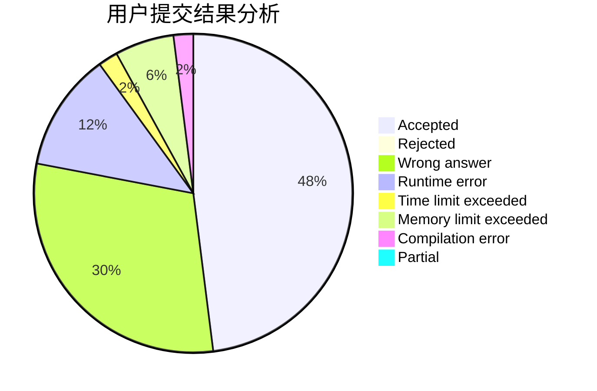
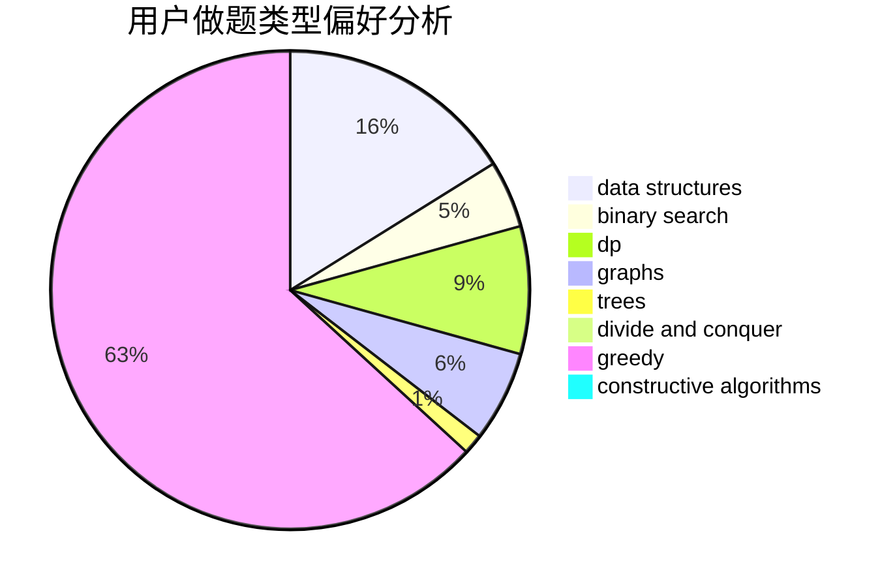
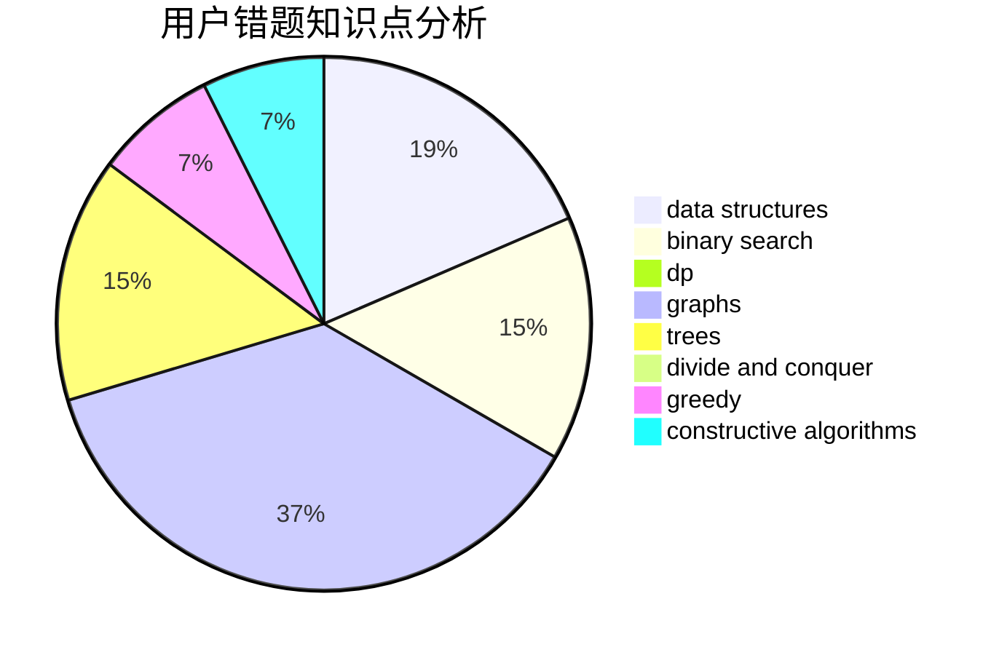

# DoubleHappy

<!-- tabs:start -->

#### **用户提交结果分析**

#### **用户做题类型偏好分析**

#### **用户错题知识点分析**

<!-- tabs:end -->
# 推荐题目
[803B](https://codeforces.com/contest/803/problem/B)		constructive algorithms		  
[802N](https://codeforces.com/contest/802/problem/N)		binary search,
                        flows,
                        graphs		  
[278B](https://codeforces.com/contest/278/problem/B)		brute force,
                        strings		  
[13783](https://codeforces.com/contest/1378/problem/3)		dsu,graphs,sortings,trees		  
[33D](https://codeforces.com/contest/33/problem/D)		geometry,
                        graphs,
                        shortest paths,
                        sortings		  
[506A](https://codeforces.com/contest/506/problem/A)		dsu,graphs,sortings,trees		  
[1227G](https://codeforces.com/contest/1227/problem/G)		constructive algorithms		  
[1332A](https://codeforces.com/contest/1332/problem/A)		greedy,
                        implementation,
                        math		  
[321B](https://codeforces.com/contest/321/problem/B)		dp,
                        flows,
                        greedy		  
[499C](https://codeforces.com/contest/499/problem/C)		dsu,graphs,sortings,trees		  
