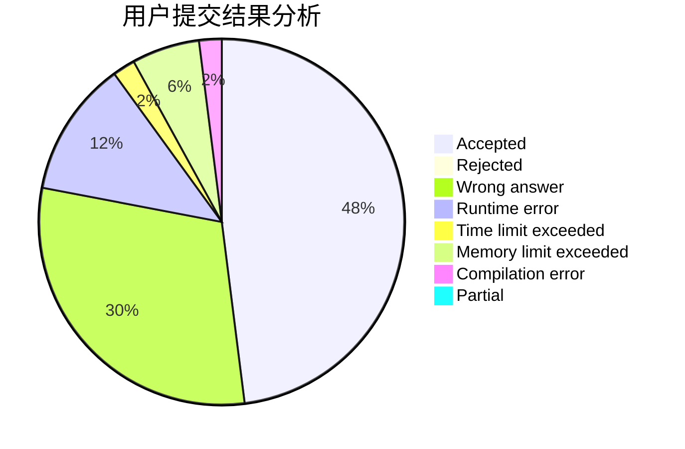
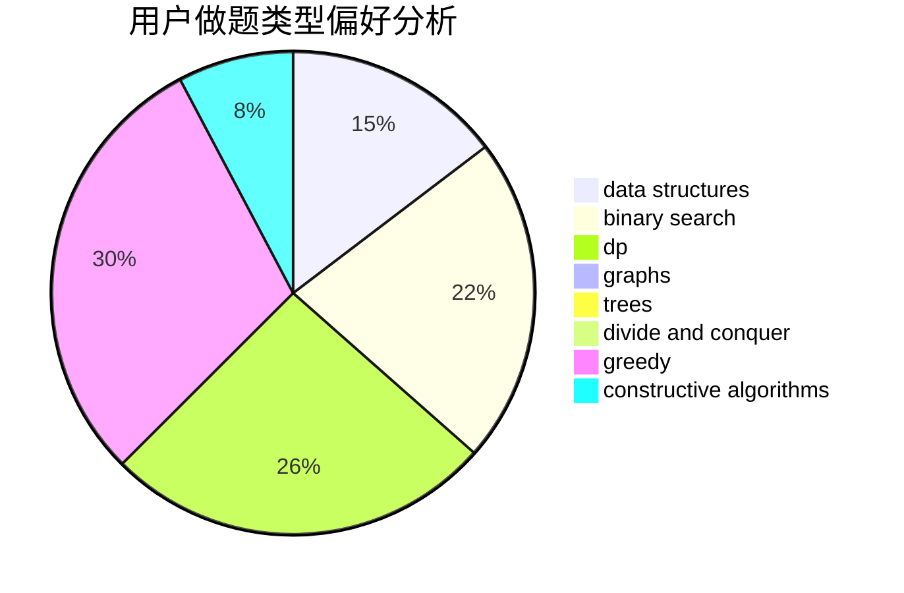
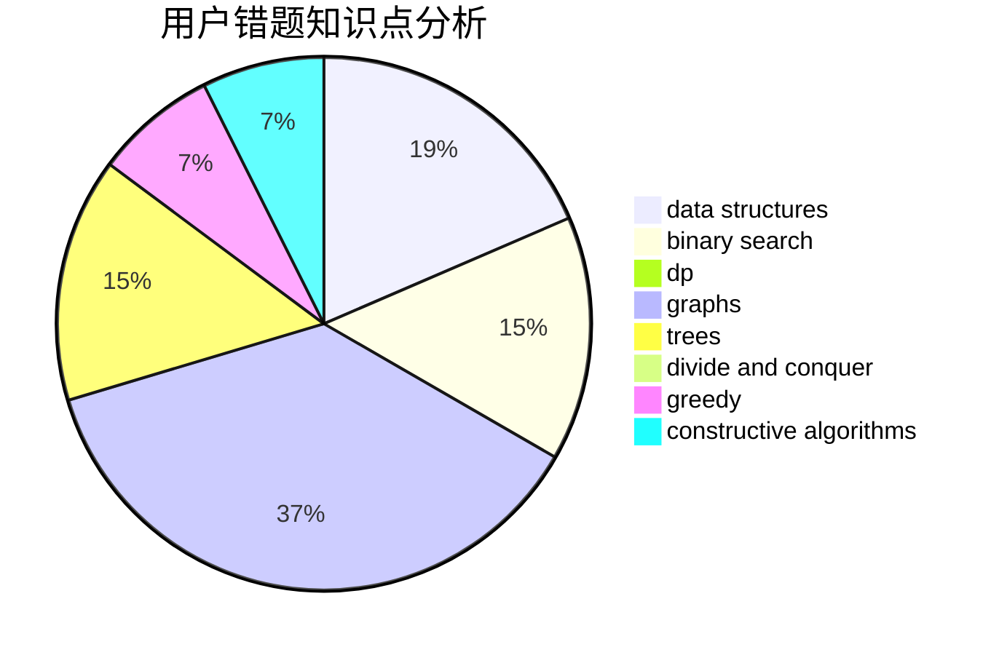

# DoubleHappy

<!-- tabs:start -->

#### **用户提交结果分析**

#### **用户做题类型偏好分析**

#### **用户错题知识点分析**

<!-- tabs:end -->
# 推荐题目
[787A](https://codeforces.com/contest/787/problem/A)		brute force,
                        math,
                        number theory		  
[786C](https://codeforces.com/contest/786/problem/C)		data structures,
                        divide and conquer		  
[260A](https://codeforces.com/contest/260/problem/A)		implementation,
                        math		  
[1370A](https://codeforces.com/contest/1370/problem/A)		greedy,
                        implementation,
                        math,
                        number theory		  
[316B2](https://codeforces.com/contest/316B/problem/2)		dfs and similar,
                        dp		  
[484E](https://codeforces.com/contest/484/problem/E)		binary search,
                        constructive algorithms,
                        data structures		  
[121E](https://codeforces.com/contest/121/problem/E)		data structures		  
[1325E](https://codeforces.com/contest/1325/problem/E)		brute force,
                        dfs and similar,
                        graphs,
                        number theory,
                        shortest paths		  
[303A](https://codeforces.com/contest/303/problem/A)		constructive algorithms,
                        implementation,
                        math		  
[479A](https://codeforces.com/contest/479/problem/A)		brute force,
                        math		  
