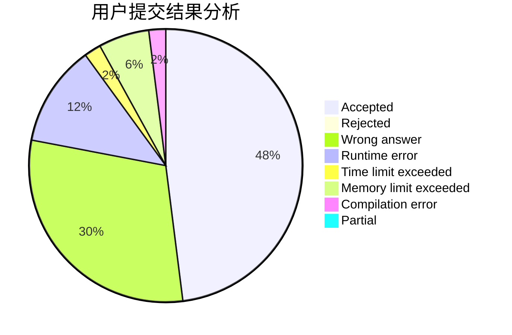
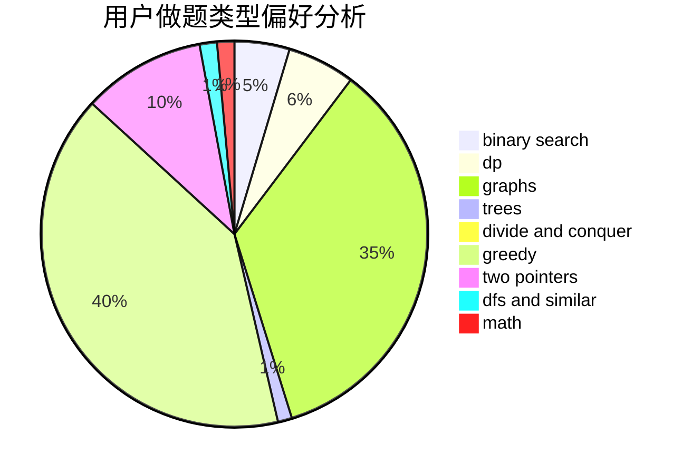

# DoubleHappy

<!-- tabs:start -->

#### **用户提交结果分析**

#### **用户做题类型偏好分析**

<!-- tabs:end -->
# 推荐题目
[803B](https://codeforces.com/contest/803/problem/B)
[802N](https://codeforces.com/contest/802/problem/N)
[278B](https://codeforces.com/contest/278/problem/B)
[13783](https://codeforces.com/contest/1378/problem/3)
[33D](https://codeforces.com/contest/33/problem/D)
[506A](https://codeforces.com/contest/506/problem/A)
[1227G](https://codeforces.com/contest/1227/problem/G)
[1332A](https://codeforces.com/contest/1332/problem/A)
[321B](https://codeforces.com/contest/321/problem/B)
[499C](https://codeforces.com/contest/499/problem/C)
